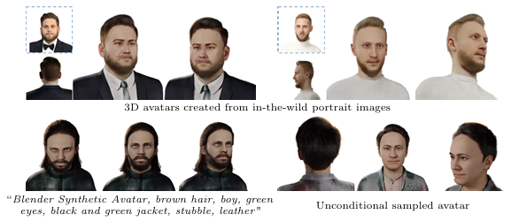
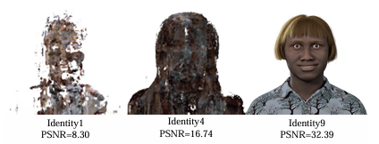
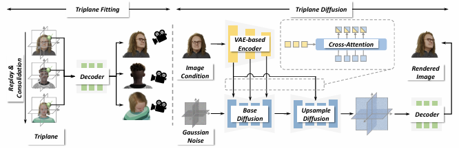

# RodinHD: High-Fidelity 3D Avatar Generation with Diffusion Models

---
Reference

본 문서에 사용된 모든 이미지와 표는 해당 논문에서 발췌하였습니다.

---

## 📌 Metadata
---
분류
- 3D Avatar Generation
- Diffusion
---
url:
- [paper](https://arxiv.org/abs/2407.06938) (arXiv 2024)
- [project](https://rodinhd.github.io/)
---
- **Authors**: Bowen Zhang, Yiji Cheng, Chunyu Wang, Ting Zhang, Jiaolong Yang, Yansong Tang, Feng Zhao, Dong Chen, Baining Guo
- **Venue**: ECCV 2024

---

## 📑 Table of Contents
- [Abstract](#abstract)
- [1. Introduction](#1-introduction)
- [2. Related Work](#2-related-work)
- [3. Method](#3-method)
  - [3.1 Triplane Fitting](#31-triplane-fitting)
  - [3.2 Triplane Diffusion](#32-triplane-diffusion)
- [4. Experiments](#4-experiments)

---

## ⚡ 요약 (Summary)
**RodinHD**는 단일 인물 사진에서 고해상도 3D 아바타를 생성하는 확산 모델 기반 프레임워크입니다. 대규모 아바타 학습 시 발생하는 **Catastrophic Forgetting(치명적 망각)** 문제를 해결하기 위해 'Task Replay' 전략과 'Weight Consolidation' 정규화를 제안합니다. 이를 통해 별도의 2D Refiner 없이도 미세한 헤어스타일과 의상 질감을 보존하며 고품질의 3D 일관성을 유지합니다.

---

## 📖 Paper Review

## Abstract

**RodinHD**
- 인물 이미지에서 고화질 3D 아바타 생성
- 기존 방법은 헤어스타일과 같은 복잡한 세부 사항을 포착하지 못함
- MLP Decoder 공유 체계로 인해 많은 아바타에 triplane을 순차적으로 장착할 때 치명적인 망각 문제 발생  
-> 새로운 데이터 스케줄링 전략 & 가중치 통합 정규화 term 제기  
--> Decoder가 더 선명한 디테일을 렌더링할 수 있는 능력을 입증
- 풍부한 2D Texture queue를 캡처하는 더 세밀한 계층적 표현을 계산하고 cross-attention을 통해 여러 layer의 3D Diffusion model에 주입하여 인물사진의 guiding effect를 최적화
- triplanes에 최적화된 noise schedule이 있는 46K개 아바타로 훈련하면 결과 모델은 이전 방법보다 더 세밀한 3D 아바타 생성 가능 & in-the-wild 인물사진 입력으로 일반화할 수 있음
- 프로젝트 페이지: https://rodinhd.github.io/.

> **Fig. 1**  
> RodinHMD는 cross-view 일관성(첫 번째 행)을 손상시키지 않고 단일 인물 사진(점선 상자)에서 상세한 3D 아바타를 생성  
> 조건화된 텍스트(두 번째 행, 왼쪽) 또는 uncoditional(두 번째 행, 오른쪽) 생성을 지원

## 1. Introduction

Generative Diffusion Model 및 암시적 neural radiance fields의 개발로 3D 아바타를 대규모로 자동 생성할 수 있게 됨.
- 현재는 미세한 detail을 생성하는데 어려움을 겪음

**3D Generative Diffusioin Model**
- 일반적으로 2단계 프레임워크를 따른다.
    1. 원래의 구조화되징 않은 mesh 또는 point cloud에서 triplane 또는 volume과 같은 고정 길이의 proxy 3D 표현을 계산하여 확산 모델로 처리. paired decoder은 표현에서 360도 이미지를 렌더링하는 방법을 공동으로 학습(jointly learn)
    2. 프록시 표현에 대한 확산 모델을 학습하여 다양한 아바타 생성
- 날카로운 천 질감과 머리카락과 같은 미세한 디테일을 생성하는데 어려움을 겪는다.
    - Rodin[65]는 렌더링된 각 이미지에 대해 누락된 디테일을 보완하기 위해 convolution refiner을 적용
    - 2D refiner은 한 뷰에서 시각적 품질을 향상시키지만 3D 일관성을 크게 손상시킴

**RodinHD**
- refiner 없이 아바타의 fidelity를 향상시킴

> **Fig. 2: Catstrophic forgetting**  
> 훈련이 진행됨에 따라 decoder는 1과 4의 이전 아바타에서 배운 지식을 점차 잊어버리고 아바타 9에 과도하게 적응

**Catastrophic forgetting**
- 많은 수의 아바타에 triplanes를 순차적으로 맞추면(fitting) catastrophic forgetting으로 고통받을 수 있음
- 새로운 triplanes에서 복잡한 디테일을 생성할 수 없는 불완전한 디코더가 발생할 수 있음
- 일반적으로 CPU와 GPU간의 데이터 전송 비용을 줄이기 위해 아바타의 triplane이 다음 triplane으로 전환하기 전에 여러 번 반복되도록 훈련되기 때문에 발생.  
-> 이 프로세스로 인해 공유 decoder가 점차 이전 아바타에서 학습한 지식을 잊어버리게 되어 일반화가 부족해진다.
- Fig 2는 디코더의 일반적인 렌더링에서 이 문제를 보임
- neural radiance field를 기반으로 하는 high-fidelity 생성의 개발을 방해

이 논문에서는 task replay라는 새로운 data scheduling 전략과 선명한 디테일을 렌더링하는 디코더의 기능을 효과적으로 보존하는 가중치 통합 정규화 term(weight consolidation regularization term)을 제안
- **task replay**
    - 아바타를 더 자주 전환하여 각 아바타를 주기적으로 여러 번 볼 수 있도록 하여 디코더가 단일 아바타에 과도하게 적합되는 것을 방지
- **weight consolidation regularization term**
    - 임계 가중치가 consolidation value에서 크게 벗어나는 것을 방지

-> 이전 데이터에서 학습한 지식을 학습 중에 유지 가능  
-> 망각 문제를 효과적으로 완화 & 복잡한 디테일을 인코딩하는 모델의 기능을 개선

조건부 생성을 위해 triplane에서 cascaded diffusion model 훈련(Fig 3 참조)

- base model과 upsample model로 구성
    - base model: 인물 이미지에 조건화된 저해상도 triplane을 생성
    - upsample model: 이후 고해상도 triplane을 생성
- [65]는 CLIP을 조건으로 사용하여 인물 이미지에 대한 전역 semantic token을 계산
- 우리는 VAE 기반 이미지 인코더를 사용하여 3D diffusion model에 대한 보다 자세한 단서를 제공하기 위해 더 미세한 계층적 표현을 계산하여 안내 효과를 극대화
- multi-scale feature은 cross-attention을 통해 U-Net의 여러 layer에 주입됨
    - 생성된 아바타와 인물 이미지 간의 일관성을 크게 향상
- [8]에서 영감을 받아 공간 및 채널 차원 모두에서 높은 중복성을 고려하여 triplane의 noise schedule을 최적화

기타 사항

- 46K 디지털 아바타로 모델 훈련
    - 다양한 정체성, 경험, 헤어스타일 및 의상을 가짐
- 고품질 이미지를 $1024 \times 1024$ 해상도로 렌더링
- 결과 모델은 추가 개선 모델 없이 간단한 확산 모델을 사용하여 선명한 옷 질감과 헤어스타일을 가진 매우 상세한 아바타를 생성 가능
- 제안된 기술은 일반적이며, 다른 3D 생성 작업에 적용 가능

## 2. Related Work

## 3. Method

> **Fig. 3 Overview of our method**

제안 프레임워크는 Fitting과 Modeling 두 단계로 구성

Fitting
- 각 아바타에 고해상도 triplane $x_0 \in \mathbb{R}^{3 \times H_x \times W_x \times C}$를 맞추고 모든 아바타가 공유하는 decoder $\mathcal{F}$를 학습  
-> triplane에서 고화질 이미지를 렌더링

> $H_x, W_x:$ triplane의 높이와 너비. 512로 설정  
> $C:$ 채널 수. 32로 설정

Modeling
- 인물 이미지 $I_{front} \in \mathbb{R}^{H_I \times W_I \times 3}$으로 조건화된 $\epsilon \in \mathbb{R}^{3 \times H_x \times W_x \times C}$를 생성할 수 있는 3D diffusion model $\mathcal{G}$를 훈련

추론하는 동안 다음 프로세스에서 360◦ 고해상도 이미지 $\left\{ \hat{I} \in \mathbb{R}^{H_I \times W_I \times 3} \right\}$을 렌더링 할 수 있다:

$$
\displaystyle
\begin{aligned}

&\mathcal{G}: (\epsilon, I_{front}) \overset{Denoising}{\longrightarrow} x_0, \\
&\mathcal{F}: x_0 \overset{Rendering}{\longrightarrow} \left\{ \hat{\text{I}} \right\}.

\end{aligned}
$$

주요 과제:
- 삼엽체의 고해상도 특성으로 인해 피팅과 모델링에 어려움이 있음

### 3.1 Triplane Fitting

triplane의 해상도가 증가하면 계산 부하가 높아짐  
-> 시간과 메모리 측면에서 병목 현상이 발생할 수 있다.  
--> 계산 비용을 줄이기 위해 이 작업을 두 단계로 분리

1. MLP Decoder와 triplane을 더 작은 아바타 하위 집합으로 공동으로 훈련
    - 정확하면서도 일반화할 수 있는 MLP decoder은 생성한 아바타를 포함한 모든 아바타에 대한 디테일을 생성하는 데 중요함
2. decoder의 weight를 수정하고 각 아바타의 triplane을 독립적으로 fine-tuning. 병렬 수행 가능

Decoder $\omega$로 매개변수화된 $\mathcal{F}$ 는 $S$ 아바타의 셋으로부터 identity-agnostic prior를 학습

$N$ multi-view로 표현된 각 아바타는 $D^s={(\text{I}^{s,n}, c^{s,n})}_{n=1}^N$을 렌더링
> $\text{I}^{s,n}:$ RGBA 이미지  
> $c^{s,n}:$ 해당 camera configuration

이전 연구[65]에서 간과된 두 가지 중요한 문제
1. training 중 batch는 일반적으로 제한된 GPU 메모리로 인해 단일 아바타에서 샘플링된 ray로 구성됨
    - 결과적으로, 각 아바타는 독립적인 작업으로 취급됨
    - CPU와 GPU 간의 데이터 전송을 최소화하기 위해 각 아바타는 다음 아바타로 교체되기 전에 수렴할 때까지 여러 iteration을 거침
    - 그 결과, MLP는 점진적으로 저번에 학습한 지식을 잊어버리고 현재 아바타에 과도하게 적응함

    -> continual learning에서의 **catastrophic forgetting**으로 알려져 있음(Fig 2 참조)

2. 아바타 간에 상당한 격차로 인해 아바타 간에 전환할 때 훈련 불안정에 직면
    - -> 일반적으로 두 번째 triplane finetuning 단계에서도 고해상도 디테일을 디코딩할 수 없는 MLP가 제대로 장착되지 않음(Fig 10 참조)

위 문제를 해결하기 위한 방법

- **Task replay strategy**
    - 아바타를 더 자주 전환하고, 각 아바타를 주기적으로 여러 번 볼 수 있도록 하고, decoder가 단일 아바타에 과도하게 적응하는 것을 방지
    - 결과적으로, Decoder는 다양한 아바타의 triplane에 노출되어 일반화 능력을 보장.
    - 각 아바타는 Algorithm 1에서 "outer_loop_iteration"과 "inner_loop_iteration"를 조정하여 수렴 없이 더 짧은 시간 동안 맞춰지며(fitting) 각 아바타를 여러 번 훈련
    - 반면, Naive 방법은 각 아바타를 한 번만 훈련하고 다음 아바타로 전환하기 전에 수렴에 맞춤(fit)
    - 단일 아바타에 과도하게 적합할 위험을 효과적으로 완화

    > **Algorithm 1** The First Stage of Triplane Fitting  
    > Require: dataset {}  
    > 1. **repeat**
    > 2. &ensp; Sample from
    > 3. &ensp; **repeat**
    > 4. &ensp;&ensp; Sample
    > 5. 
    > 6. 
    > 7. 
    > 8. 
    > 9. 
    > 10. **until** outer_loop_iteration
    

- **weight consolidation regularizer**

Triplane과 decoder을 학습 -> 아바타 사이를 전환할 때 가끔 발생하는 큰 기울기로 인한 불안정성을 겪음  
-> IWC(Identity-aware Weight Consolidation) regularizer 도입
(knowledge를 통합하고 학습 환경의 급격한 변화를 줄여 학습을 안정화 하는 기술)
- Elastic Weight Consolidation Regularizer[31]을 사용하여 이 아바타의 가장 중요한 가중치가 훈련 중에 통합된 값에서 크게 벗어나는 것을 방지

### 3.2 Triplane Diffusion

## 4. Experiments

### 4.1 Dataset and Metrics

### 4.2 Implementation Details

### 4.3 Main Results
