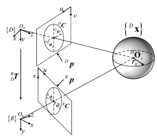
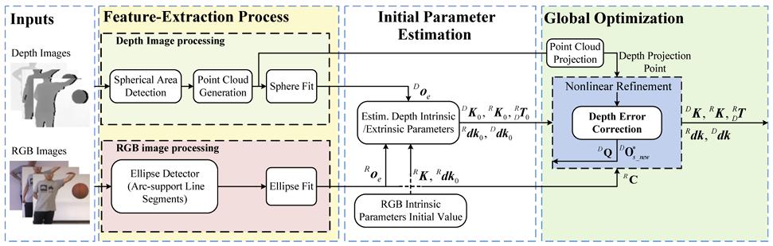

# RGB-D camera calibration and trajectory estimation for indoor mapping

---

- Camera Calibration

---

url: https://link.springer.com/article/10.1007/s10514-020-09941-w  
https://opg.optica.org/oe/fulltext.cfm?uri=oe-28-13-19058&id=432581

---

목차

0. [Abstract](#abstract)
1. 

---

## Abstract

RGB-D 카메라(또는 color-depth 카메라)

비정형 RGB-D 카메라는 많은 vision application에 필요한 정확도를 제공할 수 없는 대략적인 내적 및 외적 보정만 있다.

- color-depth sensor pair의 내재적 및 외적 매개변수를 추정하기 위한 새롭고 정확한 구 기반 보정 프레임워크를 제안
- 깊이 오류 수정 방법을 제안 & 수정 원리 자세히 분석
- 특징 추출 모듈은 noise 데이터 및 outlier을 제외하면서 구 투영의 중심과 가장자리를 자동으로 안정적으로 감지할 수 있다.
- RGB 및 깊이 이미지에 대한 구 중심의 투영을 사용하여 초기 매개변수의 closed solution을 얻는다.
- 모든 매개변수는 비선형 global 최소화의 프레임워크 내에서 정확하게 추정된다.
- 다른 SOTA 방법과 비교할 때, 사용하기 쉽고 더 높은 교정 정확도를 제공

## 1. Introduction

## 2. Mathematical analysis

> **Figure 1. RGB-D 카메라의 imaging model**  
> 

## 3. Calibration approach

> **Figure 2. 구를 기반으로 한 RGB-D 카메라 보정 방법의 framework diagram**  
> 점선은 두 선분이 교차하지 않음을 나타냄

### 3.4 Depth error correction