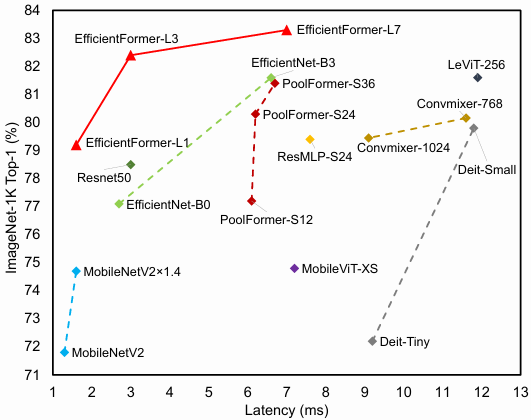
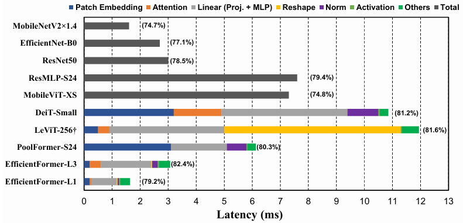

# EfficientFormer: Vision Transformers at MobileNet Speed

---
Reference

본 문서에 사용된 모든 이미지와 표는 해당 논문에서 발췌하였습니다.

---

---

## 📌 Metadata
---
분류
- Classification
- Edge Computing
- Vision Transformer
---
url:
- [paper](https://proceedings.neurips.cc/paper_files/paper/2022/hash/5452ad8ee6ea6e7dc41db1cbd31ba0b8-Abstract-Conference.html)
- [github](https://github.com/snap-research/EfficientFormer)
---
- **Authors**: Yanyu Li, Geng Yuan, Yang Wen, Ju Hu, Georgios Evangelidis, Sergey Tulyakov, Yanzhi Wang, Jian Ren
- **Venue**: NeurIPS 2022

---

## 📑 Table of Contents
- [Abstract](#abstract)
- [1. Introduction](#1-introduction)
- [3. Vision Transformers의 On-Device 지연 시간 분석](#3-vision-transformers의-on-device-지연-시간-분석)

---

## ⚡ 요약 (Summary)
- **Problem**: Vision Transformer(ViT)는 성능은 우수하지만 복잡한 어텐션 매커니즘과 설계(예: 큰 커널 패치 임베딩)로 인해 모바일 장치에서 CNN(MobileNet)보다 훨씬 느리며 실시간 배포가 어려움.
- **Goal**: 고성능을 유지하면서도 모바일 기기에서 MobileNet 수준의 빠른 추론 속도를 달성하는 Pure Transformer 아키텍처(EfficientFormer) 제안.
- **Key Method**: 
    - **Latency Analysis**: iPhone 12에서 ViT의 병목 구간을 분석하여 큰 커널의 비중첩 패치 임베딩과 불일치한 피처 차원이 속도 저하의 주원인임을 식별.
    - **Dimension-Consistent Design**: MobileNet 블록 없이도 효율적인 파라미터 활용이 가능한 순수 트랜스포머 디자인 패러다임 도입.
    - **Latency-Driven Slimming**: 기존의 MACs나 파라미터 수 대신 실제 기기에서의 '지연 시간(Latency)'을 직접 최적화 지표로 사용하는 Slimming 기법 적용.
- **Result**: EfficientFormer-L1은 MobileNetV2보다 정확도는 높으면서도 동일한 속도(1.6ms)를 달성하며, 모바일 최적화 ViT 중 최첨단 성능을 입증함.

---

## 📖 Paper Review

## Abstract

Vision Transformers(ViT)
- 다양한 벤치마크에서 좋은 결과 달성
- 많은 매개변수와 모델 설계로 인해(예: Attention mechanism) 경량 convolutional network보다 몇 배 느리다.  
-> 실시간 application을 위한 배포가 까다롭다.  
-> 자원이 제한된 장치에서 더 까다롭다.

ViT의 연산 복잡성을 줄이기 위한 노력
- 네트워크 아키텍처 search
- MobileNet block을 이용한 hybrid design

-> 추론 속도가 여전히 만족스럽지 않다.

Transformer가 고성능을 유지하며 MobileNet만큼 빠르기 위한 작업
1. 비효율적인 설계를 식별
2. dimension-consistent pure transformer(MobileNet 블록을 제외한)을 설계 paradigm으로 소개
3. EfficientFormer을 얻기 위해 latency-driven slimming 수행

실험 결과  
(iPhone 12, ImageNet-1K 사용)  
(MobileNetV2x1.4(1.6ms, 74.7% top-1)은 1.6ms의 추론 latency 달성)

- EfficientFormer-L1
    - 가장 빠른 모델
    - 79.2% 정확도, 1.6ms latency로 상위 1위를 달성((CoreML로 컴파일))
- EfficientFormer-L7
    - 가장 큰 모델
    - 83.3% 정확도, 7.0ms latency

-> 적절하게 설계된 Transformer가 고성능을 유지하며 모바일 장치에서 매우 낮은 대기시간을 달성할 수 있다.

## 1. Introduction

Transformer 아키텍처
- NLP 작업을 위해 설계됨
- long-term dependencies를 모델링하고 쉽게 병렬화할 수 있도록 하는 Multi-Head Self Attention(MHSA) 메커니즘을 도입

Vision Transformer(Vit)
- Attention 메커니즘을 2D 이미지에 적용
- 입력 이미지를 패치로 나누고 패치 간 표현은 MHSA를 통해 학습(유도 편향이 없다)
- CNN에 비해 유망한 결과를 보입
- 일반적으로 CNN보다 몇 배 느리다.  
-> 자원이 제한된 장치에서의 실제 application에 실용적이지 않다.

Transformer의 대기 시간 병목을 완화하기 위한 접근 방식들
- linear layer을 Convolution layer로 변경
- self-attention을 MobileNet block과 결합
- sparse attention을 도입하여 계산 비용 줄이기
- network searching algorithm 또는 pruning을 사용하여 효율성을 향상
-> "강력한 ViT가 MobileNet 속도로 실행되어 edge application의 옵션이 될 수 있는가" 에 대해서는 답이 나오지 않았다.  
--> 이 논문에서 그 해답에 대한 연구를 제공

이 논문의 기여
- 지연 시간 분석을 통해 ViT와 그 변형의 설계 원칙을 다시 살펴본다.  
iPhone 12를 testbed로 사용하고 CoreML을 컴파일러로 사용
- 분석을 바탕으로 ViT에서 비효율적인 설계 및 연산자를 식별하고 ViT에 대한 새로운 dimension-consistent design paradigm이 보장되는 설계 패러다임을 제안
- 새로운 디자인 패러다임의 supernet에서 시작하여 새로운 모델군(EfficientFormers)를 얻기 위해 간단하고 효과적인 latency-driven slimming 방법을 제안  
MAC 또는 매개변수 수 대신 추론 속도를 직접 최적화

> **Figure 1. 추론 속도 vs 정확도**  
> 모든 모델은 ImageNet-1K에서 훈련하고 iPhone 12에서 CoreMLTools를 사용하여 측정
> CNN과 비교했을 때, EfficientFormer-L1은 EfficientNet-B0보다 40% 더 빠르고 정확도가 2.1% 더 높다.
> 최신 MobileViT-XS의 경우, EfficientFormer-L7은 0.2ms 더 빠르고 정확도가 8.5% 더 높다.

ImageNet-1K 분류 작업
- EfficientFormer-L1
    - 1.6ms latency(1000회 이상 실행을 평균)으로 79.2%의 top-1 정확도를 달성
- EfficientFormer-L7
    - 7.0ms latency로 83.3% 정확도를 달성
    - ViTxMobileNet 하이브리드 설계(MobileViT-XS, 74.8%, 7.2ms)를 큰 차이로 능가

이미지 Detection 및 Segmentation 벤치마크에서 우수한 성능을 관찰

-> ViT는 빠른 추론 속도를 달성하고 동시에 강력한 성능을 발휘할 수 있다.

## 2. Related Work

## 3. Vision Transformers의 On-Device 지연 시간 분석

대부분의 기존 접근 방식은 서버 GPU에서 얻은 계산 복잡도(MACs) 또는 처리량(images/sec)을 통해 Transformer의 추론 속도를 최적화  
-> 실제 기기 내 latency를 반영하지 않는다.

Edge device에서 ViT의 추론 속도를 늦추는 작업 및 설계 선택을 명확하게 이해하기 위해 Fig 2.와 같이 여러 모델 및 작업에 대해 포괄적인 대기 시간 분석을 수행

> **Figure 2. Latency profiling**  
> CoreML이 설치된 iPhone 12에서 얻은 결과  
> CNN: MobileNetV2x1.4, EfficientNet-B0  
> ViT-based models: DeiT-Small, LeViT-256, PoolFormer-S24 및 EfficientFormer  
> 모델 및 작업의 latency는 다른 색상으로 표시  
> ()는 ImageNet-1K의 top-1 정확도  
> †LeViT은 CoreML에서 잘 지원되지 않는 HardSwish를 사용하며, 공정한 비교를 위해 GeLU로 대체

**관찰 결과 1:**  
**큰 kernel과 stride를 사용한 patch embedding은 모바일 장치에서 속도 병목 현상을 일으킨다.**

- 패치 임베딩은 종종 kernel 크기와 stride가 큰 비중첩 convolution layer로 구성
- Transformer 네트워크에서 patch embedding layer의 계산 비용은 눈에 띄지 않거나 무시할 수 있을 정도라는 것이 일반적인 믿음
    - 그림 2에서 큰 kernel과 stride를 갖는 DeiT-S & PoolFormer-S24와 그렇지 않은 모델 LeViT-256 & EfficientFormer을 비교하면 patch embedding이 모바일 장치에서 속도 병목을 일으킴을 알 수 있다.
- 대형 kernel convolution은 대부분의 compiler에서 잘 지원되지 않고, Winograd와 같은 기존 알고리즘으로 가속화 할 수 없다.
    - 대안으로, 비중첩 patch embedding은 여러 하드웨어 효율적인 $3 \times 3$ convolution으로 구성된 빠른 donwsampling이 있는 convolution stem으로 대체될 수 있다.(그림 3)

**관찰 결과 2:**
**일관된 feature 차원은 token mixer을 선택하는데 중요하다. MHSA가 반드시 속도 병목 현상을 일으키는 것은 아니다.**