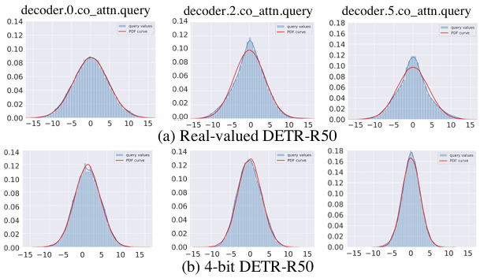
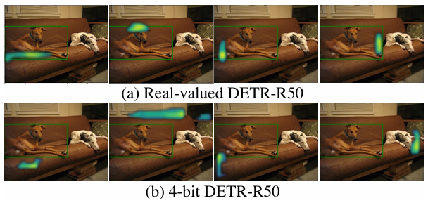

# Q-DETR: An Efficient Low-Bit Quantized Detection Transformer

## 📌 Metadata
---
분류
- Object Detection
- Model Quantization
- Transformer

---
url:
- [paper](https://openaccess.thecvf.com/content/CVPR2023/html/Xu_Q-DETR_An_Efficient_Low-Bit_Quantized_Detection_Transformer_CVPR_2023_paper.html) (CVPR 2023)

---
- **Authors**: Sheng Xu, et al.
- **Venue**: CVPR 2023

---

## 📑 Table of Contents
- [Abstract](#abstract)
- [1. Introduction](#1-introduction)
- [2. Related Work](#2-related-work)
- [3. The Challenge of Quantizing DETR](#3-the-challenge-of-quantizing-detr)
  - [3.1 Quantized DETR baseline](#31-quantized-detr-baseline)
  - [3.2 Challenge Analysis](#32-challenge-analysis)
- [4. Q-DETR Method](#4-q-detr-method)
- [5. Experiments](#5-experiments)
- [6. Conclusion](#6-conclusion)

---

## Abstract

최신 DETR(Detection Transformer)에는 advanced object detection 기능이 있지만 막대한 계산 및 메모리 자원이 필요하다.
양자화는 low-bit parameter와 연산으로 네트워크를 표현하는 해결책으로 두드러진다.
하지만, 기존 양자화 방ㅂ버으로 low-bit quantized DETR(Q-DETR)을 수행할 때 상당한 성능 저하가 있다.
경험적 분석을 통해 Q-DETR의 병목 현상이 query information distortion(쿼리 정보 분산)에서 비롯된다는 것을 발견
이 논문은 distribution rectification distillation(DRD)를 기반으로 이 문제를 다룬다.
DRD를 bi-level 최적화 문제로 공식화하며, 이는 Information Bottleneck(IB) 원리를 Q-DETR 학습에 일반화하여 파생될 수 있다.
내부 수준에서는, self-information entropy를 최대화하기 위해 query에 대한 distribution alignment를 수행한다.
상위 수준에서는 새로운 foreground-aware query matching scheme을 도입하여 teacher information을 distillation-desired features로 효과적으로 전달하여 conditional information entropy를 최소화

실험 결과는 논문의 방법이 선행 기술보다 더 나은 성능을 보임
    - 4-bit Q-DETR은 이론적으로 ResNet-50 backbone을 사용하여 DETR을 6.6배 가속하고 39.4% AP를 달성할 수 있으며, COCO dataset의 실제 값 대비 2.6%의 성능 차이만 존재한다.

## 1. Introduction

DETR
- 초기 object detection(CNN, NMS(Non-Maximum Suppresion) 사용)과 달리 object detection을 direct set prediction 문제로 처리
- 일반적으로 두 배의 매개변수와 float-pointing 연산을 갖고 있다.
예: ResNet-50 backbone을 사용하는 DETR-R50 모델은 159MB 메모리를 사용하고 86G FLOPs를 차지하는 39.8M 매개변수가 있다.
-> 추론 중에 허용할 수 없는 메모리 및 계산 소비가 발생
-> 자원이 제한된 장치에 배포하는 데 문제 발생

양자화는 네트워크를 low-bit 형식으로 표현
DETR에 Post-Training Quantization(PTQ)은 pre-trained real-valued 모델에서 양자화된 매개변수를 계산
-> 훈련 데이터에 대한 fine-tuning이 부족하여 모델 성능을 제한하는 경우가 많다.
ultra-low bits(4-bit 이하)로 양자화할 경우 성능이 급격히 떨어진다.
Quantization-Aware Training(QAT)는 훈련 데이터셋에 대한 양자화와 fine-tuning을 동시에 수행하므로 bit가 현저히 낮아도 사소한 성능 저하 발생
QAT 방법은 컴퓨터 비전 작업을 위해 CNN을 압축하는데 효과적인 것으로 입증되었지만, low-bit DETR에 대해서는 탐구되지 않음

> **Figure 1. (a)와 (b)의 서로 다른 decoder layers의 cross attention에 대한 Gaussian 분포의 Query 값 q(파란색 영역)과 그에 해당하는 PDF curve(빨간색 curve)**  
(a): real-valued DETR-R50  
(b): 4-bit 양자화된 DETR-R50(baseline)  
VOC 데이터셋을 사용하여 실험  
Gaussian 분포는 query 값의 통계적 평균과 분산에서 생성  
양자화된 DETR-R50의 query는 real-valued query에 비해 정보 왜곡이 있다.

> **Figure 2**  
(a) real-valued DETR-R50  
(b) 4-bit 양자화된 DETR-R50  
초록색 사각형: GT bounding box  
강조 표시된 영역은 bound prediction에 따라 선택된 4개의 head에서 큰 attention weights를 나타냄
real-valued counterpart와 비교했을 때, 양자화된 DETR-R50은 GT bound에서 크게 벗어난다.

QAT 기법을 기반으로 하는 low-bit DETR baseline을 구축
이 baseline에 대한 경험적 연구를 통해 VOC dataset에서 상당한 성능 저하를 관찰
4-bit quantized DETR-R50 및 LSQ는 76.9% AP50만 달성하므로 실제 값 DETR-R50에 비해 6.4%의 성능 차이가 있다.
기존 QAT 방법의 비호환성이 주로 DETR의 독특한 attention mechanism에서 비롯됨을 발견
- 공간 종속성(spatial dependencies)은 객체 query와 encoded feature 사이에 먼저 구성된다.
- 그 다음, co-attended object queries는 feed-forward network에 의해 상자 좌표 또는 class label로 공급된다.
DETR에서 기존 QAT 방법을 적용하면 query 정보 왜곡이 발생하여 성능이 심각하게 저하
Fig 1은 4-bit DETR-R50의 query feature에서 정보 왜곡의 예를 보임
- 양자화된 DETR과 real-valued version에서 query 모듈의 상당한 분포 변동을 볼 수 있다.
- query 정보 왜곡은 spatial attention의 부정확한 초점을 유발.
-> 그림 2에서 4-bit와 real-valued DETR-R50의 spatial attention weight map을 시각화  
양자화된 DETR-R50의 부정확한 물체 위치 파악을 보임
-> DETR 양자화를 위해 보다 일반적인 방법이 필요하다.

Q-DETR
- 위의 문제를 해결하기 위해 양자화된 DETR의 쿼리 정보를 real-valued DETR의 쿼리 정보로 수정
- 그림 3은 Q-DETR에 대한 overview 제공
    - Distribution Rectification knowledge Distillation(DRD)을 사용
- 비효율적인 지식(knowledge)가 real-valued teacher로부터 양자화된 학생에게 전달되는 이유:
    - 정보 격차와 왜곡(distortion)  
-> DRD를 정보 병목 현상 원칙(IB. Information Bottleneck principle)에 따라 설정된 bi-level 최적화 프레임워크로 공식화
- 일반적으로 학생 queries의 self-information entropy를 최대화하기 위한 inner-level optimization과 학생과 교사 queries 사이의 conditional information entropy를 최소화 하기 위한 upper-level optimization이 포함된다.
- inner-level에서는 그림 1과 같이 gaussian-alike distribution에 따라 query에 대한 분포 정렬을 수행  
-> 순방향 전파에서 최대 정보 entropy를 준수하는 명시적 상태로 이어짐
- upper-level에서는 학생과 교사 간의 정확한 1대1 query 매칭을 위해 low-qualified 학생 query를 필터링하는 새로운 foreground-aware query를 도입
-> 역전파에서 minimum conditional information entropy를 push할 수 있는 귀중한 knowledge gradients를 제공

논문의 기여
1. Q-DETR을 개발
    - DETR을 위한 최초의 QAT 양자화 프레임워크
2. DRD를 사용
    - bi-level optimization distillation framework
3. 기존 양자화 baselines에 비해 상당한 성능 향상을 관찰

## 2. Related Work

**Quantization**

양자화된 신경망은 종종 낮은 bit(1~4 bit)의 가중치와 activation을 통해 모델 추론을 가속화하고 메모리를 절약
- DoReFa-Net은 low bit-width parameter와 gradients를 가진 convolution kernel을 활용하여 훈련 및 추론을 가속화
- TTQ는 두 개의 real-valued scaling coefficients를 사용하여 사중치를 삼항(ternary) 값으로 양자화
- [48]은 가중치와 activation을 교대로 양자화하는 2단계 접근 방식을 사용하여 메모리, 효율성 및 성능 간의 최적 절충을 제공하는 2 ~ 4-bit 양자화 체계를 제시
- [14]에서는 양자화 간격을 매개변수화하고 네트워크의 task loss를 최소화하여 최적의 값을 얻는다.
- ZeroQ는 서로 다른 network layers 간의 batch normalization 통계와 일치하도록 설계된 distilled dataset을 최적화하여 uniform and mixed-precision quantization을 지원
- [41]은 KL divergence를 활용하여 정확한 low-precision 모델을 얻기 위해 네트워크 양자화에 전이 학습을 도입
- [10]은 긴 꼬리를 가진 종 모양의 분포를 갖는 텐서 값에 대한 정확한 근사치를 가능하게 하고 양자화 오류를 최소화하여 전체 범위를 찾는다.
- [17]은 양자화된 vision transformer에서 bit-width를 push하기 위해 information rectification module과 distribution-guided distillation을 제안

이 논문에서는 동시에 IB 원칙에서 DETR의 양자화를 다룬다.

**Detection Transformer**

몇몇 연구자들은 vision task를 위한 transformer framework를 탐구
- DETR은 물체 감지를 위한 attention mechanism을 기반으로 하는 Transformer 구조를 소개
DETR의 단점: 매우 비효율적인 training process
- Deformable-DETR: reference points 주위의 정적 point-wise query sampling 방법을 사용하여 희소하고 point-to-point Multi-Head Attention(MHA) mechanism을 구성
- SMCA-DETR은 공간적으로 변조된 co-attention을 공식화하기 전에 gaussian-distributed spatial function을 도입
- DAB-DETR은 DETR의 query를 dynamic anchor boxes로 재정의하고 cascade 방식으로 layer별로 soft ROI pooling을 수행
- DN-DETR은 query 생성에 query denoising을 도입하여 bipartite graph matching(이분 그래프 매칭) 난이도를 줄이고 더 빠른 수렴을 유도
- UP-DETR은 DETR의 수렴 속도와 성능을 향상시키기 위해 새로운 self-supervised loss를 제안

선행기술들은 주로 DETR의 훈련 효과에 초점을 맞추고 있으며, DETR의 training 효율성에 대해 논의한 연구는 거의 없다.

이를 위해 양자화된 DETR baseline을 구축한 다음, IB 원칙에 따라 query information distortion 문제를 해결
마지막으로, Q-DETR을 효과적으로 해결하기 위해 foreground-aware query matching scheme을 기반으로 하는 새로운 KD 방법을 구현

## 3. The Challenge of Quantizing DETR

### 3.1 Quantized DETR baseline

low-bit DETR을 연구하기 위한 baseline을 구성.

LSQ+를 따라 비대칭 activation 양자화와 대칭 가중치 양자화의 일반적인 framework를 진행

$$
\displaystyle
\begin{aligned}
x_q = \lfloor \rm clip \it \{ \frac{(x - z)}{\alpha_x}, Q^x_n, Q^x_p \} \rceil, \quad w_q = \lfloor \rm clip \it \{ \frac{W}{\alpha_w}, Q^w_n, Q^w_p \} \rceil,
\\
Q_a(x) = \alpha_x \circ x_q + z,
\quad\quad
Q_w(x) = a_w \circ w_q,
\quad\quad
(1)
\end{aligned}
$$

> $\rm clip \it \{ y, r_1, r_2 \}$: 값 경계 $r_1$ 및 $r_2$로 입력 $y$를 자름  
> $\lfloor y \rceil$: $y$를 가장 가까운 정수로 반올림  
> $\circ$: 채널별 곱셈  
> $Q^x_n = -2^{a - 1}, Q^x_p = 2^{a - 1}, Q^w_n = -2^{b - 1}, Q^w_p = 2^{b - 1} - 1$: a-bit activation과 b-bit 가중치에 대한 이산 한계  
> $x$: 이 논문에서는 convolution과 완전 연결 레이어(fully-connected layers)의 input feature map과 multi-head attention module의 입력을 포함한 activation을 나타냄

양자화된 fully-connected layer:

$$
\displaystyle
\begin{aligned}
&Q-FC(x) = Q_a(x) \cdot Q_w(w) = \alpha_x \alpha_w \circ (x_q \odot w_q + z/\alpha_x \circ w_q)
&(2)
\end{aligned}
$$

> $\cdot$: 행렬 곱셈  
> $\odot$: 효율적인 bit-wise 연산을 사용한 행렬 곱셈

Straight-Through Estimator(STE)는 역전파에서 gradient의 유도를 위해 사용

DETR에서는 backbone에서 생성된 시각적 특징이 위치 임베딩과 합쳐지고 transformer encoder에 공급된다.
encoder 출력 $E$가 주어지면 DETR은 객체 query O와 visual features $E$ 간에 co-attention을 수행하고, 이는 다음과 같다.

$$
\displaystyle
\begin{aligned}
q &= Q-FC(O), k,v = Q-FC(E) &
\\
A_i &= \rm softmax \it (Q_a(q)_i \cdot Q_a(k)^T_i / \sqrt{d})
&(3)
\\
D_i &= Q_a(A)_i \cdot Q_a(v)_i
\end{aligned}
$$

> $D$: multi-head co-attention module. object query의 co-attended feature을 의미
> $d$: 각 head의 feature dimension

더 많은 FC layer은 최종 출력에 대한 각 object query의 decoder의 output feature을 변환.
box와 class 예측이 주어지면 hungarian 알고리즘이 예측과 GT box annotation 사이에 적용되어 각 object query의 학습 대상을 식별

### 3.2 Challenge Analysis