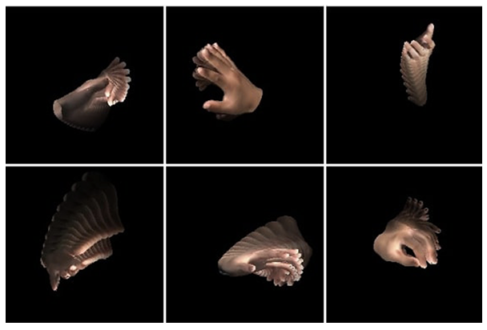
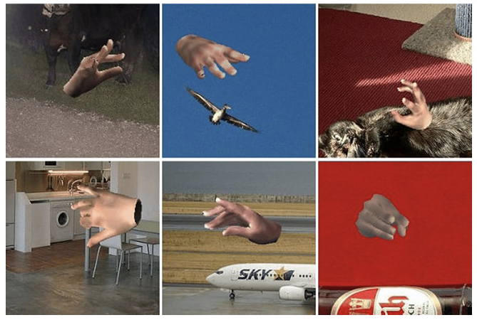

# SeqHAND: RGB-Sequence-Based 3D Hand Pose and Shape Estimation

---

- Hand pose estimation
- LSTM

---

- John Yang et al.
- ECCV 2020
- url: https://link.springer.com/chapter/10.1007/978-3-030-58610-2_8

---

## GPT 정리

1. 새로운 RGB 기반 3D 손 포즈 및 형상 추정 방법 제안  
기존 연구들은 독립적인 프레임 단위의 추정에 초점을 맞췄으나, 본 논문에서는 RGB 연속 이미지(sequence)를 활용하여 손의 시간적 움직임(temporal movement) 을 고려한 새로운 프레임워크를 제안함.
시간적 일관성을 유지하면서 3D 손 포즈 및 형상을 더 정확하게 추정할 수 있도록 설계됨.
2. SeqHAND: 새로운 합성 데이터셋 생성 방법 제안  
대규모 RGB 연속 손 이미지 데이터셋이 부족한 문제를 해결하기 위해 기존 정적(static) 손 포즈 데이터셋(BigHand2.2M) 의 주석을 재구성하여 자연스러운 손 움직임을 포함한 포즈 흐름(pose-flow)을 생성 함.
새로운 합성 데이터셋 SeqHAND 는 현실적인 손 움직임을 모사하며, 다양한 배경 및 조명 조건에서의 일반화를 가능하게 함.
3. ConvLSTM을 활용한 새로운 순환 구조 네트워크 (SeqHAND-Net)  
손의 시각-시간적(visuo-temporal) 특징 을 직접 활용하기 위해 ConvLSTM 기반의 순환 신경망 구조 를 제안.
기존 ResNet-50 기반 인코더에서 ConvLSTM을 추가하여, 연속적인 손 포즈 변화 정보를 학습할 수 있도록 개선됨.
개별 프레임별로 독립적으로 학습하는 기존 방식보다 연속된 이미지에서 손의 자연스러운 움직임을 학습 하여 추정 성능을 향상시킴.
4. 합성-실제 도메인 간 적응 (Synthetic-to-Real Domain Adaptation)  
합성 데이터로 학습된 모델이 실제 데이터에 잘 적용되지 않는 도메인 갭(domain gap) 문제 를 해결하기 위해 새로운 학습 전략을 제안 함.
ConvLSTM 계층을 동결(freeze) 하여, 합성 데이터에서 학습한 시간적 특징을 유지한 채, 실제 데이터에서 저수준(low-level) 특징만 미세 조정(finetuning) 하는 방식을 사용.
이를 통해 합성 데이터에서 학습한 시간적 특징이 유지되면서도, 실제 손 이미지에 대한 일반화 성능을 향상 시킴.
5. 실험 결과: 기존 SOTA(State-of-the-Art) 대비 성능 향상  
STB(Stereo Hand Pose Tracking), EgoDexter, Dexter+Object 등 주요 데이터셋에서 실험을 진행.
RGB 연속 프레임을 활용하여 기존 SOTA 대비 높은 성능을 달성 함.
손의 자연스러운 움직임을 더 잘 반영하며, 연속된 프레임에서도 부드럽고 안정적인 예측을 제공 함.
특히, 손가락이 가려지는 경우(occlusion)에서도 강건한 추정 성능을 보임.
6. 핵심 기술 요약  
새로운 합성 데이터셋(SeqHAND) 생성 방법: 기존 정적 포즈 데이터를 변형하여 연속된 포즈 흐름(pose-flow) 생성.
ConvLSTM을 활용한 순환 신경망(SeqHAND-Net): 시간적 일관성을 반영한 3D 손 포즈 추정 네트워크.
합성-실제 도메인 적응 기술: 시간적 특징을 유지한 채 실제 데이터로 미세 조정하는 학습 전략 제안.
SOTA 대비 성능 향상: 다양한 데이터셋에서 실험하여 더 정확하고 자연스러운 3D 손 포즈 추정을 달성.

📌 결론
이 논문은 기존 RGB 기반 3D 손 포즈 추정 연구들이 놓친 시간적 연속성(temporal continuity) 을 강조하여 더 자연스럽고 강건한 추정이 가능하도록 개선한 점이 핵심 기여입니다. 새로운 합성 데이터셋과 네트워크 구조, 도메인 적응 기법을 통해 SOTA를 능가하는 성능을 보이며, 손 동작 추적의 새로운 방향을 제시한 연구 라고 볼 수 있습니다.

## Abstract

대부분의 RGB 이미지를 기반으로 한 3D 손 포즈 추정은 연구는 독립적인 정적 이미지를 기반으로 프레임별 추정을 수행

이 논문에서는 손의 모양뿐만 아니라 움직이는 손의 시간적 움직임 정보를 학습 프레임워크에 통합하려고 시도  
-> 순차적 RGB 손 이미지가 있는 대규모 데이터 세트 필요  
--> 기존 정적 손 포즈 데이터 세트의 주석을 포즈 흐름으로 재엔지니어링하여 자연스러운 인간의 손 움직임을 모방하는 합성 데이터 세트를 생성하는 새로운 방법을 제안

생성된 데이터셋으로 제안한 순환 프레임워크를 훈련
- 순차적 합성 손 이미지의 visuo-temporal 특징을 활용
- 시간적 일관성 제약 조건으로 추정의 부드러움을 강조

새로운 훈련 전략:
domain fine-tuning 중에 프레임워크의 순환 계층을 합성에서 실제로 분리
- 순차적인 합성 손 이미지에서 학습한 visual-temporal 특징을 보존할 수 있도록 함

순차적으로 추정되는 손 포즈는 결과적으로 자연스럽고 부드러운 손 움직임을 생성
-> 강력한 추정으로 이어짐

3D 손 포즈 추정을 위해 시간 정보를 활용
-> 손 포즈 추정 벤치마크 실험에서 SOTA를 능가

## 1. Introduction

손 포즈 추정은 많은 인간-컴퓨터 상호 작용에 필수적입니다 
- 증강 현실(AR)
- 가상 현실(VR)
- 제스처 추적이 필요한 컴퓨터 비전 작업

손 포즈 추정의 어려움
- 자기 폐색을 포함한 포즈 관절 및 교색의 광범위한 공간에서 어려움을 겪음

순차적 깊이 이미지 프레임을 입력으로 사용하는 최근의 일부 3D 손 포즈 추정기는 손 움직임의 시간적 정보를 고려하여 성능을 향상시키려고 노력함[14, 22, 26, 43].

**모션 컨텍스트**:
- 더 좁은 검색 공간
- 수동 개인화
- 폐색에 대한 견고성 및 추정 개선
을 위한 시간적 기능을 제공

이 논문에서는 3D 공간 정보를 더 잘 추론하기 위해 RGB 이미지 시퀀스만 사용하여 손의 움직임을 고려한 손 포즈 추정에 중점을 둠

단일 RGB 이미지에서 손 포즈를 추정하는 문제는 ill-posed problem
하지만 다양한 딥 러닝 네트워크의 개발로 인해 성능이 빠르게 향상되고 있음 [3, 11, 24]

대부분의 연구는 모션 경향을 고려하지 않고 각 이미지의 3D 조인트 위치를 정확하게 추정하는 데 중점을 둠

- 손의 포즈는 매우 빠르게 변경되며 대부분의 경우 순간적인 포즈보다 연속적인 포즈의 움직임에 대한 더 많은 정보를 포함 
- 현재 포즈는 이전 프레임의 포즈의 영향을 크게 받음

지금까지 포즈의 지속적인 변화를 고려한 추정 네트워크에 대한 연구가 부족했습니다.

기존의 RGB 기반 딥 3D 손 포즈 추정기[1, 3, 24, 49]
- 프레임별 포즈 추정 접근 방식을 가진 프레임워크만 제안
    - 손 포즈의 정적 이미지가 있는 데이터셋과 달리 대규모 RGB 순차 손 이미지 데이터셋을 사용할 수 없음

피부색, 배경 및 폐색에 대한 일반화와 함께 손 동작의 다양성과 진정성은 데이터 세트가 보장하기 어렵다.

**논문의 기여**

- 손 포즈 및 형태 추정 작업에 대한 새로운 관점을 제시
- RGB 이미지 입력을 기반으로 손 포즈의 보다 정확한 3D 추정을 위해 손의 시간적 움직임과 모양을 고려할 것을 제안

연속적인 손 포즈 이미지를 관리하기 위해 visuo-temporal 특징을 활용하는 프레임워크를 훈련시키려면 순차적으로 상관 관계가 있는 충분한 포즈 데이터 샘플이 있어야 함
- 자연스러운 손 움직임의 순차적 합성 RGB 이미지를 사용하여 BigHand2.2M 데이터셋[46]의 현존하는 정적 손 포즈 주석을 재엔지니어링하는 새로운 생성 데이터 세트 방법인 SeqHAND 데이터 세트를 제안합니다
- 생성된 데이터셋을 효과적으로 테스트하기 위해 [3]의 프레임워크를 확장. 구조의 경험적 타당성을 기반으로 하는 순환 계층이 있음
- 합성 이미지로 훈련된 모델이 실제 이미지에서 성능이 좋지 않다는 것이 널리 받아들여지고 있기 때문에 합성-실제 도메인 전환 중에 사전 훈련된 이미지 수준 시간 매핑을 보존하기 위한 새로운 훈련 파이프라인을 제시

> **Figure 1. 제안된 방법에 의해 생성된 hand pose-flows의 2D image**

> **Figure 2. 순차적인 손 모션 비디오의 각 프레임은 다양한 포즈와 움직이는 배경으로 구성**

**기여 정리**

- 우리는 3D 손 포즈 및 모양 추정기가 손 포즈 변화의 역학을 학습할 수 있도록 하는 사실적인 손 움직임이 있는 순차 RGB 이미지 데이터 세트를 위한 새로운 생성 방법인 포즈-플로우(pose-flow) 생성 절차를 제안(그림 1 참조)

- 이미지 공간의 손, 포즈 및 형상 변화의 시시적 정보를 직접 활용하고 3D 공간에 매핑할 수 있는 컨볼루션-LSTM 레이어를 사용하는 새로운 순환 프레임워크를 제안

- 합성에서 실제로의 도메인 미세 조정 중에 순차적 RGB 손 이미지에서 추출된 시공간 특징을 보존하는 새로운 교육 파이프라인을 제시

- 논문의 접근 방식은 표준 3D 손 포즈 추정 데이터 세트 벤치마크에서 최첨단 성능을 달성할 뿐만 아니라 이미지 시퀀스에 대한 부드러운 인간과 같은 3D 포즈 피팅을 달성

- 순차적 RGB 이미지에서 직접 시간 정보를 활용하는 외부 2D 포즈 추정기가 없는 최초의 딥 러닝 기반 3D 손 포즈 및 모양 추정기를 제안

## 2. Related Works

우리는 3D 손 포즈 및 모양 추정기가 손 포즈 변화의 역학을 학습할 수 있도록 하는 사실적인 손 움직임이 있는 순차 RGB 이미지 데이터 세트를 위한 새로운 생성 방법을 설계합니다(그림 참조). 1) 포즈-플로우(pose-flow) 생성 절차를 제안합니다.

우리는 이미지 공간의 손, 포즈 및 형상 변화의 시시적 정보를 직접 활용하고 3D 공간에 매핑할 수 있는 컨볼루션-LSTM 레이어를 사용하는 새로운 순환 프레임워크를 제안합니다.

우리는 합성에서 실제로의 도메인 미세 조정 중에 순차적 RGB 손 이미지에서 추출된 시공간 특징을 보존하는 새로운 교육 파이프라인을 제시합니다.

우리의 접근 방식은 표준 3D 손 포즈 추정 데이터 세트 벤치마크에서 최첨단 성능을 달성할 뿐만 아니라 이미지 시퀀스에 대한 부드러운 인간과 같은 3D 포즈 피팅을 달성합니다.

우리가 아는 한, 우리는 순차적 RGB 이미지에서 직접 시간 정보를 활용하는 외부 2D 포즈 추정기가 없는 최초의 딥 러닝 기반 3D 손 포즈 및 모양 추정기를 제안합니다.

## 3. SeqHAND Dataset

### 3.1 Preliminary: MANO Hand Model

**MANO hand model**

Hand mesh 출력의 포즈와 모양을 제어하기 위한 두 개의 저차원 매개변수 $\theta$와 $\beta$를 각각 입력으로 사용하는 mesh deformation model

rigid hand mesh:

$$
\displaystyle
\begin{aligned}
&M(\theta, \beta) = W(T(\theta, \beta, \bar{T}), J(\beta), \theta, \omega)
&(1)
\end{aligned}
$$

> $\bar{T}:$ 주어진 평균 template  
> $T(\cdot):$ pose 및 shape와 함께 사전 정의된 deformation 기준에 따라 mesh model의 전체 형상을 정의  
> $J(\cdot):$ kinematic tree를 사용하여 3D 관절 위치를 생성
> $W(\cdot):$ blend 가중치 $\omega$로 적용되는 선형 blend skinning 함수

MANO model은 최대 45차원 pose parameter $\theta$ 및 10차원 shape parameters $\beta$를 사용할 수 있다.
(original MANO model은 계산 효율성을 위해 $\theta$의 6차원 PCA 부분공간을 사용)

**2D Reprojection of MANO Hands:**

관절 $J(\beta)$의 위치는 $R_{\theta}$로 표시된 포즈 $\theta$를 기준으로 전역으로 회전하여 21개 관절의 해당 3D 좌표를 갖는 손 posture $P$를 얻을 수 있다.

$$
\displaystyle
\begin{aligned}
&P = J(\theta, \beta) = R_{\theta}(J(\beta))
&(2)
\end{aligned}
$$

mesh 정점 $M(\theta, \beta)$와 joints $J(\theta, \beta)$에 대한 3D 추정이 MANO 모델에 의해 대치된 후, 3D 추정은 주어진 회전 행렬 $R \in SO(3)$, 평행 $t \in \mathbb{R}^2$ 및 scaling factor $s \in \mathbb{R}^{+}$을 사용하여 2D 추정을 획득하기 위해 weak-perspective camera model을 사용하여 2D 이미지 평면에 재투영

$$
\displaystyle
\begin{aligned}
&M_{2D} = s \Pi RM(\theta, \beta) + t
&(3) \\
&J_{2D} = s \Pi RJ(\theta, \beta) + t
&(4)
\end{aligned}
$$

> $\Pi:$ orthographic projections

손 mesh $M(\theta, \beta)$
- 1538개의 mesh 면으로 구성
- 778개 꼭짓점의 3D 좌표로 정의

joint 위치 $J(\theta, \beta)$
- 21개 joint의 3D 좌표로 표시

$M_{2D}$ 및 $J_{2D}$의 재투영된 2D 좌표는 이미지 좌표에서 2D 위치로 표시된다.

### 3.2 Generation of SeqHAND Dataset

시간적 feature의 잠재력은 3D HPE 작업에 대해 유망한 결과를 보임  
하지만 대규모 RGB 기반 손 이미지 데이터셋을 사용할 수 없었다.

사람과 같은 손 동작으로 순차적 RGB 이미지 데이터를 생성하려면 초기 pose에서 최종 pose로 변환되는 동안 모든 pose가 사실적이어야 함
순차적 손 motion image dataset을 생성하기 위해 BigHand2.2M(BH)[46]를 활용

BigHand2.2M(BH)[46]
- 10명의 피험자로부터 수집된 2시간동안 수집한 손 동작
- 관절 위치에 대한 3D 주석이 있는 220만개의 pose sample

BH 데이터셋을 사용하면 생성된 샘플이 실제 인간의 손 관절 공간의 manifold와 실제 손 pose의 운동학을 상속받을 것

그림 3. 에서 t-SNE를 이용한 BH 샘플의 3D mapping
-> BH는 pose sample이 조밀하고 광범위하게 수집된다

**Pose-Flow Generation:**

먼저 각 time step에서 pose 집합인 pose-flow를 정의
서서히 변화하는 pose를 순차적으로 넣는 pose-flow generation 방법을 제안

pose-flow generation
- 각 pose-flow generation에 대해 초기 및 최종 pose인 $P_{initial}$ 및 $P_{final}$은 BH 데이터셋에 대해 독립적이고 무작위로 선택
- n frame동안 초기 pose에서 최종 pose까지 joint의 좌표는 현재 좌표와 최종 좌표 간의 차이의 $\alpha / n$ 만큼 업데이트된다.
($\alpha:$ 업데이트 크기. 경험적으로 선택)
- Euclidean 거리 측면에서 업데이트된 pose에 가장 가까운 BH 데이터셋의 포즈 $P_i^{BH}$가 k번째 프레임의 현재 포즈로 선택

$$
\displaystyle
\begin{aligned}
&P_{0} = P_{initial}^{BH}
&(5)
\\
&P_{updated} = P_{k - 1} - \frac{\alpha}{n}(P_{k - 1} - P_{final}^{BH})
&(6)
\\
&P_k = P_i^{BH} \quad s.t. \quad \min_i ||P_{updated} - P_i^{BH}||.
&(7)
\end{aligned}
$$

pose flow 생성의 전체 절차(Fig 4 참조)
- 중간 pose($P_{updated}$)는 확률적 업데이트로 계산
- 이러한 확률성은 pose gradient의 strict update를 피하고 pose 공간 내에서 더 많이 방황하도록 장려하는데 도움이 됨.
- BH 주석에서 pose를 선택하면 변형 중에 손 pose의 정확성을 다시 확신할 수 있다.

Pose에 대한 RGB 이미지를 생성하기 위해 BH 주석의 joint에 대한 3D 좌표 입력을 받는 얕은 4-layer network를 훈련시켜 MANO 손 모델에 해당하는 pose 매개변수 $\theta$를 출력하도록 함

프레임의 각 pose에 대해 21개의 관절 위치 좌표를 이 네트워크에 입력하여 원하는 pose의 손 mesh 모델을 얻음  
이후 이미지 평면에 투영

[3]에서와 같이 mesh의 각 정점에 미리 정의된 손 색상 template의 RGB 값을 할당하여 손의 모양을 만든다.

샘플링된 손 모양 매개변수 $\beta \in [-2, 2]^{10}$ 및 선택한 색상 template는 흐름에 따라 변경되지 않고 설정된다.

회전 $R$, scale $s$ 및 translation $t$ factor의 카메라 매개변수는 초기 및 최종 pose에 대해 독립적으로 sampling되고 pose와 동일한 방식으로 각 프레임에서 update

Fig 1은 생성된 pose-flows를 보여줌

in the wild hand motion 이미지를 더욱 모방하여 $w$ 및 $h$ 크기의 VOC2012 에서 두 개(맨 처음과 맨 끝) 무작위 patch를 sampling하고 frame에 따라 배경에 대한 patch의 위치를 이동

표 1에서 알 수 있듯이 생성된 SeqHAND 데이터셋은 손 자세에 대한 3인칭 및 자기 중심적 관점뿐만 아니라 손 자세의 순차적 RGB 이미지도 제공
-> 신경망이 RGB 입력에서 직접 시공간 기능을 활용할 수 있도록 함

## 4. SeqHand-Net for Visuo-Temporal Feature Exploitation

포즈에 대한 RGB 이미지를 생성하기 위해 BH 주석의 joint에 대한 3D 좌표 입력을 받는 얕은 4-layer 네트워크를 훈련시켜 MANO 손 모델에 해당하는 포즈 매개변수 $\theta$를 출력하도록 함