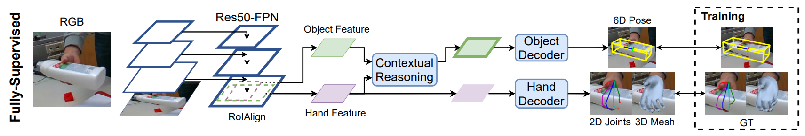
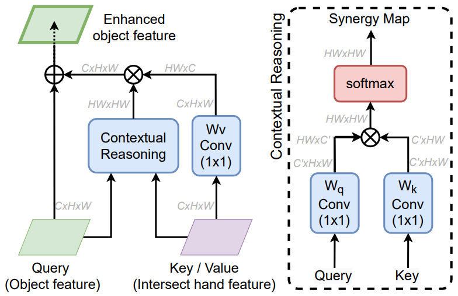
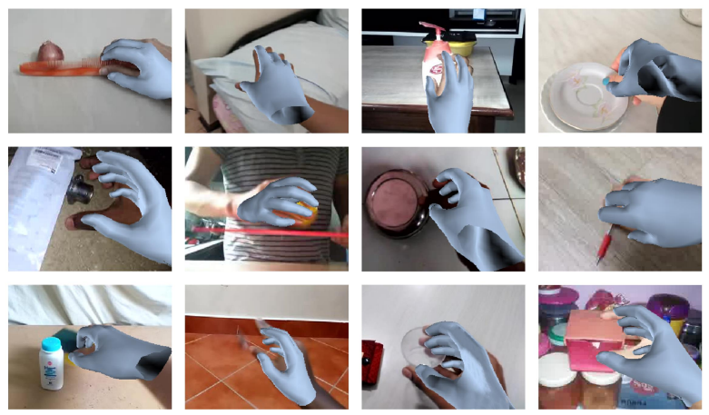
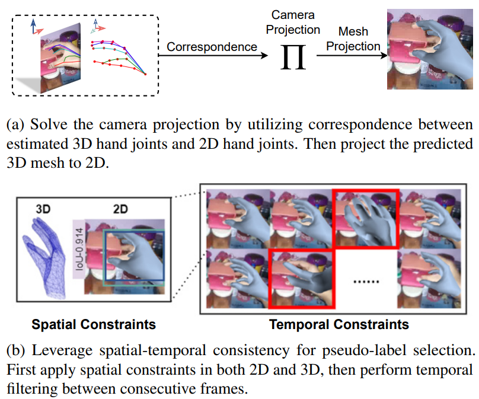
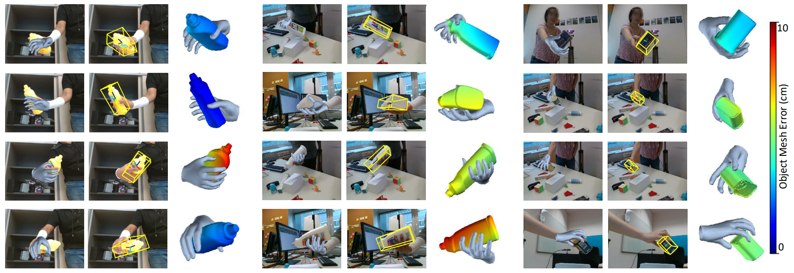

# Semi-Supervised 3D Hand-Object Poses Estimation with Interactions in Time

---

- Hand pose estimation
- object pose estimation

---

- Liu Shaowei et al.
- CVPR 2021
- url: https://openaccess.thecvf.com/content/CVPR2021/html/Liu_Semi-Supervised_3D_Hand-Object_Poses_Estimation_With_Interactions_in_Time_CVPR_2021_paper.html

---

## Abstract

single image에서 3D Hand & object pose 추정은 매우 도전적인 문제
- 손과 object는 가끔 상호작용 중에 self-occluded된다.
- 3D annotations는 사람도 single image에서 GT를 완벽하게 라벨링 할 수 없다.

-> semi-supervised learning을 사용한 통합 framework를 제안

손과 물체 표현 사이에 명시적 contextual 추론을 수행하는 joint learning framework을 제작

single image에서 제한된 3D annotations을 넘어 대규모 hand-object video의 공간-시간적 일관성을 semi-supervised learning에서 pseudo labels를 생성하기 위한 제약 조건으로 활용

제안한 방법의 기여:
- 실제 데이터셋에서 hand pose estimation을 향상
- instance 당 GT가 (hand보다)더 적은 object pose를 크게 개선
- 대규모의 다양한 video로 훈련하여 여러 out-of-domain 데이터셋에더 더 잘 일반화된다.

## 1. Introduction

이 논문에서는 비디오를 사용한 3D 손 및 물체 포즈 추정을 위한 반지도 학습 접근 방식을 소개합니다. 먼저 완전히 주석이 달린 데이터를 사용하여 지도 학습을 통해 3D 손 포즈와 6-Dof 객체 포즈 추정을 위한 조인트 모델을 훈련시킵니다. 그런 다음 3D 주석이 없는 대규모 비디오에서 손 포즈 추정을 위한 모델을 배포합니다. 추정 결과를 자가 훈련을 위한 새로운 의사 레이블로 수집합니다. 구체적으로, 손과 물체 사이의 상호 작용 정보를 활용하기 위해 전체 입력 이미지에서 표현을 추출하고 RoIAlign[20]을 사용하여 물체와 손 영역 표현을 추가로 얻는 통합 프레임워크를 설계합니다. 이러한 표현을 기반으로 두 개의 서로 다른 하위 네트워크 분기를 적용하여 각각 손과 물체에 대한 3D 포즈를 추정합니다. 우리는 손과 객체 사이의 상호 컨텍스트를 인코딩하기 위해 두 분기를 연결하는 관계형 모듈 [61]을 사용합니다. 손-물체 비디오로 반지도 학습을 수행하기 위해 그림 1과 같이 의사 레이블 생성을 위해 각 프레임에 통합 모델을 배포합니다. 모델의 3D 손 포즈 결과를 감안할 때 불안정하고 불안정한 추정치를 필터링하기 위해 공간 시간적 일관성 제약 조건을 설계합니다. 직관적으로, 우리는 시간이 지남에 따라 지속적으로 변경되는 경우에만 결과를 의사 레이블로 유지하며, 이는 추정치의 견고성을 나타냅니다. 그런 다음 새로 수집된 데이터와 레이블을 사용하여 자체 학습을 수행합니다. HO 3D 데이터 세트[16]에서 초기 모델을 훈련하여 실험하고 Something-Something 비디오 데이터 세트[14]를 사용하여 반지도 학습을 수행합니다. 우리의 접근 방식을 사용하여 대규모 비디오의 의사 레이블에서 학습함으로써 HO-3D 벤치 마크에서 최첨단 ap proaches에 비해 큰 이득을 얻을 수 있습니다. 또한 FPHA[11] 및 Frei Hand[76] 데이터 세트를 포함한 도메인 외부 데이터 세트로 일반화되는 3D 손 포즈 추정이 크게 개선되었음을 보여줍니다. 더 놀라운 것은, 우리가 손에 대해서만 의사 레이블을 사용함에도 불구하고, 우리의 관절 자기 훈련은 물체 포즈 추정을 큰 차이(일부 물체의 경우 10% 이상)로 향상시킨다는 것입니다. 우리의 기여는 다음과 같습니다: (i) 공동 3D 손과 물체 포즈 추정을 위한 통합 프레임워크; (ii) 라벨이 지정되지 않은 대규모 손-물체 상호 작용 비디오를 활용하는 반 지도 학습 파이프라인; (iii) 손과 물체 포즈 추정에 대한 상당한 형태별 개선 및 도메인 외 데이터에 대한 일반화

## 2. Related Works

## 3. Overview

## 4. Hand-Object Joint Learning Framework

> **Figure 2. hand-object 3D pose joint estimation framework의 overview**  
> shared encoder과 hand-object interaction을 위한 contextual reasoning module, hand-object pose 추정을 위한 두 개의 decoder로 구성

ResNet-50을 Backbone으로 사용한 FPN
hand와 object에 대한 bounding box가 주어지면 RoIAlign으로 각각의 features($\mathcal{F}^h, \mathcal{F}^o$)를 $\mathbb{R}^{H \times W \times C}$로 추출

두 feature 사이에 contextual reasoning을 적용하고 strengthened interactive context information와 enhanced feature maps을 hand와 object decoders로 각각 전송

hand decoder의 output: 3D hand mesh
object decoder의 output: 6-Dof object pose

total loss: 두 개의 decoder branches의 loss를 합침  
$\mathcal{L} = \mathcal{L}_{hand} + \mathcal{L}_{object}$

### 4.1 Contextual Reasoning

hand와 object features 사이의 시너지를 contextual reasoning(CR) module을 활용하여 융합
(Fig 3 참고)

object features에 있는 query positions는 interaction region을 합침으로써 향상될 수 있다.

query: object features $\mathcal{F}^{o}$
key: hand-object intersecting regions $\mathcal{F}^{ho}$
ROIAlign의 상단에서 query와 key간의 pairwise relation을 모델링

$\mathcal{F}^{o^+}$: enhanced object features
sub-position $i$는 feature의 $i$번째 position

$$
\displaystyle
\begin{aligned}
&\mathcal{F}^{o^+}_i = \sum_{j\in\Omega} w(i, j) \cdot V(\mathcal{F}^{ho}_j) + \mathcal{F}^o_i
&(1)
\end{aligned}
$$

> $\Omega:$ key에 있는 $H \times W$ 크기의 모든 position  
> $V:$ $W_v$로 인해 parameterized 된 value transformation function(Fig 3의 왼쪽)  
> $w(i, j)$: query position $i$ 와 key posiriton $j$ 사이의 pairwise spatial similarity score

$$
\displaystyle
\begin{aligned}
&w(i, j) = \frac{exp(q^T_i k_j)}{\sum_{s \in \Omega} exp(q^T_i k_s)}
&(2)
\end{aligned}
$$

> $q_i = W_q F^o_i:$ i번째 query embedding
> $k_j = W_k F^{ho}_j:$ j번째 key embedding

### 4.2 Hand Decoder

2D joints localization network와 mesh regression network로 구성

2D joints localization network:
- hourglass module
- RoIAlign 이후 hand features를 input으로 사용
- 각 joint $j \in \mathcal{J}^{2D}$마다 2D heatmap 출력
$\mathcal{J}^{2D} \in \mathbb{R}^{N^h \times 2}$
$N^h = 21$

- heatmaps는 $32 \times 32$ 해상도
- loss: GT heatmaps $H_j$와 predictions $\hat{H}_j$ 사이의 거리

$\mathcal{L}_{\mathcal{H}} = \sum_{j \in N^h} ||\mathcal{H}_j - \hat{\mathcal{H}}_j||^2_2$

mesh regression network
- MANO 모델을 사용
- hand feature와 2D heatmaps를 결합하여 입력으로 사용
- hand mesh의 parameters를 예측
- MANO model은 pose parameters $\theta \in \mathbb{R}^{48}$과 shape parameters $\beta \in \mathbb{R}^{N^h \times 3}$
- mesh regression network의 입력은 4개의 residual blocks를 통해 ConvNet으로 forwarded되고, 2048-D feature vector로 vectorized된다.
- 출력: 세 개의 Fully-connected layer를 사용하여 MANO parameters $\hat{\theta}$와 $\beta$ 예측
- loss: prediction과 GT 사이의 L2 distance

hand decoder의 total loss:
$$
\displaystyle
\begin{aligned}
&\mathcal{L}_{hand} = \lambda_{\mathcal{H}} \cdot \mathcal{L}_{\mathcal{H}} + \mathcal{L}_{\mathcal{M}}
&(3)
\end{aligned}
$$

> $\lambda_{\mathcal{H}}:$ balancing loss. 0.1로 설정

### 4.3 Object Decoder

object decoder은 두 개의 streams를 포함
각각 4개의 shared convolution layers와 2개의 separate convolution layers를 갖는다.

첫 번째 stream은 image grid proposal에서 object의 pre-defined 3D control points의 2D location을 예측

두 번째 stream은 각 proposal에 해당하는 confidence score을 예측

control points의 2D position을 얻은 다음, object 6-Dof pose는 object mesh의 original 3D control points와 2D control points 사이의 연관성을 사용하여 PnP 알고리즘으로 계산

이 연구에서는 object mesh 3D bounding box의 8개의 모서리, 12개의 edge 중간점, 1개의 center point 총 $N^o = 21$개의 control points를 사용

첫 번째 stream에서, 더 나은 self-occlusion 핸들링을 위해 grid-based method를 적용.

object feature map에 있는 각 grid $g$는 모든 control point $i \in N^o$에 대한 예측 제공

$\delta_{g, i}:$ grid prediction과 target control point 사이의 geometric 거리  
첫 번째 stream의 loss function은 모든 grids $g$와 control points $i$의 모든 loss를 합침  
$\mathcal{L}_{p2d} = \sum_g \sum^{N^o}_{i=1} ||\delta_{g,i}||_1$

두 번째 stream은 각 grid g와 control point i의 confidence score $c_{g, i}$를 예측

confidence GT: $c_{g, i} = exp(-||\delta_{g, i}||_2)$(prediction이 GT 2D point location에 가까운 정도)

test time 중, 10개의 most confident proposals를 PnP 알고리즘의 input으로 선택하여 object pose를 해결

loss function:
$
\mathcal{L}_{conf} = \sum_g \sum^{N^o}_{i=1} ||\hat{c}_{g, i} - c_{g, i}||^2_2
$

> $\hat{c}_{g, i}:$ predictions
> $c_{g, i}:$ GT

object decoder total loss:
$$
\displaystyle
\begin{aligned}
&\mathcal{L}_{object} = \lambda_p \cdot \mathcal{L}_{p2d} + \lambda_c \cdot \mathcal{L}_{conf}
&(4)
\end{aligned}
$$

> $\lambda_p = 0.5$
> $\lambda_c = 0.1$로 설정

## 5. Semi-Supervised Learning

fully annotated dataset으로 hand-object pose estimation 모델 훈련 후, 3D hand pseudo-label 생성을 위해 large-scale unlabeled video dataset에 배포

공간-시간적 일관성을 활용하여 신뢰할 수 없는 pseudo hand labels를 필터링
(Fig 4 참고)

object에 대한 pseudo-label은 생성하지 않음
- inference time에 object 3D 모델 필요
- annotated dataset에서 제한된 instances로 인해 object pose의 일반화가 좋지 않다. 

선택된 pseudo-labels로 fully annotated dataset을 확대하여 hand와 object pose estimation에 대해 self-training을 수행

### 5.1 Pseudo-Label Generation

3D hand pose estimation을 위해 large-scale video dataset의 video frame에 모델 배포
추정 robustness를 향상시키기 위해, test-time data augmentation과 predictions를 앙상블

각각의 instance에 대해 8개의 다른 augmentation을 수행하고 결과를 평균
각 프레임의 outputs는 2D joints, 3D joints, 3D hand mesh vertices와 MANO parameters를 포함

> in the wild video frames에서 pesudo-label selection pipeline  
> (a) 예측한 3D hand joints와 2D hand joints 사이의 연관성을 활용하여 camera projection을 해결. 예측한 3D mesh를 2D로 project  
> (b) pseudo-label selection에 공간적-시간적 일관성 제약 조건을 활용. 2D와 3D에 공간 제약 조건을 적용. 이후 연속된 프레임에서 temporal filtering 수행

앙상블 예측은 생성된 샘플에서 noise를 줄이지만, 신뢰할 수 있는 예측을 식별해야 한다.
이를 위해, video dataset의 공간적, 시간적 일관성 제약 조건을 활용하여 필터링을 위한 pipeline을 구축

#### 5.1.1 Spatial Consistency Constraints

공간적 일관성으로 filtering에는 각 프레임의 연관된 카메라 포즈가 필요.

다양한 시점 변화가 있는 [14]와 같은 video dataset에서는 camera pose를 직접 추론하는 것은 불가능하다

이 문제에 대한 해결 방법: 그림 5a와 같이 추정된 3D joints $J^{3D}$와 2D joints $J^{2D}$ 간의 대응을 활용하고 3D joints를 2D로 투영하는 최적의 카메라 매개변수 $\Pi$를 구하는 것

weak-perspective camera model을 사용하고 최적화를 위해 SMPLify를 사용

목적 함수:
$$
\displaystyle
\begin{aligned}
&\Pi^* = \argmin_{\Pi} ||\Pi \mathcal{J}^{3D} - \mathcal{J}^{2D}||^2_2
&(5)
\end{aligned}
$$

**IoU 제약 조건**
camera pose를 사용하여 추정한 3D mesh $\mathcal{V}$를 image 평면으로 re-project할 수 있다.
또한, 제공된 ground bounding box $B_g$와 re-projected mesh bounding box $B_d$ 사이의 IoU를 계산할 수 있다.
(Figure 5b 참고)

3D GT가 없기 때문에, [14]가 제공한 2D bounding box annotations을 활용

신뢰할 수 있는 prediction은 이 두 boxes 사이에 일관성을 유지해야 하고 큰 IoU를 가져야 한다. 이를 위한 IoU threshold를 0.6으로 설정

**Pose Re-projection 제약 조건**
re-projected 3D hand joints $\Pi \mathcal{J}^{3D}$와 예측한 2D hand joints $\mathcal{J}^{2D}$는 연관이 있어야 한다.

1. 입력 크기에 관계없이 이 두 joints set을 정규화하고 두 joint 사이의 L2 distance 계산 $||\mathcal{J}^{2D} - \Pi \mathcal{J}^{3D}||_2$

distance가 threshold $t_p$(0.65로 설정)보다 큰 경우, prediction은 필터링된다.

**Biomedical Constraint**
예측한 hand pose는 실제 사람의 손이어야 함
- 정규화된 뼈 길이 0.1
- 물리적으로 그럴듯한 관절 각도 범위(0, 90) 이내
를 제약 조건으로 사용

위 세 가지 제약 조건을 지키는 경우, 공간적 시간적 제약 조건으로 이동

#### 5.1.2 Temporal Consistency Constraints

**Smoothness 제약 조건**

공간적 시간적 제약 조건 

두 연속된 프레임 $t - 1$과 $t$ 사이에 2D joint 예측과 3D mesh predictions의 부드러움을 공간적 시간적 제약 조건으로 고려

frame이 연속적이기 때문에 model output은 시간이 지남에 따라 매끄러워야 한다.
(Fig 5b 참고)

구체적으로, 이 두 프레임 사이의 2D 포즈 추정 결과 거리 $||\mathcal{J}^{2D}_t - \mathcal{J}^{2D}_{t - 1}$는 임계값 $t_j$보다 작아야 한다.

MANO pose parameter $\theta$도 3D mesh 부드러움을 보장하기 위해 $||\theta_t - \theta_{t - 1}||_2 \leq t_\theta$를 적용한다($t_j = 0.5, t_\theta = 0.01$)

**Shape Constraint**

### 5.2 Re-training with Pseudo-Labels

## 6. Experiment

### 6.1 Implementation Details

지도 학습 단계와 반지도 학습 단계 모두에서 처음부터 end-to-end 방식으로 훈련

joint learning framework의 shared encoder은 ImageNet으로 사전 훈련한 ResNet-50으로 초기화

- batch size: 242
- learning rate: 1e-4
- Adam optimizer 사용
- 50epochs
- 10epochs 마다 learning rate에 0.7 곱하기
- input image는 $512 \times 512$ 크기로 crop
- data augmentation:
    - scaling: $\pm 20%$
    - rotation: $\pm 180 \degree$
    - translation: $\pm 10%$
    - color jittering: $\pm 10%$

### 6.2 Datasets

### 6.3 Evaluation Metrics

Procrustes 정렬 이후 다음 계산
- mean joint error(mm)
- mesh error(mm)

F-scores

교차 데이터셋 일반화를 추가로 평가하기 위해 올바른 정점(PCV. Percentage of Correct Vertices)와 keypoints(PCK) 를 [76]과 같이 보고
object pose estimation을 위해 물체 지름(ADD-0.1D)의 10% 이내의 평균 물체 3D 정점 error의 백분율 보고

### 6.4 Pose Estimation Performance

**Qualitative Results**

> **HO-3D dataset에 대한 예측한 hand-object pose estimation Qualitative results**  
> 첫번째 두 열: 복구한 hand mesh와 추정한 6-Dof object pose  
> 세번째 열: 추정한 hand-object를 3D로 표시  
> object의 색상은 3D object mesh error을 나타냄(빨강에 가까울수록 큰 에러)

HO-3D 데이터셋의 정성적 결과는 Fig6에 표시

예측된 손-물체를 2D와 3D로 시각화
-> interaction 에서 occlusion을 잘 처리하고 정확한 3D 손 mesh와 object 6-Dof pose를 복구할 수 있음을 보임

Figure 7.의 CR 모듈에서 다양한 object query position의 synergy maps를 시각화

CR module이 contact regions에 대해 높은 응답을 제공하고 relational reasoning을 위해 contact pattern을 사용하는 경향이 있음을 관찰

**Comparison with State-of-the-Art**

### 6.5 Ablation Study