# MobRecon: Mobile-Friendly Hand Mesh Reconstruction From Monocular Image

---
Reference

본 문서에 사용된 모든 이미지와 표는 해당 논문에서 발췌하였습니다.

---

## 📌 Metadata
---
분류
- Hand Mesh Reconstruction

---

- Xingyu Chen et al.
- CVPR 2022
- url: https://openaccess.thecvf.com/content/CVPR2022/html/Chen_MobRecon_Mobile-Friendly_Hand_Mesh_Reconstruction_From_Monocular_Image_CVPR_2022_paper.html

---

0. [Abstract](#abstract)
1. [Introduction](#1-introduction)
2. [Related Work](#2-related-work)
3. [Our Method](#3-our-method)
4. [Experiments](#4-experiments)
5. [Conclusions And Future Work](#5-conclusions-and-future-work)

---

## Abstract

- 높은 재구성 정확도, 빠른 추론 속도 및 시간적 일관성을 동시에 달성할 수 있는 single view hand mesh reconstruction을 위한 프레임워크 제안
- 2D encoding: 가벼우면서도 효과적인 적층 구조 제안
- 3D decoding: 효율적인 graph operator, 즉 depth-separable spiral convolution을 제공
- 2D 와 3D 표현 사이의 격차를 해소하기 위한 새로운 lifting module을 제시
    - map-based position regression(MapReg) 블록으로 시작하여 heatmap 인코딩 및 position regression 패러다임의 장점을 통합하여 2D 정확도와 시간적 일관성을 개선
    - MapReg 다음에 pose pooling 및 pose-to-vertex lifting 접근 방식을 적용
        - 2D pose encoding을 3D vertex의 의미론적 특징으로 변환

- Apple A14 CPU에서 83FPS의 높은 추론 속도에 도달

# 1. Introduction

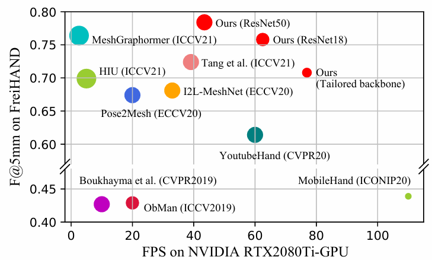
> **Figure 1. Accuracy vs inference speed**  
> 마커 크기는 모델 크기에 비례  
> 제안한 방법은 모바일 cpu에서 빠른 속도로 실행 가능

Single-view hand mesh reconstruction
- AR/VR, 행동 이해 등의 분야에서 적용
- 실제 응용 프로그램에서 필요한 성능
    - 재구성 정확도
    - 추론 효율성
    - 시간적 일관성

모바일 플랫폼에서 3D hand reconstruction을 탐구

일반적인 pipeline은 세 단계로 구성
- 2D encoding
    - 기존 접근 방식은 계산 집약적인 네트워크를 채택
    - 모바일 네트워크를 그대로 사용하면 재구성 정확도가 크게 저하된다.

    -> 추론 효율성과 정확성의 균형을 맞추기 위해 경량 2D encoding 구조 개발
- 2D-to-3D mapping
    - 효율성은 상대적으로 탐구되지 않음
- 3D decoding
    - 효율성은 상대적으로 탐구되지 않음

-> 2D-to-3D mapping 문제를 해결하고 3D mesh data 처리를 위한 효율적인 graph operator을 설계하기 위해 가벼우면서도 효과적인 lifting 방법을 모색

시간적 일관성은 일반적으로 3D 손 재구성 작업에서 무시된다.
- 이전 방법[11, 37, 41, 49]는 과거와 미래를 모두 통합하기 위해 sequential model 채택
    - offline이거나 계산 비용이 많이 들기 때문에 모바일 애플리케이션에 사용하기 어렵다.

-> 비순차적 방법으로 시간적 일관성을 탐구

MobRecon(Mobile Mesh Reconstruction)
- 최고의 정확도, 효율성 및 시간적 일관성을 동시에 탐구
- 2D encoding: hourglass network의 정신을 활용하여 효율적인 stack encoding 구조를 설계
- 3D decoding: depth-separable spiral convolution(DSConv)를 제안
    - DSConv는 깊이별 분리 가능한 convolution에서 영감을 받아 graph 구조의 mesh data를 효율적으로 처리
- 2D-to-3D mapping
    - MapReg(Map Based Position Regression), pose pooling, PVL(pose-to-vertex lifting) 접근 방식을 사용하는 feature lifting module 제안
    - MapReg는 2D 포즈 정확도와 시간적 일관성을 동시에 개선하기 위한 Hybrid 방법
    - PVL은 학습 가능한 lifting matrix를 기반으로 2D pose encoding을 3D vertex features로 변환하여 3D 정확도와 시간적 일관성을 향상
    - 잠재 공간에서 fully connected operator을 기반으로 하는 표준 접근 방식과 비교할 때, feature lifting module은 모델 크기를 크게 줄임
- 균일하게 분포된 손 포즈와 시점을 가진 합성 데이터셋을 구축
(Fig1 참조)

논문의 기여:
- MobRecon은 123M 곱셈-덧셈 작업(Mult-Adds) 및 5M 매개변수만 포함  
Apple A14 CPU에서 최대 83FPS로 실행할 수 있는 hand mesh 재구성을 위한 모바일 친화적인 pipeline을 제안
- 효율적인 2D 인코딩 및 3D 디코딩을 위한 경량 적층 구조와 DSConv 제공
- 2D 및 3D 표현을 연결하기 위해 Mapeg, pose pooling 및 PVL 방법을 사용하는 새로운 feature lifting 모듈을 제안
- 논문의 방법이 포괄적인 평가 및 SOTA 접근 방법과의 비교를 통해 모델 효율성, 재구성 정확도 및 시간적 일관성 측면에서 우수한 형태를 달성함을 보임

## 2. Related Work

**Hand mesh estimation**

다섯 가지 타입으로 나눌 수 있다.
- parametric model

    많은 model-based approaches는 MANO를 parametric model로 사용
    - hand mesh를 모양 및 포즈 계수로 분해
    - 이 파이프라인은 lightweight network에 적합하지 않음
        - coefficient estimation은 공간 상관 관계를 무시하는 매우 추상적인 문제
- voxel representation

    Voxel 기반 접근법은 3D 데이터를 2.5D 방식으로 설명
    - Moon et al. [52]
        - voxel 공간을 3개의 lixel 공간으로 나눈다.
        - 1D heatmap을 사용하여 메모리 소비를 줄이는 I2L-MeshNet을 제안
    - 이러한 최적화에도 불구하고 I2L-MeshNet은 lixel style 2.5D heatmap을 처리하기 위해 막대한 메모리를 필요로 함
    - 메모리가 제한된 모바일 장치에 적합하지 않다.

- implicit function

    - 연속성과 고해상도라는 장점
    - 최근에는 articulated human을 디지털화하는 데 사용
    - 수천 개의 3D point를 계산해야 함
    -> 모바일 설정에서 효율성이 떨어진다.

- UV map

    - Chen et al.[8]
        - hand mesh 재구성을 image-to-image 변환 작업으로 처리
        - UV 맵을 사용하여 2D와 3D 공간을 연결
    - 이 pipeline은 geometry correlation을 통합하여 개선할 수 있다.

- vertex position

    - 3D 꼭짓점 좌표를 직접 예측
    - 2D 인코딩, 2D-to-3D mapping 및 3D 디코딩 절차를 따른다.
    - Kulon et al[42]
        - 3D 꼭짓점 좌표를 얻기 위해 ResNet, global pooling, spiral convolution(SpiralConv)를 기반으로 encoder과 decoder을 설계

    - 본 논문에서는 효율적인 모듈로 vertex-based pipeline을 재구축
        - 2D encoding 을 위한 lightweight stacked structures
        - 2D-to-3D mapping을 위한 feature lifting module
        - 3D decoding을 위한 DSConv
    - 높은 재구성 정확도와 시간 전반에 걸친 일관성을 달성

**Lightweight networks**

인기 있는 효율적인 아이디어를 활용하여 Euclidean 2D images와 Non-Euclidean 3D meshes를 위한 graph network를 위한 stacked networks 설계
- 2D-to-3D mapping 문제를 효율적으로 처리하기 위해 feature lifting module 제안
- Mobile Hand[18]는 모바일 CPU에서 75FPS로 동작
- MobRecon은 정확도와 추론 속도가 더 뛰어나다

**Temporally coherent human reconstruction**

human/hand mesh 재구성의 시간적 일관성에 대한 연구는 제한적
- [11, 37, 41, 49]
    - 시간적 접근 방식을 사용하여 시간적 성능에 집중
- Kocabas et al[41]
    - bi-directional gated recurrent unit을 사용하여 across-time features를 융합
        - SMPL 매개변수들이 시간적 단서로 회귀하도록
- 이러한 순차적 방식은 계산 비용을 증가시키고, 미래의 정보가 필요할 수도 있다.
- 대조적으로, 본 논문에서는 non-sequential single-view method에 대한 시간적 일관성을 향상시키기 위해  MapReg를 사용하여 feature lifting module을 설계

**Pixel-aligned representation**

convolutional features는 dense와 regularly structured 2D 단서들로 만들어짐

하지만 3D 데이터는 sparse하고 unordered points로 구성

- 3D 정보를 설명하기 위해 이미지 특징을 더 잘 추출하기 위해 최근 작업은 일반적으로 pixel-aligned representations를 채택[59, 53, 19, 74, 22, 78]
- 여기에 영감을 얻이 feature lifting을 위한 pixel alignment 아이디어를 사용 & pose-aligned encoding을 vertex features로 변환하는 PVL을 디자인

heatmap 또는 position을 2D representation으로 사용한 것은 주목할만하다.
- Li et al[43]
    - 정확도 측면에서 heatmap과 position based human pose를 분석하고 고정밀 회귀를 달성하기 위해 RLE 제안

- 본 논문에서는 시간적 일관성의 관점에서 heatmap과 position 표현을 고려하고 MapReg를 제안하여 heatmap 및 position 기반 2D representation의 장점을 탕합
- RLE와 MapReg는 서로 보완할 수 있다.

## 3. Our Method

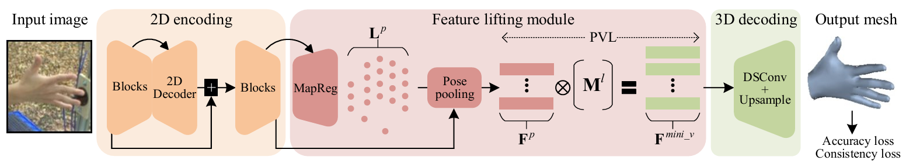

> **Figure 2. MobRecon framework의 overview**

입력: single-view 이미지
목표: 예측된 정점 $\text{V} = \{\text{v}_i\}^V_{i=1}$ 및 사전 정의된 표면 $\text{C} = \{\text{c}_i\}^C_{i=1}$을 사용하여 3D 손 mesh를 추론

### 3.1 Stacked Encoding Network

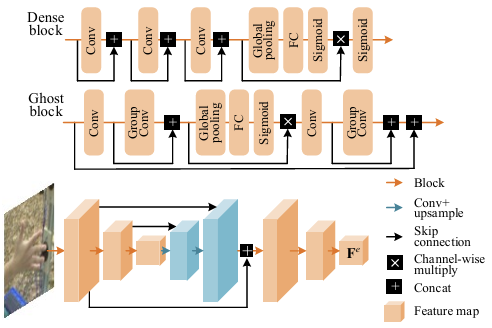

> **Figure 3. Tailored stacked encoding 구조**

- hourglass network에서 영감을 받음
- 점차적으로 개선된 인코딩 feature을 얻기 위함
- 두 개의 계단식 encoding block 그룹으로 구성(Fig 3)
    - 첫 번째 group은 feature fusion을 위한 업샘플링 모듈
    - single-view 이미지를 입력으로 사용하면 인코딩 feature $\text{F}^e \in \mathbb{R}^{C^e \times H^e \times W^e}$ 생성
    > $C:$ 채널 크기  
    > $H:$ 높이  
    > $W:$ 너비

- 두 가지 block 대안을 설계
    - DenseStack(Fig 3 참조)
        - DenseNet[31]과 SENet[30]에 따라서, DenseStack을 형성하기 위한 dense block 제시
        - $128 \times 128$ 입력 해상도에서 373.0M Mult-Add 및 6.6M 매개변수로 구성
    - GhostStack 개발
        - 모델 크기를 더욱 줄이기 위해 ghost operation[23]을 활용
        - 저렴한 operation으로 주요 feature을 기반으로 ghost feature을 생성
        - $128 \times 128$ 입력 해상도에서 96.2M Mult-Add 및 5.0M 매개변수로 구성

ResNet18을 사용한 stacked network 작업은 2391.3M Mult-Add 및 25.2M 매개변수로 구성
- 모바일 애플리케이션에서 사용 불가

### 3.2 Featuring Lifting Module

Lifting: 2D에서 3D로의 매핑

feature lifting에 두 가지 문제 고려 필요
1. 2D feature을 수집하는 방법
2. 3D domain에 매핑하는 방법

이전 방법[42, 15, 9]
- global average pooling 연산을 통해 $F^e$를 latent vector로 포함
- 이후 latent vector는 fully connected layer(FC)를 사용하여 3D 영역에 매핑되고, vector 재배열을 통해 vertex feature을 얻는다.
- 이러한 방식은 FC의 차원이 크기 때문에 모델 크기가 증가.  
-> $C^e=256$일 때, 3.2M 매개변수 포함

최근 연구[59, 19, 22, 74, 78]
- 2D 랜드마크를 기반으로 하는 pixel-aligned feature extraction과 pixel-aligned feature pooling을 보고
- heatmap $\text{H}^p$는 일반적으로 2D 랜드마크[19, 15, 9, 75]를 인코딩하는데 사용
    - 2D 위치 $\text{L}^p$[43, 66, 7, 63, 68]의 직접 회귀에 비해 더 정확한 랜드마크를 추정

**Map-based position regression**

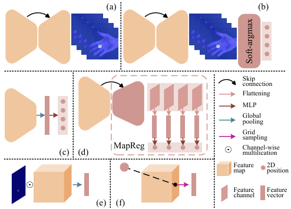

> **Figure 4. 2D 표현과 pose pooling 방법 비교**  
> (a) heatmap  
> (b) heatmap + soft-argmax  
> (c) regression 기반 방법  
> (d) MapReg 기반 방법  
> (e) heatmap을 사용한 joint-wise pooling  
> (f) 2D 위치를 사용한 grid sampling  
> 더 나은 시각화를 위해 4개의 랜드마크만 표시

- Fig 4(a):
    - $H^p$는 고해상도 표현
- Fig 4(b):
    - soft-argmax는 $\text{H}^p$를 해당 2D 위치로 decoding하는 차별화 가능한 기술
- Fig 4(c):
    - direct position regression은 저해상도 표현으로, $\text{H}^p$에 의존하지 않고 $\text{L}^p$를 얻을 수 있다.

human pose estimation 작업에는 저해상도 encoding과 고해상도 encoding이 모두 필요함이 입증됨[67]  
-> feature을 융합하는 skip-connection은 $H^p$의 우수한 정확도의 주요 원인[55]

$\text{L}^p$를 예측하기 위해 사용하는 global feature($1 \times 1$ 해상도인)이 global semantics과 receptive field로 인해 더 나은 시간적 일관성(temporal coherence)를 유도한다.(Fig 4(c) 참조)

이 전역 속성은 손 포즈의 관절 관계를 더 잘 설명할 수 있다.  
반대로, $\text{H}^p$는 convolution 및 고해상도 feature로 예측되며, 제한된 receptive field로 인해 랜드마크 간 제약이 부족하다.

- Fig 4(d):
    - MapReg: heatmap과 위치 기반 패러다임의 장점을 결합한 중간 해상도 방법
        1. 정확도를 위해 저해상도 및 고해상도 feature을 융합
        2. 시간적 일관성을 위해 global receptive field를 사용

    - position regression 패러다임에 skip connection을 통합하여 공간적으로 작은 크기(예: $16 \times 16$)의 feature map을 생성
    - 각 feature channel을 vector로 flatten한 다음 MLP(Multi-Layer Perceptron)을 사용하여 2D 위치 생성
    - 두 개의 $2 \times$-upsampling 작업만 포함하기 때문에 heatmap보다 우수한 middle-resolution 공간 복잡성을 얻는다.

**Pose pooling**
- 2D 표현을 얻은 후 pixel-aligned features를 얻는 프로세스
- $N$개의 2D joint landmark로 pose-aligned된 feature을 캡처
- 히트맵 $\text{H}^p$가 2D 표현으로 사용되는 경우 pose pooling은 joint-wise pooling으로 수행된다.

    joint-wise pooling:

    $$
    \displaystyle
    \begin{aligned}
    &\text{F}^p = [\Psi (\text{F}^e \odot \text{interpolation}(\text{H}^p_i) )]_{i=1, 2, ..., N}
    &(1)
    \end{aligned}
    $$

    > $[\cdot]:$ concatenation

    1. $\text{H}^p_i$의 공간 크기를 $H^e \times W^e$로 보간
    2. 보간된 $\text{H}^p$와 $\text{F}^e$ 사이에 channel-wise 곱을 채택

    -> joint landmark와 관련 없는 feature가 억제됨

    joint-wise feature을 추출하기 위해 feature reduction $\Psi$를 설계
    - global max-pooling 또는 spatial sum reduction을 나타냄
    - $C^e$ 길이 feature vector을 생성

    concatenation 이후 $\text{F}^p \in \mathbb{R}^{N \times C^e}$는 pose-aligned feature을 나타냄

- Fig 4(f):
    - 2D 포즈를 설명하기 위해 $\text{H}^p$ 대신 $\text{L}^p$를 사용하면 다음과 같이 grid sampling을 사용하여 pose pooling을 달성 가능

    $$
    \displaystyle
    \begin{aligned}
    &\text{F}^p = [\text{F}^e(\text{L}^p_i)]_{i=1,2,...,N}
    &(2)
    \end{aligned}
    $$

    -> convolutional encoding $\text{F}^e$는 pose-aligned 표현 $\text{F}^p$로 변환됨

**Pose-to-vertex lifting**

PVL(몇 가지 학습 가능한 매개변수)을 사용하여 3D 공간으로의 feature mapping을 위한 선형 연산자를 설계(Fig 2 참조)

MANO-style 손 mesh는 $V$개의 정점(778개)과 $N$개의 joint(21개)로 구성

$V \gg N$  
-> $\text{F}^p$를 $V$ 정점 feature로 변환하기 어렵다.
- 대신 template mesh를 2 값으로 4번 downsampling하고 $V^{mini}=49$ 정점이 있는 최소 크기의 손 mesh를 얻는다.
- 이후 2D에서 3D로의 mapping 기능을 위해 학습 가능한 lifting matrix $M^l \in \mathbb{R}^{V^{mini} \times N}$을 설계. PVL은 다음과 같다.

$$
\displaystyle
\begin{aligned}
&\text{F}^{mini_v} = \text{M}^l \cdot \text{F}^p
&(3)
\end{aligned}
$$

> $\text{F}^{mini_v}:$ minimal-size vertex feature

PVL은 $O(V^{mini} C^{e2})$에서 $O(NV^{mini}C^e)$로 feature mapping의 계산 복잡성을 줄인다.

### 3.3 Depth-Separable SpiralConv

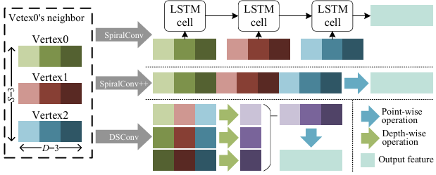

> **Figure 5. SpiralConv, SpiralConv++, DSConv의 비교**  
> 더 나은 시각화를 위해, $S = D = 3$으로 표시

SpiralConv: 나선형 이웃을 다음과 같이 설계하는 euclidean convolution과 동일:

$$
\displaystyle
\begin{aligned}
0\text{-ring}(\text{v}) &= {v}
\\
(k+1)\text{-ring}(\text{v}) &= \mathbb{N}(k\text{-ring}(\text{v})) \setminus k\text{-disk}(\text{v})
&(4)
\\
k\text{-disk}(\text{v}) &= \cup_{i=0,...,k} i\text{-ring}(\text{v})
\end{aligned}
$$

> $\mathbb{N}: $ 꼭짓점 $v$의 이웃을 추출

$k-\text{disk}(\text{v})$를 사용하면 SpiralConv는 convolution을 sequential problem으로 공식화하고 feature 융합을 위해 LSTM을 활용:

$$
\displaystyle
\begin{aligned}
&\text{f}^{out}_v = \text{LSTM}(\text{f}_{\text{v}'}), \text{v}' \in k\text{-disk}(\text{v})
&(5)
\end{aligned}
$$

> $\text{f}_v \in \mathbb{R}^{1 \times D}:$ D 차원인 $\text{v}$에서의 feature vector

LSTM을 사용한 SpiralConv는 직렬 sequence 처리로 인해 느려질 수 있다.

SpiralConv++[20]
- SpiralConv의 효율적인 버전
    - 이웃 vertices의 집계 순서를 명시적으로 공식화함으로써
- 효율을 위해 $S$개 정점이 있는 고정 크기 spiral 이웃만 채택
- FC를 활용하여 이러한 feature을 융합

$$
\displaystyle
\begin{aligned}
&\text{f}_\text{v}^{out} = \text{W} \cdot [\text{f}_{\text{v}'}] + b,
&\text{v}' \in k\text{-disk}(\text{v})_S
\quad&(6)
\end{aligned}
$$

> $\text{W}, \text{b}:$ learnable parameters

- FC의 크기가 크다.  
-> 모델 크기 증가

**DSConv**
- depth-wise seprarable convolution의 정신
- vertex $v$의 경우, $k\text{-disk}(\text{v})_S$는 식 4에 따라 수행됨
- depth-wise 연산과 point-wise 연산으로 구성
    - depth-wise:

    $$
    \displaystyle
    \begin{aligned}
    &\text{f}_\text{v}^{d} = [\text{W}_i^d \cdot [\text{f}_{\text{v}',i}]]^D_{i=1},
    &\text{v}' \in k\text{-disk}(\text{v})_S
    \quad&(7)
    \end{aligned}
    $$

    - point-wise:

    $$
    \displaystyle
    \begin{aligned}
    &\text{f}_\text{v}^{out} = \text{W}^{\text{v}} \cdot \text{f}^d_{\text{v}}
    &(8)
    \end{aligned}
    $$

계산 복잡도 비교
- SpiralConv++: $O(SD^2)$
- DSConv: $O(SD + D^2)$

3D decoder
- upsampling, DSConv, ReLU를 포함한 4개 블록으로 구성
- 각 블록에서, vertex feature은 2배로 upsampling되고 DSConv로 처리
- 최종적으로, vertex 좌표 $\text{V}$는 DSConv에 의해 예측됨

### 3.4 Loss Functions

**Accuracy loss**
- $\mathcal{L}_{mesh}:$ 3D mesh에 대한 $L_1$ norm
- $\mathcal{L}_{pose2D}:$ 2D pose에 대한 $L_1$ norm
- $\mathcal{L}_{norm}:$ normal loss. mesh smoothness를 위해 사용
- $\mathcal{L}_{edge}:$ edge 길이 loss. mesh smoothness를 위해 사용

$$
\displaystyle
\begin{aligned}
&\mathcal{L}_{mesh} = ||\text{V} - \text{V}^*||_1
\\
&\mathcal{L}_{pose2D} = ||\text{L}^p - \text{L}^{p,*}||_1
\\
&\mathcal{L}_{norm} = \sum_{\text{c} \in \text{C}} \sum_{(i,j) \subset \text{c}} |\frac{\text{V}_i - \text{V}_j}{||\text{V}_i - \text{V}_j||_2} \cdot n^*_c|
&(9)
\\
&\mathcal{L}_{edge} = \sum_{\text{c} \in \text{C}} \sum_{(i,j) \subset \text{c}} |||\text{V}_i - \text{V}_j||_2 - ||\text{V}^*_i - \text{V}^*_j||_2|
\end{aligned}
$$

> $C, V:$ mesh의 face & vertex set  
> $n^*_c:$ face $\text{c}$의 unit normal vector  
> $*:$ Ground truth

**Consistency loss**

- self-supervision task에 영감을 받아 시간 데이터가 필요 없는 augmentation에 기반한 일관성 supervision을 설계
- 2D affine transformation과 color jitter로 두 개의 view를 얻을 수 있다.
- 두 view 간의 상대 affine transformation을 상대 회전 $R_{1 \rightarrow 2}$를 포함하는 $T_{1 \rightarrow 2}$로 나타냄
- 3D와 2D space 모두에서 consistency supervision을 수행

$$
\displaystyle
\begin{aligned}
&\mathcal{L}_{con3D} = ||R_{1 \rightarrow 2} \text{V}_{view1} - \text{V}_{view2}||_1
&(10)
\\
&\mathcal{L}_{con2D} = ||T_{1 \rightarrow 2} \text{L}^p_{view1} - \text{L}^p_{view2}||_1
\end{aligned}
$$

$T$에는 2D space에서의 rotation, shift, scale이 포함되어 있으므로, $R$은 손목 랜드마크를 root로 삼기 때문에 $R$만 $\text{V}$에 영향을 준다.

**전체 loss:**

$
\mathcal{L}_{total} = \mathcal{L}_{mesh} + \mathcal{L}_{pose2D} + \mathcal{L}_{norm} + \mathcal{L}_{edge} + \mathcal{L}_{con2D} + \mathcal{L}_{con3D}
$

## 4. Experiments

### 4.1 Implementation Details

- optimizer: Adam
- batch size: 32
- epochs: 38
- learning rate: $10^{-3}$
- learning rate decay: 30 epoch에서 10으로 나누기
- input resolution: $128 \times 128$
- $S:$ 9
- $C^e:$ 256
- $D:$ {256, 128, 64, 32}

기존 3D hand pose estimation 데이터셋은 일반적으로 hand pose와 viewpoint의 long-tailed distribution으로 고통받음

-> 손 포즈와 시점이 균일하게 분포되어 있어야 함  
-> 1520개 포즈 & 216개 시점이 있는 합성 데이터셋 개발(328K개 데이터. Maya 사용)

### 4.2 Evaluation Criterion

**데이터셋:**
- **FreiHAND** [82]
    - 훈련 데이터 수: 130,240
    - evaluation 데이터 수: 3,960
- **Rendered Hand Pose Dataset(RHD)** [81]
    - hand pose estimation을 위한 합성 손 데이터
    - 훈련 데이터 수: 41,258
    - evaluation 데이터 수: 2,728
- **HO3Dv2** [21]
    - 3D hand-object dataset
    - 훈련 데이터 수: 66,034
    - evaluation 데이터 수: 11,524

**Metrics**

- MPJPE/MPVPE
    - Mean Per Joint/Vertex Position Error.
    - Euclidean distance를 사용하여 mm 단위 좌표 오차를 추정
- PA-MPJPE/MPVPE
    - 전역 변동을 무시한 MPJPE/MPVPE.
    - PA: Procrustes Alignment.
    - 두 점 집합 간의 차이를 최소화 한 다음 상대적인 위치 차이를 비교.
    - 회전, scale, 이동에 의한 차이를 제거하고 형태의 차이만을 측정
- Acc
    - 2D/3D joint landmark의 가속도를 $\text{pixel}/\text{s}^2$ 또는 $\text{mm}/\text{s}^2$ 단위로 캡처
- AUC
    - PCK(Percentage of Correct Keypoints) vs error thresholds(3D 측정에서 n~50mm 또는 2D 측정에서 0~30 pixel) 곡선 아래 영역.
    - n은 0 또는 20으로 설정
- F-Score
    - 특정 거리 임계값을 기준으로 두 mesh 사이의 재현율(recall)과 정밀도(precision) 사이의 조화 평균(harmonic mean)

    예) 1, 4, 4의 harmonic mean:

    
    
    [출처: https://en.wikipedia.org/wiki/Harmonic_mean]
    
    - F@5/F@15는 5mm/15mm 임계값에 해당
- Mult-Adds
    - multiply-add 연산의 수

### 4.3 Ablation studies

**Our stacked networks and complement data**

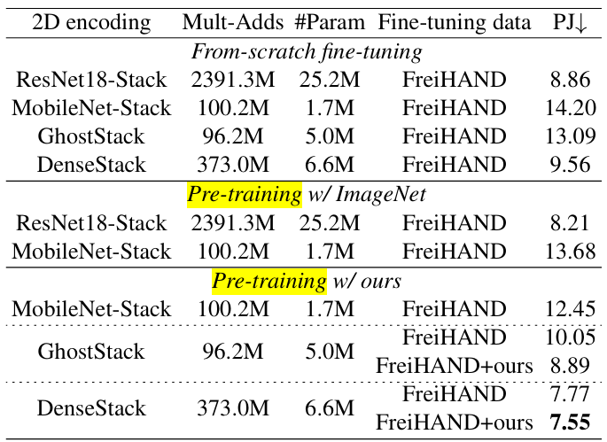

> **Table 1. 2D encoding 방법에 대한 절제 연구 및 FreiHAND에 대한 보완 데이터**  
> Mult-Adds와 #Params는 2D encoding network에 대한 것

- CMR[9]를 baseline으로 사용
    - FC를 2D-to-3D feature mapping에 사용
    - SpiralConv++를 3D decoding에 사용
    - 동일한 hyperparameter 사용
- 2D encoding network와 data만 바꿔서 비교
- 다른 stacked structure도 from-scratch training으로 비교

ResNet과 MobileNet을 stacked structure을 설계할 때 사용
- ResNet
    - 집약적인 계산 비용 포함
- MobileNet
    - 계산을 다루기 쉬움
    - 성능(PA-MPJPE)를 크게 떨어뜨림

**사전 훈련**

- ImageNet
    - classification 작업에 사용됨
    - 이 지식을 2D/3D 위치 회귀로 전달하기 어려움
    - ImageNet 사전 훈련은 1mm PA-MPJPE보다 적은 개선을 가져옴
- complement data
    - 사전 훈련 및 fine-tuning에 사용 가능
    - DenseStack/GhostStack 은 7.55/8.89mm PA-MPJPE 개선을 가져옴

맞춤형 encoding 구조와 데이터셋으로 정확도를 유지하며 컴퓨팅 비용을 절감  
-> DenseStack/GhostStack을 모바일 환경에 적합하게 만듬

**Feature lifting module**

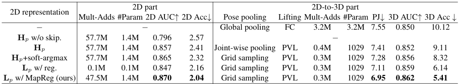

> **Table 2. Feature lifting module의 절제 연구**  
> 첫 번째 행: CMR 설정(표 1의 마지막 행)  
> skip: skip-connection  
> reg: direct regression  
> 2D 및 3D 정확도는 각각 RHD 및 FreiHAND에서 테스트  
> Acc은 Ho3Dv2로 테스트

DenseStack을 통해 정확성과 시간적 일관성에 대한 연구 수행
- 표 2에서는 sequential module, temporal optimization, post-processing을 수행하지 않음
- $\text{H}^p$는 고해상도 표현. skip-connection은 high & low-resolution feature을 융합하는데 중요  
-> skip-connection을 제거하면 $\text{H}^p$ 정확도가 떨어짐
- soft-argmax는 $\text{H}^p$에서 더 부드러운 2D position 생성 가능  
-> 2D AUC와 ACC을 모두 개선할 수 있다.
- $\text{L}^p$ w/ reg.(그림 4(c))는 상대적으로 적은 정확도를 갖지만 더 나은 시간적 성능을 보임
- MapReg는 더 나은 2D 정확도와 시간 일관성을 달성

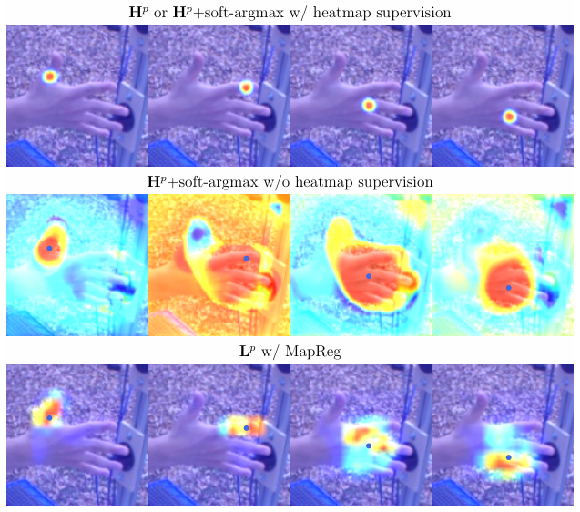

> **Figure 6. 다양한 2D pose 표현 map 시각화**  
> 

- $\text{H}^p$ +soft-argmax
    - 훈련을 위해 동일한 loss(식 9)를 추가로 사용
    - heatmap supervision이 포함되지 않음  
    -> heuristic soft-argmax가 시각적 semantics를 무시하기 때문에 $\text{H}^p$의 부드러운 버전을 순진하게 유도
- MapReg
    - vector로 평면화되기 전에 map을 표시
    - $\text{H}^p$와 달리 joint landmark 제약 조건을 적응적으로 설명 가능. 또한, 적응형 local-global 정보를 사용하여 2D 위치 예측 가능  
    (예: 랜드마크를 예측할 때 엄지 손가락 전체가 활성화됨)
    - MapReg는 시간적 일관성을 향상시키기 위해 보다 합리적인 관절 구조를 생성 가능(supplimental material 참고)

2D pose aligned feature을 사용하여 3D 성능을 탐구
- pose pooling 중에 joint-wise pooling을 사용하여 $\text{H}^p$를 기반으로 2D pose aligned feature을 얻을 수 있음
- grid sampling은 soft-argmax 또는 $\text{L}^p$를 사용할 때 일반적으로 채택
- $\text{L}^p$ w/ reg는 $\text{H}^p$+soft-argmax보다 2D 정확도가 떨어지지만 더 나은 PA-MPJPE를 보임  
-> 동일한 pose pooling방법으로는 안정적인 훈련 process를 확립하는 데 정확성보다 2D 일관성이 중요
- MapReg 기반 $\text{L}^p$는 가장 좋은 PA-MPJPE 및 3D 정확도를 보임

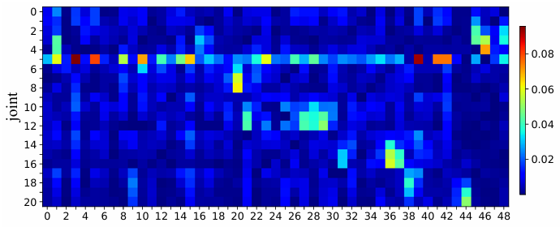

> **Figure 7. 학습한 lifting matrix**

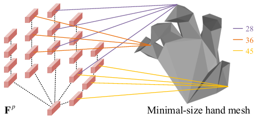

> **lifting matrix의 여러 정점에 대한 관련성이 높은 연결**  
> 숫자는 정점 인덱스

PVL에서는 lifting matrix $\text{M}^l \in \mathbb{R}^{V^{mini} \times N}$을 사용하여 2D pose 공간에서 3D 정점 공간으로 feature을 변환하는 선형 operation을 설계  
-> $V^{mini}$ 정점 feature은 $N$개의 랜드마크 feature의 선형 조합에 의해 생성됨
- Fig 7은 잘 훈련된 lifting matrix를 보임. abs($\text{M}^l$)을 사용하여 joint-vertex 관계를 명확하게 나타냄
- 학습된 $\text{M}^l$은 희박함
- joint landmark(집게손가락의 root에 위치한 joint 5)는 전역 정보 역할을 하며 대부분의 정점에 기여
- 일부 관절 랜드마크 특성인 관련된 정점으로 전파됨
- Fig 8은 관련성이 높은 $\text{M}^l$ 연결을 보여줌. PVL 접근 방식이 의미론적 일관성을 유지할 수 있음을 보임

feature lifting module
- CMR보다 더 나은 PA-MPJPE 및 3D Acc을 제공
- CMR에 비해 2D-3D부분의 계산 비용을 크게 줄임
- 2D 파트에서 추가 Mult-Add를 사용했음에도 2D pose 예측은 multi-task learning 및 root recovery task로 인해 3D 손 재구성에 도움이 되는 것으로 입증됨

**Towards balancing model efficiency and performance**

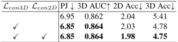

> **Table 3. 일관성 학습의 절제 연구**  
> 정확도는 FreiHAND로 측정  
> Acc은 HO3Dv2로 측정

3D/2D 일관성 loss를 설계
- 표 3은 일관성 학습이 시간적 일관성을 향상시킴을 보임
- 정확한 일관성과 시간적 일관성은 서로 도움이 될 수 있으므로 PA-MPJPE도 향상됨

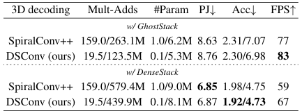

> **Table 4. 3D decoding의 절제 연구**  
> Mult-Adds와 #Param은 3D decoder/전체 모델  
> 2D/3D Acc을 표시  
> Apple A14 CPU에서 테스트 한 FPS 표시  
> 정확도와 시간적 성능은 각각 FreiHAND와 HO3Dv2로 테스트

- DSConv는 3D decoder의 Mult-Adds와 #Param을 크게 감소시키고 SpiralConv++와 비교하여 동등하거나 더 나은 성능을 보임
- DenseStack/GhostStack을 사용한 MobRecon은 Apple A14 CPU에서 67/83 FPS에 도달할 수 있음

**Discussion**

MobRecon은 DSConv가 메모리 접근 비용을 증가시킨다는 제한이 있음  
-> 더 높은 inference speed를 위해 일부 엔지니어링 최적화를 포함해야 함

### 4.4 현대적 방법과 비교

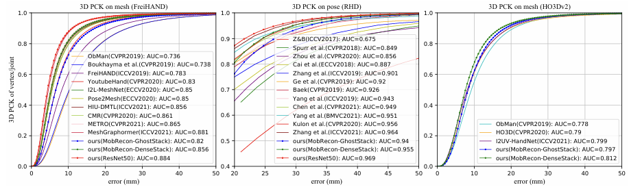

> **Figure 9. 3D PCK vs. error thresholds.**

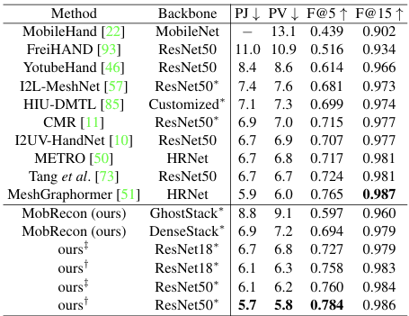

> **Table 5. FreiHAND 데이터셋 결과**  
> *: stacked structure  
> $\dagger:$ ImageNet 사전 훈련 backbone + mixed fine-tuning data  
> $\ddagger:$ complement data와 관련 없음

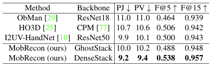

> **Table 6. HO3Dv2 데이터셋 결과**

FreiHAND 데이터셋에서 공정한 비교
- $224 \times 224$ 입력 해상도로 ResNet 기반 모델 확장
- ResNet50은 이전 방법을 능가하여 5.7mm PA-MPJPE를 제공(표 5 참조)
- DenseStack 또는 GhostStack을 기반으로 하는 MobRecon은 일부 ResNet 기반 방법 능가
- MobRecon은 3D PCK에서 우수한 성능 발휘(그림 9 참조)
- 또한 뛰어난 추론 속도를 달성(그림 1 참조)

RHD 및 HO3Dv2로 실험
- complement data는 DenseStack/GhostStack을 사전 학습하는 데만 사용
- DenseStack/GhostStack을 사용한 MobRecon은 0.955 및 0.940의 3D AUC를 보임. 대부분의 비교한 접근 방식을 능가(그림 9 RHD)

HO3Dv2 데이터셋 평가
- MobRecon은 기존 방법보다 뛰어난 성능을 보임
- HO3Dv2는 심각한 객체 폐색 때문에 FreiHAND 및 RHD보다 더 까다로움
- MobRecon은 더 나은 일반화 기능으로 인해 일부 ResNet 기반 방법보다 성능이 뛰어나다.
- 또한 더 나은 시간적 일관성을 달성(표 2 참조)

## 5. Conclusions and Future Work

우수한 효율성, 정확성 및 시간적 일관성을 가진 새로운 손 mesh 재구성 구조 방법을 제시
- 2D encoding을 위한 경량 적층 구조 제안
- 2D-to-3D mapping을 위해 MapReg, pose pooling, PVl 접근 방식을 사용하는 feature lifting 모듈 설계
- DSConv는 3D 디코딩 작업을 효율적으로 처리
- MobRecon은 123M Mult-Add 및 5M 매개변수만 포함
- Apple A14 CPU에서 83FPS 추론 속도 달성
- FreiHAND, RHD, HO3Dv2에서 SOTA 달성

향후 계획
- 손을 상호작용하기 위한 효율적인 방법 조사

# Supplementary Materials

## 1. Complement Dataset

**Data Designs**

- 5633개 vertices와 11232개 face로 구성

**Network pre-training**
- 2D encoding network를 사전 훈련하기 위해 2D pose estimation 작업 설계

- 본문에서는 heatmap과 position regression을 사용하여 2D representation 분석
- 사전 학습 단계에서 heatmap과 joint landmark를 모두 감독
- implementation details
    - epochs: 80
    - batch size: 128
    - learning rate: $10^{-3}$
    - learning rate decay: 20, 40, 60번째 epoch에서 10으로 나눔
    - input resolution: $128 \times 128$

## 2. Analysis and Application

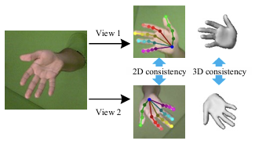

> **Figure 6. data augmentation에 기반한 consistency loss**

**Diagram of our consistency loss**

- 입력 이미지에서 두 개의 view가 파생됨
- 본문의 식 11과 같이 2D 공간과 3D 공간 모두에서 설계 가능
