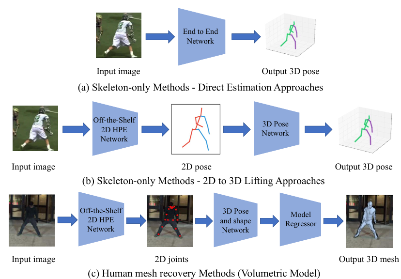

# Deep Learning-Based Human Pose Estimation: A Survey

---
Reference

본 문서에 사용된 모든 이미지와 표는 해당 논문 및 레퍼런스 논문에서 발췌하였습니다.

---

## 📌 Metadata
---
분류
- Human Pose Estimation

---

url: https://doi.org/10.1145/3603618

---

목차

0. [Abstract](#abstract)
1. 

---

## Abstract

## 1. Instruction

## 2. 2D Human Pose Estimation

### 2.1. 2D Human Pose Estimation
이미지, 동영상 등에서 신체 keypoints의 위치를 추정

#### 2.1.1. 2D single-person pose estimation
입력 이미지에 여러 명이 있는 경우, 사람마다 patch를 잘라서 입력으로 사용

2가지 방법 존재
- Regression Methods

    

    [출처](https://doi.org/10.1145/3603618)

    - end-to-end 방식
    - key points의 위치를 직접 추정
    
    **논문 목록**
    - Toshev and Szegedy 2014. [[paper]](https://openaccess.thecvf.com/content_cvpr_2014/html/Toshev_DeepPose_Human_Pose_2014_CVPR_paper.html)
        

        - AlexNet을 BackBone으로 사용하는 cascaded network인 DeepPose 제안
        - first stage에서 keypoint 위치 예측. subsequent stage에서 이전 stage에서 예측한 keypoint 위치와 실제 위치의 변위 학습.
        - 이전 stage의 keypoint 예측 위치 주변의 이미지를 잘라서 다시 입력으로 사용
        - 모든 stage의 network 구조는 동일하지만 다른 network 사용

    - Sun et al. 2017. [[paper]](https://openaccess.thecvf.com/content_iccv_2017/html/Sun_Compositional_Human_Pose_ICCV_2017_paper.html)
        - ResNet-50을 기반으로 구조 인식 regression 방법 제안
        - 기존의 관절 기반 표현 대신 인체 정보와 포즈 구조를 포함하는 bone-based 표현을 채택
    - Luvizon et al. 2019. [[paper]](https://doi.org/10.1016/j.cag.2019.09.002)
        

        

        - soft-argmax 함수를 사용하여 feature을 관절 좌표로 변환

    - Li et al. 2021. [[paper]](https://openaccess.thecvf.com/content/CVPR2021/html/Li_Pose_Recognition_With_Cascade_Transformers_CVPR_2021_paper.html)
    
        

        
        
        

        - Transformer 기반 cascade network 설계
        - 관절과 외관의 상관관계는 self-attention mechanism에 의해 고려된다.

    - Li et al. 2021. [[paper]](https://openaccess.thecvf.com/content/ICCV2021/html/Li_Human_Pose_Regression_With_Residual_Log-Likelihood_Estimation_ICCV_2021_paper.html)

        

        

        - Residual Log-likelihood Estimation(RLE) 모델을 제안
        - network는 keypoint 좌표의 평균과 분산을 출력
        - flow model을 사용하여 $N(0, I)$에서 추출한 random variable $z$를 받아 zero-mean deformed distribution에 속한 $\bar{x}$를 생성.
        - flow model은 자신의 분포를 $\displaystyle \frac{P_{opt}(\bar{x})}{s \times Q(\bar{x})}$에 맞추고자 학습
        ($P_{opt}()$: 최적의 분포, $Q()$: 간단한 분포. 논문에서는 laplace distribution 사용. $s = \frac{1}{\int G_{\phi}(\bar{x})Q(\bar{x})d\bar{x}}$)
        - inference 시에는 flow model을 사용하지 않고 network 출력의 평균을 keypoint 좌표로 사용

    **multi-task learning**
    - Li et al. 2014. [[paper]](https://www.cv-foundation.org/openaccess/content_cvpr_workshops_2014/W15/html/LI_Heterogeneous_Multi-task_Learning_2014_CVPR_paper.html)

        

        - 다음 두 가지 작업으로 구성된 multi-task framework 제안
            - regressor을 사용하여 전체 이미지에서 관절 좌표를 예측
            - sliding window를 사용하여 patch에서 신체 부위를 감지(detector)

    - Fan et al. 2015. [[paper]](https://openaccess.thecvf.com/content_cvpr_2015/html/Fan_Combining_Local_Appearance_2015_CVPR_paper.html)

        

        - 다음 두 가지 작업을 위한 dual-source CNN 제안
            - patch에 신체 관절이 포함되어있는지 판단하는 joint detection
            - patch에서 관절의 정확한 위치를 찾는 joint localization
    
&nbsp;
- Heatmap-based Methods

    

    - 각 GT keypoints마다 heatmap을 생성하고 모델이 이 heatmap을 예측하도록 학습
    - regression과 비교했을 때: 공간 위치 정보를 보존하고, 훈련 프로세스가 더 원활할 수 있다.
    
    **논문 목록**
    - Wei et al. 2016. [[Paper]](https://openaccess.thecvf.com/content_cvpr_2016/html/Wei_Convolutional_Pose_Machines_CVPR_2016_paper.html)
        

        - CPM(Convolutional Pose Machines)라는 multi-stage processing을 통해 keypoint 위치 예측
        - 각 단계의 convolutional network는 이전 단계에서 생성된 2D belief map을 활용하고 점점 더 정교한 keypoint 예측을 생성

    - Newell et al. 2016. [[Paper]](https://arxiv.org/abs/1603.06937)
        

        - "Stacked Hourglass"라는 네트워크 제안
        - 이미지의 모든 scale에 대한 정보를 downsampling 과정에서 추출하고 이를 upsampling 과정에서 반영
        - hourglass network를 쌓음으로써 후속 모듈에서 high-level feature을 다시 처리하여 더 높은 차원의 공간 관계를 재평가 할 수 있다.
        - hourglass network 사이의 feature에 loss를 적용할 수 있다.

    - Chu et al. 2017. [[Paper]](https://openaccess.thecvf.com/content_cvpr_2017/html/Chu_Multi-Context_Attention_for_CVPR_2017_paper.html)
        

        

        - 다양한 scale의 feature을 capture하기 위해 더 큰 receptive fields를 가진 Hourglass Residual Units(HRU)를 설계

    - Yang et al. 2017. [[Paper]](https://openaccess.thecvf.com/content_iccv_2017/html/Yang_Learning_Feature_Pyramids_ICCV_2017_paper.html)

        

        

        - Stacked Hourglass(SHG)의 residual unit을 대체하는 multi-branch Pyramid Residual Module(PRM)을 설계하여 깊은 CNN scale에서 불변성을 향상
        - PRM은 다양한 크기의 input feature에 대한 convolutional filters를 학습

    - Sun et al. 2019. [[Paper]](https://openaccess.thecvf.com/content_CVPR_2019/html/Sun_Deep_High-Resolution_Representation_Learning_for_Human_Pose_Estimation_CVPR_2019_paper.html)

        

        - multi-resolution subentworks를 병렬로 연결하고 반복적인 multi-scale fusion을 수행하는 High-Resolution Net(HRNet)을 제안
        - 병렬 연결: low-resolution에서 high-resolution으로 진행하여 resolution을 복구하는 대신 high-resolution을 유지할 수 있다. 이를 통해 예측한 heatmap이 잠재적으로 공간적으로 더 정확하다

    - Yu et al. 2021. [[Paper]](https://openaccess.thecvf.com/content/CVPR2021/html/Yu_Lite-HRNet_A_Lightweight_High-Resolution_Network_CVPR_2021_paper.html)

        

        

        

        - HRNet을 경량화한 Lite-HRNet 제안

    **GAN을 사용한 방법**

    - Chen et al. 2017. [[Paper]](https://openaccess.thecvf.com/content_iccv_2017/html/Chen_Adversarial_PoseNet_A_ICCV_2017_paper.html)

        

        

        - hourglass network 기반 pose generator과 두 개의 discriminator을 포함하는 Adversarial PoseNet을 제안
        - Pose Discriminator: 가짜 포즈(인체 구조상 불가능한)와 진짜 포즈를 구별
        - Confidence Discriminator: 높은 신뢰도의 예측과 낮은 신뢰도의 예측을 구별

    - Chou et al. 2018. [[Paper]](https://doi.org/10.23919/APSIPA.2018.8659538)
        

        

        

        - discriminator과 generator이 동일한 구조인 두 개의 stacked hourglass network 사용
        - generator: 각 joint의 위치를 추정
        - discriminator: 실제 heatmap과 예측한 heatmap을 구분

    - Peng et al. 2018. [[Paper]](https://openaccess.thecvf.com/content_cvpr_2018/html/Peng_Jointly_Optimize_Data_CVPR_2018_paper.html)
        
        - HPE 네트워크를 discriminator로 사용하고 data augmentation network를 Generator로 사용하는 "adversarial data augmentation network 제안
        - augmentation network는 어려운 augmentation을 생성

    **신체 구조 정보를 활용하는 방법**
    - Yang et al. 2016. [[Paper]](https://openaccess.thecvf.com/content_cvpr_2016/html/Yang_End-To-End_Learning_of_CVPR_2016_paper.html)
        
        - 신체 부위 간의 공간 및 외관 일관성을 고려하여 hard negative를 찾을 수 있는 end-to-end CNN framework 설계

    - Ke et al. 2018. [[Paper]](https://openaccess.thecvf.com/content_ECCV_2018/html/Lipeng_Ke_Multi-Scale_Structure-Aware_Network_ECCV_2018_paper.html)
        
        - multi-scale supervision, multi-scale feature combination, structure-aware loss information scheme, keypoint masking training method를 결합한 신경망 설계

        - multi-scale supervision network(MSS-net)
            - Hourglass module 기반
            - 각 keypoint에 해당하는 heatmap 출력
        - multi-scale regression network(MSR-net)
            - multi-scale keypoint heatmap과 high-order associations를 매칭하여 최종 포즈 추정
        - structure-aware loss: 복잡하거나 군중이 많은 상황에서 가려진 keypoint 추정을 향상
        - keypoint masking training method:
            - 신체 keypoint patch를 이미지에 붙이는 augmentation 방법
            - keypoint가 가려진 샘플을 keypoint를 인위적으로 넣은 샘플만큼 생성

    - Tang, W. Yu, P. et al. 2018. [[Paper]](https://openaccess.thecvf.com/content_ECCV_2018/html/Wei_Tang_Deeply_Learned_Compositional_ECCV_2018_paper.html)
        
        
        - 신체 부위 간의 복잡하고 사실적인 관계를 설명하고 인체의 구성 패턴 정보(각 신체 부위의 방향, 크기 및 모양)을 학습하기 위해 Deep-Learned Compositional Model이라고 하는 hourglass 기반 감독 네트워크를 제안

    - Tang, W. Yu, P. et al. 2019. [[Paper]](https://openaccess.thecvf.com/content_CVPR_2019/html/Tang_Does_Learning_Specific_Features_for_Related_Parts_Help_Human_Pose_CVPR_2019_paper.html)

        
        - 모든 part에 대한 공유 표현이 아닌 각 part group의 특정한 표현을 학습하기 위해 Part-based Branches Network를 도입

    **비디오에서 HPE 수행**
    - Jain et al. 2014. [[Paper]](https://doi.org/10.1007/978-3-319-16808-1_21)

        
        - 시간적-공간적 model을 구축하기 위해 프레임 쌍 내에 색상 및 motion features를 모두 통합하는 two-branch CNN을 설계

    - Pfister et al.
        - optical flow를 사용하여 인접 프레임의 예측된 heatmap을 정렬함으로써 여러 프레임의 시간적 context 정보를 활용할 수 있는 CNN을 제안
    - Luo et al.
    - Zhang et al.

#### 2.1.2. 2D multi-person pose estimation

[출처](https://doi.org/10.1145/3603618)

- **Top-down pipeline(하향식)**
    - Human Detector을 사용해 사람 bbox 출력
    - 포즈 추정기를 사용해 사람 bbox에서 포즈 추정

    - occlusion으로 인해 human detector 단계에서 실패할 수 있다.

    - Transformer 기반 방식의 attention 모듈은 CNN보다 더 강력한 다음 기능을 갖는다.
        - 예측된 keypoint에 대한 장거리 종속성과 global 증거를 얻을 수 있다.

    - 가려짐 문제
        - 가려짐으로 인해 Human Detector가 실패할 수 있다.
        - lqbal and Gall
        - Fang et al.

- **Bottop-up pipeline(상향식)**
    - 두 단계로 구성
        - 신체 joint 감지
        - 개별 물체에 대한 joint 후보 조립

    - Pishchulin et al. [192]
        - DeepCut 제안
        - Fast R-CNN 기반
        - 2단계 상향식 접근 방식
        - 모든 신체 부위 후보를 감지한 다음, 각 후보에 label을 지정하고 Integer Linear Programming(ILP)를 사용하여 최종 포즈로 조립
        - 계산 비용이 많이 든다.

    - Insafutdinov et al. [76]
        - DeeperCut 제안
        - 더 나은 incremental optimization startegy(증분 최적화 전략)과 image-conditioned pairwise terms를 가진 더 강력한 body part detector을 적용하여 신체 부위를 그룹화
        - 성능 개선 & 속도 향상

    - Cao et al. [16]
        - Convolutional Pose Machines를 사용하여 heatmap과 part Affinity Fields(PAFs, 팔다리의 위치와 방향을 인코딩하는 vector map이 있는 2D 벡터 필드 집합)을 통해 keypoint 좌표를 예측하는 OpenPose라는 detector을 구축하여 keypoint를 각 사람에게 연결
        - OpenPose는 상향식 다중 인력 HPE의 속도를 크게 가속화

    - Zhu et al. [315]
        - OpenPose 프레임워크 기반
        - PAF에서 joint간의 연결을 늘리기 위해 redundant edges를 추가하여 OpenPose 구조를 개선

    - Kreiss et al. [104]
        - OpenPose 기반 방법은 고해상도 이미지에서 좋은 결과를 보이지만 저해상도 이미지 및 가려짐이 있을 때 성능이 저하됨
        - Part Intensity Field를 사용하여 신체 부위 위치를 예측하고 Part Association Field를 사용하여 joint 연관성을 나타내는 PifPaf라는 상향식 방법 제안
        - 저해상도 및 폐색된 장면에서 OpenPose 기반 접근 방식보다 성능이 뛰어남

    - Newell et al. [170]
        - OpenPose와 stacked hourglass architecture에 동기를 받음
        - pose detection과 group assignments를 동시에 하기 위해 single-step deep network 도입
    
    - Jin et al. [88]
        - human part grouping을 학습하기 위해 새로운 차별화 가능한 Hierarchical Graph Grouping 방법을 제안

    - Cheng et al. [31]
        - 상향식 multi-person HPE의 scale variation 분제를 해결하기 위해 HRNet에서 생성된 고해상도 heatmap을 deconvolution하는 Higher Resolution Network 제안

    **Multi-task structures**
    
    - Papandreou et al. [179]
        - keypoint detection 및 association을 위해 pose 추정 모듈과 person segmentation module을 결합하기 위해 PersonLab을 도입
        - 단거리 offset(히트맵 미세 조정용), 중거리 offset(keypoint 예측용), 장거리 offset(keypoint를 instance로 그룹화용)

    - Kocabas et al. [99]
        - keypoint 예측, 인간 감지 및 의미론적 분할을 모두 수행할 수 있는 MultiPoseNet이라는 pose residual net을 제시
        - human scales의 분산을 처리하는데 어려움을 겪음
    
    - Luo et al. [146]
        - SAHR(scale-adaptive heatmap regression)이라는 방법을 도입하여 적응적으로 joint standard deviation을 최적화하여 다양한 human scale의 허용 오차와 labeling 모호성을 효율적인 방식으로 개선

#### 2.1.3. 해결해야 할 문제
- 군중 시나리오에서 상당히 가려진 개인을 안정적으로 감지하는 것
- 계산 효율성
- 적은 "희귀한 포즈 데이터"

### 2.2. 3D Human Pose Estimation
- 3D 공간에서 신체 keypoints의 위치를 추정 또는 human mesh를 재구성
- 단안 이미지 또는 동영상에서 수행 가능하다.
- multiple viewpoint 또는 추가 센서(IMU, LiDAR)을 사용하여 3D pose를 추정할 수 있지만 이는 어려운 작업이다.
2D 이미지는 얻기 쉽지만 정확한 3D pose annotation을 얻으려면 많은 시간이 필요하고, 수동 라벨링은 실용적이지 않고 비용이 많이 든다.
- 모델 일반화, 폐색(occlusion)에 대한 견고성, 계산 효율성에 대한 문제가 남아있다.

#### 2.2.1. monocular RGB image와 video를 사용한 3D HPE
- 자체 가려짐, 다른 물체에 의한 가려짐, 모호한 깊이, 불충분한 훈련 데이터로 어려움을 겪는다.
- 서로 다른 3D 포즈가 유사한 2D 포즈로 투영될 수 있다.
- 가려짐 문제는 multi-view 카메라를 사용하여 완화할 수 있다. 하지만 viewpoint 연결을 처리해야 한다.

    #### 2.2.1.1 Single-view single person 3D HPE
    

    **A. Skeleton-only**
    - 3D 신체 관절을 추정
    - Direct estimation

    - 2D to 3D lifting
    - Kinematic model
        - kinematic 제약 조건이 있는 연결된 뼈와 관절로 표현된 관절체
    - 3D HPE dataset
        - 일반적으로 통제된 환경에서 선택된 동작 수집
        - 정확한 3D pose annotation을 얻는 것이 어렵다
        - 특이한 포즈와 가려짐이 있는 실제 데이터를 잘 반영하지 못할 수 있다.
        - 몇몇 2D to 3D lifting 방식은 annotation이 없는 in-the-wild image로부터 3D 포즈를 추정한다.

    **B. Human Mesh Recovery(HMR)**
    - parametric body model을 통합하여 인간 mesh를 복원

    #### 2.2.1.2 Singel-view multi-person 3D HPE

    #### 2.2.1.3 Multi-view 3D HPE

    - Rhodin et al. 2018. [[Paper]](https://openaccess.thecvf.com/content_cvpr_2018/html/Rhodin_Learning_Monocular_3D_CVPR_2018_paper.html)
        - loss 함수에 view-consistency term 추가
        - 초기 pose prediction에서 drift를 패널티화하는 정규화 항을 사용하여 네트워크 훈련
        -> 사람 중심 좌표계에서의 자세와 카메라에 대한 해당 좌표계의 회전을 공동으로 추정

    - Rhodin et al. 2018. [[Paper]]()

    - Tu et al. 2020. [[Paper]](https://doi.org/10.1007/978-3-030-58452-8_12)
    
        - 각 카메라 뷰의 특징을 3D voxel 공간에서 집계
        - Feature Extractor
            - HRNet등의 backbone을 사용해 모든 카메라 view의 feature(2D pose heatmap)을 추출
        - Cuboid Proposal Network(CPN)
            - 모든 카메라 view의 2d pose heatmap을 common discretized 3D space에 투영
            - cuboid proposal을 추정
        - Cuboid Proposal
        
            - 각 앵커 위치에 사람이 존재할 가능성 추정
        - Pose Regression Network(PRN)
            - CPN에서 생성한 proposal로 3D pose estimation

    - Wang et al. 2021. [[Paper]](https://proceedings.neurips.cc/paper/2021/hash/6da9003b743b65f4c0ccd295cc484e57-Abstract.html)
    
        

## 3. 3D Human Pose Estimation

대부분의 기존 작업
- 단안 이미지 또는 비디오에서 3D HPE를 다룬다
    - 3D를 2D로 투영하여 1차원이 손실되기 때문에 잘못 설정된 문제이며 역문제(원래 문제와 반대 문제)이다.

- 여러 view를 사용할 수 있거나 IMU 및 LiDAR와 같은 다른 센서가 배포된 경우
    - 3D HPE는 정보 융합 기술을 사용하는데 문제가 될 수 있다.

- 딥 러닝 모델이 데이터를 많이 사용하고 데이터 수집 환경에 민감하다
    - 3D 포즈 주석 수집은 시간이 많이 걸리고 수동 라벨링은 실용적이지 않다.
    - 데이터셋은 일반적으로 선택한 동작과 함께 실내 환경에서 수집된다.

최근 연구는 교차 데이터셋 추론에 의해 편향된 데이터셋으로 훈련된 모델의 일반화가 제대로 이뤄지지 않았다는 것을 드러냄

### 3.1 3D HPE from monocular RGB images and videos

단안 이미지 및 비디오 single view에서 3D 포즈를 재구성하는 것은 다음 작업들로 인해 사소한 작업이 아니다:
- self-occlusion
- other object occlusions
- 깊이 모호성
- 불충분한 훈련 데이터

서로 다른 3D 포즈가 유사한 2D 포즈에 투영될 수 있다.
가려짐 문제는 multi-view 카메라에서 3D 포즈를 추정하여 완화할 수 있다.
multi-view setting에서는 viewpoint 연결을 처리해야 한다.

딥 러닝 기반 3D HPE는 세 가지 범주로 나뉜다.
- single-view single-person 3D HPE
- single-view multi-person 3D HPE
- multi-view 3D HPE

#### 3.1.1 Single-view single person 3D HPE

> **Fig 4. Single-person 3D HPE frameworks**  
> (a) Direct estimation 접근법. 2D 이미지에서 3D 인간 포즈를 직접 추정  
> (b) 2D to 3D lifting 접근법. 예측한 2D 인간 포즈를 3D 포즈 추정에 활용  
> (c) Human mesh recovery 방법. parametric 신체 모델을 통합하여 고품질 3D human mesh를 복구. 3D 포즈 및 shape 네트워크에 의해 추론된 3D 포즈 및 shape 매개변수는 model regressor에 공급되어 3D human mesh를 재구성

Single person 3D HPE 방법의 두 가지 부류
- 3D 인간 골격을 재구성
- 인체 모델을 사용하여 3D 인간 mesh를 복구(HMR, Human Mesh Recover)

A. Skeleton-only
- 3D 인체 관절을 최종 출력으로 추정
- Direct estimation과 2D to 3D lifting 방법으로 나뉜다.
- Direct estimation
    - 2D 포즈 표현을 중간에 추정하지 않고 2D 이미지에서 3D human pose를 바로 추론
    - Li and Chen [117]
        - shallow network를 사용하여 sliding window로 body part detector을 훈련시키고 pose coordinate regression를 동기적으로 훈련
    - Sun et al. [222]
        - structure-aware regression 접근 방법을 제안
        - joint-based 표현을 사용하는 대신, 더 안정적인 bone-based 표현을 사용
        - 구성 손실은 뼈 간의 장거리 상호작용을 인코딩하는 bone-based 표현과 함께 3D 뼈 구조를 활용하여 정의
    - Pavlakos et al. [183, 184]
        - 고도의 비선형 3D 좌표 회귀 문제를 불연속화된 공간에서 관리 가능한 형태로 변환하기 위해 체적 표현(volumetric representation)을 도입
        - 볼륨의 각 joint에 대한 voxel likelihood는 convolutional network로 예측
        - 정확한 3D GT 포즈의 필요성을 완화하기 위해 인체 관절의 ordinal depth relations가 사용됨
- 2D to 3D lifting
    - 1단계: 기성 2D HPE 모델로 2D 포즈를 추정.
    - 2단계: 3D 포즈를 추정
    - 일반적으로 직접 추정 접근 방식보다 성능이 뛰어나다.
    - Martinez et al. [156]
        - 2D joint 위치를 기반으로 3D joint 위치를 회귀하는 fully connected residual network를 제안
        - 당시 SOTA를 달성했음에도 불구하고 2D pose detector에 대한 과도한 의존으로 인한 재구성의 모호성으로 인해 실패할 수 있었다.
    - Tekin et al. [226] & Zhou et al.[307]
        - 3D 포즈를 추정하기 위한 중간 표현으로 2D 포즈 대신 2D 히트맵을 사용
    - Wang et al. [250]
        - pairwise human joint의 depth ranking을 예측하기 위해 pairwise ranking CNN을 개발
        - coarse-to-fine pose estimator을 사용하여 2D joint 및 depth ranking matrix에서 3D 포즈를 회귀 분석
    - Jahangiri and Yuille [80] & Sharma et al. [215] & Li and Lee [111]
        - 여러 다양한 3D 포즈 가설을 생성한 후 ranking network를 적용하여 최상의 3D 포즈를 선택

- Graph Convolutional Networks(GCN)은 유망한 성능을 보임
    - Ci et al. [42]
        - fully connected network와 GCN을 모두 활용하여 local joint neighborhoods 간의 관계를 인코딩하는 Locally Connected Network(LCN)을 제안
        - LCN은 가중치 공유 방식이 포즈 추정 모델의 표현 능력에 해를 끼치고, 구조 matrix가 customized node dependence를 지원할 수 있는 유연성이 부족하다는 GCN의 한계를 극복할 수 있다.
    - Zhao et al. [296]
        - GCN의 모든 노드에 대한 convolution filter의의 공유 가중치 행렬의 한계를 다룸
        - 그래프에 명시적으로 표시되지 않는 의미론적 정보과 관계를 조사하기 위해 Semantic-GCN을 제안
        - Semantic Graph Convolution(SemGConv) 연산은 간선에 대한 채널별 가중치를 학습하는데 사용
        - 노드 간의 local 및 global 관계는 모두 SemGConv 및 non-local layer가 interleaved되기 때문에 캡처된다.
    - Zhou et al. [316]
        - 가중치 변조 및 affinity 변조로 구성된 새로운 modulated GCN network를 추가로 도입
        - 가중치 변조는 feature transformations를 분리하는 서로 다른 노두에 대해 서로 다른 moculation vectors를 이용
        - affinity 변조는 정의된 인간 골격을 넘어서는 추가적인 관절 상관 관계를 탐구

- Kinematic model
    - Kinematic 제약 조건이 있는 연결된 뼈와 관절로 표현된 관절체
    - 많은 방법이 골격 관절 연결성 정보, 관절 회전 특성 및 그럴듯한 자세 추정을 위한 고정된 뼈 길이 비율과 같은 운동학 모델을 기반으로 하는 사전 지식을 활용
    - Zhou et al. [309]
        - 방향 및 회전 제약 조건을 적용하기 위해 kinematic model을 kinematic layer로 네트워크에 포함
    - Nie et al. [173] & Lee et al. [110]
        - joint relations 및 connectivity를 활용하기 위해 skeleton-LSTM 네트워크를 사용
    - Wang et al. [245] & Nie et al. [173]
        - 인체 부위가 kinematic 구조에 따라 뚜렷한 자유도(DOF, Degree Of Freedom)을 갖는다는 점에서 주목
        - 인체 골격의 운동학적 및 기하학적 종속성을 모델링하기 위해 bidirectional network를 제안
    - kundu et al.[108][107]
        - energy-based loss로 local-kinematic parameter을 추론하여 kinematic 구조 보존 접근 방식을 설계하고, parent-relative local limb kinematic 모델을 기반으로 2D part segment를 탐색
    - Xu et al. [263]
        - 2D joint의 noise가 정확한 3D 포즈 추정을 위한 주요 장애물 중 하나임을 입증  
        -> kinematic 구조를 기반으로 신뢰할 수 없는 2D joints를 미세 조정하기 위해 2D pose correction module 사용
    - Zanfir et al. [278]
        - 미분 가능한 semantic body part alignment loss function을 사용하여 kinematic latent normalizing flow 표현(원래 분포에 적용된 가역 가능한 transformations의 sequence)을 도입

    

## 4. Datasets and Evaluation Metrics

### 4.1 Datasets for 2D HPE

- Max Planck Institute for Informatics(MPII) Human Pose Dataset
    - 관절형 HPE를 평가하기 위한 데이터셋
    - 40,000명 이상의 개인이 포함된 약 25,000장의 이미지
    - 신체 부위 가려짐, 3D torso, 머리 방향을 포함한 annotation은 Amazon Mechanical Turk의 작업자가 label을 지정
    - 2D single-person 또는 multi-person HPE에 적합

- Microsoft Common Objects in Context(COCO) Dataset
    - 330,000장 이상의 이미지, keypoint로 label이 지정된 200,000개의 피사체
    - 각 개인은 17개의 관절 label이 존재
    - [89]는 HPE를 위한 전신 주석이 포함된 COCO-WholeBody Dataset을 제안

- PoseTrack Dataset
    - 혼잡한 환경에서의 신체 부위 가려짐 및 잘림을 포함하여 HPE와 비디오의 관절 추적을 위한 대규모 데이터셋
    - 두 가지 버전
        - PoseTrack2017
            - 16,219개의 pose 주석이 있는 514개의 video sequence
            - 250, 50, 214개를 각각 훈련, 검증, 테스트로 사용
        - PoseTrack2018
            - 153,615개의 pose 주석이 있는 1,138개의 video sequence
            - 593, 170, 375개를 각각 훈련, 검증, 테스트로 사용
    - 각 사람에게는 15개의 관절과 keypoint 가시성을 위한 추가 label을 지정
            
### 4.2 Evaluation Metrics for 2D HPE

- Percentage of Correct Parts(PCP)

- Percentage of Correct Keypoints(PCK)

- Average Precision(AP) and Average Recall(AR)

### 4.3 Performance Comparison of 2D HPE Methods

### 4.4 Datasets for 3D HPE

3D HPE 데이터셋에 정확한 3D 주석을 획득하는 것은 MoCap이나 wearable IMUs와 같은 motion capture system이 필요한 까다로운 작업

- Human3.6M
    - 단안(monocular) 이미지와 비디오에서 3D HPE 실내 데이터셋으로 사용
    - 전문 배우 11명이 실내 실험실 환경에서 4가지 다른 관점에서 17가지 활동을 수행
    - 정확한 marker-based MoCap systems로 생성한 3D GT 주석이 있는 3.6M 3D Human pose 데이터
    - Protocol #1은 S1, S5, S6, S7에 해당하는 이미지를 훈련으로 사용하고, S9와 S11에 해당하는 이미지를 test에 사용한다.

- MuPoTS-3D
    - GT 3D pose를 multi-view marker-less MoCap system 으로 생성한 multi-person 3D testset
    - 20가지 real-world scene에서 촬영(5 indoor, 15 outdoor)
    - 가려짐, 일루미네이션 변화, lens flares와 같은 몇몇 도전적인 야외 영상 sample을 포함한다.
    - 8명의 피사체가 있는 20개의 영상을 촬영(8,000 프레임 이상)

### 4.5 Evaluation Metrics for 3D HPE

- MPJPE(Mean Per Joint Position Error)
    - 3D HPE를 평가할 때 가장 널리 쓰이는 metric
    - GT point와 추정 point의 Euclidean distance를 사용하여 계산

$$
\displaystyle
\begin{aligned}
&MPJPE = \frac{1}{N} \sum_{i=1}^N ||J_i - J_i^* ||_2
&(1)
\end{aligned}
$$

> $N:$ joint 개수  
> $J_i, J_i^*:$ i번째 joint에 대한 GT position과 추정 position

- PA-MPJPE
    - Reconstruction Error
    - 추정 pose와 GT pose 사이에 post-processing을 통한 rigid alignment 이후 MPJPE

- NMPJPE
    - [206]에 따라 예측 position을 scale로 정규화한 후 MPJPE

- MPVE(Mean Per Vertex Error)
    - GT vertices와 예측 vertices 사이의 Euclidean 거리를 측정

$$
\displaystyle
\begin{aligned}
&MPVE = \frac{1}{N} \sum_{i=1}^N ||V_i - V_i^* ||_2,
&(2)
\end{aligned}
$$

> $N:$ vertices 개수
> $V:$ GT vertices
> $V^*:$ 추정 vertices

- 3DPCK
    - 2D HPE 평가에 사용되는 Perentage of Correct Keypoints(PCK)의 3D 확장 버전
    - 추정된 joint는 추정치와 GT사이의 거리가 특정 임계값 내에 있는 경우 올바른 것으로 간주
    - 일반적으로 임계값은 150mm로 설정

### 4.6 Performance Comparison of 3D HPE Methods

- Single-view single-person

- Single-view multi-person

- Multi-view
    - 표 6과 표 8의 결과를 비교한 결과, 동일한 dataset 및 평가 metric을 사용하는 single-view 3D HPE 방법에 비해 multi-view 3D HPE 방법의 성능(예: Protocol 1에 따른 MPJPE)이 향상되었음을 알 수 있다.
    - 가려짐과 depth 모호성은 multi-view setting을 통해 완화할 수 있다.

## 5. Applications

## 6. 결론 및 향후 방향

HPE 연구의 발전을 위한 유망한 미래 연구 방향
- HPE를 위한 Domain adaptation
    - 유아 이미지 또는 예술 작품에서 사람의 포즈를 추정하는 것과 같은 경우 GT annotation이 있는 학습 데이터가 충분하지 않다.
    - 이러한 응용 프로그램의 데이터는 표준 pose dataset의 데이터와 다른 분포를 갖는다.
    - 기존 표준 pose dataset으로 학습한 HPE 방법은 다른 도메인에서 잘 일반화되지 않을 수 있다.
    - 최근에는 GAN-based learning approaches를 활용하여 도메인 갭을 완화
    - 도메인 갭을 완화하기 위한 연구가 필요하다.

- SMPL, SMPL-X, GHUM& GHUML 및 Adam과 같은 Human body model은 Human mesh representation을 모델링하는 데 사용된다.
    - 이러한 모델에는 엄청난 수의 매개 변수가 존재한다.
    - 재구성된 mesh 품질을 유지하면서 매개변수 수를 줄이는 방법은 흥미로운 문제
    - 사람마다 체형의 다양한 변형이 있다.
    - 보다 효과적인 Human body model은 더 나은 일반화를 위해 BMI 및 실루엣과 같은 다른 정보를 활용할 수 있다.

- 대부분의 기존 방법은 3D 장면과 사람의 상호작용을 무시한다.
    - 강력한 human-scene 관계 제약 조건이 있다.(예: 인간 피사체가 장면에 있는 다른 개체의 위치에 동시에 존재할 수 없다)
    - semantic cue가 있는 물리적 제약은 안정적이고 사실적인 3D HPE를 제공할 수 있다.

- 3D HPE는 시각적 추적 및 분석을 제공한다.
    - video의 기존 3D HPE는 매끄럽고 연속적이지 않다.
    - MPJPE와 같은 평가 메트릭이 부드러움과 현실성의 정도를 평가할 수 없기 때문
    -시간적 일관성(temporal consistency)와 동작의 부드러움에 초점을 맞춘 적절한 frame-level의 평가 metric을 개발해야 한다.

- 기존의 잘 훈련된 네트워크는 해상도 불일치에 주의를 덜 기울인다.
    - HPE 네트워크의 training data는 일반적으로 고해상도 이미지 또는 비디오  
    -> 저해상도 입력에서 사람의 자세를 예측할 때 부정확한 추정이 발생할 수 있다.
    - 대조 학습 체계(예: 원본 이미지와 저해상도 버전의 positive pair)는 해상도 인식 HPE 네트워크를 구축하는데 도움이 될 수 있다.

- vision 작업의 Deep neural networks는 적대적 공격(adversarial attacks)에 취약하다.
    - 감지할 수 없는 noise는 HPE의 성능에 큰 영향을 미칠 수 있다.
    - 적대적 공격에 대한 방어 연구는 HPE 네트워크의 견고성을 개선하고 real-world pose-based applications를 촉진할 수 있다.

- 인체 부위는 인체의 이질성으로 인해 다양한 움직임 패턴과 모양을 가질 수 있다.
    - single shared network 아키텍처는 다양한 자유도로 모든 신체 부위를 추정하는 데 최적이 아닐 수 있다.
    - Neural Architecture Search(NAS)는 각 신체 부위를 추정하기 위한 최적의 아키텍처를 검색할 수 있다.
    - NAS를 사용하여 효율적인 HPE 네트워크 아키텍처를 검색하여 컴퓨팅 비용을 절감할 수 있다.
    - 여러 목표(예: latency, 정확성, 에너지 소비)를 충족해야 하는 경우 HPE에서 다중 목표 NAS를 탐색하는 것도 가치가 있다.