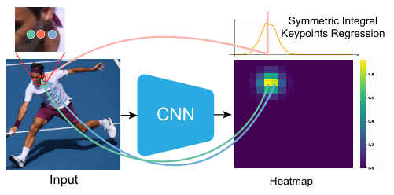
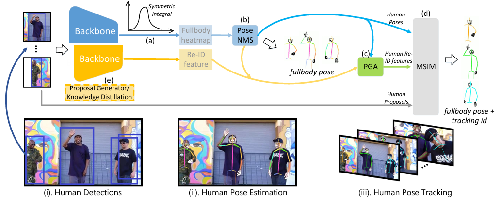
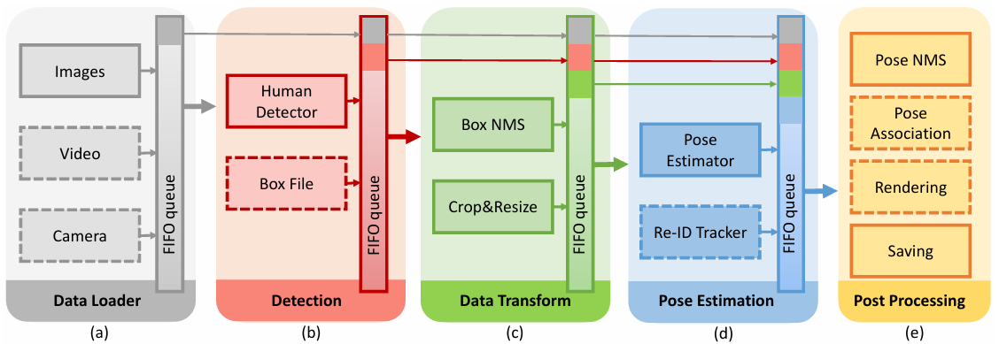
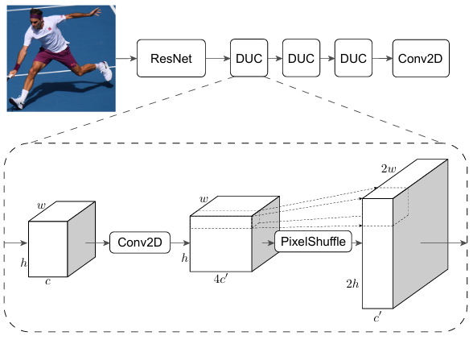

# AlphaPose: Whole-Body Regional Multi-Person Pose Estimation and Tracking in Real-Time

---
Reference

본 문서에 사용된 모든 이미지와 표는 해당 논문에서 발췌하였습니다.

---

---

- Human Pose Estimation

---

paper:
- https://ieeexplore.ieee.org/abstract/document/9954214/  
- https://arxiv.org/pdf/2211.03375

---

목차

0. [Abstract](#abstract)
1. 

---

## Abstract

AlphaPose
- 실시간
- 정확한 전신 pose 추정 및 tracking을 공동으로 수행
- Symmetric Integral Keypoint Regression(SIKR)
    - 빠르고 미세한 위치 파악
- Parametric Pose Non-Maximum-Suppression(P-NMS)
    - 중복되는 human detection 제거
- Pose Aware Identity Embedding
    - jointly pose estimation과 추적을 위함
- Part-Guided Proposal Generator(PGPG)
    - 훈련 중 multi-domain knowledge distillation을 사용하여 정확도를 높임

## 1. Introduction

multi-person full body pose estimation 문제에 초점

in the wild 이미지에서 여러 사람의 포즈를 인식하는 것이 이미지에서 한 사람의 포즈를 인식하는 것보다 어렵다.

이 논문에서는 하향식 프레임워크로 접근
- 사람 bounding box를 감지
- 각 box 내의 pose를 독립적으로 추정

단점:
- detection 단계와 pose estimation 단계가 분리되어 있다  
-> detector가 실패하면 pose estimator가 pose를 복구할 단서가 없다.
-> 정확도를 위해 강력한 detector를 사용하기 때문에 추론이 느려진다.

이러한 단점을 해결하는 새로운 방법론 제안
- detection 누락 문제를 완화하기 위해 detection confidence와 NMS 임계값을 낮추어 pose 추정을 위한 더 많은 후보를 제공
- 중복 box에서 생성된 중복 pose는 pose 유사성을 비교하기 위해 새로운 pose distance metric을 도입하는 parametric pose NMS에 의해 제거
- pose 거리 매개변수를 최적화하기 위해 데이터 기반 접근 방식 사용
- YOLOv3 SPP detector을 사용
    - SOTA와 비교했을 때 더 높은 효율성을 보이고 동등한 성능을 달성
- 하향식 프레임워크의 속도를 높이기 위해 multi-stage 동시 pipeline을 설계하여 framework를 실시간으로 실행

> **Figure 1. heatmap(녹색 및 파란색 선)으로 인한 양자화 오류**  
> symmetric integral keypoints regression(분홍색 선)을 사용하면 localization error을 해결할 수 있다.

in the wild에서 full body pose estimation
- keypoint 표현으로 heatmap을 가장 많이 사용
    - 계산 자원의 한계로 입력 이미지의 1/4를 사용
    - 신체, 얼굴, 및 손의 keypoint를 동시에 찾는 경우 이러한 표현은 서로 다른 신체 부위에 걸친 대규모 변형(variation)을 처리할 수 없기에 적합하지 않다.
    - 양자화 오류가 발생할 수 있다.  
    (Fig 1 참고. heatmap이 불연속적이기 때문에 인접한 grid 모두가 올바른 위치를 놓칠 수 있다.)  
    (신체 포즈 추정에는 문제가 되지 않을 수 있지만, 손과 얼굴 등 미세한 keypoint의 경우 올바른 위치를 놓치기 쉽다.)

    - 이를 해결하기 위한 이전 방법들:
        - 손과 얼굴 추정을 위해 추가 하위 네트워크 사용
        - ROI-Align을 사용하여 feature map 확대
    - 두 방법 모두 multi-person 시나리오에서 계산 비용이 많이 든다.
    - 이 논문에서는 새로운 symmetric integral keypoints 회귀 방법을 제안
        - 서로 다른 scale의 keypoint 위치를 정확하게 찾을 수 있다.
        - heatmap 표현과 동등한 정확도를 가지면서 양자화 오류를 제거할 수 있는 회귀 방법

훈련 데이터 부족
- full body pose estimation을 위한 데이터셋은 하나밖에 없다.[18]
- Halpe라는 새 데이터셋에 주석을 달았으며, [18]에 없는 추가 joint를 포함한다.

in the wild full body pose estimation 을 위한 하향식 프레임워크의 일반성을 개선하기 위해 두 가지 핵심 구성 요소 도입
- Multi-Domain Knowledge Distillation
    - 별도의 신체 부위 dataset의 훈련 데이터를 통합
- Part-guided Human Proposal Generator(PGPG)
    - 서로 다른 데이터셋 간의 도메인 격차와 불완전한 감지 문제를 완화하기 위해 훈련 샘플을 보강할 수 있다.
    - 다양한 포즈에 대한 human detector의 출력 분포를 학습하여 human bounding boxes의 생성을 시뮬레이션하여 대규모 훈련 데이터 샘플 생성이 가능하다.
    
Pose-aware identity embedding
- 하향식 프레임워크 내에서 동시 human pose tracking을 가능하게 함
- 포즈 추정기에 person re-id branch가 부착되어 포즈 추정과 인간 식별을 공동으로 수행
- pose-guided region attention의 도움으로 포즈 추정기는 사람을 정확하게 식별할 수 있다.

ICCV 2017[20]에서 발표한 예비 작업과 비교했을 때 확장 내용
- 프레임워크를 full body 포즈 추정 시나리오로 확장. fine-level localization을 위한 새로운 symmetric integral keypoint localization network 제안
- pose guided proposal generator을 확장하여 다양한 body part dataset에 대한 multi-domain knowledge distillation과 통합
- 새로운 whole-body pose estimation benchmark(각 사람당 136점)에 주석을 달고 이전 방법과 비교
- 통일된 방식으로 하향식 프레임워크에서 포즈 추적을 가능하게 하는 pose-aware identity embedding을 제안
- 정확한 성능과 실시간 성능을 모두 달성하는 AlphaPose 출시를 문서화

## 2. Related Work

### 2.1 Multi Person Pose Estimation

**Bottop-up Approaches**

- part-based approach라고도 함
- 가능한 모든 신체 부위를 감지한 다음 개별 골격으로 그룹화
- Chen et al. [11]
    - 신체 부위의 유연한 구성을 모델링하는 graphical model을 통해 대부분 가려진 사람들을 parse하는 접근 방식 제시
- Gkiox et al. [10]
    - k-poselets을 사용하여 사람을 공동으로 감지하고 활성화된 모든 poselets의 weighted average로 인간 포즈 위치를 예측
- Pishchulin et al. [12]
    - DeepCut이 먼저 모든 신체 부위 감지
    - integral linear programming을 통해 이러한 part들을 label, filter, assemble할 것을 제안
- Insafutdinov et al. [13]
    - DeeperCut 제안
    - ResNet을 기반으로 하는 더 강력한 part detector와 더 나은 incremental optimization 전략을 제안
- Openpose [17, 25]
    - Part Affinity Fields(PAF)를 도입하여 개인과 신체 부위 간의 연관 점수를 encoding하고 이를 bipartite matching subproblems로 분해하여 매칭 문제 해결
- Netwell et al.[26]
    - 감지된 각 part에 대해 식별 tag를 학습하여 해당 부품이 속한 개인을 나타내는 associative embedding을 학습
- Cheng et al.[27]
    - 강력한 multi-resolution network를 백본으로 사용하고 high-resolution feature pyramids를 사용하여 scale-aware 표현을 학습
- OpenPifpaf [22, 23]
    - 신체 부위를 각각 localize 하고 연결하기 위해 Part Intensity Field(PIF) 및 Part Association Field(PAF)를 제안

**정리**
- 우수한 성능
- body-part detector은 작은 local 영역만 고려
- 이미지에 작은 사람이 있을 때 scale 변동 문제에 직면하기 때문에 취약할 수 있다.

**Top-down Approaches**

- object detector을 통해 각 인체의 bounding box를 얻은 다음 cropped image에 대해 single-person pose estimation을 수행
- Fang et al. [20]
    - human body detector에 의해 발생하는 큰 noise를 가진 불완전한 bounding boxes의 문제를 해결하기 위해 symmetric spatial transformer network 제안
- Mask R-CNN [29]
    - ROI Align 뒤에 기존 bounding box 인식 branch와 병렬로 pose estimation branch를 추가하여 Faster R-CNN을 확장하여 end-to-end 훈련을 가능하게 함
- PandaNet [33]
    - single shot 방식으로 multi-person 3D 포즈 추정을 예측하는 anchor based 방법을 제안하고 높은 효율성 달성
- Chen et al. [30]
    - simple joints를 localize하기 위해 feature pyramid network를 사용
    - hard joints를 처리하기 위해 이전 네트워크의 모든 level의 feature을 통합하는 refining network 사용
- [31]
    - ResNet을 backbone으로 사용하고 몇 개의 deconvolutional layers를 upsampling head로 사용하는 단순 구조화된 네트워크는 효과적이고 경쟁력 있는 결과를 보임
- Sun et al. [28]
    - first stage에서 고해상도 subnetwork가 설정되고 다음 단계에서 고해상도에서 저해상도 subnetwork가 병렬로 하나씩 추가되어 반복적인 multi-scale feature fusion 융합을 수행하는 강력한 high-resolution network 제시
- Bertasius et al. [34]
    - 이미지에서 비디오로 확장
    - 드물게 label이 지정된 비디오에서 pose warping을 학습하는 방법 제안

**정리**
- large-scale 벤치마크에서 놀라운 정밀도 달성
- 2단계 패러다임은 상향식 접근 방식에 비해 추론 속도가 느리다.
- 라이브러리 수준의 framework 구현이 부족하여 업계에 적용되지 않음

-> 시간이 많이 걸리는 단계를 동시에 처리하고 빠른 추론을 가능하게 하는 multi-stage pipeline을 개발하는 AlphaPose 제안

**One-stage Approaches**

### 2.2 Whole-Body Keypoint Localization

### 2.3 Integral Keypoints Localization

Heatmap은 HPE 분야에서 joint localization을 위한 대표적인 표현

heatmap 의 위치는 각 공간 grid에서 joint가 발생할 가능성만 설명  
-> 불연속적인 숫자  
-> 불가피한 양자화 오류로 이어짐

soft-argmax 기반 integral regression이 whole-body keypoint localization에 더 적합하다.
- 이전의 여러 연구에서는 heatmap에서 연속적인 joint 위치를 읽는 soft-argmax 연산을 연구
- Luvizon et al [43, 46] & Sun et al. [45]
    - 1인 2D/3D 포즈 추정에 soft-argmax 연산을 성공적으로 적용
- 단점
    - assymetric gradient 문제
    - size-dependent keypoint scoring 문제

이러한 문제를 해결하여 더 정확한 새로운 keypoint 회귀 방법을 제공

### 2.4 Multi Person Pose Tracking

## 3. Whole-body Multi Person Pose Estimation

> **Figure 2. full-body pose estimation과 추적 프레임워크 그림**  
> 입력 이미지가 주어지면 YOLOv3 또는 EfficientDet과 같은 off-the-shelf object detector을 사용하여 human detection을 얻음  
> 감지된 각 사람에 대해 자르고 크기를 조정한 다음 pose estimation 및 tracking network를 통해 전달하여 full body human pose 및 Re-ID features를 얻음  
> 이 두 네트워크의 backbone은 서로 다른 pose 구성에 적응하기 위해 분리되거나 빠른 추론을 위해 동일한 가중치를 공유할 수 있다. (따라서 그림에서 잘못 정렬됨)  
> (a) symmetric integral regression은 세밀한 수준의 keypoint localization을 위해 채택  
> (b) pose NMS는 중복 포즈를 제거하기 위해 채택  
> (c) pose-guided alignment(PGA) 모듈은 예측된 human re-id feautre에 적용되어 pose-aligned human re-id feature을 획득  
> (d) Multi-stage identity matching(MSIM)은 사람의 pose, re-id features 및 detected boxes를 활용하여 최종 추적 id를 생성  
> (e) 훈련 중에 네트워크의 일반화 능력을 향상시키기 위해 proposal generator 및 knowledge distillation 채택

### 3.1 Symmetric Integral Keypoints Regression

soft-argmax 연산은 미분 가능  
이를 통해 heatmap 기반 접근 방식을 regression 기반 접근 방식으로 전환하고 end-to-end training을 수행할 수 있다.

integral regression 연산:

$$
\displaystyle
\begin{aligned}
&\hat{\mu} = \sum x \cdot p_x
&(1)
\end{aligned}
$$

> $x:$ 각 픽셀의 좌표  
> $p_x:$ 정규화 후 heatmap의 pixel likelihood

훈련 중에 손실 함수는 예측된 joint 위치와 GT 위치 $\mu: \mathcal{L}_{reg} = ||\mu - \hat{\mu}||_1$ 사이의 $\ell_1$ norm을 최소화하기 위해 적용

각 pixel의 gradient는 다음과 같이 공식화:

$$
\displaystyle
\begin{aligned}
&\frac{\partial \mathcal{L}_{reg}}{\partial p_x} = x \cdot sgn(\hat{\mu} - \mu)
&(2)
\end{aligned}
$$

gradient amplitude(기울기 진폭)은 비대칭  
gradient의 절대값은 GT에 대한 상대적 위치 대신 pixel의 절대 위치(즉, $x$)에 의해 결정된다.  
동일한 거리 오차가 주어지면 keypoint가 다른 위치에 있을 때 gardient가 달라진다는 것을 나타냄

-> 이러한 비대칭성은 CNN 네트워크의 translation invariance를 깨뜨려 성능 저하로 이어진다.
(CNN은 객체가 어디에 있든지 객체를 동일하게 인식. 하지만 keypoint의 위치에 따라 gradient가 달라지면 이러한 특징이 깨질 수 있다.)

**Amplitude Symmetric Gradient**

학습 효율성을 향상시키기 위해 역전파에서 실제 gradient에 대한 근사치인 Amplitude symmetric gradient(ASG) 함수를 제안

$$
\displaystyle
\begin{aligned}
&\delta_{ASG} = A_{grad} \cdot sgn(x - \hat{\mu}) \cdot sgn(\hat{\mu} - \mu)
&(3)
\end{aligned}
$$

> $A_{grad}:$ gradient의 진폭. heatmap 크기의 1/8로 수동으로 설정하는 상수

- 다음 paragraph에서 파생을 제공
- symmetric gradient를 사용하면 gradient 분포는 예측된 joint 위치에 중심을 둔다.
- 학습 과정에서 symmetric gradient 분포는 heatmap의 이점을 더 잘 활용하고 보다 직접적인 방식으로 GT 위치를 근사화할 수 있다.
- 예: 예측 위치가 GT보다 높다고 가정했을 때, 네트워크는 양의 gradient를 갖고 있기 때문에 $\hat{\mu}$의 오른쪽에 있는 heatmap 값을 억제. $\hat{\mu}$의 왼쪽에 있는 heatmap 값은 음의 gradient로 인해 활성화됨

**Stable gradients for ASG**

#### 3.1.2 Size-dependent Keypoint Scoring Problem

### 3.2 Multi-Domain Knowledge Distillation

multi-domain knowledge distillation을 채택
- 300Wface, FreiHand, InterHand 세 가지 추가 데이터셋 사용
- 얼굴과 손의 keypoint를 정확하게 예측할 수 있다.
- 훈련 동안 고정 비율로 서로 다른 dataset을 샘플링하여 각 훈련 batch를 구성
- batch의 1/3은 주석이 달린 dataset엣, 1/3은 COCO-fullbody에서, 나머지는 300Wface와 FreiHand 에서 동일하게 샘플링

domain별 데이터셋은 정확한 중간 감독을 제공할 수 있지만 데이터 분포는 실제 이비지와 상당히 다르다
- 이를 해결하기 위해 [20]의 pose-guided proposal generator을 full body scenario로 확장하고 통일된 방식으로 데이터 증강을 수행

### 3.3 Part-Guided Proposal Generator

- 2단계 포즈 추정: human proposals에 의해 생성된 human detector은 일반적으로 GT human boxes와 다른 데이터 분포를 생성
- 얼굴과 손의 공간 분포는 in the wild full-body images와 datasets의 part-only images 간에 다르다.
- 훈련 중 적절한 데이터 증강이 없으면 감지된 인간에 대한 test 단계에서 pose estimator가 제대로 작동하지 않을 수 있다.

training sample을 생성하기 위해 part-guided proposal generator 제안
- tight surrounded bounding box가 있는 다른 신체 부위의 경우, proposal generator은 human detector의 출력 분포와 일치하는 새 box를 생성
- 각 part에 대한 GT bounding box가 이미 있으므로 이 문제를 detected bounding box와 GT bounding box간의 상대적 offset 분포가 part마다 다르다는 모델링으로 단순화

분포:

$$
\displaystyle
\begin{aligned}
&P(\delta x_{min}, \delta x_{max}, \delta y_{min}, \delta y_{max} | p)
\end{aligned}
$$

~

### 3.4 Parametric Pose NMS

## 4. Multi Person Pose Tracking

### 4.1 Pose-Guided Attention Mechanism

Person re-ID 기능을 사용하여 많은 인간 제안에서 개별적으로 동일한 것을 식별할 수 있습니다. 하향식 프레임워크에서는 object detector에 의해 생성된 각 bounding box에서 re-ID 기능을 추출합니다. 그러나 re-ID 기능의 품질은 특히 다른 사람의 신체가 있는 경우 경계 상자의 배경에 의해 저하됩니다. 이 문제를 해결하기 위해 예측된 인간의 포즈를 사용하여 인체가 집중된 영역을 구성하는 것을 고려합니다. 따라서 PGA(Pose-Guided Attention)는 추출된 특징이 관심 있는 인체에 초점을 맞추도록 강제하고 배경의 영향을 무시하도록 제안됩니다. PGA의 통찰력은 절제 연구에서 자세히 설명됩니다(Sec. 6.8).

포즈 추정기는 k 히트맵을 생성하며, 여기서 k는 각 사람에 대한 키포인트 수를 의미합니다. 그런 다음 PGA 모듈은 이러한 히트맵을 간단한 변환 계층이 있는 주목 맵(mA)으로 변환합니다. mA는 re-ID feature map(mid)과 크기가 같습니다. 따라서 가중치가 적용된 re-ID 기능 맵(mwid)을 얻을 수 있습니다.

$$
$$

### 4.2 Multi-Stage Identity Matching

## 5. AlphaPose

### 5.1 Pipeline

> **Figure 4. AlphaPose의 시스템 아키텍처**
> 우리 시스템은 (a) 이미지, 비디오 또는 카메라 스트림을 입력으로 취할 수 있는 데이터 로딩 모듈, (b) 인간 제안을 제공하는 감지 모듈, (c) 감지 결과를 처리하고 나중에 사용할 수 있도록 각 사람을 자르는 데이터 변환 모듈, (d) 각 사람에 대한 키포인트 및/또는 인간 정체성을 생성하는 포즈 추정 모듈,  (e) 포즈 결과를 처리하고 저장하는 후처리 모듈. 우리의 프레임워크는 유연하며 각 모듈에는 쉽게 교체하고 업데이트할 수 있는 여러 구성 요소가 포함되어 있습니다. 파선 상자는 각 모듈의 선택적 구성 요소를 나타냅니다. 자세한 내용은 텍스트를 참조하고 컬러로 가장 잘 볼 수 있습니다.

> **Figure 5. FastPose의 네트워크 아키텍처**
> FastPose의 네트워크 아키텍처. 첫째, ResNet이 네트워크 백본으로 채택됩니다. 그런 다음 DUCmodules가 업샘플링을 위해 적용됩니다. 마지막으로 1 1 컨볼루션을 사용하여 히트맵을 생성합니다