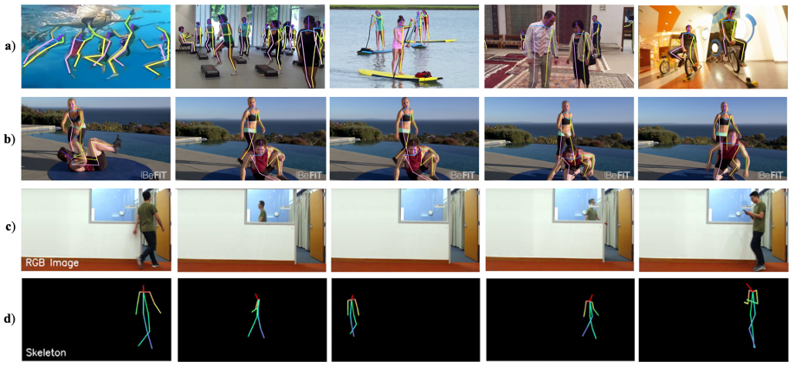
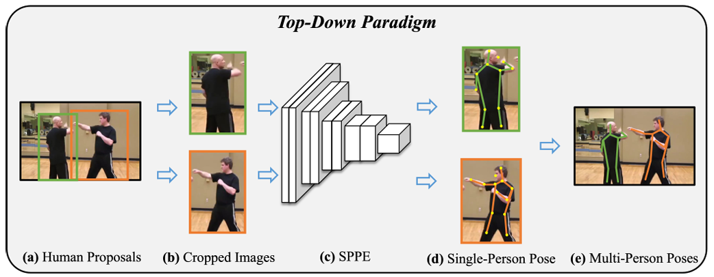
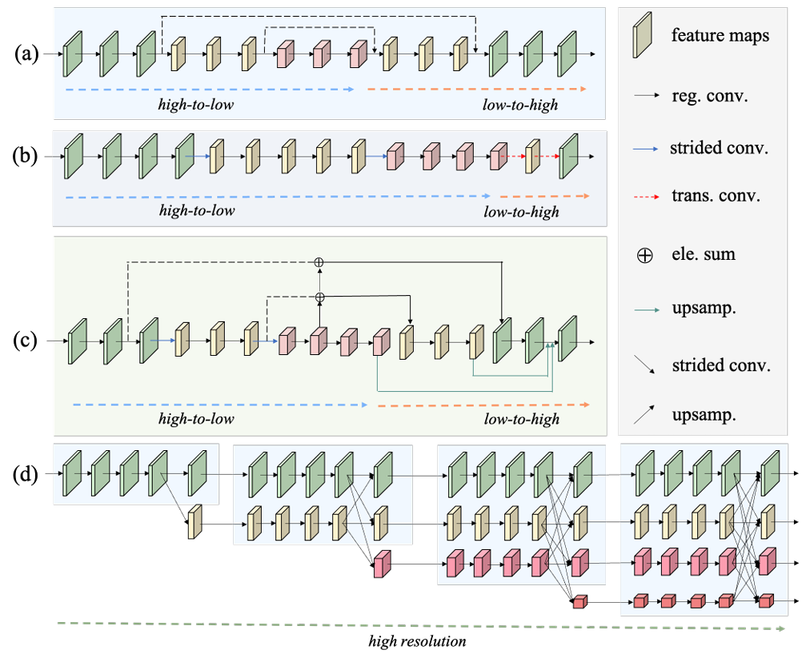

# 2D Human Pose Estimation: A Survey

---
Reference

본 문서에 사용된 모든 이미지와 표는 해당 논문 및 레퍼런스 논문에서 발췌하였습니다.

---

---

- Human Pose Estimation
- Survey

---

paper: https://arxiv.org/pdf/2204.07370

---

목차

0. [Abstract](#abstract)
1. 

---

## Abstract

Human pose estimation(HPE)
- 입력 데이터(이미지, 비디오, 또는 신호)에서 인체의 해부학적 keypoint또는 신체 부위를 찾는 것이 목표
- 딥 러닝을 사용하면 데이터에서 직접 특징 표현을 학습할 수 있어 HPE 성능의 한계를 크게 높일 수 있다.
- 최근 2차원 HPE 방법의 성과를 바탕으로 종합적인 조사를 제시
- 기존 접근 방식은 3가지 방향으로 노력을 기울인다.
    - network architecture design
        - HPE 모델의 아키텍처를 살펴보고 keypoint 인식 및 위치 파악을 위한 보다 강력한 feature을 추출
    - network training refinement
        - 신경망 훈련을 활용하며 모델의 표현 능력을 향상시키는 것이 목표
    - post processing
        - keypoint 감지 성능을 향상시키기 위해 모델에 구애받지 않는 연마 전략을 추가로 통합

## 1. Introduction

> **Figure 1. 2D Human pose estimation 그림**  
> a) 이미지  
> b) 비디오
> c), d) RF 신호
> c)는 RF signal-based HPE의 시각적 참조를 위해 제공
> d)는 RF signals(RGB 이미지를 사용하지 않고 signal만 사용)에서 추출된 골격을 보임

2D HPE의 목표(Fig 1 참고)
1. 센서가 기록한 multimedia data(RGB 이미지, 비디오, RF 신호 또는 레이더) 에서 다양한 인물 instance를 인식
2. 각 인물에 대해 사전 정의된 인체 해부학적 keypoint set 위치를 찾는 것

이전 방법은 관절 간의 관계를 나타내기 위해 probabilistic graphical model을 사용
- 일반화와 성능을 제한하는 수작업 기능에 크게 의존

딥러닝 기법
- 데이터로부터 특징 표현을 자동으로 학습
- Convolutional network의 성공을 기반으로 뛰어난 성능 달성

이 논문에서는 HPE 방법을 세 가지 범주로 나눈다.
1. Network architecture design 접근 방식
    - 다양한 장면에서 강력한 표현을 캡처하는 강력한 모델을 고안하려고 시도
    - 개별 bounding box 또는 전체 이미지 내에서 인체 특징을 추출하고 처리하는데 중점을 둔다.
2. Network training refinement 접근 방식
    - 신경망 훈련을 최적화하는 것이 목표
    - 네트워크 구조를 변경하지 않고 모델 능력을 향상시키고자 함
    - 데이터 증강 기법, 모델 훈련 전략, 손실 함수 제약 조건, 모데인 적응 방법 등
3. Post processing
    - 거친(coarse) 포즈 추정치에 대한 pose polishment에 중점을 둠
    - 일반적으로 모델에 구애받지 않는 plugin으로 작동
    - 양자화 오류 최소화, pose resampling 등이 있다.

## 2. Problem Statement

### 2.1 The Problem

HPE 문제는 다음과 같이 formulation 가능하다.

- 이미지나 비디오를 입력으로 받으면 입력 데이터에서 모든 사람의 포즈를 감지

입력 이미지: $I$일 때,
이미지에 있는 각 사람 $i$의 포즈 $P = {P_i}_{i-1}^n$를 탐지.
($n$: I에 있는 사람의 수)

인체 포즈를 설명하기 위한 방법들:
- 골격 기반 모델
    - 사전 정의된 관절 세트로 특성화
- 윤곽 기반 모델
    - 신체 윤곽 및 사지 너비 정보를 포함
- volume 기반 모델
    - 3D 인체 모양을 설명

### 2.2 Technical Challenges

이상적인 방법
- 높은 정확도로 감지하여 정확한 인체 정보를 보장
- 3D HPE 및 동작 인식과 같은 downstream 작업을 용이하게 함
- 높은 효율성으로 desktop 및 휴대폰과 같은 다양한 장치에서 실시간 컴퓨팅을 가능하게 함

정확한 포즈 감지의 어려움
1. 노출 부족/과다 노출 및 human-object 얽힘과 같은 성가신 현상이 자주 발생
2. 매우 유연한 human kinematic chains으로 인해 pose occlusion, 자체 occlusion도 불가피하다.  
    -> 시각적 feature을 사용하는 keypoint detector을 혼란스럽게 한다.
3. Motion bulr 및 video defocus는 비디오에서 자주 발생하여 포즈 감지 정확도를 저하시킨다.

pose estimation 알고리즘이 practical applications에 적용될 때, 정확한 추정 외에도 실행속도(효율성)도 중요하다. 

HRNet-W48은 여러 벤치마크에서 SOTA를 달성했지만, GTX-1080TI에서도 실시간 포즈 추정 달성에 어려움이 있다.

## 3. Network Architecture Design Methods

> **하향식 프레임워크의 고전적 파이프라인**  
> (a): 데이터셋 원본 이미지  
> (b): human proposal 영역을 원본 이미지에서 잘라내어 단일 사람 이미지 형성  
> (c): 자른 각 이미지는 Single Person Pose Estimation(SPPE)를 거친다.  
> (d): 추정된 포즈  
> (e): 추정 결과를 원본 이미지에 투영하여 최종 결과 산출

딥 러닝 방법의 주요 장점: 데이터에서 feature 표현을 자동으로 학습
feature 품질은 네트워크 아키텍처와 밀접한 관련이 있다.

- 하향식 프레임워크(Top-down framework)
    - 사람 bounding box를 감지한 다음 각 bounding box에 대해 한 사람의 포즈 추정을 수행하는 two-step 절차 사용
    - 회귀 기반, 히트맵 기반, 비디오 기반, model compressing 기반으로 분류
- 상향식 프레임워크(Bottom-up framework)
    - keypoint를 찾은 다음 사람 instance로 그룹화
    - 1단계 및 2단계 방법으로 분류

### 3.1 Top-Down Framework

#### 3.1.1 Regression-Based Methods

입력 이미지에서 joint까지의 매핑을 학습하여 keypoint 좌표를 직접 회귀하는 방식

- DeepPose
    - 반복적인 아키텍처를 사용하여 계단식 convolutional entwork(AlexNet)으로 이미지 특징을 추출하고, fully connected layer로 joint 좌표를 회귀
- GoogleNet 기반 모델
    - 관절 위치를 직접 예측하는 대신 내무 관절 좌표 추정치를 점진적으로 변경하는 자체 수정 모델을 제안
- ResNet50 기반 모델[154]
    - 뼈의 새로운 재매개변수화된 포즈 표현을 활용하는 구조 인식 표현 접근 방식을 제시

Graph Convolutional Network(GCN)
- node와 edge를 사용하여 entity와 그 상관관계를 나타냄
- Graph에 convolution을 적용하면, 노드의 feature은 인접 노드들의 feature을 통합하여 향상
- [135]
    - 노드가 관절을 나타내고 가장자리가 뼈를 나타내는 그래프 구조로 인체를 casting
    - Image-Guided Progressive GCN 모듈을 사용하여 보이지 않는 관절을 추정하는 것을 제안

Attention 메커니즘은 표현 학습을 크게 발전신킴
self-attention에 기반을 둔 Transformer은 객체 감지, 이미지 분류 및 의미론적 분할과 같은 여러 시각적 이해 작업에 대한 SOTA를 확립

Cascaded Transformer[87]
- 인간과 Keypoint 탐지의 end-to-end regression을 수행
- 모든 사람에 대한 bbox를 탐지한 다음 각 사람에 대한 모든 관절 좌표를 개별적으로 회귀

회귀 기반 방법
- 효율적. 실시간 응용 프로그램에서 유망한 잠재력이 있다.
- 각 관절에 대해 단일 2D 좌표를 직접 출력하므로 신체 부분의 면적을 고려하지 않음  
    -> keypoint 대신 probabilistic heatmap으로 keypoint 위치를 찾는 heatmap-based 방식 도입

#### 3.1.2 Heatmap-Based Methods

> **Figure 4. high-to-low 및 low-to-high 프레임워크에 의존하는 고전적인 Human pose detector**  
> (a) Stacked hourglass network [122]  
> (b) Cascaded pyramid network [17]  
> (c) Simple Baseline [181]
> (d) HRNet [153]  
> ele. sum: element-wise summation  
> (a)에서 high-to-low 및 low-to-high 네트워크 아키텍처는 대칭  
> (b)와 (c)에서 high-to-low 프로세스는 무거운 대형 시각적 backbone network(예: ResNet)에 의해 수행. low-to-high 프로세스는 일부 전치된 convolution 또는 가벼운 directly upsampling에 의해 구현  
> (c)에서 skip-connection(점선) 은 동일한 공간 크기를 가진 feature을 융합  
> (d)에서 고해상도 표현은 전체 propagation에서 유지되고, 반복적인 multi-scale 융합이 수행됨. 각 해상도 feature은 모든 해상도로부터 풍부한 정보를 받는다.

- Heatmap $H_i$는 각 관절 위치 $(x_i, y_i)$를 중심으로 하는 2D Gaussian을 통해 생성. 위치가 i번쨰 관절일 확률을 encoding
- 훈련 목표: N개의 joint에 대한 N개의 heatmap을 예측

- Iterative Architecture
    - keypoint heatmap을 생성하고 개선하도록 설계됨
    - [137]
        - 여러 단계에서 관절의 위치를 점진적으로 추론하는 모델 제시
    - [178]
        - [137]의 아키텍처를 확장하고 sequential convolutions를 사용하여 인체 부위 간의 long-range spatial dependencies를 암시적으로 모델링하는 sequential prediction framework 구축
        - 이전 단계의 결과를 조적하여 joint 위치에 대한 점점 더 세분화된 추정치를 수집
        - 반복 아키텍처에서 gradient가 사라지는 문제를 완화하기 위해 중간 감독(intermediate supervision)을 제안

        - 중간 감독 전략은 multi-stage models의 기울기 소실 문제를 완화하지만, 각 단계는 여전히 효과적인 의미론적 feature을 추출하기 위한 deep sub-network를 구축하지 못하기 때문에 피팅 능력이 크게 제한된다.
            - 잔류 네트워크(ResNet)이 나오면서 해결됨
                - 지름길 도입
                - 더 깊은 계층의 오류를 역전파할 수 있도록 함

- Symmetric Architecture
    - 일반적으로 high-to-low(downsampling) 및 low-to-high(upsampling) 프레임워크를 사용
    - [122]
        - joint 간의 다양한 공간 관계를 포착하기 위해 모든 scale에 걸쳐 feature을 통합하는 pooling 및 upsampling의 연속적인 단계를 기반으로 하는 stacked hourglass architectrure 제안(Fig 4. a)
    - [20]
        - [122]를 더 큰 수용장을 가진 filter을 포함하는 곁가지가 있는 hourglass residual units로 확장
            - 다양한 scale에 걸쳐 feature을 자동으로 학습
    - [184]
        - [122]의 residual block을 Pyramid Residual modules로 대체하여 네트워크의 scale 불변성을 향상
    - [75]
        - 모든 scale에 걸쳐 keypoint heatmap을 결합하는 multi-scale supervision을 제안
        - 풍부한 context 기능을 획득하고 stacked hourglass network의 성능을 향상시킴
    - [8]
        - Residual Steps Network 설계
            - 동일한 spatial size를 가진 feature을 집계하여 섬세한 지역화된 설명을 생성하는 stacked hourglass-like network
    - [157]
        - hourglass entwork를 backbone으로 사용하고 다른 part groups에 특정한 표현을 학습하기 위해 part-based branching network를 제안
        - high-to-low와 low-to-high convoultions에서 대칭 아키텍처를 유지

- Asymmetric Architecture
    - high-to-low 프로세스는 무겁고 low-to-high 프로세스는 가볍다
    - [17]
        - GlobalNet으로 간단한 keypoint를 감지하는 cascade pyramid network(Fig 4. c)를 제안
        - RefineNet으로 어려운 keypoint를 감지
        - RefineNet은 GlobalNet의 모든 수준의 feature 표현을 통합하는 여러 개의 일반 convolution으로 구성
    - [181]
        - Fig 4. b에 표시된 featuremap 보간 대신 몇 가지 deconvolutional layer을 추가하여 ResNet을 확장
        - high-to-low convolution을 위해 고전적 분류 네트워크(VGGNet, ResNet)의 하위 네트워크를 사용하고, low-to-high convolution을 위해 simple 네트워크를 채택
    - 이러한 비대칭 네트워크 아키텍처는 feature encoding 및 decoding의 불균형으로 어려움을 겪으며, 잠재적으로 모델 성능에 영향을 미침

- High Resolution Architecture
    - [153]
        - HRNet을 제안(Fig 4. d)
        - 전체 프로세스에서 고해상도 표현을 유지할 수 있다.
        - HPE를 위한 고해상도 표현의 우수성을 보여줌
    - [68]
        - HRNet을 백본 네트워크로 사용
        - gating mechanism과 feature attention module을 통합하여 discriminative 및 attention-aware features를 선택하고 융합

- Composed Human Proposal Detection  
    위의 모델들은 전체 이미지에서 잘린 human proposal에 대한 pose 추정에 집중하고, proposal identification을 위해 off-the-shelf human proposal detector을 사용

    기존 연구[34, 84]는 human proposal의 품질이 pose estimator의 결과에 유의미한 영향을 미침을 보임
    - [128]
        - Faster-RCNN을 person detector로, ResNet-101을 pose detector로 사용하는 multi-person pose estimation 방법 제안
        - 포즈 중복 문제를 해결하기 위한 새로운 핵심 포인트로 NonMaximum-Suppression(NMS) 전략을 제안
    - [34]
        - SSD-512[95]를 human detector로, stacked hourglass를 single person pose detector로 활용
        - human pose estimation을 용이하게 하기 위해 부정확한 bounding box에서 고품질 단일 사람 영역을 추출하는 symmetric spatial transformer network를 제안
    - [84]
        - 붐비는 장면에서 single person bounding box는 여러 사람이 포함되는 경향이 있어 pose detector의 성능이 저하된다.
        - joint-candidate pose detector을 활용하여 다중 peaks가 있는 heatmap을 예측하고 graph network를 사용하여 전역 joint 연결을 수행

    proposal detection과 pose detection을 공동으로 수행하는 연구들
    - [162] 
        - dense regression fashin으로 인간 bounding box와 keypoint 위치를 동시에 추론하는 혼합 모델 개발
    - [177]
        - 인간 bounding box와 pose에 대한 좋은 초기화를 제공한 다음, 초기화와 해당 label 사이의 offset을 회귀하는 template offset model을 소개
    - [77]
        - 먼저 keypoints와 인간 proposals를 개별적으로 detect한 다음 Pose Residual Netowrk를 사용하여 감지된 keypoint를 다른 boudning box에 할당하는 MultiPoseNet을 제공
        - Pose Reidual Network는 residual multilayer perceptron에 의해 구현됨
    - [109]
        - dynamic instance-aware convolution을 통합하고 bounding box cropping 및 keypoint grouping 프로세스를 제거하는 pose estimation framework 설계

    heatmap 기반 방법은 전반적으로 정확도가 높다
    하지만 heatmap 계산 process는 값비싼 계산 overhead와 불가피한 quantization error을 포함하여 새로운 미해결 문제를 야기함

#### 3.1.3 Video-Based Methods

#### 3.1.4 Model Compression-Based Methods

### 3.2 Bottop-Up Framework(상향식 접근 방식)

- human detection에 의존하지 않고 원본 이미지에서 직접 keypoint 추정을 수행  
-> 계산 overhead가 줄어든다.
- 추정한 joint의 신원을 판단해야 한다.

**Human Center Regression**

- 인간 중심점을 사용하여 사람 instance를 나타냄
- Nie et al. 2018 [125]

    

    - 사람 instance, body joint 위치 표현을 조합하는 Single-stage multi-person Pose Machine을 제안
    - root joints(center biased points)는 사람 instance를 나타내기 위해 도입됨
    - body joint 위치는 root의 변위로 인코딩된다.

- Geng et al. 2021 [40]

    - 사람 instance를 나타내는 human center map을 예측하고, center map 내의 각 pixel q에서 후보 pose를 조밀하게 추정

**Associate Embedding**

- 각 keypoint에 assocate embedding을 할당
    - 이는 다른 사람을 구별하기 위한 instance 표현
- Newell et al. 2016 [121]

    

    - 예측된 각 keypoint에는 instance 할당을 식별하기 위한 tag 역할을 하는 추가 embedding vector가 있다.

- Jin et al. 2019 [69]

    

    - 입력 이미지에서 신체 부위 heatmap을 감지하고 part-level data association을 예측하는 SpatialNet을 제안
    - part-level data association은 keypoint embedding에 의해 매개변수화된다.

- Cheng et al. 2020 [19]

    

    - [121]의 keypoint grouping을 따름
    - 고해상도 feature pyramids를 학습하여 작은 사람의 pose 추정을 개선하기 위한 고해상도 네트워크를 제안

- Luo et al. 2021 [106]

    

    - human scale의 큰 차이와 labeling 모호성의 문제에 초점을 맞춤
    - 각 keypoint에 대한 GT gaussian kernel의 표준 편차를 적응적으로 조정할 수 있고, 다양한 human scale 및 labeling 모호성에 대한 높은 허용 오차를 달성하는 scale-adaptive heatmap regression model을 제안

**Part Field**

- keypoint와 keypoint 간의 연결을 감지한 다음 keypoint 연결에 따라 keypoint 그룹화를 수행

- Cao et al. 2017 [9]

    

    - two-branch multi-stage CNN architecture 제안
    - 한 branch는 keypoint 위치를 나타내는 confident(신뢰도) map을 예측
    - 다른 branch는 keypoint간의 연결 강도를 나타내기 위해 Part Affinity Fields를 예측
    - greedy algorithm을 적용하여 joint간의 연결 강도에 따라 동일한 사람의 다른 관절을 조립

- Kreiss et al. 2019 [78]

    

    - 신체 부위 위치를 찾기 위해 part intensity field를 활용
    - 신체 부위를 서로 연관시키기 위해 part association field를 사용

- Li et al. 2020 [85]

    
    
    - 효과적인 keypoint grouping을 위해 Part Affinity Field를 기반으로 신체 부위 heatmap과 관련된 새로운 keypoint를 제공

- 일부 접근 방식은 kyepoint grouping을 위한 keypoint 연결의 대체 표현을 사용

- Luo et al. 2018 [105]

    - keypoint 위치 heatmap을 회귀
    - 인접한 joint 간의 친족 관계를 추론하여 최적의 matched joint pairs를 결정하는 multi-layer fractal network 제안

- Jin et al. 2020 [70]

    

    - keypoint grouping을 graph grouping으로 변환하는 차별화 가능한 hierarchical graph grouping network 제안
    - keypoint detection network를 사용하여 end-to-end로 훈련 가능

**Summary**

- 추가 object detection techniques를 사용을 제거하여 포즈 감지 효율성 향상
- OpenPose는 광범위한 작업에서 사용됨

## 4. Network Training Refinement

- 데이터의 양과 질, 훈련 전략 및 손실 함수는 모델 성능에 영향을 미친다.
- 데이터 증강 기법: 데이터의 양과 다양성을 늘리는 것이 목표
- multi-task learning: 관련 시각적 작업 간의 표현을 공유하여 유익한 feature을 포착하고자 함
- loss function 제약 조건: 신경망의 최적화 목표 결정
- Domain adaptation: 네트워크가 다양한 데이터셋에에 적응할 수 있도록 돕는다.

### 4.1 Data Augmentation Techniques

- 일반적인 방법들
    - 무작위 회전
    - 무작위 scale
    - 무작위 자르기
    - 수평 뒤집기
    - 무작위 dropping
    - 조명 변형

- Peng et al. 2018 [130]

    

    - 어려운 pose sample을 생성하는 enhancement network 제안

- Tang et al. 2019 [157]

    - SOTA HPE 접근법이 유사한 오차 분포를 갖는다고 지적

- Moon et al. 2019 [118]

    

    - [157]의 error statics를 기반으로 합성 pose를 생성
    - 합성된 pose로 HPE 네트워크 훈련

- Bin et al. 2020 [6]

    - GAN을 통해 adversarial semantic data augmentation을 제시
    - 서로 다른 의미론적 granularities(세분성)을 갖는 segmented body parts를 붙여 넣어 원본 이미지를 향상

- Wang et al. 2021 [171]

    - AdvMix 알고리즘을 도입하여 generator 네트워크가 다양한 손상된 이미지를 혼합하여 pose estimator를 혼란스럽게 함
    - knowledge distillation network는 clean pose structure knowledge를 target pose detector로 전송

### 4.2 Multi-Task Training 전략

- Xia et al. 2017 [180]
    - human parsing과 pose estimation 두 가지 작업을 공동으로 해결하고 part-level segment를 활용하여 keypoint localization를 Guide

- Nie et al. 2018 [124]
    - parsing encoder과 pose model parameter adapter을 제공
    - 이 두 모듈은 pose 모델의 파라미터를 예측하는 방법을 학습하여 HPE를 위한 보완적인 feature을 추출

### 4.3 Loss Function Constraints

- HPE의 표준 및 공동 loss function: L2 distance
- 비용 함수:

$$
\displaystyle
\begin{aligned}
&L = \frac{1}{N} * \sum_{j=1}^N v_j \times ||G(j) - P(j)||^2
&(1)
\end{aligned}
$$

> $j:$ joint  
> $G(j):$ GT heatmap  
> $P(j):$ predicted heatmap  
> $v_j:$ 가시성
> $N:$ joint 개수

- [75]
    - 인체의 structure-aware loss를 제시
    - i번째 feature scale에서 structure-aware loss는 다음과 같이 표현될 수 있다.

$$
\displaystyle
\begin{aligned}
&L^i = \frac{1}{N} \sum_{j=1}^N ||P_j^i - G_j^i||_2 + \alpha \sum_{i=1}^N ||P_{S_j}^i - G_{S_j}^i||_2
&(2)
\end{aligned}
$$

> $G_j:$ labeled j번쨰 keypoint heatmap
> $P_j:$ 예측한 j번째 keypoint heatmap
> $G_{S_j}:$ keypoint j와 그 이웃의 heatmap group label
> $P_{S_j}:$ keypoint j와 그 이웃의 heatmap group 예측

- [17]
    - 모든 keypoint 에 대한 L2 loss를 계산한 다음 추가로 상위 M개의 hard keypoints를 처벌하는 online hard keypoints mining 제안
    - 어려운 keypoint의 패널티를 증가시키고 네트워크 성능 향상
- [189]
    - structure loss(STLoss), pairwise 억제 loss(PairLoss) 및 probability distribution loss(PDLoss)로 구성된 HRNet에 대한 combied distillation loss을 나타냄
    - STLoss는 pose 가려짐에 맞서기 위해 초기 단계에서 인체 구조를 학습하도록 네트워크를 강제한다.
    - PairLoss는 혼잡한 시나리오에서 유사한 joint 오분류 문제를 완화
    - PDLoss는 final heatmap의 분포를 학습하는 것을 guide

### 4.4 Domain Adaption Methods

- [183]
    - 서로 다른 데이터셋에서 human body-level topological 구조 정렬과 fine-grained feature alignment를 모두 수행하는 2D HPE에 대한 domain adaptation method를 제안
- [47]
    - multi-domain 학습 방식으로 더 나은 pose 표현을 얻는 여러 dataset에서 모델을 여러 번 훈련할 수 있는 multi-domain pose network를 제안
- [82]
    - 합성 데이터와 실제 데이터간의 격차를 줄이기 위해 animal pose estimation에 대한 강력한 일반화 능력을 입증한 online coarse-to-fine pseudo label updating 전략을 제안
    - label noise를 완화할 수 있으므로 여러 동물 벤치마크 데이터셋에서 SOTA 달성

## 5. Post Processing Approaches

일부 접근 방식은 초기 pose를 추정한 다음 후처리 방법으로 최적화

- 양자화 오류
    - heatmap에서 좌표 공간으로 변환할 때 필연적으로 양자화 오류가 발생
- pose resampling
    - 초기 추정을 개선하기 위해 유리한 포즈 표현을 다시 샘플링

### 5.1 Quantization Error

keypoint heatmap에서 joint의 2D 좌표를 decoding해야 한다.

- 일반적인 방법: heatmap에서 최대 activation 값의 위치를 keypoint 좌표로 사용  
단점:
    - 예측한 gaussian heatmap이 항상 표준 gaussian 분포를 따르지는 않음
    - 여러 peak 값을 포함할 수 있으므로 정확도가 저하될 수 있다.

- [193]
    - heatmap distribution modulation을 수행하여 예측된 heatmap의 모양을 조정한 다음 새로운 좌표 decoding 방법을 사용하여 최종 keypoint의 위치를 정확하게 얻는 distribution aware architecture 제안
    - heatmap에서 좌표로 변환하는 실수를 줄이고 heatmap 기반 모델의 성능을 향상시킴
- [58]
    - 2D HPE에서 처리되는 일반적인 biased data를 정량적으로 분석
    - pixel 대신 단위 길이를 기반으로 data를 추가로 처리하여 추론에서 flipping을 수행할 때 정렬된 pose 결과를 얻는다.
    - encoding-decoding 방법을 도입  
    -> heatmap과 좌표 사이의 keypoint 위치 전송에 이론적으로 오류가 없다.
    -> decoding process에서 maximum 연산이 미분 불가능하여 양자화 오류 발생
- [107]
    - 새로운 Softargmax 함수를 사용하여 feature map을 keypoint 좌표로 직접 변환하는 차별화 가능하고 end-to-end 학습을 가능하게 하는 regression 접근 방식 제안
- [155]
    - heatmap에서 좌표로 미분 불가능한 문제를 해결하기 위한 적분 방법을 제안

### 5.2 Pose Resampling

광범위한 포즈 추정기는 모델 출력을 최종 추정치로 직접 사용

이는 모델에 구애받지 않는 pose resampling 기술에 의해 개선될 수 있다.

추가 포즈를 사용하여 초기 추정을 미세 조정하는 것을 고려

- [118]
    - 입력 이미지와 입력 포즈의 tuple에서 정제된 포즈를 추정하는 모델에 구애받지 않는 PoseFix 방법을 제안
    - 입력 pose는 기존 방법의 추정치에서 파생
- [135]
    - 기존 pose estimator에 의한 시각적 정보를 기반으로 joint 위치를 추정한 다음, image context와 pose struecture cues를 결합한 Image Guided Progressive GCN 모듈로 보이지 않는 joint를 추정하는 것을 제안
- [170]
    - two-stage 모듈에 구애받지 않는 Graph-PCNN 프레임워크 제안
    - 거친 keypoint localization을 위해 기존 pose 추정기를 사용
    - 보다 정확한 localization 결과를 위해 graph pose refinement 모듈 설계됨

위 방법들은 정적 이미지용으로 설계됨

비디오에 대한 pose resampling 기술:
- 현재 프레임의 여러 추정 포즈를 적분하여 추정을 구체화하는 포즈 집계를 수행[5, 99, 172, 186, 201]
- 정규화는 일반적으로 여러 포즈 예측을 집계하는데 활용[5, 99, 186]
- [172]
    - 최적 keypoint 위치 문제를 해결하기 위해 dijkstra 알고리즘 도입
    - mean shift 알고리즘을 사용하여 모든 pose 가설을 다양한 cluster로 그룹화
    - cluster 중심까지의 거리가 가장 가까운 keypoint를 최적의 결과로 선택
- [201]
    - 인접 프레임과 현재 프레임 사이의 pose similarity를 활용하여 feature을 편향되게 집계
    - 이후, convolutional neural network를 사용하여 집계된 feature에서 현재 heatmap decoding