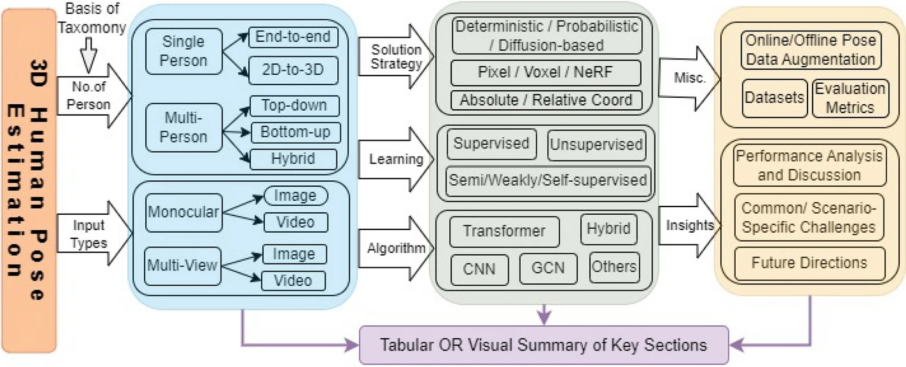
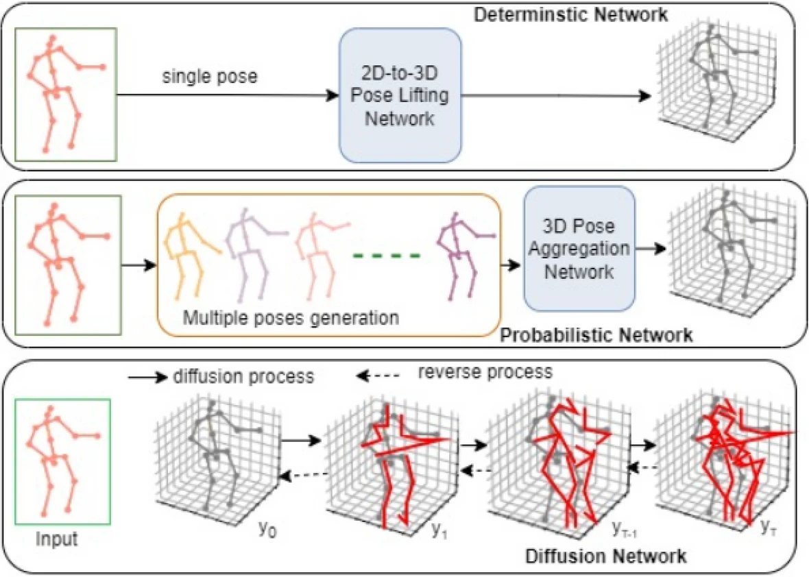
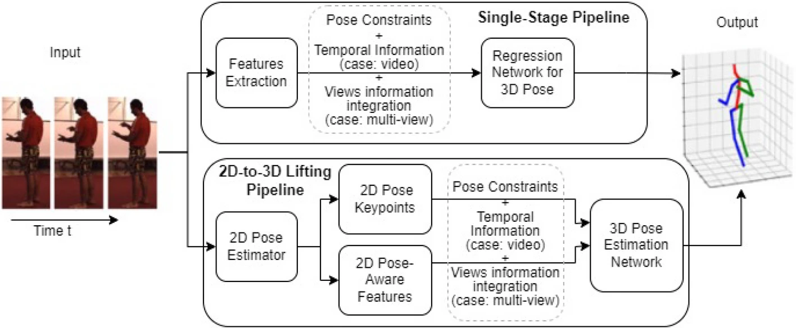
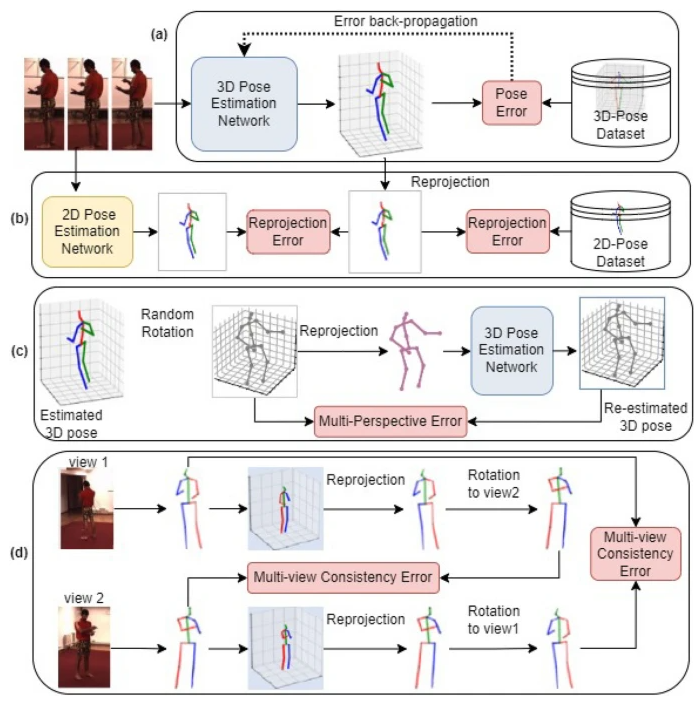

# A survey on deep 3D human pose estimation

---

- Human Pose Estimation
- Survey

---

paper: https://doi.org/10.1007/s10462-024-11019-3

---

목차

0. [Abstract](#abstract)
1. 

---

## Abstract

3D-HPE(3D Human Pose Estimation)
- 확장 현실(extended reality), 동작 인식, 비디오 감시와 같은 다양한 app을 통해 컴퓨터 비전 분야에서 매우 활발하고 발전하는 연구 영역
- 딥러닝, 공개 데이터셋 및 향상된 컴퓨팅을 통해 크게 발전  
-> 깊이 모호성, 가려짐 및 데이터 부족과 같은 문제를 해결
- 단안(monocular) 설정의 잘못된 문제, multi-view 시스템에서 카메라 동기화를 통한 cross-view 집계(aggregation), multi-person 시나리오에서 개인 간 가려짐과 같은 문제에 직면

논문에서 정리한 내용
- Convolutional Neural Networks(CNN), Graph Convolutional Networks(GCN), Transformers 및 이러한 문제를 해결하는 데 사용한 방법을 종합적으로 검토
- 단안 및 다중 view 설정, single 및 multi person, 이미지 및 비디오 입력과 같은 시나리오 포함
- single-stage vs 2D-to-3D lifting, absolute vs relative keypoints, pixel vs voxel vs Neural Radiance Field spaces, 결정론적, 확률론적, Diffusion-based 전략, top-down vs bottom-up 접근 방법을 포함한 다양한 패러다임을 탐구
- 다양한 pose dataset에 대해 data augmentation과 지도 방법을 뛰어넘는 advanced learning 기법을 살펴본다.
- 과제는 공통 문제와 시나리오 별 이슈로 분류되며, 해당 분야에서 추가 발전을 촉진하기 위한 향후 연구 방향을 제안한다.

## 1. Introduction

3D-HPE
- 이미지 또는 비디오 프레임에서 인간 관절의 3D 좌표 예측
- 사람이 있는 3D 장면을 2D 이미지에 투사하면 모든 관절의 위치 및 깊이 정보가 손실된다.
- 궁극적인 목표: 이미지에서 2D 위치와 카메라 좌표계 내의 깊이를 정확하게 결정하는 것
- 인간-컴퓨터 상호작용, 동작 인식, 확장 현실(XR), 자율 주행 차량, 비디오 감시, 게임, 의료 등 다양한 분야에서 응용 가능

장면에서 이미지와 개인을 캡처하는 센서의 수에 따라 다른 문제점 존재  
카메라 수에 따라 입력 데이터는 단안(단일 카메라) 또는 multi-view(다중 카메라)가 될 수 있다.

4 가지 시나리오
- 단안 이미지
- 단안 영상
- multi-view 이미지
- multi-view 영상

single-person 또는 multi-person 까지 포함하면 8가지 시나리오

각 시나리오는 고유 문제점과 공통 문제점을 제시한다.

공통 문제점:
- 깊이 모호성
- 가려짐(폐색)
- 부적절한 데이터
- 외관 변화(예: 의류 및 조명)
- 관절이 있는 인체의 복잡성

각 시나리오의 문제
- 단안 이미지: 깊이 모호성과 자체 폐색
- 단일 영상: 더 나은 포즈 추정을 위해 frame-to-frame 관계에서 시간적 정보를 추출하고 활용하는 방법이 필요
- multi-view: 삼각 측량 또는 이와 유사한 기술을 통해 자체 폐색 및 깊이 모호성을 처리하는 데 더 효과적. 하지만 카메라 캘리브레이션(보정)과 동기화가 필요하다.

intra-person occlusion 및 카메라 중심 좌표 요구 사항과 같은 multi-person 시나리오의 새로운 과제로 인해 single-person 방식으로 설계된 방법을 multi-person으로 직접 확장할 수 없다.
- 이를 해결하기 위해 Convolutional Neural Network(CNN), Graph Convolution Network(GCN), Transformer 및 이 조합과 같은 딥 러닝 아키텍처를 활용한 다양한 방법 개발
- online/offline 데이터 augmentation 기법과 supervision 이상의 학습 기법을 활용하여 데이터 부족 문제를 처리함으로써 모델이 natural 시나리오에 더 잘 적응하도록 함

### 1.1 이전 survey

### 1.2 연구의 범위

> **Figure 1. 인간 포즈 추정 survey의 분류학적 풍경**

## 2. 3D-HPE 문제 해결 전략

### 2.1 문제 해결 단계

3D-HPE 방법 분류
- single-stage or end-to-end
- two-stage or 2D to 3D lifting paradigms

End-to-End learning 학습 접근 방식
- 이미지에서 3D 포즈를 직접 추정하는 것을 목표로 함
- coordinate regression, 이미지와 pose 간의 nearest neighbor matching 또는 pose class set 분류와 같은 방법을 사용

two-stage 접근 방식
- 2D pose-aware features 또는 직접 2D 사람 포즈를 3D 좌표를 추정하기 위한 중간 입력으로 활용

Stack Hourglass, Cascaded Pyramid Network(CPN), High-Resolution Network(HRNet)과 같은 최첨단 2D-HPE 네트워크를 적용하여 3D 인간 포즈를 복원

two-stage 전략은 소규모 3D 데이터셋에 대한 과적합 위험을 완화하고 MPII 및 COCO와 같은 기존 2D 포즈 데이터셋을 활용할 수 있도록 함
texture과 의미론적 세부 정보(semantic details)와 같은 추가 이미지 정보는 2D 포즈에서 3D 포즈를 정확하게 예측하는 데 도움이 될 수 있다.

| 주요 용어 | 간략한 개념 |
|---|---|
| Convolutional Neural Networks(CNNs) | 주로 2D 이미지 또는 비디오 프레임에서 기능을 추출하여 신체 keypoint의 2D 위치를 예측하거나 깊이 맵을 추정한 다음 3D 포즈를 추론하는데 사용 |
| Data Augmentation | 회전, 뒤집기, 크기 조정 또는 keypoint 위치 변경과 같은 변환을 이미지에 적용하여 데이터셋의 크기와 다양성을 인위적으로 늘리는 작업을 포함. 모델의 일반화 기능을 향상시켜 포즈 추정 모델이 다양한 인간 포즈, 신체 모양 및 카메라 관점을 효과적으로 관리할 수 있도록 한다. |
| Diffusion Models | 무작위 noise를 점진적으로 정제하여 그럴듯한 human skeleton으로 변환하여 인간 포즈를 함성하는 생성 모델. 누락된 포즈 데이터를 예측하거나 다양한 포즈 샘플을 생성하는 것을 목표로 함 |
| Graph Convolutional Networks(GCNs) | 관절을 node, 뼈를 edge인 graph로 골격을 모델링하여 관절의 공간 구성이 어떻게 진화하는지 학습하는데 유용. 관절 관계를 학습하여 2D 포즈 keypoint에서 3D 포즈를 추론하는 데 특히 효과적 |
| Hybrid Approach | 3D-HPE에서 하이브리드 접근 방식은 다양한 방법(예: CNN, GCN 또는 Transformer)을 결합하여 신체 관절 간의 local 및 global 관계를 더 잘 포착. 하향식(Top-down) 및 상향식(Bottom-up) 접근 방식도 결합되어 multi-person 포즈 추정 성능을 향상시킴 |
| Neural Radiance Field(NeRF) | 2D 이미지에서 사실적인 3D 장면을 모델링하고 합성하는 neural rendering 기술. 3D 공간의 각 지점이 색상 및 밀도와 연관되는 volumetric scene 표현을 학습하여 작동. 3D-HPE에서 NERF는 2D 이미지셋에서 모양과 형상을 학습하여 인체의 volumetric scene을 3D로 표현하는 데 사용할 수 있다. |
| Transformer | 3D-HPE에서 Transformer은 신체 관절 간의 장기적인 종속성을 모델링할 수 있다. self-attention 메커니즘을 사용하여 비디오 프레임에서 관절이 공간적, 시간적으로 서로 어떻게 연관되어 있는지에 초점을 맞춘다. |
| Voxel | 3D-HPE에서 Voxel은 vilumetric pixels(voxels)라고 불리는 3D 단위  grid에서 인체 또는 신체 일부의 3D volume을 나타냄. 각 voxel에는 인체의 일부가 차지하고 있는지 여부에 대한 정보가 포함되어 있음. 색상이나 질감과 같은 외부 정보 전달 가능 |

> **표 1. 주요 용어 해설**

#### 2.1.1 Single-stage or End-to-end

- 단안 이미지에서 3D-HPE에 대한 값비싼 3D 포즈 주석 없이 공간 일관성을 보장하기 위해 multi-view 데이터를 활용할 것을 제안한다
- LCR-Net++ 및 UniPose+
    - 2D 및 3D 포즈 추정을 위한 end-to-end 방법을 제시
    - 깊이 회귀를 자세 추정 네트워크에 직접 통합
- Wang et al. (2021)
    - 다중 사람 3D 포즈 추정을 위한 Multi-view Pose Transformer 제안
    - 계층적 joint query embedding 체계 및 projective attention mechanism과 함께 직접 회귀 방법을 사용
    - 뛰어난 성능과 속도에도 불구하고 데이터 부족과 다양한 카메라 설정으로 어려움을 겪음
- Reddy et al. (2021)
    - TesseTrack으로 위의 문제 해결
    - common voxelized feature space에서 spatio-temporal formulation(시공간 공식)을 사용하여 3D 관절 재구성과 시공간 속 사람 연관성(association)을 동시에 처리하는
- Honari et al. (2023)
    - RGB 비디오에서 single-stage human pose estimation을 위해 대조적 자기 지도 학습(contrastive self-supervised learning)을 사용
- Luvizon et al. (2023)
    - coarse-to-fine 접근 방식을 사용하여 여러 척도에서 포즈를 추정하기 위해 확장 가능한 sequential pyramid network를 사용하는 확장성 문제를 다룬다.

**single-stage 패러다임의 장단점**

**장점**
- 2D-to-3D lifting 방법은 2D 포즈 추정 단계에서 실제 application에서 상당히 노이즈가 많은 경향이 있다.  
-> 후속 3D 포즈 추정 단계에 중요하고 돌이킬 수 없는 여향을 미칠 수 있다.

**단점**
- 3D 주석이 필요하므로 natural 환경에서 label이 지정된 대규모 데이터셋이 부족하여 포즈 추정기의 과적합 및 일반화가 제대로 이뤄지지 않을 수 있다.
- 중간 감독이 없기 때문에 배경 및 조명의 변화에 취약하고, 기능의 복잡성으로 단일 모델에 대한 학습 프로세스가 어렵다.
- 이미지에서 3D 사람 포즈로 직접 회귀하는 것은 매우 비선형적인 문제.  
-> 방대한 solution 검색 공간 및 최적이 아닌 솔루션의 가능성이 높다.

=> 2D Human pose를 3D로 lifting하는 방법이 two-stage methods 중에서 실행 가능한 방법으로 부상

#### 2.1.2 2D-to-3D lifting

3D 좌표 추정에 사용되는 중간 입력의 유형에 따라 3D 인체 포즈 추정을 위한 2단계 방법의 두 가지 종류
- 2D Pose-Aware Feature-Based lifting 방법
    - 감지한 2D pose에서 파생된 2D pose-aware features(heatmaps, part affinity fields, 기타 keypoints descriptors)를 활용
    - 2D pose에서 공간 및 context 정보를 캡처한 다음, 3D 좌표 추정에 사용
    - 몇몇 연구는 2D pose를 입력으로 사용하고 attention-based temporal convolutional neural network를 사용하여 3D pose를 추정
    - 정규화된 좌표계에서 2D-pixel 공간의 입력을 3D ray로 변환하여 카메라 고유 매개변수 및 피치 각도의 변화로 인한 변동을 완화
    - 일부 연구에서는 2D pose confidence score과 heatmap을 통합하여 3D pose를 추정
        - 신뢰도가 높은 joint를 사용하여 신뢰도가 낮고 불확실한 joint의 위치를 수정하여 전반적인 예측 정확도를 향상
    - Kim et al. (2024)은 2D pose에서 관절의 confidence level을 사용하여 의사(pseudo)-label을 생성
        - 2D 포즈의 신뢰도를 기반으로 각 관절에 대한 가중 평균을 계산하여 3D 의사(pseudo) GT를 생성하고, 자기 지도 학습에 사용

- 2D Pose-Based lifting 방법
    - 2D 공간에서 감지된 keypoint 또는 관절로 구성된 2D 인간 포즈를 중간 입력으로 직접 사용
    - 2D joint의 공간 구성으로 3D 위치를 추론하는데 활용
    - 2D joint 위치에서 3D 포즈를 재구성하는 것을 목표로 함
    - Xu et al. (2020)은 원근 투영(perspective projection)을 사용하여 2D pose를 미세 조정하고 운동학적 제약 조건을 적용하여 3D 포즈를 추정
    - Zhang et al. (2020)은 포즈와 시점을 포함한 포즈 기하학을 활용하여 2D 포즈를 3D 포즈로 들어올린다.
    - AdaFuse(Zhang et al. 2021)는 2D 포즈 방법을 사용하여 각 뷰에 대한 heatmap을 생성하고 3D 포즈를 추정하기 전에 epipolar 기하학을 사용하여 융합

**장점**
- 이미지에서 2D 사람 포즈를 추정하는 작업은 잘 해결된 문제
- 관절 위치를 명확하게 시각화하고 3D 포즈와 공간적으로 잘 정렬되어 충분한 GT 데이터가 주어지면 다양한 배경, 의상 및 색상과 같은 이미지 왜곡에 대해 견고
- 불확실성과 의미론적 손실을 크게 줄일 수 있다.
- 2D 포즈에 label을 지정하는 것이 3D 실측 자료를 캡처하는 것보다 쉽고 저렴하다  
-> in-the-wild 에서 사용할 수 있는 2D label이 많이 있다.
- 2D 인간 포즈 디텍터의 광범위한 가용성과 2D 스켈레톤 표현의 경량 특성으로 인해 3D 포즈 추정에서 lifting-based 방법이 널리 퍼졌다.

**단점**
- 2D에서 3D로의 pipeline에는 view의 수, 비디오 sequence 길이, 카메라 보정 사용 여부와 같은 여러 변수 요소가 포함된다.
- 2D-3D 접근 방식은 2D 모델로의 오류를 상속한다.
- 깊이를 동시에 추정하는 대신 두 번째 단계에서 깊이를 순차적으로 계산하여 계산 복잡성을 증가시킨다.

### 2.2 joint keypoint 좌표

기존 3D-HPE 방법은 root body joints 또는 카메라 좌표를 기준으로 3D 포즈를 예측

참조 좌표계를 기반으로, 사람 중심(person-centric)과 카메라 중심(camera-centric) 두 가지로 분류

일부 모델은 사람 중심 좌표와 카메라 중심 좌표 모두에서 keypoint를 추정하여 SOTA 기술과 훈련에 사용되는 dataset과 성능을 비교
- TesseTrack(Reddy et al. 2021)
    - Human3.6M 데이터셋에서 root-centered MPJPE 메트릭을 계산하고 CMU Panoptic 데이터셋에서 non-root-centered MPJPE를 계산
    - 한 사람에 대한 상대적인 신체 좌표에서 3D 포즈를 추정하는 것이 관련이 있다.
        - 단안 이미지에서 여러 사람에 대한 절대 좌표(absolute coordinate)가 필요
        - 전역 좌표는 multi camera views에서 multi-person 포즈 추정에 의미가 있다.

#### 2.2.1 Person-centric

- relative coordinates 또는 root-centric method라고도 함
- 골반과 같은 중심 신체 지점을 기준으로 keypoint에 대한 3D 좌표를 예측
    - 이러한 root 관절을 원점으로 하여 다른 관절을 이와 관련되어 추정
- 단안 이미지를 사용하여 single-person 포즈 추정에 유용
- 일부 연구는 person-centric 좌표에서 3D 포즈를 추정하기 위해 비디오 입력에 중점을 둔다.
- multiple people 또는 multiple view 상황에서는 적합하지 않다.
    - 사람의 위치를 잃고 배치할 위치를 모르기 때문에

#### 2.2.2 Camera-centric

- 카메라를 기준점으로 3D keypoint를 예측
- 카메라와 사람 사이의 거리는 사람의 크기와 keypoint를 정의
    - multi-view image 또는 video 입력과 관련된 multi-person 3D HPE에서 매우 중요
- 카메라에서 멀리 있는 사람은 키가 더 크더라도 카메라에 가까운 사람보다 키가 작아보임
- person-centric 좌표는 multi-view 설정에 대한 일반화를 제한
    - 한 카메라에서 예측된 상대적 pose를 다른 view에 쉽게 투영할 수 없어 multi-view 시나리오에서 가려짐 처리를 복잡하게 만들기 때문
- 정적 참조를 기준으로 추정이 이뤄지면 예측을 한 view에서 다른 view로 쉽게 투영할 수 있다.
- multiple camera scenarios의 경우, global 또는 world 좌표계에서 3D 포즈를 추정하는 것이 중요
- 절대(absolute) 3D 포즈를 추정하는 것은 real-world 응용 프로그램에서 root-relative 3D pose보다 더 유리하다.
    - 예: 무인 매장에서는 고객이 픽업한 상품을 감지하기 위해 world 좌표계의 정확한 손 위치 파악에 의존
    - 예: 증강 현실과 같은 응용 프로그램에서는 world 좌표계에서 사람의 위치를 재파악하기 위해 camera-centric 인체 keypoint가 필요하다.
- 몇몇 연구는 단안 이미지 또는 비디오 입력을 사용하여 카메라 좌표에서 인간 keypoint를 찾는다.
- 대부분의 multi-view 연구 작업은 세계 좌표를 기준으로 인간 keypoint를 추정하여 multiple view에서 조율할 수 있도록 한다.

### 2.3 Multi-person paradigms

> **Figure 2. Multi-person paradigms: top-down, bottom-up, and hybrid approaches**

3D multi-person pose estimation(3D-MPPE)에서 사용되는 문제 해결 패러다임의 분류

하향식(Top-down)
- bounding box를 사용하여 각 사람을 식별한 다음 keypoint를 감지
- 하향식 방법이 일반적으로 더 정확하다.

상향식(Bottom-up)
- 한 번에 모든 개인에 대한 heatmap을 생성한 다음 각 개인에게 keypoint를 할당
- 상향식 방법이 일반적으로 더 빠르다.

hybrid 접근 방식
- 하향식 방법과 상향식 방법을 통합하여 각각의 이점을 활용

일부 연구에서는 하향식 및 상향식 방법과 다른 two-stage 방법과 다른 single-stage 방법을 사용

#### 2.3.1 Top-down(하향식) paradigm

- 사람이 포함될 가능성이 있는 bounding box를 식별한 다음 각 개인에 대해 1인 HPE를 수행
- 포즈 추정에서 탁월한 정확도를 제공
- people detector의 정확도에 크게 의존
- 대부분이 가려진 개인을 감지하지 못하는 경우가 많다.
- 사람 수에 따라 계산 복잡성이 증가
    - 붐비는 장면에서 잘 확장되지 않아 성능이 느려지고 real-time processing에 적합하지 않다.
- Benzine et al. (2020)은 bounding box detection을 사용하여 이미지에 있는 사람 수에 의존하지 않는다.

#### 2.3.2 Bottom-up(상향식) paradigm

- 사람을 감지할 필요가 없다
- 여러 사람을 동시에 추정할 수 있다.
- 일반적으로, Heatmap을 생성한 다음 후처리 단계를 거쳐 관절 감지를 완전한 human skeletons로 조립하는 작업이 포함된다.
- Zhou et al. (2021, 2023)은 의미론적 및 기하학적 요소가 풍부한 인간 관절을 pixel embedding으로 회귀하여 관절 연결을 통해 세분화된 의미론(semantics)를 효율적으로 그룹화할 수 있는 instant-aware human body parsing을 위한 상향식 방법을 제안
- 몇몇 연구는 multi-person 3D-HPE에서 상향식 방법을 고수하고 하향식보다 효율적
- 하향식 방법과 달리 한 번의 pass로 여러 사람의 관절 위치를 생성하므로 상당한 가려짐 상태에서도 3D 포즈 추론이 가능하다.
- 대부분 상향식 방법은 모든 개인을 균일한 규모로 처리하므로 여러 사람간의 규모 변화에 민감하고 더 작은 개인의 관절을 감지하는 능력이 떨어진다.

#### 2.3.3 Hybrid/single-stage

- 하향식 방법
    - 장면 내 사람의 규모를 고려하는데 효과적
    - 가려짐으로 인해 감지 오류가 발생하기 쉽다
    - 붐비는 장면에서 사람 수가 증가함에 따라 더 많은 자원이 필요하다.
- 상향식 방법
    - 일반적으로 효율적
    - 현장의 사람 수에 의존하지 않음
    - 소규모 개인에게 오류를 범하는 경향이 있다.
- Cheng et al(2021, 2023)은 하향식 네트워크와 상향식 네트워크를 결합하여 두 가지 접근 방식을 모두 활용할 것을 제안
    - 하향식 네트워크는 이미지 패치에 있는 모든 개인의 관절을 추정
    - 상향식 네트워크는 정규화된 heatmap을 기반으로 human detection을 수행하여 크기 변화에 대한 모델의 강인함을 향상시킨다.
- 몇몇 연구자는 two-stage 하향식 또는 상향식 접근 방식을 사용하는 현재의 multi-person 방법은 실시간 처리 효율성이 충분하지 않은 문제에 직면해 있다고 주장
    - 중복 계산과 높은 계산 비용 때문
- Jin et al. (2022)는 "regression map을 이용한 multi-person 3D 인간 포즈 추정"을 위한 decoupled regression model을 이용한 single-stage solution을 제안
- Wang et al. (2022)는 신체 관절 추정을 재귀적으로 향상시키는 single-stage distribution-aware 방법을 제안

### 2.4 결정론적 vs 확률론적 vs 확산 기반

> **Figure 3. 결정론적, 확률론적, 확산 기반 접근 방식의 일반적인 흐름**

결정론적 접근 방식
- 각 이미지에 대해 하나의 명확한 3D 포즈를 생성하므로 실제 응용 프로그램에서 실용적

확률론적 접근 방식
- 2D에서 3D로의 변환을 확률 분포로 모델링
- 각 이미지에 대해 가능한 solution set을 생성하여 lifting process의 불확실성과 모호성을 수용
- 확률론적 접근 방식을 실용적으로 만들기 위해 집계 기술은 여러 가설을 하나의 고품질 3D-pose로 결합

확산 기반 접근 방식
- Gaussian noise와 같은 단순한 데이터 분포를 최종 3D 포즈를 나타내는 더 복잡한 분포로 점진적으로 변환하는 개념을 기반으로 함

#### 2.4.1 결정론적 접근 방식

- 대부분의 기존 3D-HPE 방식은 결정론적 접근 방식 사용
- 일관되고 직접적인 결과를 생성하여 다양한 응용 프로그램에 실용적
- 2D 관절에서 올바른 3D 포즈를 정확하게 재구성하는 것은 깊이의 모호성과 가려진 신체 부위로 인해 어렵다.
    - 결정론을 기반으로 하는 접근 방식은 단일 해결책이 존재한다고 가정하여 이러한 모호성을 간과하는 경우가 많다.  
    -> 만족스럽지 않은 결과가 나올 수 있다.

#### 2.4.2 확률론적 접근 방식

- 2D 검출기에서 포즈 추정의 불확실성을 모델링하는 것을 목표로 함
- Bertoni et al. (2019)는 라플라스 분포에서 파생된 손실 함수를 사용하여 신뢰 구간을 추정하여 localization의 모호성을 해결
- Rogez et al. (2020); Wehrbein et al. (2021)은 포즈 감지의 localization process에 대해 일련의 포즈 제안을 생성하기 위해 여러 3D 포즈 가설을 생성하는 확률 모델을 제안
- Han et al. (2022)는 확률을 사용하여 관절 위치의 불확실성을 모델링함으로써 노이즈 라벨링, 부정확한 사람 감지, 가려짐에서 비롯된 불확실성을 해결하기 위해 불확실성 학습(uncertainty leraning)을 제안
- Wandt et al. (2022)는 정규화 흐름을 사용하여 포즈의 사전 분포를 설정하여 무작위 투영에서 가장 가능성이 높은 up-to-scale 3D 포즈를 쉽게 식별할 수 있다.
- Bartol et al. (2022)는 각 관절에 대한 view의 무작위 하위 집합을 삼각 측량하여 여러 3D 포즈 가설을 생성하는 인간 포즈를 삼각 측량하는 방법을 제안.
- Lee et al. (2023)은 자세 entropy 기반 확률 모델을 활용
- Jiang et al. (2023)은 확률 분포를 활용하여 카메라 포즈를 표현
- MHCanonNet(Kim et al. 2024)는 여러 프레임에 걸쳐 특징의 시간적 상관 관계를 포착하면서 공간 영역 내에서 포즈 및 회전에 대한 여러 가설을 생성
- 동적 매개변수와 휴리스틱 function(예: joint 또는 motion 제약 조건)을 통합하여 개선할 수 있다.
    - Sun et al. (2024)는 고유 수용성 피드백을 확률 모델에 통합

#### 2.4.3 확산 기반(Diffusion-based) 접근 방식

- 초기 노이즈가 있는 포즈 추정치에서 시작해서 역방향 프로세스를 통해 반복적으로 개선
- Shan et al. (2023)은 기존 3D-HPE 방법과 호환되고 추론 중에 사용자 정의 가능한 수의 가설을 허용하는 확산 기반 방법을 제안
- Holmquist & Wandt (2023)은 3D joint 좌표를 나타내는 vector가 gaussian 분포로 점진적으로 변환됨에 따라 여러 가설을 예측하기 위한 조건부 diffusion model을 도입
- denoising 단계는 embedding transformer을 사용하는 2D joint 검출기에 의해 생성된 joint-wise heatmap에 의존
    - 이 embedding transformer은 각 joint에 대한 모든 샘플을 단일 벡터에 비선형으로 내장하여 multi-modality를 보존
- Cai et al. (2024)는 계층적 정보를 사용하여 순방향 확산 과정에서 포즈 priors를 명시적으로 모델링하기 위해 얽힘 해소(disentanglement) 접근 방식을 활용
    - reverse process로, 계층과 관련된 spatial transformer와 temporal transformer 두 가지로 구성된 denoiser을 사용

### 2.5 문제 해결 공간

#### 2.5.1 Pixel-based 접근 방식

- 대부분의 기존 방법이 사용
- 인간의 포즈와 관련된 이미지 특징을 추출하여 2D 공간에 표현하는 것으로 시작
- 후속 포즈 추정 작업이 이러한 2D feature map에서 수행
- 계산 효율성이 높지만 2D feature space에서 3D 좌표를 회귀하는 매우 비선형적인 프로세스로 인해 상당한 문제에 직면

#### 2.5.2 Voxel-based 접근 방식

- 3D 포즈 추정의 volumetric supervision은 3D 공간의 각 voxel에 대한 상세한 GT를 제공하여 보다 풍부한 정보를 제공
- 3D 좌표를 각 voxel에 대한 신뢰도 추정치를 예측하는 것으로 변환하여 직접 회귀
- multi-person 환경에서는 관절 좌표를 직접 회귀하는 것이 불가능  
-> volumetric heatmap은 상향식 multi-person 3D HPE를 위한 자연스러운 선택
- 몇몇 연구는 모든 카메라 뷰를 통합하여 multiple people from multiple camera views에서 3D 포즈를 추정하기 위한 voxel 기반 접근 방식을 제안
- 합쳐진 3D representation은 서로 다른 view에서 2D 포즈를 연결할 필요가 없다.  
-> 가려짐을 처리하는데 유용
- 정확도는 volumetric heatmap의 해상도에 따라 크게 달라지며, 정밀도(precision)는 각 voxel의 크기와 연결된다.
    - 고해상도 heatmap에는 상당한 메모리가 필요하므로 확장성 문제가 발생한다.
- 속도-정확도 trade-off가 있다.(정확하면 느리고, 부정확하면 빠르다.)

#### 2.5.3 NeRF-based 접근 방식

- NeRF는 여러 이미지의 장면을 합성하여 새로운 view를 생성
- A-NeRF 및 Neural Body와 같은 일부 최근 연구는 NeRF를 사용하여 관절이 있는 인체의 표현을 구체적으로 다룬다.
- A-NeRF
    - 관절 골격 모델과 음함수를 통합하여 2D 이미지에서 3D 표현을 생성
    - 표준 3D 포즈 추정기를 사용하여 관절 신체 pose를 초기화하고 공간 잠재 변수(spatial latent variables)를 활용
- Neural Body
    - latent code를 사용하여 local features와 모양을 인코딩하여 희박한 multi-view video에서 움직이는 사람에 대한 새로운 관점을 생성하는 데 중점을 둔다.
    - latent code는 인체 역학을 캡처하는 SMPL(Loper et al. 2015) 모델의 꼭짓점과 연결된다.
- Peng et al. (2023)
    - implicit surface model을 통합하여 기하학 추출을 개선하고 학습 중에 학습된 기하학을 제한
- Gholami et al. (2024)
    - 다양한 3D 인간 포즈 데이터를 생성하기 위해 A-NeRF를 통합한 NeRF 기반 데이터 증강 방법을 제안
- 많은 방법들이 일반적으로 3D 포즈 정보를 암시적으로 표함하는 SMPL과 같은 무거운 paremetric 모델 또는 off-the-shelf 3D pose estimator에 의존
- 현재로서는 NeRF를 이용한 3D 인체 포즈 추정을 구체적으로 표적으로 하는 널리 알려진 방법은 없다.

### 2.6 새로운 기술 및 요구 사항

- LLM
    - 언어 모델의 의미론적 이해를 기하학적 추론과 통합하여 3D-HPE를 개선할 수 있는 가능성이 있다.
    - 잠재적으로 보다 강력하고 정확한 포즈 추정 시스템으로 이어질 수 있다.
- 실시간 3D-HPE
    - Choi et al. (2021), Liu et al. (2020)은 실시간 3D-HPE를 달성할 수 있다는 제안을 제시
    - 핵심 과제: 효율적이고, 정확하며 낮은 메모리 및 처리 능력과 같은 제한된 컴퓨팅 리소스를 가진 장치에서 실행할 수 있는 모델 설계
    - 휴대용 장치에서 AR/VR 경험, 피트니스 추적, 인간-컴퓨터 상호 작용과 같은 실시간 application을 가능하게 할 것
- 인간과 역동적인 3D 장면 간의 상호 작용을 탐색하는 것이 중요
    - 인간이 환경과 상호 작용하는 방식을 이해하는 것이 포함된다.
    - 일부 연구는 다양한 센서를 사용하여 인간-장면 상호 작용을 탐색
        - 동적인 환경에서 이러한 방법을 발전시키기 위한 추가 연구 필요
    - Zhou et al. (2024)는 인간 활동 인식을 위해 여러 센서를 사용하여 feature selection process에 센서 데이터를 통합

## 3. Single-person 3D-HPE 방법

> **Figure 4. single-person 3D-HPE pipeline(Single-stage와 2D-to-3D lifting)**

### 3.1 단안 이미지의 3D-HPE

- 카메라 매개변수를 보정할 필요가 없다.
- 깊이 모호성(depth ambiguity), 가려짐으로 인해 까다롭기 때문에 효과적인 일반화를 위해 대량의 in-the-wild 데이터셋이 필요하다.
- 깊이 모호성은 신체 관절 keypoint의 깊이(카메라로부터의 거리)를 정확하게 결정하기 어려운 것으로 정의할 수 있다.
- 가려짐은 팔이나 다리와 같은 신체 부위가 신체의 다른 부분이나 외부 물체에 의해 시야가 가려져 전체 포즈를 추정하기 어려운 상황을 의미한다.
- method는 가려짐에 강해야 하며 보이는 joint를 기반으로 숨겨진 신체의 joint를 추론해야 한다.

#### 3.1.1 CNN 기반 방법

- 여러 연구에서 광범위한 3D pose annotation의 필요성을 해결하기 위해 end-to-end 접근 방식을 도입하여 일반화를 개선하고 깊이 모호성과 가려짐과 같은 문제를 효과적으로 해결하고자 함

    - Umar et al. (2020)

        .png)

        - 2D 포즈 주석이 달린 이미지를 활용하여 모델을 훈련하고 heatmap loss와 multi-view consistency loss를 통합

    - Mitra et al. (2020)

        .png)

        - multiple-views에서 동기화된 비디오를 사용하여 pose embedding을 학습하고, 제한된 3D 포즈 label set을 사용하여 유사한 pose가 임베딩 공간에서 밀접하게 매핑되도록 한다.

    - Kundu et al. (2020b)

        .png)
    
        - 라벨링되지 않은 단안 비디오 샘플을 활용하고 계층적 limb(수족, 사지) 연결성을 통합하는 kinematic structure preservation pipeline(운동학적 구조 보존 파이프라인)을 설계

    - Luvizon et al. (2023)

        .png)

        - 여러 scale에서 pose를 회귀하고 3D 포즈 regression에 사용되는 heatmap 및 depth maps를 생성하여 확장성 문제를 해결하기 위해 확장 가능한 Sequential Pyramid Network를 제안

- 일부 연구에서는 깊이 모호성, 가려짐을 처리하기 위해 다양한 신체 부위 기하학을 활용

    - Fang et al. (2018), Xu et al. (2022)

        .png)

        .png)
    
        - 운동학(kinematics), 대칭(symmetry) 및 motor coordination과 같은 포즈 문법을 활용하는 방법을 제시
        - 종속성 문법 내에서 양방향 관계를 효율적으로 캡처하는 bi-directional RNNs의 계층 구조를 특징으로 한다.

    - Liu et al. (2020)

        .png)
    
        - graphical convolutional Long Short-Term Memory(LSTM)을 사용하여 다양한 신체 부위 간의 관계를 활용

    - Kundu et al. (2020a)

        .png)
    
        - 차별화 가능한 part-based representation을 소개
        - 단일 part-based 2D puppet 모델, 인간 포즈 관절에 대한 제약 조건 및 페어링되지 않은 3D 포즈 컬렉션을 포함

    - WU and Xiao (2020)

        .png)

        - 팔다리가 단단한 구조라고 가정하고 팔다리를 따라 깊이 갚을 조밀하게 보간하여 만든 인간 괄절의 깊이 값과 팔다리 depth map을 사용

- 데이터 부족, 일반화 및 가려짐 문제를 해결하기 위해 다양한 학습 및 최적화 전략을 도입
    - Li et al. (2020b)

        .png)

        - 기하학적 원리를 활용하여 multi-view frames에서 supervision 신호를 생성하는 self-supervised learning 접근 방식을 제시
        - self-occlusion으로 인한 noise의 영향을 처리하기 위해 네트워크는 2D joints의 confidence level을 통합

    - Wandt et al. (2021)

        .png)

        - 보정되지 않은 카메라의 multi-view self-suervision을 사용하여 단안 3D-HPE를 학습하도록 CanonPose를 설계
        - 한 시점에서의 2D 감지가 표준 포즈 공간을 통해 다른 시점에 투영될 수 있도록 함

    - Zhang et al. (2020)

        .png)

        - 추론 단계에서 label이 지정되지 않은 대상 이미지에 대해 self-supervised learning을 수행하여 모델 일반화를 향상시키는 추론 단계 최적화 방법을 소개

    - Kundu et al. (2022)

        .png)

        - model-free joint localization과 model-based parametric regression 네트워크를 결합
        - 배경 및 시뮬레이션 된 synthetic joint-level 가려짐을 포함한 negative samples를 통합하여 제안된 포즈를 향상하고 joint 불확실성을 감소시킨다.

    - Gao et al. (2023)

        .png)

        - CNN 기반 신체 포즈 추정 하위 네트워크를 활용하여 손 관절 좌표를 예측하여 네트워크의 전반적인 성능을 크게 향상시킨다.

#### 3.1.2 GCN 기반 방법법

- Graph Convolutional Network(GCN)은 감지된 2D 키포인트를 그래프 구조로 나타낼 수 있어 신체 관절 간의 관계를 효과적으로 캡처하고 처리할 수 있기 때문에 2단계 방법으로 사용
- Body joints 관계 및 팔다리 길이 제약 조건은 깊이 모호성 및 가려짐을 처리하는 데 사용
- Ma et al. (2021)
    - 그래프 신경망 내에서 팔다리 길이 제약을 부과하는 pictorial structure model을 통합하는 ContextPose를 제안
- Xu와 Takano (2021)
    - 인간 골격에 대한 prior knowledge와 multi-scale 및 multi-level features를 통합하여 Graph Stacked Hourglass Network를 제안
- Xu et al. (2021)
    - 교사-학생 접근 방식을 사용하는 방법 제안
    - 교사 네트워크는 pose-dictionary-based 정규화를 사용하고 학생 네트워크는 GCN을 사용하여 기하학 일관성을 활용하여 3D 좌표를 추정
- Zou and Tang (2021)
    - 가중치 변조 GCN을 도입하여 서로 다른 노드의 특징 변환을 분리하고 신체 관절 간의 다양한 관계 패턴을 학습
- Ci et al. (2022)
    - laplacian 연산자를 사전 정의된 structure matrix와 learnable weight matrix의 곱으로 분해하여 graph node간의 종속성을 캡처
- Azizi et al. (2022)
    - 그래프 laplacian의 고유값 행렬에서 Möbius transformation을 활용하여 inter-segmental 각도와 joint translations를 통해 포즈를 명시적으로 인코딩하는 스펙트럼 GCN 아키텍처를 제시
- Zhang et al. (2023)
    - human graph의 공간적으로 정확한 표현과 multi-hop 노드의 의미론적 상관 관계를 유지하면서 골격 관절의 상관 관계를 학습하기 위해 Parallel Hop-Aware Graph Attention Network를 제안

#### 3.1.3 Transformer 기반 방법

- 일부 연구에서는 인간 골격의 구조를 활용하기 위해 pose-specific self-attention 메커니즘을 사용할 것을 제안
- Li et al. (2023a)

    .png)

    - 관절 쌍 사이의 상대적 거리를 계산하고 이 정보를 self-attention process 내에서 attention bias로 인코딩하는 Transformer 아키텍처의 pose-oriented adaptation을 제안
    - 이 메커니즘은 인간 골격 내에서 종속성을 캡처하는 능력을 향상시킨다.

- Zhou et al. (2024a)

    .png)

    - 네트워크의 다양한 이미지 패치에서 가치 있는 features를 선택하여 이미지 정보를 활용할 것을 제안

#### 3.1.4 Hybrid/기타 방법

- GCN + Transformer
    - Zhao et al. (2022)
        - GraAttention 및 ChebGConv 구성 요소로 구성된 GraFormer을 제안
        - GraNote는 모든 노드에서 global 정보를 캡처하기 위해 multi-head attention에 따라 MLP 대신 graph convolution layer을 통합
        - ChebGConv 블록은 인접하지 않은 노드 간의 정보 교환을 용이하게 하여 더 넗은 수용 영역(receptive field)을 달성
    - Chen et al. (2024)
        - Transformer Encoder(TE), immobile GCN, dynamic GCN으로 구성된 dynamic graph transformer을 제안
        - TE 모듈은 self-attention 메커니즘을 활용하여 skeleton joints 간의 복잡한 global 관계를 이해
        - immobile GCN은 다양한 동작 포즈를 기반으로 희소 dynamic K-nearest neighbor 상호 작용을 학습하는 데 전념  
        -> 관절의 pose-dependent 상관 관계를 효과적으로 해결

- 다른 방법
    - Li & Pun (2023)
        - 공동 훈련을 통해 GAN 기반 포즈 생성과 MLP 기반 추정 네트워크를 결합
        - GAN 기반 네트워크는 생성된 포즈의 다양성과 joint-angle loss를 증가시켜 포즈가 합리적인 한계 내에서 유지되도록 함
        - 포즈 추정을 위해 MLP 기반 신체 부위 그룹화 전략을 제안
    - Chai et al. (2023)
        - 3D 인간 포즈 도메인 적응 문제를 해결하기 위해 GAN을 기반으로 하는 비지도 방법을 제안
        - 전역 위치 정렬은 기하학적 제약 조건을 통해 달성
        - local root-relative 포즈는 3D 포즈에서 로컬 구조의 다양성을 높이기 위해 증강(augmented)된다.
    - Nie et al. (2023)
        - 회귀에서 domain adaptation을 통해 2D-3D 모호성을 해결하여 3D 인체 모델을 학습하는 AutoEncoder(AE) 기반 방법을 소개
    - Kang et al. (2023)
        - Semantic Grid Transformation을 사용하여 포즈 표현을 그래프 구조에서 weave-like Grid 포즈로 변환하여 GridConv라는 convolution 연산의 개선 사항을 제안
        - attention module은 convolutional kernel에 통합되어 context 정보를 인코딩하는 GridConv의 기능을 향상시킴

### 3.2 단안 비디오에서 3D-HPE

- RGB 카메라는 저렴하고 배포가 용이
- 감시 시스템과 같은 다양한 응용 분야에 중요하다.
- 시간 정보를 활용하여 깊이 모호성 및 가려짐 문제를 해결할 수 있다.
- 인간 역학의 고차원 변동성 및 비선형성, 모션 블러 및 훈련 데이터에 대한 이동 속도의 변화와 같은 문제를 포함한 어려움에 직면

#### 3.2.1 CNN 기반 방법

- 많은 연구에서 시간 정보를 활용하여 깊이 모호성 및 다른 문제를 해결
- Artacho and Savakis (2022)

    .png)

    - UniPose+ 제안
    - 시간 정보에 선형 sequential LSTM을 활용하는 end-to-end 통합 프레임워크

- Pavllo et al. (2019)

    %20fig2.png)

    - dilated temporal convolutions를 사용하여 장기적인 종속성(long-term dependencies)를 캡처하여 깊이 모호성을 해결하기 위해 여러 프레임을 동시에 처리할 수 있다.

- Wang et al. (2020)

    .png)

    - 시간적 종속성을 캡처하기 위해 CNN 및 LSTM을 사용하여 이미지와 공간 context 모두에 대한 feature representations를 학습하는 방법 제안

- Liu et al. (2020b)

    .png)

    - Tenporal Convolutional Network(TCN)을 통해 temporal context를 활용하기 위한 attention mechanism을 통합

- Xu et al. (2020)

    .png)

    - 원근 투영의 제약 조건을 준수하여 노이즈가 있는 2D 입력을 개선하고 trajectory completion을 통해 3D 포즈 미세 조정(refinement)를 달성  
    -> 운동학 분석을 심층 모델에 통합하여 인간에 대한 사전 지식을 활용

- Cheng et al. (2020)

    .png)

    - 다양한 거리와 속도의 사람들을 다루기 위해 공간적, 시간적으로 multi-scale features를 제안

- Liu et al. (2021)

    .png)

    - attention-based model과 dilated convolution의 multi-scale 구조를 활용하여 네트워크 layer을 늘리지 않고 큰 temporal receptive fields 내에서 암시적 종속성(implicit dependencies)를 학습

- Cho et al. (2021)

    .png)

    - 모델에 구애받지 않는 meta-learning을 활용하여 단안 비디오에서 카메라 왜곡 시나리오에 적응하는 방법을 제안

- Lee et al. (2023)

    - 자세 엔트로피를 최소화하기 위해 시공간(spatio-temporal) 자세 상관관계를 사용하여 관절 상호 의존성, 시간적 일관성, 인간 인식(human perception)을 다루는 Temporal Propagating LSTM Network를 제안

#### 3.2.2 GCN 기반 방법

- 여러 인접 노드의 공간 및 시간 표현을 활용하여 키포인트에 대한 더 풍부한 정보를 얻는다.
- Zeng et al. (2021)
    - dynamic hop-aware hierarchical channel-squeezing fusion layer 제안
    - 인접 노드에서 관련 정보를 추출하고 원치 않는 노이즈를 최소화하여 노드 feature을 업데이트하는 dynamic hop-aware hierarchical channel-squeezing fusion layer 제안
- Yu et al. (2023)
    - GT 2D 포즈 데이터를 활용하는 GCN 기반 모델 내에서 global spatio-temporal 표현과 local joint 표현을 모두 활용하는 global-local 학습 아키텍처를 제안

#### 3.2.3 Transformer 기반 방법

- self-attention 메커니즘을 사용하면 확장된 입력 sequence 간에 전역 상관관계를 명확하게 캡처할 수 있다.

- 많은 방법이 사용하는 방법 (Zheng et al. (2021), Li et al. (2022), Zhao et al. (2023b), Kim et al. (2024))

    .png)

    .png)

    .png)

    - spatial transformers를 활용하여 각 프레임 내 2D joint간의 국소적인 관계를 spatial self-attention layers를 통해 포착
    - 2D joint와 temporal transformer 모듈의 위치 정보를 고려하여 서로 다른 프레임에 걸친 spatial feature representations 간의 전역 종속성을 조사

- Zhang et al. (2022)

    .png)

    - MixSTE(Mixed Spatio-Temporal Encoder)
        - 각 관절의 시간 움직임을 개별적으로 모델링
    - 관절 간 inter-joint spatial correlations를 포착하기 위한 공간 변환기를 소개
    - 입력 비디오의 전체 프레임을 처리하여 입력 및 출력 sequence 간의 일관성을 향상

- Tang et al. (2023)

    .png)

    - 공간 및 시간 정보를 병렬로 모델링하는 Spatio-temporal Criss-Cross Attention(STC) 메커니즘 소개

- Zhou et al. (2024b)
    - 느리고 빠른 분기가 있는 병렬 인코딩 단계와 더 낮은/높은 rate motion을 처리하기 위한 blending 단계를 포함하는 SlowFastFormer을 제안

- Cai et al. (2024a)

    .png)

    - forward diffusion 과정에서 disentanglement(얽힘 제거) 전략을 사용하는 확산 기반 방법을 제안
    - 계층적 정보를 활용하여 pose priors를 명시적으로 모델링
    - 계층-관련 공간 transformer와 temporal transformer로 구성된 denoiser
        - 역확산 과정에서 인접 joint의 attention weight를 증가시켜 계층적 joint간의 연결을 강화

#### 3.2.4 Hybrid 방법

- GCN + Transformer
    - Zhu et al. (2021)

### 3.3 Multi-view 이미지에서 3D-HPE

- world 좌표계에서 신체 관절의 절대적 3D 위치를 결정하기 위해 다중 카메라 사용
- 깊이 정보와 가려진 부분을 효과적으로 복원할 수 있다.
- 여러 view의 정보를 집계하기 위해 동기화되고 보정된 카메라가 필요

#### 3.3.1 CNN 기반 방법

- Remelli et al. (2020)
    - 카메라 포즈에서 분리된 canonical frame에서 feature map을 얻기 위한 경량 아키텍처 제안
    - 학습된 카메라 독립적인 3D 포즈 표현에서 2D joint 위치를 예측하고 미분 가능한 삼각 측량의 효율적인 공식화를 통해  2D 포즈를 3D로 lift
- AdaFuse(Zhang et al. 2021)
    - 에피폴라 기하학 및 카메라 매개변수를 사용하여 각 view의 히트맵을 융합하여 해당 지점을 찾고 SoftMax 연산자를 적용하여 노이즈를 줄인다.
- Luvizon et al. (2022)
    - 절대 좌표에서 3D 인간 포즈를 예측
    - 절대 깊이 예측과 상대 관절 깊이 추정을 분리하여 view frustum 공간 포즈 추정을 활용
- Wan et al. (2023)
    - source view에서 감지된 keypoint를 활용하여 pseudo heatmap을 생성하는 Multi-View Fusion 모듈 제안
    - feature 매칭을 통해 참조 view에 국한된 keypoint의 확률 분포를 나타냄
    - Holistic Triangulation(전체론적 삼각 측량)은 해부학적 사전 정보를 통합하여 포즈 일관성과 타당성을 유지하여 전체 포즈를 통일된 개체로 추론
- Jiang et al. (2023)
    - 여러 보기에서 보정되지 않은 3D 인간 포즈를 추정하기 위한 확률적 삼각 측량 모듈을 소개
- Usman et al. (2022)
    - 훈련 또는 추론 중에 3D 관절 주석이나 카메라 매개변수가 없는 Metapose를 제안
    - 간단한 view-equivariant neural network를 사용하여 단일 view 모듈의 출력을 융합하여 여러 view의 포즈 예측과 불확실성 추정치를 결합

#### 3.4 Multi-view 비디오에서 3D-HPE

- multi-view 비디오를 사용하여 한 사람의 3D 포즈를 추정하면 깊이 모호성, 가려짐과 같은 문제를 효율적으로 해결할 수 있다.
- 하지만 상당한 계산 능력과 값비싼 setup이 필요하여 연구가 상대적으로 적고, 실시간 처리에 적합하지 않다.

- Shuai et al. (2023)
    - 카메라 보정 없이 다양한 multi-view sequence를 처리하기 위한 Multi-view Fusion Transformer 제안
    - View 간 관계를 relative-attention block에 통합하고 여러 view에서 feature을 재구성
    - multi-view fusion 및 temporal fusion transformer 내에서 random mask 메커니즘을 사용하여 view의 수와 비디오 길이의 변동에 대한 견고성을 향상시킨다.
- Cai et al. (2024)
    - 카메라 매개변수에 의존하지 않고 unified scheme 내에서 multi-view 및 multi-frame feature을 융합하는 FusionFormer을 제안
    - 2D 포즈 추정 결과를 pose feature로 인코딩한 다음 transformer encoder을 사용하여 multi-view 및 multi-frame features를 global feature로 공동으로 병합
- Zhang et al. (2024)
    - Deep semantic graph transfer을 기반으로 한 multi-view 3D human pose 추정 방법을 제안
    - deep semantic features와 그 관계를 동적으로 학습하여 모든 인간의 관절 위치, 공간 구조, skeletal edges를 통합
    - 여러 viewpoints에서 중요한 공간-시간 정보를 점진적으로 융합함으로써 프레임간의 장기적인 종속성을 효과적으로 모델링

## 5. Learning techniques

딥러닝 방법은 모델의 견고성과 일반화 가능성을 보장하기 위해 상당한 양의 데이터를 필요로 함

3D-HPE에 대한 현재의 접근 방식은 대부분 fully supervised paradigm을 따른다.  
-> GT 3D 데이터 입력을 필요로 한다.  

- 3D 포즈 데이터를 얻는 것은 비용과 시간이 많이 소요된다.
- 종종 multi-view setup이나 motion capture system이 필요하다.

-> 제어되지 않는 시나리오에서는 실용적이지 않다.

in-the-wild 3D pose data의 부족을 해결하기 위해 weakly-/semi-/self-supervised와 같은 여러 학습 기법이 사용되었다.

> **Figure 6. 학습 기법 요약**  
> a: supervised learning  
> b-d: self-supervised learning with various strategies

### 5.1 Supervised learning

labeled dataset을 사용하여 모델을 학습

주어진 데이터셋에 대해 높은 서능을 발휘하지만, label이 지정된 in-the-wild 3D pose 데이터셋의 가용성이 제한되어 있다.
-> 제어되지 않는 환경에서는 일반화할 수 없다.

### 5.2 Semi-supervised learning

- label이 지정된 데이터와 label이 지정되지 않은 데이터를 활용하여 학습 성능을 향상시키는 것을 목표로 함

- Pavllo et al. (2019)

    %20fig3.png)

    - cycle consistency에서 영감을 얻어 unlabeled video 데이터를 활용
    - 표준 2D keypoints detector을 사용하여 label이 지정되지 않은 비디오의 2D keypoint를 예측하고, 이러한 keypoint에서 3D 포즈를 추정. 추정된 3D 포즈를 다시 2D 공간에 매핑
- Cheng et al. (2020)

    .png)

    - 2D 비디오 데이터를 통합

- Mitra et al. (2020)

    .png)

    - 단일 이미지에서 3D 인간 포즈 추정을 위해 2D 포즈 label의 필요성을 제거하는 multi-view 일관된 metric-learning 기반 semi-supervised learning 접근 방식을 소개
    - 제한된 3D supervision을 통합하여 네트워크 내에서 포즈별 특징의 학습을 촉진

- Cheng et al. (2021b, 2023)

    .png)

    .png)

    - 재투영 오류 및 다중 관점을 통합한 semi-supervised learning을 통해 네트워크 성능을 향상시키는 것을 목표로 함
    - 재투영 오류: 생성된 3D 포즈 투영과 감지된 2D 포즈의 투영 간의 차이를 측정
    - 다중 관점 오류: 다양한 시야 각도에서 예측된 3D 포즈의 일관성을 평가

- Nie et al. (2023)

    .png)

    - multi-view 또는 시간적 일관성과 같은 추가 정보 없이 통합된 방식으로 supervised 및 semi-supervised 모드를 통합하는 domain 적응에 기반한 학습 아키텍처 제시
    - 풍부한 2D 포즈를 활용하여 3D 포즈 추정의 정확도를 향상시킴

### 5.3 Weakly-supervised learning

- 불완전하게 label이 지정된 데이터로 작업하는 것을 포함
- label에 noise가 있거나 불완전하거나 부정확할 수 있다.
- label의 결함에 강한 모델을 개발하여 품질이 낮은 라벨 문제를 해결

- Umar et al. (2020)

    .png)

    - label이 지정되지 않은 multi-view 이미지와 2D 포즈로 주석이 달린 독립적인 이미지 컬렉션을 활용
    - 3D supervision은 multi-view 일관성 loss를 통해 파생되며, multi-view 이미지에서 얻은 3D 포즈가 엄격한 변형에서도 일관되게 유지되도록 함

- Chen et al. (2021)

    .png)

    - 보정되지 않은 카메라와 multi-view 2D 인간 포즈를 사용하여 단안 이미지에서 3D 포즈를 추정하기 위한 Deductive Weakly-Supervised Learning(DWSL)을 제안
    - DWSL: 3D 포즈 재구성을 위해 깅이 및 카메라 포즈의 잠재 표현을 학습하고 연역적 추론을 통합하여 다양한 뷰에서 사람의 포즈를 추론
    - 재구성 손실을 사용하여 모델이 학습하고 추론하는 내용의 신뢰성을 보장

- Qiu et al. (2023)

    .png)

    - 3D 주석이 없는 단안 이미지에서 약한 3D 정보를 추출하는 Weakly-Supervised Pre-Training(WSP) 방법을 소개
    - 처음에 2D 포즈 데이터셋에 대해 사전 훈련된 다음 3D 포즈 데이터셋에서 fine-tuning된다.

### 5.4 Unsupervised learning

- 데이터 내에 숨겨진 패턴을 발견하는 것이 목표
- label이 없는 데이터셋에서 모델을 훈련하는 것을 포함

- Kundu et al. (2020b)

    .png)

    - 운동학적 제약 조건을 사용하여 label이 지정되지 않은 in-the-wild 단안 비디오의 단안 이미지에서 3D 포즈를 추정할 것을 제안

- Xu & Takano (2021)

    (이 논문이 내용과 맞는지 모르겠음 확인 필요)

    - 2D 포즈에서 3D-HPE를 위한 unsupervised teacher-student 네트워크를 제안
    - teacher network는 주기 일관성 있는 아키텍처를 활용하여 서로 다른 view의 2D 포즈를 동일한 3D 포즈에 정렬하여 회전 불변성을 보장
    - student network는 cycle-consistent 아키텍처를 따라 회전 등분산을 사용하여 input view에서 포즈 추정 일관성을 보장하고 기하학적 self-supervision을 통해 훈련을 향상
- Yu et al. (2021)

    .png)

    - 단안 비디오에서 3D 포즈 추정을 위한 unsupervised learning에서 scale 모호성 및 포즈 모호성을 해결하는 방법을 제안
    - 생성된 3D 포즈의 무작위 투영은 lifting network, inverse transformation과 re-projection process를 거친다.  
    -> 네트워크는 시간적 기하학적 일관성을 활용하여 훈련 과정을 self-supervise할 수 있다.

- Wandt et al. (2022)

    .png)

    - ElePose 제안
        - lifting network와 병렬로 카메라 고도를 예측하여 2D 주석만 사용하여 단안 이미지에서 3D 포즈를 추정
        - 3D 포즈는 무작위로 회전하고 2D로 다시 투영되어 2D 손실을 계산

- Honari et al. (2023)

    .png)

    - 주어진 샘플과 양성 표본 간의 유사성을 최대화하면서 음의 표본과의 유사성을 최소화하는 Contrastive Self-Supervised(CSS) learning의 개념을 탐구
    - 각 잠재 벡터를 time-variant component와 time-invariant component로 분리
    - contrastive loss를 time-variant component에만 적용

- Chai et al. (2023)

    .png)

    - 소스 데이터셋 역할을 하는 대규모 3D 주석이 달린 인간 포즈 데이터셋과 함께 target dataset에서 non-sequence 2D 포즈 및 카메라 내장 매개변수가 필요한 unsupervised domain 적응 프레임워크를 제안

### 5.5 Self-supervised learning

- Wang et al. (2020)

    .png)

    - 2D 포즈를 3D 포즈로 변환하고, 3D 포즈를 다시 2D로 투영하여 기하학적 일관성을 보장하는 두 가지 보완 학습 작업을 포함하는 self-supervised correction mechanism을 도입

- Kundu et al. (2020a)

    .png)

    - 포즈가 다른 동일한 사람의 video frame 쌍, part-based 2D puppet model, human pose articulation 제약 조건 및 모델 학습을 위한 unpaired 3D pose를 사용할 것을 제안

- Li et al. (2020b)

    .png)

    - 훈련 과정에서 multi-view 이미지를 사용하여 기하학적 지식을 활용하여 supervision 신호를 구성하는 단안 이미지에서 3D 포즈를 추정하기 위한 self-supervised learning 방법을 제안

- Zhang et al. (2020)

    .png)

    - 모델의 추론 단계에서 self-supervised learning을 통합하는 방법을 소개

- Wandt et al. (2021)

    .png)

    - CanonPose
        - 보정되지 않았지만 시간적으로 동기화된 multi-view 카메라에서 작동
        - off-the-shelf 2D pose estimator을 사용하고 표준 회전으로 3D 포즈를 출력하므로 모든 카메라 설정에 투영할 수 있다.

- Gong et al. (2022)

    .png)

    - 2D-3D 포즈 쌍을 명시적으로 생성하여 full supervision을 가능하게 하고 self-learning 프로세스를 크게 향상시키는 접근 방식을 제안
    - pose estimator 및 pose generator과 함께 훈련되는 강화학습 기반 imitator을 통합

- Kundu et al. (2022)
    
    .png)

    - 단안 3D 인간 포즈 추정을 위해 labeled 합성 샘플과 불확실성 추정을 사용한 domain adaptation model을 제안

- Kim et al. (2024)

    - 보정되지 않은 카메라로 in-the-wild video의 여러 가설을 처리하는 monocular video에서 3D 포즈를 추정하기 위한 self-supervised training 접근 방식을 제안
    - 네트워크는 multi-view 데이터를 사용하여 훈련되며, 감독을 위해 multi-view 일관성을 활용