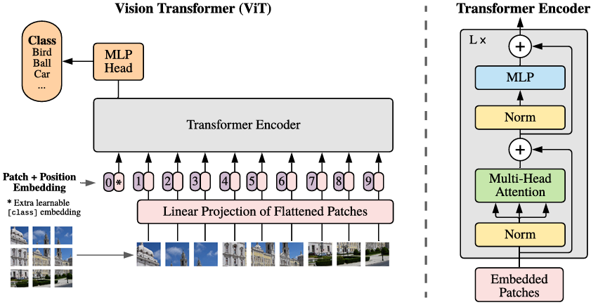
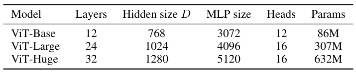
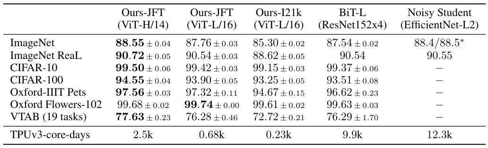
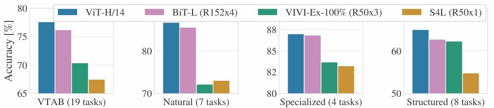
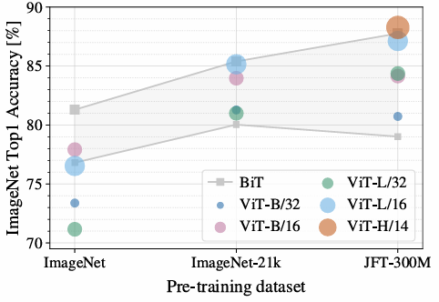
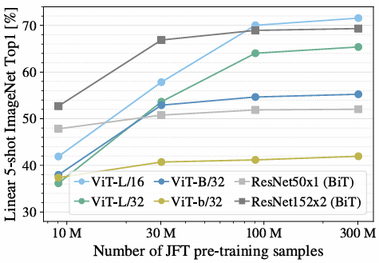
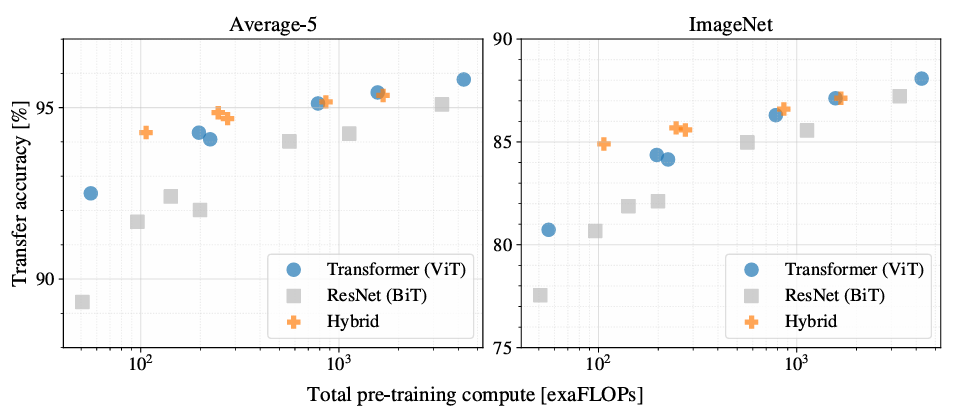
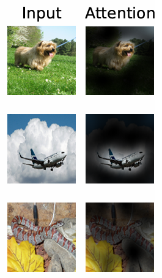
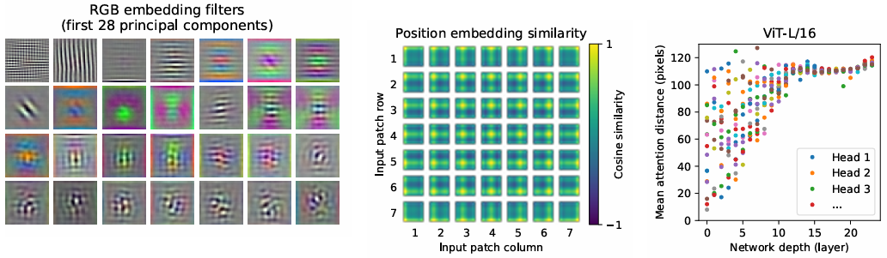

# An Image is Worth 16x16 Words: Transformers for Image Recognition at Scale

---

- Vision
- Transformer
- Classification

---

Alexey Dosovitskiy et al.  
arxiv. 2020.  
url: https://arxiv.org/abs/2010.11929

---

목차

0. [Abstract](#abstract)
1. [Introduction](#1-introduction)
2. [관련 연구](#2-관련-연구)
3. [방법](#3-방법)
4. [실험](#4-실험)
5. [결론](#5-결론)

---

## Abstract

Transformer 아키텍처
- 자연어 처리 작업을 위한 표준이 되었지만 컴퓨터 비전에는 제한적으로 적용되고 있다.

비전에서 attention 사용 방법:
- convolutional network와 함께 적용
- 전체 구조를 유지하면서 convolutional network의 특정 구성 요소를 대체

Vision Transformer(ViT)를 제안
- 이미지 patch sequence에 직접 적용하는 순수 transformer
- CNN에 의존할 필요가 없다.
- 대량의 데이터로 pre-train하고 여러 mid-sized 또는 small image recognition benchmarks로 transfer할 경우, ViT는 SOTA CNN보다 우수한 결과를 보이며 적은 컴퓨팅 자원을 필요로 한다.

## 1. Introduction

**자연어에서 Transformer**
- 일반적인 사용 방법: 대규모 text corpus로 pre-train 한 다음 더 작은 task-specific dataset에 대해 미세 조정
- Transformer의 계산 효율성과 확장성 덕분에 100B 이상 크기의 모델을 훈련할 수 있게 되었다.

**컴퓨터 비전의 상황**
- CNN과 같은 아키텍처가 지배적
- CNN과 self-attention을 결합하는 시도가 있다.
- 아직까지는 대규모 이미지 인식에서는 ResNet과 같은 고전적인 방법이 SOTA이다.

**Vision Transformer(ViT)**
- 이미지를 패치로 분할하고, 패치의 선형 embedding sequence를 Transformer의 입력으로 사용
- supervision 방식으로 image classification에 대해 모델 훈련
- 강력한 정규화 없이 ImageNet과 같은 중간 규모 데이터셋으로 훈련하면 비슷한 크기의 ResNet보다 약간 낮은 정확도 달성.  
(Transformer은 CNN에 내재 된 귀납적 편향이 없기 때문에 불충분한 양의 데이터로 훈련하면 잘 일반화되지 않는다.)  
    CNN에 내재된 귀납적 편향:
    - Locality(지역성): 입력에서 각 entities간의 관계가 서로 가까운 요소들에게 존재한다.
    - Translation equivariance(지역의 등변성): 입력의 위치가 변해도 출력은 변하지 않는다.
- 더 큰 데이터셋(14M ~ 300M개 이미지)에서 훈련되면 뛰어난 성능을 보인다.
    - ImageNet-21k 데이터 또는 JFT-300M dataset로 사전 훈련된 ViT는 여러 이미지 인식 benchmark에서 SOTA에 접근하거나 능가한다.
    - best model은 ImageNet에서 88.55%, ImageNet-ReaL에서 90.72%, CIFAR-100에서 94.55%, VTAB의 19개 작업에서 77.63%의 성능을 보인다.

## 2. 관련 연구

(생략)

## 3. 방법

> **Figure 1. Model overview**  
이미지를 고정 크기 patch로 분할하고, 각 패치를 선형으로 embedding. position embedding을 추가하고, 그 결과 vector sequence를 Transformer encoder의 입력으로 사용한다.
분류를 위해 학습 가능한 추가 "classification token"을 sequence에 추가하는 표준 접근 방식을 사용

기본 Transformer을 가능한 가깝게 따른다.

### 3.1 Vision Transformer(ViT)

**2D 이미지를 처리하기 위해 이미지 $x \in \mathbb{R}^{H \times W \times C}$를 평평한 2D 패치 sequence $x_p \in \mathbb{R}^{N \times (P^2 \cdot C)}$로 reshape.**

$(H, W)$: 원본 이미지의 해상도  
$C$: 채널 수  
$(P, P)$: 각 이미지 패치의 해상도  
$N = HW / P^2$: 결과 패치 수 = transformer의 유효 입력 sequence 길이

$$
\begin{aligned}
&z_0 = [x_{class}; x_p^1 E; x_p^2 E; \cdots ; x_p^N E] + E_{pos}, \quad &E \in \mathbb{R}^{(P^2 \cdot C) \times D}, E_{pos} \in \mathbb{R}^{(N + 1) \times D} \quad
&(1) \\
&\grave{z}_\ell = MSA(LN(z_{\ell - 1})) + z_{\ell - 1}, &\quad \ell = 1 \ldots L \quad
&(2) \\
&z_\ell = MLP(LN(\grave{z}_\ell)) + \grave{z}_\ell, &\quad \ell = 1 \ldots L \quad
&(3) \\
&y = LN(z_L^0) & &(4)
\end{aligned}
$$

**Patch embedding**
- Transformer은 모든 layer에서 일정한 잠재 벡터 크기 $D$를 사용  
-> 패치를 펼치고(flatten) 훈련 가능한 linear projection(식 1)을 사용하여 D 차원에 매핑  
이 projection의 출력을 **patch embedding**이라고 한다.
- **BERT의 [class] 토큰과 유사하게, embeded patch sequence($z_0^0=x_{class}$)에 학습 가능한 임베딩을 추가.**
- $z_L^0$은 Transformer encoder의 출력 상태. 이미지 표현 $y$를 구하는데 사용된다. (식 4)
- 위치 임베딩을 patch 임베딩에 추가  
(advanced 2D-aware 위치 임베딩은 상당한 성능 향상을 보이지 못했기 때문에 학습 가능한 표준 1D 위치 임베딩을 사용)

**Classification head**
- pre-training과 fine-tuning 중에 classification head는 $z_L^0$(Transformer의 출력)으로 조정된다.
- pre-training시: one hidden layer이 있는 MLP로 구현.
- fine-tuning시: single linear layer로 구현

Transformer 인코더는 Multiheaded Self Attention(MSA)과 MLP 블록의 교대 레이어로 구성  
Layernorm(LN)은 모든 블록 전에 적용되고 residual connection은 모든 블록 후에 적용됨  
MLP는 GELU를 갖는 두 개의 레이어로 구성

**Inductive bias(귀납 편향)**

Vision Transformer은 CNN보다 이미지 별 귀납 편향이 훨씬 적다.

CNN에서의 귀납 편향(전체 모델의 각 계층에 존재)
- 지역성
- 2차원 이웃 구조
- translation equivariance(지역 등변성)

ViT에서의 귀납 편향
- MLP 계층만 지역적이며, translation equivariant
- self-attention layer은 전역적
- 2차원 이웃 구조는 매우 드물게 사용된다.  
(이미지를 패치로 자르는 모델 시작 부분, 다른 해상도의 이미지에 대한 위치 임베딩을 조정하기 위한 fine-tuning time)

**Hybrid Architecture**
- 입력 sequence를 raw image patch 대신 CNN의 feature map으로 구성  
이 경우, patch embedding projection $E$(식 1)은 CNN feature map에서 추출된 patch에 적용된다.
- 특별한 경우, 패치는 공간 크기가 $1 \times 1$일 수 있다.  
이는 입력 sequence가 feature map의 공간 차원을 간단히 flattening하고 transformer dimension에 projection하여 얻어진다.
- classification input embedding 및 위치 embedding은 위에서 설명한 대로 추가

### 3.2 Fine-tuning and Higher Resolution

대규모 데이터셋으로 ViT를 사전 훈련하고 downstream tasks에 맞게 미세 조정.  
사전 훈련된 prediction head를 제거하고 0으로 초기화된 $D \times K$ feedforward layer을 연결  
(K: downstream class 수)

**사전 훈련보다 더 높은 해상도로 미세 조정하는 것이 도움이 되는 경우가 많다.**
- 더 높은 해상도의 이미지를 공급할 때 패치 크기를 동일하게 유지  
-> 유효 sequence 길이가 더 길어진다.
- Vision Transformer은 임의의 sequence 길이를 처리할 수 있지만, 사전 훈련된 위치 임베딩은 더 이상 의미가 없을 수 있다.  
-> 원본 이미지에서의 위치에 따라 사전 훈련된 위치 임베딩의 2D 보간을 수행한다.
- 이 해상도 조정 및 patch 추출은 이미지의 2D 구조에 대한 inductive bias가 vision transformer에 수동으로 주입되는 유일한 지점이다.

## 4. 실험

- ResNet, ViT 및 hybrid의 representation learning 능력을 평가.
- 다양한 크기의 데이터셋으로 사전학습하고 많은 benchmark 작업을 평가
- self-supervision을 이용한 작은 실험을 수행하고 가능성을 보임

ViT는 더 낮은 사전 훈련 비용으로 대부분의 인식 벤치마크에서 SOTA를 달성

### 4.1 Setup

**사용 데이터셋(pre-train에 사용):**
- ILSVRC-2012 ImageNet 데이터셋: 1k 클래스 및 1.3M 이미지
- ImageNet-21k: 21k 클래스 및 14M 이미지
- JFT: 18k 클래스 및 303M 고해상도 이미지

downstream 작업의 test set과 함께 pre-training datasets의 중복을 제거

**transfer 대상 benchmark tests:**
- 원래 검증 라벨 및 정리된 ReaL 라벨의 ImageNet
- CIFAR-10/100
- Oxford-IIIT Pets
- Oxford Flowers-102

**19개 작업 VTAB classification 제품군에 대해 평가**

VTAB
- 작업당 1000개의 교육 예제를 사용하여 다양한 작업에 대한 low-data transfer을 평가
- 작업은 세 그룹으로 나뉜다.
    - Natural: 위와 같은 작업
    - Specialized: 의료 및 위성 이미지
    - Structured: localization과 같은 기하학적 이해가 필요한 구조화된 작업

**Model Variants**

- ViT  
    
    > **Table 1. ViT 모델 변형의 세부 정보**

    - BERT에 사용되는 구성을 기반으로 ViT 구성을 수행  
    예: ViT-L/16: $16 \times 16$ 입력 패치 크기를 가진 "Large" 변형  
    (논문에는 ViT-H/14만 나오는 것으로 봐서 Table 1의 ViT-H/16에서 16은 오타로 추정)
    - Transformer의 sequence 길이는 패치 크기의 제곱에 반비례  
    -> 패치 크기가 작은 모델은 계산 비용이 더 비싸다.

- **baseline CNN으로 ResNet 사용**
    - Batch Normalization layers를 Group Noramlization으로 대체
    - standarized convolution을 사용  
    -> transfer 성능을 강화 (ResNet(BiT)로 표기)

- **hybrid ViT:**
    - 중간 feature map을 하나의 pixel 크기 patch로 ViT의 입력으로 사용
    - 다른 sequence 길이로 실험하기 위한 방법
        1. regular ResNet50의 stage 4 출력을 가져오기
        2. stage 4를 제거하고 stage 3에 동일한 수의 레이어를 배치하고 이 확장된 stage 3의 출력을 가져오기  
        첫 번째 방법보다 sequence 길이가 4배 더 길고 ViT 모델의 비용이 더 크다.

**Training & Fine-tuning**

- ResNets를 포함한 모든 모델을 $\Beta_1=0.9$, $\Beta_2=0.999$, weight decay=0.1, batch size = 4096인 Adam을 사용해 훈련
- linear learning rate warmup과 decay를 사용
- fine-tuning을 위해 모든 모델에서 batch size = 512로 설정하고 momentum과 SGD를 사용
- Table 2의 ImageNet 결과의 경우, ViT-L/16은 512, ViT-H/14의 경우 518로 더 높은 해상도로 fine-tuning

**Metrics**
- Few-shot 또는 fine-tuning 정확도를 통해 downstream 데이터셋에 대한 결과를 보고
- Fine-tuning 정확도는 해당 데이터셋에서 fine-tuning한 후 각 모델의 성능을 보임
- Few-shot 정확도는 훈련 이미지의 부분 집합에 대한 (frozen) 표현을 $\{-1, 1\}^K$ target vector에 매핑하는 정규화된 least-squares regression 문제를 풀어서 얻을 수 있다.
- Fine-tuning 성능에 중점을 두지만, 비용이 많이 들기에 빠른 평가를 위해 few-shot 정확도를 사용하기도 함

### 4.2 SOTA와 비교

> **Table 2. 인기 있는 image classification benchmark에서 SOTA와 비교**  
> 세 개의 fine-tuning runs의 정확도의 평균과 표준 편차를 평균낸 값을 보인다.
> JFT-300M 데이터셋으로 훈련한 ViT는 모든 데이터셋에서 ResNet-based baseline을 능가. 또한 사전 훈련을 위한 컴퓨팅 자원을 덜 사용함
> 작은 public 데이터인 ImageNet-21로 사전 훈련한 ViT 또한 잘 작동한다.

> **Figure 2. Natural, Specialized, Structured 작업 그룹에서의 VTAB 성능 분석**

**가장 큰 모델인 ViT-H/14 및 ViT-L/16을 SOTA CNN과 비교(Fig 1)**
- 비교 대상:
    1. BiT(Big Transfer): 대규모 ResNet으로 supervised transfer learning을 수행
    2. Noisy Student: 라벨이 제거된 ImageNet 및 JFM 300M에서 semi-supervised learning을 사용하여 훈련한 대규모 EfficientNet

- 각 모델을 사전 학습 하는데 걸린 TPUv3 core 수에 학습 시간(일)을 곱한 값을 보인다.
- JFM-300M으로 사전 훈련한 ViT-L/16은 모든 작업에서 BiT-L보다 뛰어나다.  
또한 훈련에 더 적은 컴퓨팅 자원을 요구한다.
- ViT-H/14는 ImageNet, CIFAR-100 및 VTAB과 같은 더 까다로운 데이터셋에서 성능이 더 향상된다.
- pre-training 효율성은 아키텍처 선택 뿐만 아니라 다른 파라미터(training schedule, optimizer, weight decay, 등)에 의해서 영향받을 수 있다.  
Section 4.4에서 다른 아키텍처에 대해 성능 vs 계산에 대한 통제된 연구를 수행
- ImageNet-21k로 사전 훈련한 ViT-L/16 모델은 사전 훈련에 더 적은 자원을 사용하며 대부분의 데이터셋에서도 잘 작동한다.  
(8코어를 갖는 TPUv3을 사용해 약 30일 정도로 훈련할 수 있다.)

**VTAB 작업을 각각의 그룹으로 분해하고 이 벤치마크의 이전 SOTA 방법과 비교(Fig 2)**
- 이전 SOTA 방법들:  
BiT, VIVI(ImageNet과 Youtube로 동시에 훈련된 ResNet), S4L(ImageNet으로 supervised + semi-supervised learning 진행)
- ViT-H/14는 Natural과 Structured 작업에서 BiT-R152x4와 다른 방법들보다 높은 성능을 보인다.
- Specialized 작업에서는 상위 두 모델의 성능이 비슷함

### 4.3 Pre-training 데이터 요구사항

> **Figure 3. Transfer to ImageNet**  
> 대규모 ViT 모델은 작은 데이터셋으로 사전 훈련할 때 BiT ResNet(음영 처리된 영역)보다 성능이 떨어지지만 더 큰 데이터셋으로 사전 훈련할 때 빛을 발한다.
> 데이터셋이 증가함에 따라 더 큰 ViT 변형이 더 작은 변형을 추월한다.

> **Figure 4. ImageNet과 사전 훈련 size에 대한 linear few-shot 평가**  
> 형태당 ResNet은 더 작은 사전 훈련 데이터셋에서 더 좋지만 더 큰 pre-training에서 더 나은 성능을 발화하는 ViT보다 더 빨리 정체된다.
> ViT-b: ViT-B의 모든 hidden 차원을 반으로 줄인 모델

**ResNet보다 유도 편향이 적기 때문에 데이터셋 크기가 중요한 정도를 알기 위한 두 가지 실험**

**1. 데이터셋 크기를 키워 가며 ViT 사전 훈련(Fig 3)**
- ImageNet, ImageNet-21k, JFT-300M 데이터셋에 대해 ViT 사전 훈련
- 작은 데이터셋에서 성능을 향상시키기 위해 세 가지 기본 regularization 매개변수 최적화  
(weight decay, dropout, label smoothing)
- 가장 작은 데이터셋인 ImageNet으로 훈련했을 때, ViT-Large models는 ViT-Base models보다 낮은 성능을 보인다.  
(여러 regularization에도 불구하고)
- ImageNet-21k의 경우 ViT-Large와 ViT-Base의 성능이 비슷함
- JFT-300M은 더 큰 모델의 모든 이점을 누림
- Figure 3은 다양한 크기의 BiT 모델에 걸쳐 있는 성능 영역을 보임.  
BiT CNN은 ImageNet에서 ViT를 능가하지만 데이터셋이 클수록 ViT가 추월한다.

**2. 9M, 30M, 90M의 무작위 하위 집합과 전체 JFT 300M 데이터셋으로 모델을 훈련(Fig 4)**
- 더 작은 하위 집합에 대해 추가 정규화를 수행하지 않고 모든 설정에 대해 동일한 하이퍼 파라미터를 사용  
-> 정규화의 효과가 아닌 모델의 고유한 속성을 평가  
하지만 early-stopping을 사용하고 훈련 중에 달성한 validation 최고 정확도를 사용
- 계산량을 줄이기 위해, full fine-tuning 정확도 대신 few-shot linear 정확도를 사용
- ViT는 더 작은 데이터셋에서 비슷한 계산 비용으로 ResNet보다 과적합된다.
- ViT-B/32는 ResNet50보다 약간 빠르다.(9M 하위 집합에서는 더 안좋지만, 90M+ 하위 집합에서는 더 좋은 성능을 보인다.)  
ResNet152x2 및 ViT-L/16도 마찬가지의 결과를 보인다.
- convolution 귀납 편향이 작은 데이터셋에는 유용하지만, 큰 데이터셋의 경우 데이터에서 직접 관련 패턴을 학습하는 것으로 충분하고 유익하다는 직관을 강화

**ImageNet의 few-shot 결과(Figure 4)와 VTAB의 low-data 결과(Table 2)는 low-data transfer에 유망한 것으로 보인다.**

### 4.4 Scaling Study

> **Figure 5. 다양한 아키텍처(ViT, ResNet, hybrid)에 대한 성능 vs 사전 훈련 컴퓨팅**  
> ViT는 일반적으로 같은 computational 예산으로 ResNet을 능가
> hybrid는 작은 크기에서 순수 Transformer을 개선하지만, 더 큰 모델의 경우 격차가 사라진다.

JFM-300M의 transfer 성능을 평가하여 다양한 모델에 대한 제어된 scaling 연구를 수행

이 연구의 설정에서, 데이터 크기는 모델의 성능에 병목 현상을 일으키기 않으며 각 모델의 성능 vs pre-training 비용을 평가

**모델 종류(7가지 ResNet, 6가지 ViT, 5가지 hybrid):**
- 7 epoch 동안 pre-train:
    - ResNet50x1
    - ResNet50x2
    - ResNet101x1
    - ResNet152x1
    - ResNet152x2
    - ViT-B/32
    - ViT-B/16
    - ViT-L/32
    - ViT-L/16
    - ResNet50 + ViT-B/32
    - ResNet50 + ViT-B/16
    - ResNet50 + ViT-L/32
    - ResNet50 + ViT-L/16

- 14 epoch 동안 pre-train:
    - ResNet152x2
    - ResNet200x3
    - ViT-L/16
    - ViT-H/14
    - ResNet50 + ViT-L/16

(hybrid의 경우, 모델 이름 끝의 숫자는 patch 크기가 아닌 ResNet backbone의 총 downsampling ratio)

**관찰한 패턴**
- ViT는 성능/컴퓨팅 trade-off에서 ResNet보다 뛰어나다.  
ViT는 동일한 성능을 얻기 위해 약 2~4배 적은 컴퓨팅을 사용(5개 데이터셋 평균)
- hybrid는 적은 계산 비용 예산으로는 ViT를 약간 능가하지만, 더 큰 모델(더 큰 계산 비용)에서는 그 차이가 사라진다.  
convolutional local feature processing이 모든 크기에서 ViT를 지원할 것으로 예상
- ViT는 실험한 범위 내에서 포화되지 않는다.

### 4.5 Vision Transformer 검사

> **Figure 6. 출력 토큰에서 입력 공간으로의 attention의 대표적인 예**

> **Figure 7**  
> **왼쪽:** ViT-L/32의 RGB 값에 대한 초기 linear 임베딩 필터  
> **가운데:** ViT-L/32의 위치 임베딩의 유사도. 타일은 패치의 위치 임베딩과 다른 모든 패치의 위치 임베딩의 코사인 유사도를 보인다.  
> **오른쪽:** head 및 네트워크 깊이에 따른 attended area 크기. 각 점은 한 레이어에 있는 16개의 head 중 하나에 대한 이미지 전체의 평균 attention 거리를 보여준다.

**ViT가 이미지 데이터를 처리하는 방법을 이해하기 위해 내부 표현을 분석**

- Figure 7(왼쪽)은 학습된 embedding filter의 주요 구성 요소를 보인다.
    - 구성 요소는 각 패치 내의 미세한 구조를 저차원으로 표현하기 위한 그럴듯한 기본 함수와 유사하다.

- Figure 7(가운데)는 모델이 위치 임베딩의 유사성에서 이미지 내의 거리를 인코딩하는 방법을 학습한다는 것을 보인다.  
가까운 패치는 더 유사한 위치 embedding을 갖는 경향이 있다.
    - row-column 구조가 나타난다. (동일한 행/열에 있는 패치에는 유사한 임베딩이 있다.)
    - 정현파 구조(주기적인 모양을 갖는 곡선. sin 함수같은 모양)는 때때로 더 큰 grid에서 분명하다.
    - 위치 임베딩이 2D 이미지 topology를 표현하는 방법을 학습한다
    -> 수작업으로 제작된 2D 인식 임베딩 변형이 개선되지 않는 이유를 설명한다.

- Figure 7(오른쪽)은 ViT가 self-attention을 통해 전체 이미지에 걸쳐 정보를 어느 정도 통합하는지 조사
    - attention 가중치를 기반으로 정보가 통합되는 이미지 공간에서의 평균 거리를 계산
    - attention distance는 CNN의 receptive field 크기와 유사하다.  
    일부 head가 이미 가장 낮은 레이어에 있는 대부분의 이미지에 주의를 기울인다는 것을 발견  
    -> 정보를 전역적으로 통합하는 기능이 실제로 모델에서 사용됨을 보여준다.
    - 다른 attention head는 낮은 층에서 일관되게 작은 attention 거리를 갖는다.
    - 고도로 국소화된 attention은 Transformer보다 먼저 ResNet을 적용하는 hybrid 모델에서는 덜 두드러진다.(Figure 7 오른쪽 참고)
    - CNN의 초기 convolution layer과 비슷한 기능을 제공할 수 있음을 의미
    - Attention distance는 네트워크 깊이에 따라 증가
    - 이 모델이 전역적으로 분류와 의미론적으로 관련된 이미지 영역에 주의를 기울인다는 것을 알 수 있다.(Figure 6 참고)

### Self-Supervision

Transformer은 NLP 작업에서 인상적인 성능을 보이는 이유:
- 뛰어난 확장성
- 대규모 self-attention pre-training

**self-supervision을 위한 masked patch prediction에 대한 예비 탐색을 수행**

(BERT에서 사용되는 masked language modeling 작업을 모방)

self-supervised pre-training시, ImageNet을 사용했을 때 ViT-B/16 모델이 79.9% 정확도를 달성  
scratch부터 훈련할 때 보다 2% 향상된 성능이지만, supervised pre-training보다 4% 낮은 성능

## 5. 결론

- Transformer을 이미지 인식에 직접 적용하는 방법을 탐색
- 컴퓨터 비전에 self-attention을 사용하는 이전 작업과 달리, 초기 패치 추출 단계를 제외하고는 image-specific 귀납 편향을 아키텍처에 도입하지 않음
- 이미지를 일련의 패치로 해석하고, NLP에서 사용되는 표준 Transformer 인코더로 처리
- 제안한 방법은 대규모 데이터셋으로 사전 훈련할 때 잘 작동한다.  
-> ViT는 많은 이미지 분류 데이터셋에서 SOTA와 일치하거나 능가하면서 사전 훈련 비용이 더 저렴하다.

남은 도전 과제
- ViT를 다른 컴퓨터 비전 작업(예: detection, segmentation)에 적용
- self-supervised pre-training 방법을 탐구하기  
이 논문의 초기 실험은 이 방법의 성능 향상을 보였지만, large-scale supervised pre-trianing과는 큰 격차가 있다.
- ViT의 추가 확장(scaling)은 성능을 향상시킬 가능성이 높다.