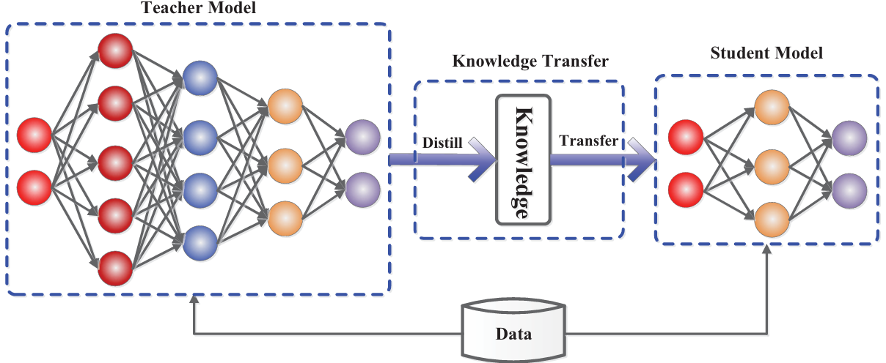

# Knowledge Distillation: A Survey

## 📌 Metadata
---
분류
- Knowledge Distillation
- Model Compression
- Survey

---
url:
- [paper](https://link.springer.com/article/10.1007/s11263-021-01453-z) (IJCV 2021)
- [arXiv](https://arxiv.org/abs/2006.05525)

---
- **Authors**: Jianping Gou, Baosheng Yu, Stephen J. Maybank, Dacheng Tao
- **Venue**: IJCV 2021

---

## 📑 Table of Contents
- [Abstract](#abstract)
- [1. Introduction](#1-introduction)
- [2. Knowledge Categories](#2-knowledge-categories)
- [3. Distillation Algorithms](#3-distillation-algorithms)
- [4. Teacher-Student Architectures](#4-teacher-student-architectures)
- [5. Applications](#5-applications)
- [6. Challenges and Future Directions](#6-challenges-and-future-directions)
- [7. Conclusion](#7-conclusion)

---

## Abstract

딥 러닝의 성공은 주로 대규모 데이터를 인코딩하고 수십억 개의 모델 매개변수를 조작할 수 있는 확장성 덕분
-> 자원이 제한된 장치에 배포하는 것은 높은 계산 복잡성과 큰 저장공간을 요구

Knowledge Distillation
- 대규모 교사 모델로 소규모 학생 모델을 효과적으로 학습

## 1. Instroduction

대규모 딥러닝 모델은 성공을 거두었지만 엄청난 컴퓨팅 복잡성과 방대한 저장공간을 요규하여 자원이 제한된 장치에 배포하기 힘들다.

효율적인 딥 러닝 모델을 만들기 위한 최근 연구
1. MobileNets와 같이 depthwise 분리 가능한 convolution을 포함한 효율적으로 block을 쌓는 방법
2. 모델 압축과 가속화 기법
    - 매개변수 가지치기(pruning) 과 sharing
        - 성능에 중요한 영향을 미치지 않는 불필요한 매개변수를 제거
        - Model quantization, Model binarization, structural matrices, parameter sharing 등이 있다.
    - Low-rank factorization
        - 행렬 및 tensor decomposition을 사용하여 Neural Network(NN)의 여분 매개변수를 파악
    - Transferred compact convolutional filters
        - 컨볼루션 필터를 transferring 또는 압축하여 불필요한 매개변수 제거
    - Knowledge Distillation(KD)
        - 큰 네트워크에서 지식을 추출하여 작은 네트워크로 전달

Knowledge Distillation
- Bucilua et al. (2006)
    - 큰 모델 또는 모델의 앙상블의 정보를 작은 모델로 전달
- Urner et al. (2011)
    - semi-supervised learning을 위해 fully-supervised teacher model과 student model 간의 지식 전달을 도입
- Hinton et al. (2015)
    - 대형 모델에서 작은 모델을 학습하는 것을 "Knowledge Distillation"으로 공식적으로 대중화

주요 아이디어
- 경쟁력 있거나 우수한 성과를 얻기 위해 학생 모델이 교사 모델을 모방

주요 문제
- 대규모 교사 모델에서 소규모 학생 모델로 지식을 전달

KD의 세 가지 구성
- Knowledge
- Distillation algorithm
- Teacher-student architecture

> **Figure 1. Knowledge distillation을 위한 일반적인 teacher-student 프레임워크**

- label이 지정되지 않은 데이터를 사용하여 교사 모델에서 학생 모델로의 지식 전달이 PAC learnable임을 입증
- Phuong and Lampert (2019)
    - deep linear classifiers 시나리오에서 learning distilled 학생 네트워크의 빠른 수렴으로 일반화에 대한 이론적 정당성을 얻음
    - 학생이 무엇을 얼마나 빨리 배우는지에 대한 답을 제시하고 distillation의 성공을 결정하는 요인을 드러냄
- 성공적인 증류(distillation)은 데이터 기하학, 증류 목표의 최적화 편향 및 student classifier의 강력한 단조성에 달려 있다.
- Cheng et al. (2020)
    - 지식 증류를 설명하기 위해 심층 신경망의 중간 layer에서 시각적 개념 추출을 정량화
