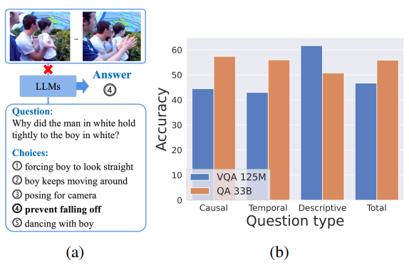
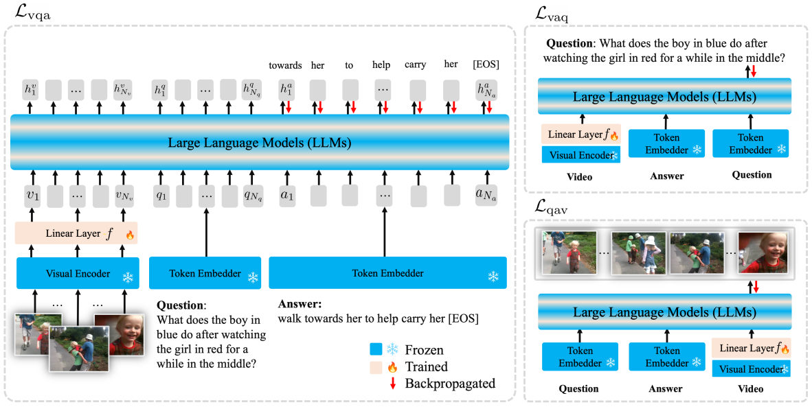
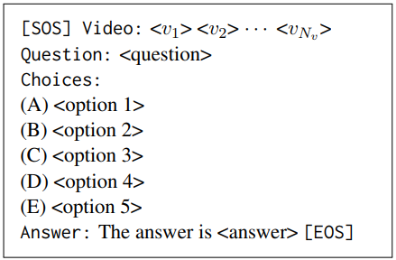

# Large Language Models are Temporal and Causal Reasoners for Video Question Answering

---
Reference

본 문서에 사용된 모든 이미지와 표는 해당 논문에서 발췌하였습니다.

---

## 📌 Metadata
---
분류
- Video Question Answering
- Large Language Models

---
url:
- [paper](https://doi.org/10.48550/arXiv.2310.15747) (arXiv 2023)

---
- **Authors**: Dohwan Ko, Ji Lee, Woo-Young Kang, Byungseok Roh, Hyunwoo Kim
- **Venue**: arXiv 2023

---

## 📑 Table of Contents
- [Abstract](#abstract)
- [1. Introduction](#1-introduction)
- [2. Related Work](#2-related-work)
- [3. Method](#3-method)
  - [3.1 LLaMA-VQA](#31-llama-vqa)
  - [3.2 Flipped-VQA](#32-flipped-vqa)
- [4. Experiments](#4-experiments)
- [5. Conclusion](#5-conclusion)

---

## Abstract

LLM이 VideoQA(Video Question Answering)에서 temporal and casual reasoning(시간적, 인과 관계)을 위한 linguistic shortcuts를 활용하는 데 효과적인 priors를 제공하는 것을 관찰
- 하지만 이러한 priors는 종종 모델이 시각적 콘텐츠를 무시하면서 질문(언어적 편향)에 과도하게 의존하도록 유도하여 VideoQA에서 최적화되지 않은 결과를 초래하는 경우가 많다.
-> 이를 "ungrounded guesses(근거 없는 추측)" 또는 "hallucinations(환각)" 이라고 한다.

Flipped-VQA를 제안
- 모델이 source pair과 대상 label을 뒤집어 <V, Q, A> 삼중항의 모든 조합을 예측하도록 장려
- VQ, VA, QA가 주어졌을 때 A, Q, V를 예측하도록 권장
- LLaMA에 적용하여 LLaMA-VQA 개발
    - VideoQA 벤치마크에서 LLM 기반 모델과 비 LLM 기반 모델을 능가
- 다양한 LLM에 적용 가능
- 언어 편향을 완화한다.

## 1. Introduction

**LLM**
- 자연어 처리에서 free-form 생성 작업과 객관식 question-answering 작업을 수행하는 인상적인 능력을 보임
- 대규모 말뭉치로 사전 훈련되었기 때문에 광범위한 작업(전문 및 학술 QA, 과학 QA, 수학 QA, 코드 생성 및 상식 추론)에서 인간 수준의 성능을 달성
- 사전 학습 데이터를 사용하여 이전 토큰이 주어지면 다음 토큰을 예측하도록 훈련
-> temporal 및 인과 추론 능력을 암묵적으로 학습한다.

**VideoQA**

> Figure 1. **LLM's temporal and causal reasoning ability**
(a) LLM이 시각적 콘텐츠 없이 올바르게 답변하는 인과 관계적 질문의 예.
(b) LLaMA 33B(QA)와 OPT 125M(VQA)의 비교

- 비디오(V)와 질문(Q) 쌍이 주어졌을 때 모델이 정답(A)를 예측하는 작업
- 까다로운 VideoQA 벤치마크는 모델이 시간적, 인과 관계를 묻는 질문에 답할 것을 요구
- Fig. 1a에서 LLM은 linguistic shortcut을 활용하여 시각적 콘텐츠를 참조하지 않고 텍스트 질문과 옵션만으로 올바르게 대답
- Fig. 1b는 QA 33B(LLaMA 33B와 같은 더 큰 언어 모델을 갖춘)로 표시된 언어 전용 QA 모델이 인과 및 시간적 질문에 대해 전체 <V, Q, A>로 훈련된 OPT 125M보다 13%의 큰 차이로 우수함을 보임
- 모델이 시각적 콘텐츠를 무시하면서 부정확한 언어적 priors(언어적 편향)에 과도하게 의존하는 경우 때때로 차선의 답변으로 이어질 수 있다.
-> 환각 문제

이 논문에서의 용어 사용
linguistic shortcut: linguistic prior이 정확할 때 사용
linguistic bias: linguistic prior이 정확하지 않을 때 사용

**Flipped-VQA**
- source pair과 target label을 뒤집어 <V, Q, A> 삼중항의 모든 조합을 예측
(VQ가 주어졌을 때 A를 예측(주 작업), VA -> Q, QA -> V를 예측(보조 작업))
- V, Q, A간의 복잡한 관계를 이해하기 위해 LLM은 시간적 및 인과 추론에 대한 지식을 활용하여 VA -> Q, QA -> V를 예측해야 함
- LLaMA에 Flipped-VQA를 적용해서 LLaMA-VQA를 개발
- Flipped-VQA는 GPT-J 및 OPT의 성능을 개선
-> 다른 decoder 전용 LLM에도 일반적으로 적용할 수 있다.
- prior knowledge를 활용하여 linguistic shortcut을 활용하도록 장려, 질문에 과도하게 의존하는 오답을 유발하는 linguistic bias를 완화함을 경험적으로 보인다.

**Contributions**
- 사전 훈련된 LLM의 지식이 까다로운 VideoQA에 대한 시간적, 인과적 추론을 위한 강력한 prior임을 조사
- Flipped-VQA 제안
    - 시간적 및 인과 추론에 대한 LLM의 prior knowledge를 사용하여 <V, Q, A> 삼중항의 복잡한 관계를 추론하고 이해함으로써 VideoQA에서 LLM을 효율적으로 fine-tuning할 수 있다.
    - LLM이 VQ -> A, VA -> Q, QA -> V 세 가지 작업을 수행하도록 요구한다.
- LLaMA-VQA는 5가지 까다로운 VideoQA 벤치마크에서 baseline을 능가한다. 또한, Flipped-VQA를 다양한 디코더 전용 LLM에 적용할 수 있고 성능을 향상시킨다.
- FlippedVQA는 LLM의 prior knowledge를 기반으로 답하기 위해 linguistic shortcuts를 활용하고 시각적 콘텐츠의 활용도를 높여 linguistic bias를 완화하는 데 효과적이다.

## 3. Method

> Figure 2. **Illustration of LLMs with Flipped-VQA**
Flipped-VQA는 $L_{vqa}, L_{vaq}, L_{qav}$의 세 가지 목표로 구성된다
$L_{vqa}$: VideoQA에 대한 일반적인 목표. video-question 쌍이 주어졌을 때 answer을 예측
$L_{vaq}$: vidoe-answer 쌍이 주어졌을 때 question을 예측
$L_{qav}$: question-answer 쌍이 주어졌을 때 video를 예측
즉, 각 목표에 대해 VQ, VA, QA 쌍을 각각 A, Q, V를 예측하기 위한 접두사 토큰으로 사용
LLM에서 interleave된(끼워넣기) 훈련 가능한 parameters는 LLaMA-Adapter에서와 같이 adapter token을 나타낸다.
우리의 프레임워크는 LLaMA 7B의 총 매개변수 중 4.5M(0.06%)와 같이 LLM에서 상대적으로 적은 수의 훈련 가능한 매개변수만 사용한다.

**Flipped-VQA**
LLM의 시간 및 인과 추론에 대한 prior knowledge를 활용하는 VideoQA를 위한 간단하면서도 효과적인 프레임워크
- VQ -> A, VA -> Q, QA -> V를 예측하도록 요구

### 3.1. LLaMA-VQA

> Table 1. **Input Prompt of LLaMA-VQA.**

LLaMA-VQA는 LLaMA와 약간의 학습 가능한 추가 parameter을 기반으로 만들어짐

1. 학습 가능한 linear layer $f$를 채택하여 frozen visual encoder(CLIP ViT/L14)에서 추출한 시각적 임베딩을 LLaMA의 텍스트 토큰 임베딩 공간에 투여

    - raw video $x_v$가 주어졌을 때, 시각적 토큰의 시퀸스는 다음과 같이 계산된다.
        $v=[v_1,...,v_N]=f(CLIP(x_v))\in R^{N_v\times D} $

        ($N_v$: video 프레임 수, $D$: feature 차원)

2. LLaMA-Adapter에서와 같이 각 self-attention layer의 key와 value 앞에 추가되는 훈련 가능한 adapter tokens $\bold p = [p_1, ..., p_{N_p}]$를 추가로 채택

    -> LLaMA-VQA 7B의 훈련 가능한 파라미터 수: 4.5M
    LLaMA 7B의 전체 파라미터의 0.06%에 불과하다.

-> 이 훈련 가능한 파라미터를 통해 LLaMA-VQA는 LLM의 사전 지식을 효과적으로 보존하고 
VideoQA의 linguistic shortcuts를 이용하는 데 활용한다.

질문 $\bold q=[q_1, ..., q_{N_q}] \in R^{N_q \times D}$와 답변 $\bold a=[a_1, ..., a_{N_a}] \in R^{N_a \times D}$ 토큰은 tokenizer에 의해 raw question $x_q$와 답변 $x_a$에서 추출된다.
($N_q$: 질문 토큰의 수, $N_a$: 답변 토큰의 수)

Table 1. 에서 LLaMA-VQA에 대한 시각적 토큰이 있는 입력 제공
(v, q는 접두사 토큰으로 사용됨)
($q \in R^{N_q \times D}$는 질문 토큰만 나타냄)
(choice token은 생략됨)

token sequence v, q, a를 연결해서 LLaMA에 입력.
출력은 다음과 같이 계산된다.

> $$\displaystyle \begin{aligned}
&[h^v, h^q, h^a] = LLaMA([v, q, a], p) &(1)
\end{aligned}$$

### 3.2. Filpped-VQA

세 가지 목표로 구성된 Flipped-VQA를 제시
- LLM의 시간적, 인과적 추론 능력을 활용하기 위해 VideoQA의 video, question, answer 간의 복잡한 관계를 추론하기 위함

**$VQ \rightarrow A.$**
목적 함수:
> $$\displaystyle \begin{aligned}
L_{vqa} &=-logP(a|v, q) \\
 &=-\sum_{t=0}^{N_a - 1} logP(a_{t+1} | v, q, a_{\leq t}) &(2)
\end{aligned}$$

v, q: a를 생성하기 위한 접두사
(참고: $P(a_1 | v, q, a_{\leq 0}) := P(a_1 | v, q)$)

식 (2)의 확률은 다음과 같이 계산된다.

> $$\displaystyle \begin{aligned}
&P(a_{t+1} | v, q, a_{\leq t}) = Softmax(Linear(h_t^a)) &(3)
\end{aligned}$$

추론 단계에서, 모델은 정답을 다음 식으로 추론한다.

> $$\displaystyle \begin{aligned}
&\hat{a}=argmax_{a \in A} P(a|v, q) &(4)
\end{aligned}$$

(A: 정답 후보 집합. 선택지)

**$VA \rightarrow Q.$**

목적 함수:
> $$\displaystyle \begin{aligned}
L_{vaq} &=-logP(q|v, a) \\
 &=-\sum_{t=0}^{N_q - 1} logP(q_{t+1} | v, a, q_{\leq t}) &(5)
\end{aligned}$$

$P(q_{t+1} | v, a, q_{\leq t}) = Softmax(Linear(h_t^q))$

식 (5)에 따라 시간적 및 인과 추론에 대한 사전 지식을 활용하여 비디오에서 답을 도출하는 질문을 생성

**$QA \rightarrow V.$**

목적 함수:
> $$\displaystyle \begin{aligned}
L_{qav} &=-logP(v|q, a) \\
 &=-\sum_{t=0}^{N_v - 1} logP(v_{t+1} | q, a, v_{\leq t}) &(6)
\end{aligned}$$

video 생성은 Q, A 생성에 비해 너무 어려운 작업이다.
-> InfoNCE를 채택하여 입력 frame feature $v_{t+1} \in R^D$와 LLaMA-VQA의 출력 기능 (h_t^v \in R^D) 간의 상호 정보를 최대화.

식 (6)의 likelihood는 다음과 같이 계산된다.

> $$\displaystyle \begin{aligned}
&P(v_{t+1} | q, a, v_{\leq t}) = \frac{exp(v_{t+1}^{\top} h_t^v)}{\sum_{i=1}^{N_v} exp(v_i^{\top} h_t^v)} &(7)
\end{aligned}$$

(h_0^v: visual token이 시작되기 전의 token 표현)

이는 모델이 LLM의 사전 지식으로 질문과 답변을 분석하여 비디오 프레임의 순서를 예측하도록 한다.

loss:

> $$\displaystyle \begin{aligned}
& L_{Flipped-VQA} = L_{vqa} + L_{vaq} + L_{qav} &(8)
\end{aligned}$$

거꾸로 작업을 수행하여 VQA 모델을 학습시키는 것이 target 작업의 성능을 향상시키는 이유:
- 주요 과제와 보조 과제의 목표는 각각 사후 학습(posterior)과 우도(likelihood)로 해석될 수 있다.

- Bayes 규칙에 따라 다음과 같다.
$P(a|v, q) \propto P(q|v, a)P(a|v)$.

-> $VA \rightarrow Q$를 통해 likelihood $P(q|v, a)$를 학습하는 것은 $VQ \rightarrow A$를 예측하는 주요 작업. $P(a|v, q)$에 도움이 된다. 
마찬가지로, $QA \rightarrow V$ 또한 주요 작업에 도움이 된다.