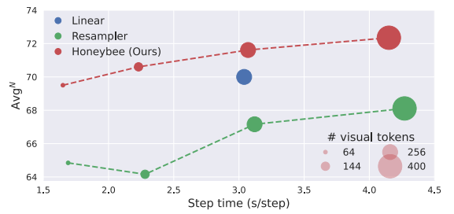
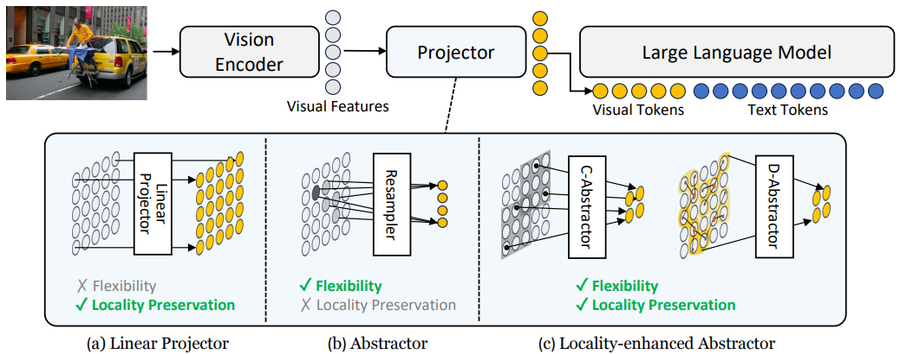
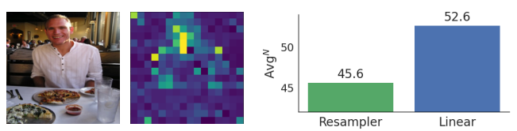
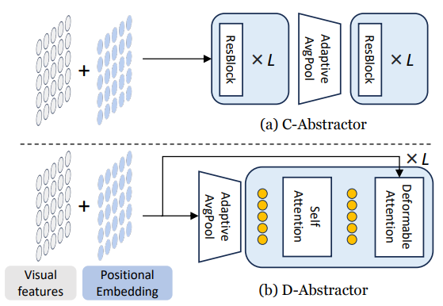
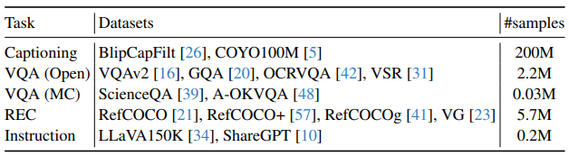
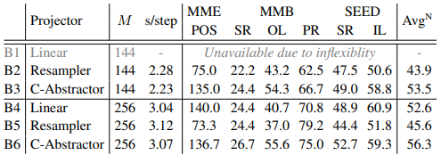
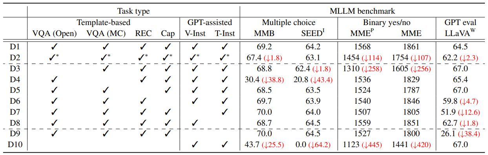
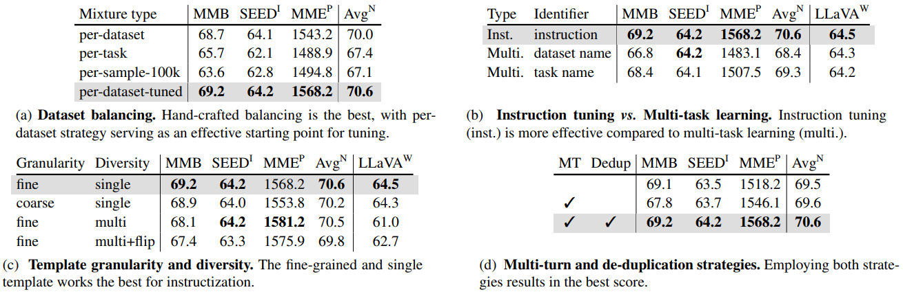
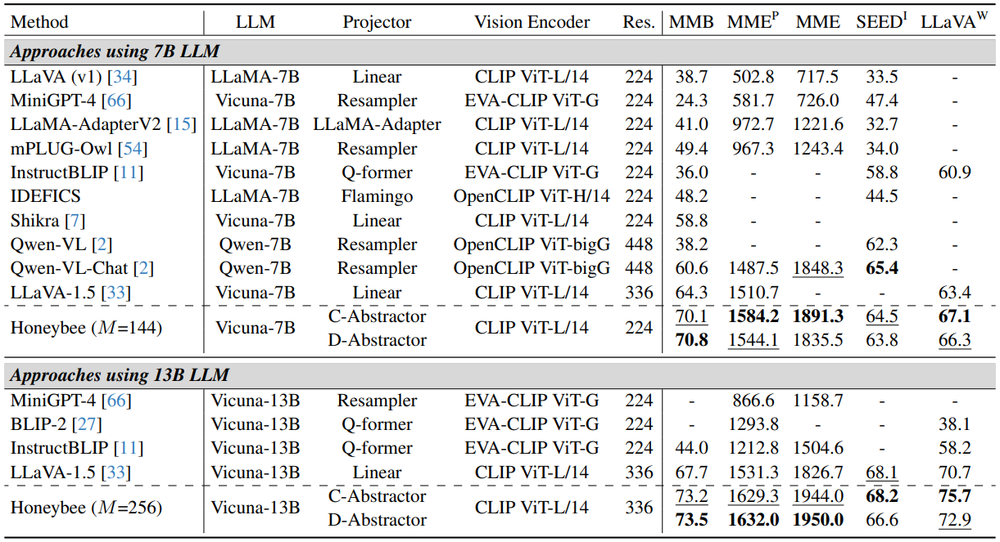
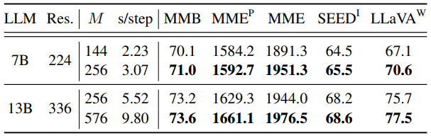

# Honeybee: Locality-enhanced Projector for Multimodal LLM

---
- LLM
- MLLM
---

Cha Junbum et al.
Proceedings of the IEEE/CVF Conference on Computer Vision and Pattern Recognition. 2024.
url: https://openaccess.thecvf.com/content/CVPR2024/html/Cha_Honeybee_Locality-enhanced_Projector_for_Multimodal_LLM_CVPR_2024_paper.html

---

목차

0. [Abstract](#abstract)
1. [Introduction](#1-introduction)
2. Related Works (생략)
3. [Method](#3-method)
4. [Hidden Recipe for visual Instruction Tuning](#4-hidden-recipe-for-visual-instruction-tuning)
5. [Experiments](#5-experiments)
6. [Conclusion](#6-conclusion)
---

## Abstract

MLLM(Multimodal Large Language Model)에서 visual projector는 사전 훈련된 vision encoder와 LLM을 연결하는데 중요한 역할을 하며, LLM의 강력한 기능을 활용하면서 심층적인 시각적 이해를 가능하게 한다.

- projector의 두 가지 필수 속성을 식별한다.
    1. MLLM의 전반적인 효율성에 중요한 visual tokens 수 관리의 유연성
    2. 공간 이해에 필수적인 visual features에서 local context의 보존을 식별
- 새로운 projector 설계를 제안
    - 유연하고 지역성이 향상되어 두 가지 특성을 효과적으로 충족
- 다중적이고 다면적인(multifaceted) 교육 데이터 세트를 효과적으로 활용하기 위한 포괄적인 전략을 제시
- 광범위한 실험을 통해 개별 설계 선택의 영향을 조사
- MLLM 모델 Honeybee 제안
    - MME, MMBench, SEED-Bench 및 LLaVA-Bench를 포함한 다양한 벤치마크에서 이전의 SOTA 방법을 현저히 능가

## 1. Introduction

LLM을 MLLM으로 확장하기 위해 visual instruction tuning이 제안됨
**MLLM의 주요 아이디어:**
- vision encoder와 LLM을 연결하는 projector 사용
- vision encoder와 LLM의 매개변수를 유지하며 visual instruction data를 사용하여 projector을 학습
-> vision encoder와 LLM에서 사전 훈련된 지식과 능력을 보존하고 활용 가능
-> MLLM은 이야기, 시, 광고, 코드 생성과 같은 새로운 기능을 얻을 수 있다.

**MLLM에서 projector은 다음 두 가지 측면에서 중요한 역할을 한다.**
1. 성능: visual token의 품질이 MLLM의 전반적인 성능에 직접적인 영향을 미친다.
2. 효율성: 대부분의 계산 부담이 언어 모델에 있기 때문에 MLLM의 효율성은 결과 visual token의 수에 크게 영향을 받는다.
이러한 중요성에더 불구하고 projector은 상대적으로 덜 탐구되어 대부분의 MLLM은 단순히 linear projector 또는 abstractor를 사용한다.

최근의 MLLM은 linear projector보다 abstractor을 선호한다. 
- 결과 visual token의 수를 처리할 수 있는 유연성 때문
- 하지만 linear projector에 비해 공간 이해 작업을 학습하는 데 어려움을 겪는다.
    - 지역성 인식 디자인이 부족하여 주로 일부 영역에 초점을 맞추게 되어 공간 이해에 필수적인 세부 사항을 잃기 때문
    - linear projector은 일대일 변환을 통해 visual feature의 모든 local context를 보존하는데 탁월하다.
    -> 효과적인 공간 이해를 가능하게 함

**locality-enhanced projector(Honeybee)를 제안**

> **Figure 1. Projector의 성능과 효율성 비교**
$Avg^N$: 정규화된 벤치마크 점수(MME, MMBench, SEED-Bench)의 평균
step time: 사전 훈련 중 single step 실행 시간
Honeybee와 locality-enhanced projector(C-Abstractor)은 기존 projector에 비해 효율성과 성능 간에 더 유리한 균형을 제공한다.

- locality modeling에서 convolution과 deformable attention을 사용한 두 가지 locality-enhanced projector을 소개
-> 이를 abstraction process에 주입하면 복잡한 시각 정보를 처리하는 MLLM의 전반적인 성능 향상을 촉진
-> 또한 LLM의 후속 응답 생성 단계에서 컴퓨팅 효율성을 활용할 수 있다.

**MLLM을 위한 hidden recipe**
- MLLM 훈련에 널리 사용되는 전략
    1. LLaVA와 같은 GPT 지원 명령 추종 데이터 세트
    2. 지시(instructization) process가 있는 vision-language task dataset

    위 두 데이터셋을 최대한 활용하기 위한 설계 선택 사항
    1. multifaceted instruction data를 활용하는 방법
    2. instructization process를 위한 효과적인 방법

**Main contributions**
- projector의 두 가지 중요한 속성을 식별하고 두 속성을 모두 달성하기 위해 locality-enhanced abstractor을 제안
    1. visual features의 지역성 보존
    2. visual tokens의 수를 관리 할 수 있는 유연성
- 

## 3. Honeybee: Locality-enhanced MLLM

### 3.1. Overview

**MLLM의 일반적인 목표:**
- 주어진 multimodal 입력에 대해 명령어에 해당하는 응답을 생성할 수 있도록 학습

이 논문에서는 이미지를 MLLM에 대한 추가 modality 입력으로 간주
-> language model은 visual & text(명령) token(X)의 수신자가 되는 동시에 autoregressive 방식으로 text 응답($Y = {\{w_i\}}_{i = 1}^L$)을 생성

> $$\displaystyle \begin{aligned}
&p(Y|X_{img},X_{text}) = \prod_{i=1}^L p(w_i|X_{img},X_{text},w_{<i}) &(1)
\end{aligned}$$

**MLLM의 구성**
1. vision encoder
    - 상세한 이미지 이해를 위해 region-level visual features로 구성된 sequence를 제공
2. projector
    - 후속 언어 모델을 위해 visual feature을 visual token으로 전송
3. LLM
    - 융합된 visual token과 instruction token을 처리하고 autoregressive하게 응답 생성

**MLLM의 효율성**
- LLM이 대부분의 계산과 메모리를 차지한다.
- LLM에 공급되는 visual token의 수에 영향을 받는다.

**기존 projector 재검토**
projector는 N개의 visual features를 M개의 visual tokens로 변환
MLLM은 linear projection과 visual features의 abstraction 사이의 작업을 채택

linear projection:
- 간단하고 효과적
- vision encoder에 대한 지식과 이해를 보존하는데 효과적
- visual features와 token간의 일대일 변환이라는 제약이 있음
-> 확장성과 효율성 측면에서 문제

abstraction:
- visual token의 수량을 결정하는데 보다 적응력 있는 접근 방식을 제공
예: resampler과 Q-former은 M개의 학습 가능한 쿼리와 cross-attention을 활용하여 visual features에서 visual cue를 추출
-> 이러한 유연성은 더 나은 효율성을 허용한다.
- vision encoder로 인한 정보 손실 위험이 있다.

### 3.2. Locality-enhanced Projector

#### 3.1. Motivation

> **Figure 2. Projector간의 개념 비교**
visual features를 visual tokens로 변환하는 방법에 대한 projector간의 개념 비교
(a) linear projector은 일대일 변환을 수행하므로 visual feature의 모든 local context를 보존하는데 효과적이지만 유연성이 제한된다.
(b) resampler와 같은 abstractor는 visual feature를 더 적은 수의 visual token으로 추상화함으로써 유연성을 제공
두드러진 영역에 초점을 맞춰서 지역적 맥락 보존에는 한계가 있다.
(c) 제안한 locality-enhanced abstractors는 유연성과 지역성 보존을 모두 달성할 수 있다.

Projector는 시각 모델과 언어 모델을 연결하여 visual feature을 언어 모델에서 이해하고 활용할 수 있는 형식으로 변환하기 때문에 중요하다.
-> Projector을 설계할 때 가장 중요한 요소: resulting visual token의 수를 결정할 때의 유연성

visual token의 수는 MLLM의 전반적인 효율성과 계산량을 결정
visual token의 수를 줄여서 효율성을 향상시킬 수 있다.
-> 최근 연구에서 linear projector보다 resampler 및 Q-former와 같은 abstractor 선호

> **Figure 3.** (왼쪽) resampler의 attention map 샘플
(오른쪽) resampler와 linear projector의 공간 이해 능력 비교. 6가지 공간 이해 작업(MME, MMB, SEED 등)을 사용하여 평균 점수 계산

Resampler가 linear projector에 비해 공간 이해 작업을 처리하는데 어려움을 겪는다.
linear projector은 visual feature의 모든 local context를 유지

Fig. 3에서, resampler은 주로 몇몇 지역의 정보를 요약하고 일부 지역의 세부 사항을 간과할 수 있다.

두 가지 새로운 visual projector을 제안
- C-Abstractor, D-Abstractor
1. visual token의 수에 대한 유연성을 가능하게 함
2. local context를 효과적으로 보존
-> MLLM의 전반적인 성능 향상
-> LLM의 subsequent response generation phase에서 계산 효율성 이점 제공

#### 3.2.2 Architecture

> **Figure 4. 제안한 projector의 개념 아키텍처**

**C-Abstractor(Convolutional Abstractor)**

Fig. 4a는 L ResNet block과 adaptive average pooling 및 다른 L ResNet block으로 구성된 전체 아키텍처를 보여줌
- visual feature을 visual token의 제곱수로 추상화할 수 있다.
- 원리 visual feature 수보다 더 많은 visual token에 projection 할 수도 있다.

**D-Abstractor(Deformable attention-based Abstractor)**

convolution은 local context modeling에서 성공적인 개념이지만, locality에 대해 지나치게 엄격한 귀납적 편향을 도입한다고 주장할 수 있다.
-> D-Abstractor을 제안하여 추상화 중 resampler의 지역성 인식을 향상시키면서 유연성을 유지한다.

deformable attention은 local context를 보존하는데 도움이 된다.
각 학습 가능한 query는 reference point 근처에 초점을 맞춘 reference point 및 sampling offset을 사용하여 2D 좌표 기반 sampling process를 통해 visual feature을 수집한다.
이 때, reference point를 수동으로 초기화하여 전체 feature map에 균일하게 분포하는  advanced initialization 방법을 제안한다.
-> 이를 통해 D-Abstractor은 주어진 이미지에 대한 세분화되고 포괄적인 정보를 캡처할 수 있다.

### 3.3. Trianing

2단계 파이프라인으로 훈련

**첫 번째 단계: vision-language alignment를 위한 사전 훈련**
- vision encoder와 LLM을 동결하고 locality-enhanced projector 훈련
- 사전 훈련의 목표: visual proejctor를 학습하여 vision encoder와 LLM간의 연결 구축
이를 통해 MLLM은 image-text 데이터를 사용하여 시각적 단서가 텍스트 설명과 어떻게 일치하는지에 대한 미묘한 이해를 개발할 수 있다.

**두 번째 단계: 시각적 instruction 조정**

> **Table 2. 모든 training dataset list**

- projector와 LLM을 공동으로 훈련하여 instruction-following 능력을 향상시키고 보다 심오한 시각적 이해를 달성
- LLaVA와 ShareGPT라는 두 가지 GPT-assisted instruction-following 데이터셋을 활용
- 시각적 이해를 높이기 위해 template를 사용하여 기존 데이터셋(표2에 있는)을 광범위하게 instructize

## 4. Hidden Recipe for Visual Instruction Tuning

5가지 연구 질문을 통해 instructization process의 세부 사항에 대한 탐구, 데이터셋 선택, 활용 및 조합 전략에 대해 명확히 함
1. 각 데이터셋이 특정 작업의 수행에 어느 정도 기여하는가?
2. 다양한 데이터셋 간의 효과적인 균형 조정 전략은 무엇인가?
3. template에 대한 적절한 세분성은 무엇인가?
4. template의 다양성은 얼마나 중요한가?
5. 대화와 같은 multi-turn template가 추가 이점을 제공하는가?

**데이터셋 조합**

특정 작업에 중요한 데이터셋을 식별하기 위한 포괄적인 분석을 제공하는 체계적인 절제 실험 설계

1. 데이터셋(표2에 있는)을 여러 작업 그룹으로 분류
2. instruction tuning 도중 각 작업 그룹을 순차적으로 제외하여 벤치마크 성능의 변동 조사

**데이터셋 balancing**

MLLM을 훈련하는데 사용할 수 있는 데이터셋은 다양하지만 크기가 크게 다르다.
MLLM을 훈련할 때 사전 훈련된 LLM의 지식을 보존하기 위해 훈련 반복 횟수를 제한하는 것이 일반적
-> 짧은 훈련동안 다양한 기술을 최대한 학습하려면 데이터셋의 균형을 적절하게 조정하는 것이 중요

밸런싱 전략
1. 데이터셋별: 각 데이터셋에 대한 균일 샘플링
2. 작업별: 각 작업에 대한 균일 샘플링
3. 샘플당 100k: 각 데이터셋의 최대 크기를 100k로 clipping
4. 데이터셋별 조정: 데이터셋별 전략을 기반으로 경험적으로 조정

**Template 세분성**

많은 연구에서 기존 데이터셋을 instruction format으로 변환하기 위해 사전 정의된 template를 사용

template 세분성이 다른 두 가지 접근 방법을 비교하도록 실험 설계
1. fine-grained: 각 데이터셋에 고유한 template 적용
2. coarse-grained: 동일한 작업 범주 내의 데이터셋 간에 공유 template 적용

**Template 다양성**

GPT-assisted conversation datasets가 등장하기 전에는 template 다양성을 확보하는 것이 중요했었다.
하지만 GPT-assisted dataset가 등장하며 template 다양성에 대한 강조가 줄어들었다.

GPT-assisted dataset에서 여러 template와 input inversion 기술을 사용하는 것의 정확한 역할과 중요성을 조사하기 위해 접근 방식 비교
세 가지 접근 방식 비교
1. 단일 template
2. 여러 template
3. input inversion이 있는 여러 template

**Multi-turn template**

기존 데이터셋을 활용할 때 이미지당 여러 QA 쌍이 있는 VQA 데이터셋에서 볼 수 있듯이 단일 이미지에 대해 여러 input-target 쌍을 찾는 것이 일반적

multi-turn 전략은 이러한 쌍을 단일 conversation-like multi-turn example로 병합
-> 의미론적으로 겹치는 input-target 쌍을 하나의 예제로 병합할 수 있다.
-> MLLM의 autoregressive training에서 답을 찾는 단순한 지름길을 장려할 수 있다.

이를 완화하기 위해 추가적인 중복 제거 전략을 도입
-> multi-turn example에서 의미상 중복된 input-target 쌍을 제거하여 shortcut training을 방지

## 5. Experiments
### 5.1. Settings

**Benchmarks**

- MME
- MMBench
- SEED-Bench
- LLaVA-Bench(In-the-Wild)

이진 질문 또는 객관식 질문을 사용하여 지각 이해 및 시각적 추론과 같은 MLLM의 기능을 평가
(MME, MMBench, SEED-Bench Image-only)

GPT-4를 활용하여 MLLM의 설명 응답을 평가(LLaVA-Bench)
-> 자연어 생성 및 인간 선호도에서 모델의 성능에 대한 포괄적인 시야를 제공

**Metrics**
- 개별 벤치마크에서 사용하는 공식 메트릭 사용
- 벤치마크 전반에 걸쳐 정규화된 평균 AvgN을 사용

**Implementation details**
- 7B, 13B Vicuna v1.5를 LLM으로 사용
- 7B, 13B LLM에 대해 각각 224, 336 해상도로 pre-train된 CLIP ViTL/14를 사용
마지막 레이어 대인 CLIP의 두 번쨰 마지막 레이어의 feature 사용

- 이미지 indicator token(시각적 token을 포함하는 특수 token)은 사용하지 않음
- fine-tuning 대신 전체 LLM 훈련
- 명시되지 않는 한 Vicuna-7B, CLIP ViT-L/14, C-Abstractor과 함꼐 M=144 visual tokens를 사용
- 최종 모델은 긴 훈련 schedule(200k pre-training, 10k instruction tuning)을 채택

### 5.2. Locality-Enhanced Projector 분석

> **Table 3. Projector 간의 공간 이해 능력 비교**

MME, MMBench, SEED-Bench의 6가지 공간 이해 작업을 사용하여 Table 3의 projector와 비교
1. Resampler(B2, B5)는 시각적 토큰 M의 수에 유연함에도 불구하고 local context 보존을 고려하지 않기 때문에 성능 저하가 발생
2. Linear projector는 유연성이 떨어지고(B1) M=256(B4)으로 제한되어 더 큰 M의 고해상도에서 계산 비용을 감당하기 어렵다.
3. 동일한 계산 예산(M=256)에 대해 C-Abstractor는 linear projector에 비해 크게 향상된 성능을 제공한다(52.6 vs 56.3).
4. C-Abstractor는 더 적은 수의 visual token(M=144)으로 향상된 성능(+0.9)과 더 뛰어난 효율성(3.04 vs 2.23 s/step)을 보인다.

이러한 개선은 locality-enhanced projector가 visual features(인접 features의 local context를 통합하고 context가 풍부한 visual token을 제공하는)를 추상화하는데 탁월함을 보인다.
-> Projector가 더 적은 visual token으로도 linear projector을 능가할 수 있도록 한다.

### 5.3. Hidden Recipe for Visual Instruction Tuning

**Dataset combination**

> **Table 4. instruction tuning 중 data 혼합의 영향**
VQA(Open): open-ended visual question answering
VQA(MC): visual question answering with multiple choice
REC: reffering expression comprehension
Cap: captioning
V-Inst: visual instruction
T-Inst: text-only instruction-following.
V표시는 각 작업 유형에서 오직 하나의 dataset(각 작업마다 GQA, ScienceQA, RefCOCO, COYO100M, LLaVA150k, ShareGPT)만 모델 훈련에 사용됨을 나타냄

Table 4는 다양한 멀티모달 벤치마크에 대한 dataset의 개별 영향을 식별하기 위한 포괄적인 절제 연구를 보인다.
1. 각 작업 그룹(D1 및 D2)에 대해 단일 dataset만 활용해서 각 작업 내에서 dataset 다양성의 영향을 조사
전반적인 성능 하락은 각 작업 내에서 dataset 다양성의 중요성을 강조
2. 특정 작업(D1 및 D3-8)을 순차적으로 제외하여 각 작업의 영향을 탐색
다양한 작업을 처리하는 방법을 배우는 데 작업 다양성이 중요하다는 것을 보임
각 작업은 관련 벤치마크(VQA(Open) -> MME, VQA(MC) -> MMB, SEED, captioning, instruction-following data -> $LLaVA^W$) 의 성능을 향상시킨다.
3. 기존 vision-language data(D9 vs D10)의 사용이 미치는 영향을 조사
이러한 데이터를 제외하면 MME, MMB, SEED 벤치마크가 크게 감소
-> 기존 vision-language dataset에 대한 풍부한 지식이 MLLM의 perception understanding 또는 시각적 추론 능력을 향상시킨다는 것을 시사
-> 작업과 데이터세트 모두 다양성이 중요하다.

> **dataset balancing 및 instructization에 대한 절제**
AvgN: $MMB$, $SEED^I$, $MME^P$의 정규화된 평균
기본 설정은 회색으로 표시

**Dataset balancing**

Table 4를 기반으로 두 가지 원칙에 따라 dataset의 균형을 조정
규칙:
1. 더 작은 dataset에 대한 epoch 제한
2. 주요 dataset에 대해 최대 몇 개의 epoch 허용

Table 5a는 수동으로 조정된 per-dataset-tuned 접근 방식의 효과를 보여준다.
-> 수작업으로 제작하지 않고도 per-dataset이 신뢰할 수 있는 대안이 될 수 있다.

**Instruction tuning vs multi-task learning**

Table 5b는 간단한 식별자를 사용하는 multi-task learning에 비해 template 기반 formatting을 사용한 instruction tuning의 이점을 보인다.

**Template 세분성**

Table 5c는 모든 벤치마크에서 fine-grained template(첫 번째 행)이 coarse-grained template보다 일관되게 성능이 우수함을 보여준다.

RefCOCO 및 RefCOCO+와 같은 dataset에서 입력 분포 $p(X_{img}, X_{text})$는 비슷하지만 정답 분포 $p(Y|X_{img}, X_{text})$는 다르다.
-> 이 시나리오에서 coarse-grained template로 인해 모델은 유사한 입력에 대한 답변을 차별화하는데 어려움을 겪는다.

**Template 다양성**

Table 5c에서 세 가지 시나리오를 평가
- single template
- 각 dataset에 대해 10개의 template 사용(multi)
- 10개의 template 중 3개 반전(multi + flip)

-> Template 다양성을 증가시킨다고 해서 성능 향상이 보장되지는 않는다.
-> 여러 template를 사용하지 않고도 효과적인 zero-shot 일반화가 가능하다.

**Multi-turn template**

Table 5d는 multi-turn template와 중복 제거 전략의 효과를 보임
-> 각 예제에서 의미상 겹치는 쌍을 제거하는 것이 shortcut training을 완화하는 데 효과적이다.

**최종 레시피**
1. 유연하고 지역성을 보존하는 C-Abstractor 또는 D-Abstractor을 채택하기
2. 다양한 작업을 위해 다양한 dataset을 활용하기
3. 절제 옵션 적용하기 - 수작업 튜닝, fine-grained templates, 중복 제거를 통한 multi-turn interactions를 통한 dataset별 balacing 적용

### 5.4. Putting It Altogether

> **Table 6. 다른 SOTA MLLM과의 비교**
Res 및 M은 각각 이미지 해상도와 visual token의 수를 나타냄
최상의 결과: 굵은 글씨
두 번째로 좋은 결과: 밑줄

> **Table 7. C-Abstractor로 visual token 수를 늘려서 한계에 도전하기**
s/step: pre-training step time

**기존 MLLM과의 비교**

Table 6에서는 최종 레시피와 긴 training schedule을 사용하여 훈련된 Honeybee를 다른 SOTA MLLM과 비교
- Honeybee는 $SEED^I$를 제외한 모든 벤치마크에서 7B 크기 MLLM을 능가함
    - Qwen-VL 및 LLaVA-1.5와 같은 방법은 더 큰 vision encoder 또는 더 많은 visual token이 있는 더 큰 이미지를 사용
    - Honeybee는 224 해상도와 144 visual token을 갖는 ViT-L/14를 사용
- $SEED^I$와 같이 자세한 시각적 이해가 필요한 작업의 경우 더 큰 이미지나 더 많은 visual token을 사용하는 것이 도움이 될 수 있다.
- visual token 개수를 144->256으로 늘리면 Table 7과 같이 7B 크기 LLM 중 $SEED^I$에서 가장 높은 점수를 받는다.
- 13B로 확장 시, Honeybee는 모든 벤치마크에서 이전 방법을 능가한다.

## 6. Conclusion

- projector의 바람직한 속성인 지역성 보존을 식별
- 바람직한 성능-효율성 균형을 제공하는 locality-enhanced projectorwpdks
- 광범위한 실험을 통해 고성능 MLLM 개발을 위한 레시피 공개
- Honeybee는 다양한 벤치마크에서 이전의 SOTA 방법을 능가