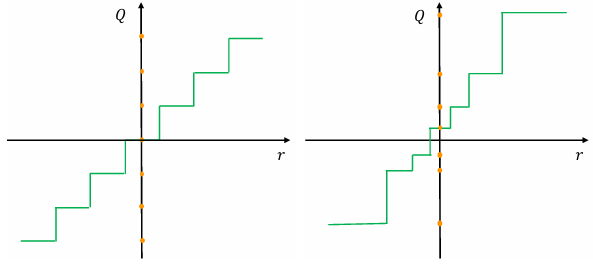
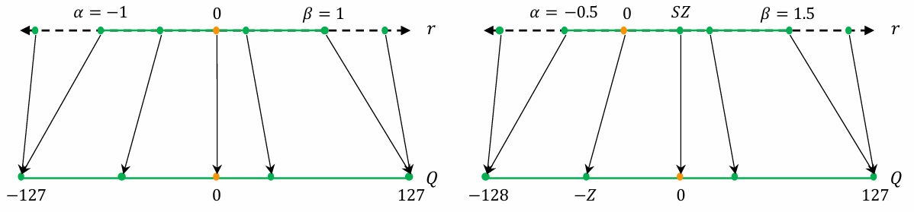
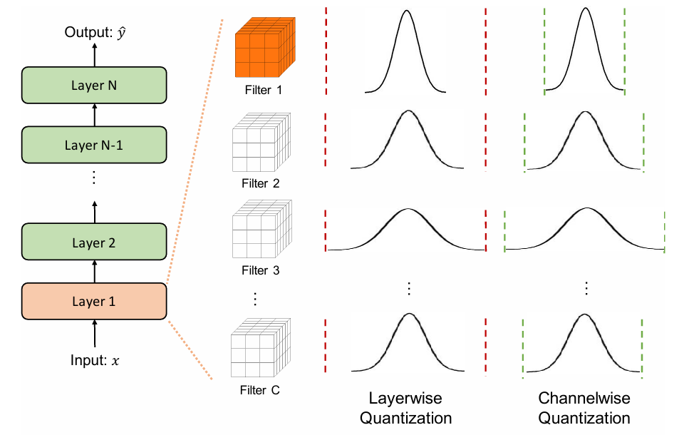
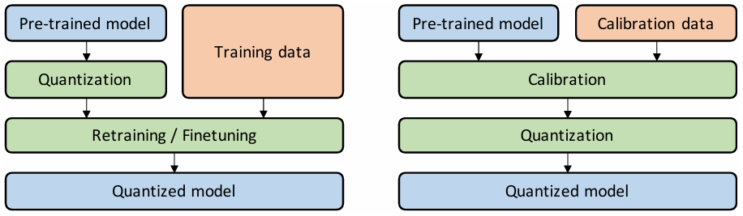
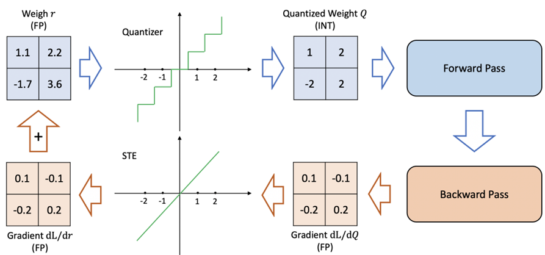
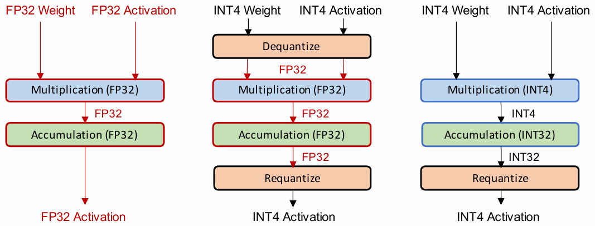
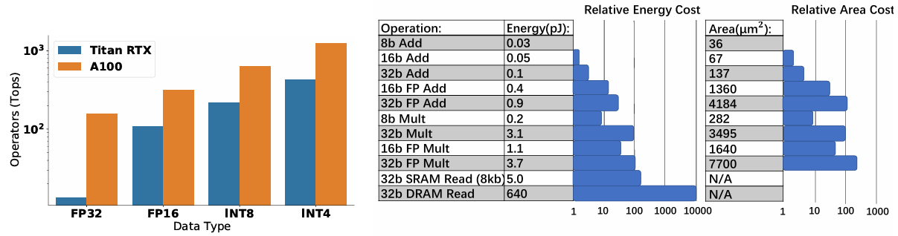
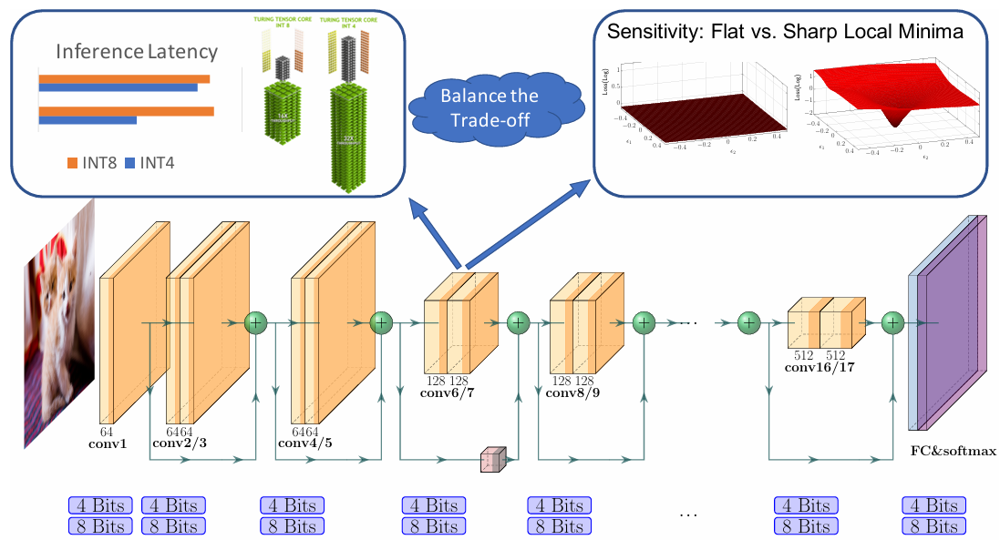
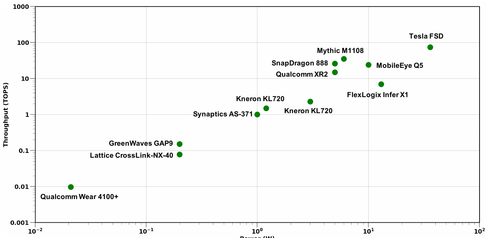

# A Survey of Quantization Methods for Efficient Neural Network Inference

---

- Quantization
- Survey

---

Amir Gholami et al.  
arxiv. 2021.  
url: https://arxiv.org/abs/2103.13630

---

목차

0. [Abstract](#abstract)
1. [Introduction](#1-introduction)
2. [양자화의 일반적인 역사](#2-양자화의-일반적인-역사)
3. [양자화의 기본 개념](#3-양자화의-기본-개념)
4. [고급 개념: 8비트 미만의 양자화](#4-고급-개념-8비트-미만의-양자화)
5. [양자화 및 하드웨어 프로세서](#5-양자화-및-하드웨어-프로세서)
6. [양자화 연구의 미래 방향](#6-양자화-연구의-미래-방향)
7. [요약 및 결론](#7-요약-및-결론)

---

## Abstract

**양자화:**
- 계산의 정확도를 최대화하면서 필요한 bit수를 최소화
- 메모리/컴퓨팅 리소스가 제한될 때 특히 필요하다.

부동 소수점(floating point)에서 4bit 이하 저정밀도 fixed interger로 변환 시,  
-> 메모리 공간과 지연 시간을 16배 줄일 수 있다. (실제 구현 시 약 4~8배 감소한다.)

## 1. Introduction

과도하게 매개변수화된(매우 큰) Neural Network(NN) 모델의 정확도가 크게 향상
- 자원이 제한된 많은 애플리케이션에 배포할 수 없다.  
-> 낮은 에너지 소비와 높은 정확도로 real-time 추론이 필요한 pervasive deep learning 구현에 문제가 발생

**NN 모델을 효율적으로 만드는 방법들(지연시간, 메모리, 에너지 소비 측면에서)**

#### a) 효율적인 NN 모델 아키텍처 설계
- micro-architecture 사용하기(예: depth-wise convolution 또는 low-rank factorization 같은 커널)
- macro-architecture 사용하기(예: residual, inception과 같은 모듈)
- 자동화된 기계 학습(AutoML) 및 Neural Architecture Search(NAS) 방법 설계하기
    - 모델 크기, 깊이 및/또는 너비 등이 주어졌을 때, 제약 조건 하에서 자동화된 방식으로 올바른 NN 아키텍처를 찾는 방법

#### b) NN 아키텍처와 하드웨어를 함께 설계하기
- 특정 하드웨어 플랫폼에 맞게 NN 아키텍처를 조정 및 공동 설계하기
    - NN 구성 요소의 overhead가 하드웨어에 따라 다르기 때문  
    (예: 전용 cache 계층이 있는 하드웨어는 bandwidth bound operation을 cache 계층이 없는 하드웨어보다 더 효율적으로 실행할 수 있다.)  
    (bandwidth bound operation: 메모리의 대역폭에 따른 성능을 갖는 연산)
- 전문가가 NN 아키텍처를 조정/변경한 후, 자동화된 AutoML 및/또는 NAS 기술을 사용하는 방법이 있다.

#### c) 가지치기(Pruning)
- saliency(민감도, sensitivity)가 작은 뉴런을 제거하여 희소 계산 그래프(sparse computational graph) 생성  
(saliency가 작은 뉴런: 제거했을 때 모델의 출력 및 손실 함수에 최소한으로 영향을 미치는 뉴런)
- Unstructured pruning
    - 모든 곳에서 작은 saliency를 갖는 뉴런을 제거
    - 모델의 일반화 성능에 거의 영항을 미치지 않으면서 대부분의 NN parameter을 제거할 수 있다.
    - 희소 행렬 연산은 가속화하기 어렵고, 일반적으로 memory-bound 연산이다.  
    (0이 아닌 요소만 저장하고 연산하기 때문에 메모리 대역폭이 병목 현상이 될 수 있다.)
- Structured pruning
    - 파라미터 그룹(예: 전체 convolutional 필터)를 제거
    - layer과 가중치 행렬의 입력 및 출력 형태를 변경
    - 종종 상당한 정확도 저하로 이어진다.

#### d) Knowledge distillation(지식 증류)
- 대규모 모델을 훈련시킨 다음, 이를 교사로 사용하여 보다 전문적인 모델을 훈련
- 학생 모델을 훈련하는 동안 "hard" 클래스 label 대신 교사가 생성한 "soft" 확률을 활용
    - 입력에 대한 더 많은 정보를 포함할 수 있다.
- 4배 압축(INT8 또는 더 낮은 정밀도)로 성능을 유지할 수 있는 양자화 및 가지치기와 비교했을 때, 지식 증류 방법은 상당한 정확도 감소가 발생하는 경향이 있다.
- 지식 증류와 양자화 및/또는 가지치기를 같이 사용했을 때 성공적인 결과를 보인다.

#### e) Quantization(양자화)
- half-precision 및 mixed-precision 훈련은 AI 가속기에서 훨씬 더 높은 처리량을 가능하게 함
- 상당한 조정 없이 half-precision 이하로 내려가는 것이 매우 어렵다.
- 최근 양자화 연구의 대부분은 추론에 중점을 둔다.

#### f) Quantization and Neuroscience(양자화 및 신경과학)
- NN 양자화와 느슨하게 관련되어 있는 신경과학
- 인간의 뇌가 정보를 불연속적/양자화된 형태로 저장한다고 제안
    - 연속적인 형태로 저장된 정보는 필연적으로 소음에 의해 손상될 수 있다.  
    (열, 감각, 외부, 시냅스 소음 등)
    - 이산 신호 표현은 이러한 낮은 수준의 잡음에 대해 더 견고할 수 있다.
    - 이산 표현의 더 높은 일반화 능력 & 제한된 자원 하에 더 높은 효율성

## 2. 양자화의 일반적인 역사

**양자화:**  
큰(종종 연속적인) 집합의 입력 값에서 작은(종종 유한한) 집합의 출력 값으로 매핑하는 방법

입력 데이터 x를 solution y에 매핑하는 함수 f가 있다고 할 때,  
순방향 오류: $\Delta y = y^* - y$  
역방향 오류: $f(x + \Delta x) = y^*$를 만족하는 $\Delta x$.  
$y^*: $ 양자화 결과

## 3. 양자화의 기본 개념

### A. 문제 정의 및 표기법

양자화의 목표:

파라미터($\theta$)와 중간 활성화 맵(예: $h_i, a_i$)의 정밀도를 낮은 정밀도로 줄여 모델의 일반화 능력/정확도에 미치는 영향을 최소화
> $h_i$: i번째 hidden layer  
$a_i$: i번째 hidden activation 출력

### B. Uniform Quantization

> **Figure 1. Uniform & Non-uniform Quantization 비교**  
(왼쪽): Uniform quantization  
(오른쪽): Non-uniform quantization  
연속 도메인 r의 실제 값은 양자화된 도메인 Q의 더 낮은 정밀도의 불연속 값으로 매핑된다(주황색 표시)  
양자화된 값 사이의 거리는 uniform quantization에서 동일하지만 non-uniform quantization에서는 동일하지 않다.

**양자화:**

$$
\displaystyle
\begin{aligned}
&Q(r) = Int(r / S) - Z &(2)
\end{aligned}
$$

> Q: quantization operator  
r: real valued input  
S: real valued scaling factor  
Z: integer zero point

**역양자화:**

$$
\displaystyle
\begin{aligned}
&\tilde{r} = S(Q(r) + Z) &(3)
\end{aligned}
$$

복구한 값 $\tilde{r}$은 반올림 연산으로 인해 $r$과 정확히 일치하지 않는다.

### C. Symmetric and Asymmetric Quantization

> **Figure 2. Symmetric & Asymmetric quantization 비교**  
restricted range symmetric quantization은 값을 [-127, 127]에 매핑  
full range symmetric quantization은 값을 [-128, 127]에 매핑

uniform quantization에서 scaling factor $S$를 선택하는 것이 중요하다.

$$
\displaystyle
\begin{aligned}
&S = \frac{\beta - \alpha}{2^b - 1} &(4)
\end{aligned}
$$

> $[\alpha, \beta]$: clipping range  
b: 양자화 bit 너비

**calibration**
- clipping range를 선택하는 과정
- 간단한 방법  
    - asymmetric quantization:  
    $\alpha = r_{min}, \beta = r_{max}$  
    - symmetric quantization:  
    $\alpha = -\beta$  
    ($-\alpha = \beta = max(|r_{max}|, |r_{min}|)$를 많이 사용)
- asymmetric quantization은 종종 symmetric quantization에 비해 clipping range가 좁아진다.
    - target 가중치 또는 activation이 불균형할 때 특히 중요하다(예: ReLU 이후의 값)
- symmetric quantization을 사용하면 영점을 $Z = 0$으로 대체하여 식(2)의 양자화 함수를 단순화할 수 있다.

$$
\displaystyle
\begin{aligned}
&Q(r) = Int(\frac{r}{S}) &(5)
\end{aligned}
$$

**두 가지 symmetric quantization**
- full range  
전체 INT8 범위 사용([-128, 127])

$\displaystyle S = \frac{2 max(|r|)}{2^n - 1}$

- restricted range  
[-127, 127] 범위만 사용

$\displaystyle S = \frac{max(|r|)}{2^{n - 1} - 1}$

symmetric quantization을 주로 사용
- 영점을 0으로 만든다.  
-> 추론 중 계산 비용 감소  
-> 구현이 간단해진다.

min/max를 사용하는 방법은 가장 널리 알려진 방법이지만, activation의 outlier의 영향을 쉽게 받는다.  
-> 범위가 불필요하게 증가  
--> quantization의 해상도 감소
- 해결 방법:
    - min/max 대신 백분위수 사용  
    = 가장 큰/작은 값 대신 i번째 큰/작은 값을 사용
    - 실제 값과 양자화된 값 간의 KL divergence를 최소화하는 $\alpha, \beta$를 선택

**Symmetric vs Asymmetric Quantization 요약**
- Symmetric Quantization
    - symmetric range를 사용하여 clipping 분할
    - Z = 0이 되므로 구현이 쉽다
    - 최적이 아닐 수 있다(범위가 치우칠 수 있고 대칭이 아닌 경우).
- Asymmetric Quantization
    - 범위가 한쪽으로 치우치거나 대칭이 아닌 경우 선호된다.

### D. Range Calibration Algorithms: Static vs Dynamic Quantization

언제 clipping range를 결정할 것인가?  
(**activation map은 입력 sample에 따라 다르다!!**)

- Dynamic quantization
    - runtime중에 각 activation map에 대해 동적으로 계산
    - 실시간 계산 필요
    -> 오버헤드가 클 수 있다.
    - 정확도가 높다.
- Static quantization
    - 추론 중에 정적으로 clipping 범위를 미리 계산
    - 계산 오버헤드가 생기지 않는다.
    - 정확도가 동적 양자화에 비해 떨어진다.
    - 보정 입력(데이터)를 사용해서 activation 범위를 계산할 수 있다.

최상의 activation 범위를 계산하기 위한 metric:
- MSE(평균 제곱 오차)
    - 양자화 이전 가중치 분포와 양자화된 값 사이의 MSE를 최소화
    - 가장 일반적으로 사용
- Entropy
- NN 훈련 중 clipping 범위를 학습/부과

**Dynamic vs Static Quantization 요약**
- Dynamic Quantization
    - 각 activation의 clipping 범위를 동적으로 계산하고 종종 가장 높은 정확도를 달성
    - 많은 비용이 든다
- Static Quantization
    - 모든 입력에 대해 clipping 범위 고정
    - 비용이 적어서 자주 사용한다.

### E. Quantization Granularity(양자화 세분성)

> **Figure 3. 다양한 양자화 세분성 그림**  
layerwise quantization: 동일한 layer에 속하는 모든 filter에 동일한 clipping range 적용  
-> 분포가 좋은 채널(예: Filter 1)에 대해 잘못된 양자화 해상도가 발생할 수 있다.  
channelwise quantization: 더 나은 양자화 해상도를 얻을 수 있다.

대부분 컴퓨터비전 작업에서, layer의 activation 입력은 Fig 3과 같이 다양한 convolutional filter과 연산된다.  
convolutional filter 각각은 서로 다른 범위의 값을 가질 수 있다.

clipping range $[\alpha, \beta]$를 계산하는 세분화된 방법:

#### a) Layerwise Quantization
- Fig 3. 세 번째 열
- layer에 있는 convolutional filter에 있는 모든 가중치를 고려하여 결정
- 모든 convolutional filter에 대해 동일한 clipping range 사용
- 구현 간단
- 각 convolutional filter의 범위가 많이 다를 수 있다.  
-> 정확도가 최적화되지 않는 경우가 많다.  
예: 넓은 범위를 갖는 convolutional filter에 의해 parameter 범위가 상대적으로 좁은 convolutional filter(동일한 layer에 있는)은 양자화 해상도가 손실될 수 있다.

#### b) Groupwise Quantization
- layer 내부의 여러 채널을 그룹화하여 clipping 범위를 계산
- 단일 convolution/activation에서 parameter 분포가 많이 변하는 경우 유용
- Q-BERT에서 fully-connected attention layers로 구성된 Transformer 모델 양자화에 유용하다.
- 다양한 scaling factor을 계산하기 위한 추가 비용이 필요하다.

#### c) Channelwise Quantization
- Fig 3. 마지막 열
- 각 convolution filter마다 다른 channel과 독립적으로 고정 값의 clipping range 사용
- 각 channel마다 scaling factor 할당
- 더 나은 양자화 해상도가 보장되고 종종 더 높은 정확도를 보인다.
- 가장 많이 사용하는 방식

#### d) Sub-channelwise Quantization
- channelwise quantization을 좀 더 극단적으로 사용한 방식
- convolution 또는 fully-connected layer의 parameter group에 대해 clipping range 결정
- 상당한 오버헤드가 발생한다.
    -> 양자화 해상도와 오버헤드간에 좋은 절충안을 찾아야 한다.

**Quantization Granularity 요약**
- Convolutional kernel을 양자화할 때 Channelwise quantization을 가장 많이 사용  
-> 무시할 수 있는 overhead로 각 개별 kernel의 clipping range를 조정할 수 있다.
- sub-channelwise quantization  
-> 상당한 overhead가 발생한다.

### F. Non-uniform quantization

불균일한 간격을 갖는 양자화 단계와 양자화 수준

$$
\displaystyle
\begin{aligned}
&Q(r) = X_i, \rm if \it \ r \in [\Delta_i, \Delta_{i + 1}). &(6)
\end{aligned}
$$

> $X_i$: 이산 양자화 수준  
$\Delta_i$: 양자화 단계(임계값)

- r 값이 $\Delta_i$와 $\Delta_{i + 1}$ 사이에 있을 때 Q는 이를 해당 양자화 수준 $X_i$로 투영
- $X_i$와 $\Delta_i$ 모두 균일한 간격이 아니다.
- 중요한 값 영역에 더 집중하거나, 적절한 동적 범위를 찾아 분포를 더 잘 캡처할 수 있다.  
    -> 고정 bit-width에 대해 더 높은 정확도를 달성할 수 있다.
- 많은 Non-uniform quantization 방법은 종종 긴 꼬리를 포함하는 종 모양의 가중치 및 activation의 분포를 위해 설계되었다.  
(종 모양인데 곡선이 옆으로 길게 늘어진 모양을 의미하는 듯)
- 규칙 기반 방법
    - log 분포를 사용  
    양자화 단계와 수준이 기하급수적으로 증가
    - binary-code-based quantization  
    실수 벡터 $r \in \mathbb{R}^n$ 은 $r \approx \Sigma_{i=1}^m \alpha_i b_i$을 통해 m개의 binary vector로 양자화된다.  
    ($\alpha_i \in \mathbb{r}$: scaling factor)  
    ($b_i \in {-1, +1}^n$: binary vector)  
    r과 $\Sigma_{i=1}^m$ 사이의 오차를 최소화하기 위한 closed-form 해결책이 없기 때문에 이전 연구에서는 heuristic solution에 의존
- 최근에는 non-uniform quantization을 최적화 문제로 공식화
    - 원본 tensor와 양자화한 값의 차이를 최소화하기 위해 조정된다.
    - 학습 가능한 양자화: 양자화 장치도 모델 매개변수와 함께 훈련할 수 있는 양자화
    - 반복 최적화 또는 경사하강법으로 훈련

$$
\displaystyle
\begin{aligned}
&\min_{Q} ||Q(r) - r||^2 &(7)
\end{aligned}
$$

- 클러스터링은 양자화로 인한 정보 손실을 완화하는데 도움을 줄 수 있다.
    - 양자화 단계와 수준을 결정하기 위해 다른 tensor에서 k-means를 사용할 수 있다.
    - 성능 손실을 최소화하기 위해 가중치에 Hessian-weighted k-means clustering을 적용할 수 있다.

**Uniform vs Non-uniform quantization 요약**
- Non-uniform quantization
    - parameter 범위를 불균일하게 불연속화하여 신호 정보를 더 잘 캡처할 수 있다.
- non-uniform quantization
    - scheme은 일반적으로 GPU 및 CPU와 같은 일반 컴퓨팅 하드웨어에 효율적으로 배포하기 어렵다.  
-> Uniform quantization은 단순성과 하드웨어에 대한 효율적인 매핑으로 현재 사용 가능한 현실적인 방법

### G. Fine-tuning Methods

> **Figure 4. Quantization-Aware Training(QAT, 좌)와 Post-Training Quantization(PTQ, 우) 비교**  
**QAT**  
pre-trained model을 양자화한 다음 훈련 데이터를 사용하여 미세조정하여 매개변수를 조정하고 정확도 저하를 복구  
**PTQ**  
pre-trained model은 교정 데이터(훈련 데이터의 하위 집합 등)을 사용하여 clipping 범위와 scaling factor을 계산하여 보정(calibration)  
calibration process는 QAT의 finetuning process와 병행하여 수행되는 경우가 많다.

#### 1) Quantization-Aware Training(QAT)

> **Figure 5. Straight Through Estimator(STE) 사용을 포함한 Quantization-Aware Training 절차 그림**

양자화는 모델의 매개변수에 섭동(perturbation. 교란과 비슷한 개념)을 도입할 수 있다.  
-> 모델이 부동 소수점 정밀도에서 훈련되었을 때 수렴했던 지점에서 멀어질 수 있다.  
--> 양자화된 매개변수로 모델을 다시 훈련하여 더 나은 지점으로 수렴할 수 있다.

**QAT:**  
gradient update 후 매개변수 양자화

양자화된 정밀도로 gradient를 누적하면 낮은 정밀도에서 gradient가 0 또는 높은 오류가 발생할 수 있다.  
-> 부동 소수점으로 역전파를 수행하는 것이 중요하다.

**역전파의 중요한 미묘함: 미분 불가능한 양자화 연산자(식 2)를 처리하는 방법**  
- 근사치가 없으면 식 2의 반올림 연산의 기울기는 거의 모든 곳에서 0이다.  
(piece-wise flat 연산자이기 때문)

해결 방법:
- STE(Straight Through Estimator)
    - 연산자의 기울기를 근사화하는 방법
    - 반올림 연산을 무시하고 그림 5와 같이 항등 함수를 사용하여 근사치를 계산
    - 초저정밀도 quantization(이진 양자화 등)을 제외하고는 실제로 잘 작동하는 경우가 많다.

- Non-STE 방법들
    - Stochastic neuron approach(확률적 뉴런 접근법)
    - Combinatorial optimization, target propagation, Gumbel-softmax 사용
    - Regularization operaotr(정규화 연산자)를 사용하여 가중치 양자화  
    -> 식 2의 미분 불가능한 quantization 연산자를 사용할 필요 없다.
    - ProxQuant
        - 식 2에서 반올림 연산을 제거하고 W 모양의 non-smooth regularization function을 사용
    - pulse training을 사용하여 불연속 점의 도함수 근사화
    - 양자화된 가중치를 floating point와 양자화된 매개변수의 affine combination으로 대체
    - AdaRound 사용
        - 적응형 반올림 방법

-> 이러한 방법들은 종종 많은 조정이 필요하다.  
--> STE 방법이 가장 일반적으로 사용됨

QAT 중에 양자화 매개변수를 학습하는 것이 효과적
- PACT: uniform quantization에서 activation의 clipping 범위를 학습
- QIT: non-uniform quantization에 대한 확장으로 quantization step과 level을 학습
- LSQ: QAT 중 음수가 아닌 activation(예: ReLU)에 대한 scaling factor을 학습하기 위한 새로운 gradient 추정치 도입
- LSQ+: LSQ를 음수 값을 생성하는 swish 및 h-swish와 같은 일반 activation function으로 확장

**QAT 요약**
- STE의 대략적인 근사치에도 불구하고 잘 작동함
- NN 모델을 다시 훈련하는데 계산 비용이 필요하다
    - 낮은 bit 정밀도 quantization의 경우, 정확도를 복구하기 위해 더 많은 계산이 필요할 수 있다.

#### 2) Post-Training Quantization(PTQ)

- Fine-tuning 없이 가중치 양자화 및 조정
- 오버헤드가 매우 낮다.
- 데이터가 제한적이거나 label이 지정되지 않은 상황에서도 적용할 수 있다.
- 저정밀도 양자화일수록 QAT에 비해 정확도가 낮다.

정확도 저하를 완화하기 위한 방법들
- 양자화 후 가중치 값의 평균과 분산에서 내재된 bias를 보정하는 방법
- 서로 다른 layer 또는 채널 간의 가중치 범위를 균등화
- ACIQ
    - 최적의 clipping 범위와 channel-wise bitwidth 설정을 분석적으로 계산
    - channel-wise activation quantization은 하드웨어에 효율적으로 배포하기 어렵다.
- OMSE
    - activation 시 channel-wise quantization을 제거
    - 양자화된 tensor와 원래 floating point tensor 사이의 L2 거리를 최적화
- OCS(Outlier Channel Splitting)
    - outlier 값을 포함하는 채널을 복제하고 반으로 줄이는 방법
- AdaRound
    - loss(양자화 loss)를 더 잘 줄이는 적응형 반올림 방법
- AdaQuant
    - 필요에 따라 양자화된 가중치를 변경할 수 있는 방법 제안

**PTQ 요약**
- 모든 가중치 및 양자화 매개변수는 모델 재훈련 없이 결정
- 양자화하는 매우 빠른 방법
- 종종 QAT에 비해 정확도가 낮다.

#### 3) Zero-shot Quantization(ZSQ)
필요성
- 양자화 후 정확도 저하를 최소화하기 위해서는 훈련 데이터의 일부를 사용할 필요가 있다.
    - 값을 clipping하고 적절한 scaling 계수를 결정하기 위해 activation 범위를 알아야 한다.
    - 정확도 저하를 복구하기 위해 fine-tuning이 필요한 경우가 많다.
- 대부분의 경우 양자화 중에 원본 데이터에 접근할 수 없다.
    - 훈련 데이터셋이 커서 배포가 불가하거나
    - 훈련 데이터셋이 독점적이거나
    - 보안 or 개인정보 보호 문제

두 가지 방법
- Level 1: No data & No fine-tuning (ZSQ + PTQ)
    - 빠르고 쉽게 양자화
- Level 2: No data & Requires fine-tuning(ZSQ + QAT)
    - 저정밀도 설정에서 정확도 저하를 복구할 수 있다.

Level 1 방법 적용 사례
- 가중치 범위를 균등화하고 bias 오류를 수정
    - piece-wise linear activation 함수의 scale-equivariance 속성을 기반으로 함
        - GELU나 swish activation을 사용하는 경우 최적이 아닐 수 있다.

대상 모델의 실제 훈련 데이터와 유사한 합성 데이터를 생성하는 방법
- 합성 데이터로 모델을 보정 또는 fine-tuning
    - GAN 활용 방법  
    pre-trained model을 discriminator(판별자)로 사용하여 generator(생성자)를 훈련  
    생성자에서 수집된 합성 데이터 샘플을 사용하여 양자화된 모델을 full-precision 대상의 지식 증류로 fine-tuning
        - 모델의 최종 출력만 사용하여 생성되기 때문에 실제 데이터의 내부 통계(예: 중간 계층 activation 분포)를 확인하지 못한다.  
        -> 실제 데이터 분포를 제대로 나타내지 못할 수 있다.
    - 후속 연구  
        - BatchNorm에 저장된 통계. 즉, 채널별 평균 및 분산을 사용하여 보다 현실적인 합성 데이터를 생성  
        KL 발산을 직접 최소화하여 데이터를 생성할 수도 있다.
        - ZeroQ: 합성 데이터를 민감도 측정 및 보정에 사용할 수 있음을 보임  
        데이터 생성 시 출력 label에 의존하지 않기 때문에 object detection 작업으로 확장 가능
        - 입력 이미지를 훈련 가능한 parameter로 설정하고, 내부 통계가 실제 데이터의 통계와 유사해질 때까지 역전파를 수행
            
**ZSQ 요약**
- train/validation 데이터에 접근하지 않고 전체 양자화를 수행
- 고객의 workloawd 배포를 가속화하려는 MLaas(Machine Learning as a Sevice) 공급자에게 중요
- 학습 데이터에 대한 접근이 제한될 수 있는 경우에 중요

### H. Stochastic Quantization(확률적 양자화)

추론하는 동안 양자화는 일반적으로 결정론적
- 확률적 양자화는 결정론적 양자화에 비해 모델이 더 많은 것을 탐색할 수 있도록 한다.
    - 반올림 연산이 항상 동일한 가중치를 반환하는 경우  
    -> 작은 가중치 업데이트가 가중치 변경으로 이어지지 않을 수 있다.
    - 확률적 반올림 시, 모델이 이를 벗어날 수 있는 기회를 제공하여 매개변수를 업데이트할 수 있다.

- 확률적 양자화는 가중치 업데이트 크기와 관련된 확률로 floating 숫자를 위 또는 아래로 매핑
식 2의 INT 연산은 다음과 같이 정의될 수 있다.

$$
\displaystyle
\begin{aligned}
&\rm Int \it (x) = \begin{cases}
\lfloor x \rfloor &\rm with \  probability &\it \lceil x \rceil - x, \\
\lceil x \rceil &\rm with \  probability &\it x - \lfloor x \rfloor.
\end{cases}
\quad &(8)
\end{aligned}
$$

이진 양자화(binary quantization)의 경우 다음과 같이 확장한다.

$$
\displaystyle
\begin{aligned}
&\rm Binary \it (x) = \begin{cases}
-1 &\rm with \  probability &\it 1 - \sigma(x), \\
+1 &\rm with \  probability &\it \sigma(x).
\end{cases}
\quad &(9)
\end{aligned}
$$

> $\sigma(\cdot)$: sigmoid function

**QuantNoise**
- 각 순방향 패스 동안 서로 다른 가중치의 무작위 부분 집합을 양자화
- 편향되지 않은 gradient로 모델을 훈련

-> 정확도가 크게 떨어지지 않고 낮은 bit 정밀도의 양자화가 가능  
단점: 모든 단일 가중치 업데이트에 대해 난수를 생성하는데 오버헤드가 존재

## 4. 고급 개념: 8비트 미만의 양자화

### A. Simulated and Integer-only Quantization

> **Figure 6.**  
왼쪽: full-precision inference  
가운데: inference with simulated quantization  
오른쪽: inference with integer-only quantization  
(accumulation: 해당 데이터 값을 누적(더하기, 곱하기 등)한 결과 유형. 누적 결과는 더 큰 정밀도가 필요할 수 있다.)
 

> **Figure 7.**  
왼쪽: Titan RTX와 A100 GPU의 서로 다른 bit-precision logic에 대한 peak 처리량 비교  
오른쪽: 45nm 기술을 사용했을 때, 여러 정밀도에 대한 에너지 비용 및 상대 면적 비용 비교  
정밀도가 낮을수록 에너지 효율성이 기하급수적으로 향상되고 처리량이 높아진다.

양자화된 모델을 배포하는 두 가지 일반적인 접근 방식:
- simulated quantization(가짜 양자화)
    - 모델 매개변수는 낮은 정밀도로 저장되지만 연산은 부동 소수점으로 수행  
    -> 양자화된 매개변수는 부동 소수점 연산 전에 역양자화되어야 한다.(그림 6 참고)  
    -> 빠르고 효율적인 저정밀도 방법의 이점을 완전히 누릴 수 없다.
- integer-only quantization(fixed-point 양자화)
    - 모든 연산이 저정밀도 정수를 사용하여 수행된다.  
    -> 전체 추론이 효율적  
    -> 매개변수나 activation의 부동 소수점 역양자화 없이 수행 가능하다.

부동 소수점 산술로 full-precision 추론을 수행 시
- 양자화 정확도에 도움을 줌
- 낮은 정밀도를 사용하는 이점을 활용할 수 없음

저정밀도 사용의 이점 (그림 7 참고)
- 낮은 지연 시간
- 낮은 전력 소비
- 높은 면적 효율성
예: INT8 덧셈 수행은 FP32 덧셈보다 에너지 효율이 30배 더 높고 면적 효율이 116배 더 높다.

integer-only quantization 방법 예시
- batchnorm을 이전 convolution layer에 융합
- batchnorm을 사용하는 residual network에 대한 integer-only 계산 방법  
-> 두 방법 모두 ReLU activation으로 제한된다.
- 최근 연구는 GeLU, Softmax 및 Layer Norm을 정수 연산으로 근사화하여 이러한 제한을 해결  
integer-only quantization을 Transformer 아키텔처로 더욱 확장

**Dyadic quantization**

[출처: By David Eppstein - Own work, Public Domain, https://commons.wikimedia.org/w/index.php?curid=4134639](https://commons.wikimedia.org/w/index.php?curid=4134639)

- Integer-only quantization의 다른 방법
- 모든 scaling은 분자에 정수 값이 있고 분모에 2의 거듭제곱이 있는 유리수인 dyadic 숫자로 수행  
-> 정수 덧셈, 곱셈, bit shifting만 필요하고, 정수 나누기는 필요하지 않은 계산 그래프가 생성됨
- 모든 덧셈(예: residual connections)이 동일한 dyadic scale을 갖도록 적용되어 덧셈 논리를 더 간단하고 효율적으로 만들 수 있다.

**Simulated vs Integer-only Quantization 요약**
- integer-only 및 dyadic quantization은 simulated/fake quantization보다 바람직하다.
    - integer-only quantization: 낮은 정밀도의 logic을 사용
    - simulated quantization: floating point logic을 사용
- fake quantization은 추천 시스템과 같이 computing-bound가 아닌 bandwidth-bound 문제에 유용
    - 이 경우 병목 현상은 메모리 공간과 메모리에서 매개 변수를 로드하는 비용

### B. Mized-Precision Quantization

> **Figure 8. mixed-precision 양자화 그림**  
mixed-precision 양자화의 목표:  
\- 민감하고 효율적인 layer을 더 높은 정밀도로 유지  
\- 민감하지 않고 비효율적인 layer에만 낮은 정밀도 양자화 적용  
efficiency metric은 하드웨어에 따라 다르며 latency 또는 energy consumption가 해당된다.

더 낮은 정밀도의 양자화를 사용하면
- 하드웨어 성능이 증가
- 정확도가 저하  
-> mixed-precision quantization으로 이를 해결할 수 있다.
- 그림 8과 같이 서로 다른 bit 정밀도로 양자화된다.

문제점
- 검색 공간(정밀도를 결정하기 위한)이 layer 수에 대해 기하급수적  
검색 공간을 해결하기 위한 다양한 접근 방법:
    - 양자화 정책을 자동으로 결정하는 강화 학습(RL) 기반 방법
        - 하드웨어 시뮬레이터를 사용하여 RL agent 피드백에서 하드웨어 가속기 피드백을 받음
    - mixed-precision configuration searching 문제를 Neural Architecture Search(NAS) 문제로 공식화하고 Differentiable NAS(DNAS) 방법을 사용하여 검색 공간을 효율적으로 탐색
        - 탐색 기반 방법의 단점: 종종 많은 계산 자원이 필요. 일반적으로 성능이 하이퍼파라미터 및 초기화에 민감

Mixed-precision 방법의 다른 종류
- 주기적 함수 정규화(periodic function regularization) 사용
    - 각 layer의 bitwidth를 학습하면서 각 layer의 정확도와 관련된 다양한 중요성을 자동으로 구별하여 mixed-precision 모델을 훈련
- HAWQ: 모델의 2차 민감도를 기반으로 mixed-precision 설정을 자동으로 찾는 방법
    - 2차 연산자(Hessian)의 대각합을 사용하여 양자화에 대한 layer의 민감도를 측정할 수 있다.
- HAWQv2: mixed-precision activation 양자화로 확장. RL 기반 방법보다 100배 이상 빠르다.
- HAWQv3: Integer-only, hardware-aware 양자화 도입
    - 주어진 application 별 제약 조건(예: 모델 크기 or 지연 시간)에 대한 최적의 bit 정밀도를 얻기 위해 fast integer linear programming 방법을 제안
    - mixed-precision 양자화를 T4 GPU에 직접 배포하여 mixed-precision 양자화의 하드웨어 효율성에 대한 질문 해결
    INT8 양자화에 비해 mixed-precision(INT4/INT8) 양자화가 최대 50% 빨라짐

**Mixed-precision Quantization 요약**
- 다양한 모델의 저정밀 양자화를 위한 효과적이고 하드웨어 효율적인 방법
- NN의 계층은 양자화에 민감한/둔감한 layer로 그룹화되고 각 계층에 대해 더 높은/더 낮은 비트 사용
- 정확도 저하를 최소화하면서도 메모리 공간을 줄이고 정밀도가 낮은 양자화로 더 빠른 속도를 얻을 수 있다.
- 혼합 정밀도는 operations/layers에만 사용되므로 하드웨어 효율적

### C. Hardware Aware Quantization

양자화의 목표 중 하나:  
**추론 latency 개선**
- 하지만 특정 layer/operation 작업이 양자화된 후 모든 하드웨어에 동일한 속도 향상을 제공하지는 않는다.

양자화의 이점은 하드웨어에 따라 다르다
- on-chip memory, bandwidth, cache hierarchy 등 많은 요소가 양자화 속도 향상에 영향을 미침

한 연구는 RL agent를 사용하여 hardware-awrae mixed-precision을 결정
- bitwidth가 다른 layers들에 대한 지연 시간의 look-up table을 기반으로 함
- 시뮬레이션된 하드웨어 latency를 사용하는 문제 존재  
-> 하드웨어에 양자화된 operations를 배포하고, 서로 다른 양자화 bit 정밀도에 대해 각 layer의 실제 배포 대기 시간을 측정할 수도 있다.

### D. Distillation-Assisted Quantization

**Model distillation:**
- 정확도가 높은 대형 모델을 교사로 사용하여 소형 학생 모델의 훈련을 돕는 방법
- 학생 모델을 훈련하는 동안 GT class label만 사용하는 대신, 교사가 생성한 soft probabilities를 활용할 것을 제안
- 전체 loss 함수: 학생 loss과 distillation loss를 포함. 다음과 같다:

$$
\displaystyle
\begin{aligned}
&\mathcal{L} = \alpha \mathcal{H}(y, \sigma(\mathcal{z}_s)) + \beta \mathcal{H}(\sigma(\mathcal{z}_t, T), \sigma(\mathcal{z}_s, T))
\quad &(10)
\end{aligned}
$$

> $\alpha, \beta$: 학생 모델과 증류 loss의 loss 양을 조정하기 위한 가중치 계수  
> $y$: GT class label  
> $\mathcal{H}$: cross-entropy loss function  
> $\mathcal{z}_s, \mathcal{z}_t$: 학생/교사 모델에 의해 생성된 logits  
> $\alpha$: softmax function  
> $T$: 다음과 같이 정의된 temperature

$$
\displaystyle
\begin{aligned}
&p_i = \frac{\exp \frac{z_i}{T}}{\sum_j \exp \frac{z_j}{T}}
\quad &(11)
\end{aligned}
$$

지식 증류(knowledge distillation) 방법은 다양한 지식 source를 탐색하는 데 중점을 둠
- 몇몇 연구는 logit(soft probabilities)을 지식 source로 사용하려 함
- 몇몇 연구는 중간 layer의 지식을 활용하려고 함

교사 모델에 대한 연구
- 학생 모델을 공동으로 감독하기 위해 여러 교사 모델 사용
- 추가 교사 모델 없이 self-distillation 적용

### E. Extreme Quantization

**이진화:**
- 1-bit로 양자화하여 메모리 요구사항이 32배 감소
- 이진(1-bit) 및 삼항(2-bit)연산은 종종 bit 단위 연산으로 효율적으로 계산할 수 있다.
- FP32 및 INT8과 같은 더 높은 정밀도보다 상당한 가속을 달성할 수 있다.  
(예: NVIDIA V100 GPU의 peak 이진 산술은 INT8보다 8배 높다)
- naive 이진화는 정확도를 크게 저하시킬 수 있다.

이진화 연구
- BinaryConnect
    - 순방향 및 역방향 중에만 이진화
    - sign 함수를 사용하여 가중치를 +1 또는 -1로 변환
    - STE(Straight Through Estimator)와 표준 훈련 방법을 사용하여 신경망을 훈련시켜 미분 불가능한 sign 함수를 통해 기울기 전파
- Binarized NN(BNN)
    - BinaryConnect의 확장
    - activation과 가중치를 이진화  
        -> 비용이 많이 필요한 부동 소수점 행렬 곱셈을 경량 XNOR 연산과 bit-counting으로 대체할 수 있다.  
        --> latency 향상
- BWN(Binary Weight Network) & XNOR Net
    - 가중치에 scaling factor을 통합
    - +1, -1 대신 $+\alpha$ or $-\alpha$를 사용하여 더 높은 정확도 달성  
    ($\alpha:$ real-valued weight와 이진화된 가중치 사이의 거리를 최소화하는 scaling factor)  
    real-valued weight matrix $W$는 $W \approx \alpha B$로 공식화 될 수 있다.  
    $B:$ 식 12의 최적화 문제를 충족하는 binary weight matrix

$$
\displaystyle
\begin{aligned}
&\alpha, B = \argmin ||W - \alpha B||^2
\quad &(12)
\end{aligned}
$$

- Ternarization(삼항 값을 사용하는 방법)
    - 많은 학습된 가중치가 0에 가깝다는 관찰에 영감을 받아 weight/activation을 삼항 값(+1, 0, -1)으로 Ternarization(삼항 값으로 양자화).
    - 비용이 많이 드는 행렬 곱셈(이진화 등)을 제거하여 추론 latency를 크게 줄임
- TBN(Ternary-Binary Network)
    - 이진 네트워크 가중치와 삼항 activation을 결합하면 정확도와 계산 효율성 간의 최적의 절충을 달성할 수 있다.

naive 이진화 및 ternarization 방법은 일반적으로 ImageNet 분류와 같은 복잡한 작업에서 심각한 정확도 저하를 초래  
정확도 저하를 줄이기 위한 세 가지 방법

#### a) Quantization Error Minimization
- real value와 양자화된 값 사이의 차이를 최소화
- HORQ 및 ABC-Net은 real-value 가중치/activation를 단일 이진 행렬 대신 여러 이진 행렬의 선형 조합($W \approx \alpha_1\beta_1 + \cdots + \alpha_M\beta_M$)을 사용하여 오류를 줄임
- activation을 이진화하면 후속 convolution block에 대한 표현 능력이 감소  
-> 더 넓은 네트워크(더 많은 filter을 갖는 네트워크)의 이진화가 정확도와 모델 크기 간의 좋은 절충을 달성할 수 있다.

#### b) Improved Loss function
- loss-aware binarization & ternarization
    - 이진화/ternarization 된 가중치에 대한 손실을 직접(directly) 최소화
    - 가중치만 근사화하고 final loss를 고려하지 않는 다른 접근 방식과 다르다.
- full-precision teacher model로부터 knowledge distillation
    - 이진화/ternarization 후 정확도 저하를 복구하는 유망한 방법

#### c) Improved Training Method
- 이진/삼항 모델에 대한 더 나은 학습 방법
- sign 함수를 통해 기울기를 역전파하는 STE의 한계 지적
    - STE는 [-1, 1] 범위 내에 있는 가중치 및/또는 activation에 대한 기울기만 전파
- BNN+(Binarized NN+)
    - sign 함수의 도함수에 대한 연속 근사치 도입
    - sign 함수를 미분 가능한 함수(smooth하다가 점차적으로 sign 함수에 가까워지고 선명해지는(sharpen))로 대체
- Bi-Real Net
    - 32-bit activation을 전파(propagate)할 수 있는 연속 블록의 activation에 activation을 연결하는 identity shortcut을 도입
- DoReFa-Net
    - 훈련 가속화를 위해 가중치와 activation 외에도 gradient를 양자화

극단적인 양자화는 Computer vision 작업에서 많은 CNN모델의 크기 뿐만 아니라 inference/training latency를 크게 줄임  
-> NLP작업으로 확장 시도

**Extreme Quantization 요약**
- 기존 방법은 매우 광범위한 튜닝 및 hyper paremeter search가 수행되지 않는 한 baseline에 비해 정확도 저하가 큰 경우가 많다

### F. Vector Quantization

기존(기계 학습 방법 외의) 양자화 방법과 기계 학습의 양자화 방법의 차이점:
- 최소한의 변경/오류로 신호를 압축하는 데 관심이 없다.
- 대신 가능한 한 작은 loss를 갖는 정밀도가 감소한 표현을 찾는 것이 목표  
-> 양자화된 가중치/activaiton이 양자화되지 않은 가중치/activation과 많이 달라도 괜찮다.

고전적인 양자화 방법에는 vector 양자화에 적용된 흥미로운 아이디어가 많다.
- 가중치를 다른 그룹으로 클러스터링하고 추론 중에 각 그룹의 중심을 양자화된 값으로 사용 (식 13)  
클러스터링 후, weight $w_i$는 codebook(look-up table)에서 $c_j$와 관련된 클러스터 인덱스 $j$를 갖는다.

$$
\displaystyle
\begin{aligned}
&\min_{c_1, \cdots, c_k} \sum_i ||w_i - c_j||^2
\quad &(13)
\end{aligned}
$$

> $i:$ tensor의 가중치 index
> $c_1, \cdots, c_k:$ 클러스터링에 의해 발견된 k개의 중심
> $c_j:$ $w_i$에 해당하는 중심

- k-means 클러스터링
    - 정확도가 크게 저하되지 않고 모델 크기를 최대 8배까지 줄일 수 있다.
- 가지치기 및 Huffman 코딩과 함께 k-means 기반 벡터 양자화를 공동으로 적용
    - 모델 크기를 더욱 줄일 수 있다.

Product quantization은 vector quantization의 확장
- 가중치 행렬이 하위 행렬로 나뉘고 각 하위 행렬에 vector 양자화 적용
- 기본 product quantization 방법 외에도 클러스터링을 보다 세밀하게 사용하면 정확도를 더욱 향상시킬 수 있다.
    - k-평균 product quantization 후의 residual은 재귀적으로 양자화된다.
    - 정보를 더 잘 보존하기 위해 더 중요한 양자화 범위에 대해 더 많은 클러스터를 적용

## 5. 양자화 및 하드웨어 프로세서

**양자화**
- 모델 크기를 줄임
- 정밀도가 낮은 로직을 가진 하드웨어의 경우 더 빠르고, 더 적은 전력을 소모한다.
- 양자화는 IoT 및 모바일 애플리케이션의 엣지 배포에 특히 중요
- Edge(실제 적용 현장) device는 컴퓨팅, 메모리 및 중요한 전력 예산을 포함한 엄격한 리소스 제약 조건을 갖는 경우가 많다.
    - 많은 edge processor은 micro-controller에서 부동 floating point operation 연산을 지원하지 않는다.

양자화 맥락에서 하드웨어 플랫폼 설명
- ARM Cortex-M
    - 저가형 & 전력 효율적인 임베디드 장치용으로 설계된 32-bit RISC ARM 프로세서 코어 그룹
    - 일부 ARM Cortex-M 코어에는 전용 floating-point unit이 포함되어 있지 않다  
    -> 배포 전에 모델을 양자화해야 한다.
    - CMSIS-NN
        - ARM 라이브러리
            - NN 모델을 양자화하고 ARM Cortex-M 코어에 배포하는 용도
        - 두 개의 scaling factor의 거듭제곱으로 fixed-point 양자화를 활용하여 양자화 및 역양자화를 bit shifting 연산으로 효율적으로 수행할 수 있다.
- GAP-9
    - 전용 CNN 가속기를 사용한 edge 추론을 위한 RISC-V SoC(System on Chip)
    - 정수 산술만 지원하는 edge processor
- Google Edge TPU
    - ASIC 칩
    - 8-bit 연산만 지원
        - Google 데이터 센터에서 실행되는 Cloud TPU와 달리 Edge TPU는 소형 및 저전력 기기용으로 설계되었기 때문
    - TensorFlow의 QAT 또는 PTQ를 사용하여 NN 모델을 양자화해야 한다.

> **Figure 9. Edge에서 NN 추론을 위한 다양한 상용 edge processor의 처리량 비교**

그림 9는 edge에서 NN 추론에 널리 사용되는 다양한 상용 edge processor의 처리량을 보여줌
- edge processor의 computing 성능이 크게 향상되어 값비싼 NN 모델을 배포하고 추론할 수 있다.
- edge processor 진화를 위한 원동력
    - 효율적인 저정밀 logic 및 전용 딥러닝 가속기와 결합된 양자화
- 양자화는 비 edge processor에서도 개선을 보일 수 있다.
    - 99번째 백분위수 지연시간(요청의 99%를 처리하는 최대 지연 시간)과 같은 SLA(Service Level Agreement) 요구 사항을 충족할 수 있다.
    - 엔비디아 Turing GPU(특히 Turing Tensor Core을 포함한 T4 GPU) 등  
    (Tensor 코어는 효율적인 저정밀도 행렬 곱셈을 위해 설계된 특수 실행 단위)

## 6. 양자화 연구의 미래 방향

**양자화 소프트웨어**
- 정확도를 잃지 않고 다양한 NN 모델을 양자화하고 INT8에 배포하는 것이 간단한다.
- INT8 양자화 모델(예: Nvidia의 TensorRT, TVM 등)을 배포하는데 사용할 수 있는 여러 소프트웨어 패키지가 있다.
- 구현도 최적화가 잘 되어 있으며, 양자화로 속도가 빨라지는 것을 쉽게 관찰할 수 있다.
- 낮은 bit-precision 양자화를 위한 소프트웨어는 없거나, 잘 사용되지 않음  
예: Nvidia의 TensorRT는 현재 sub-INT8 양자화를 지원하지 않음  
TVM에는 최근에 INT4 양자화 지원이 추가됨
- 최근 연구에 따르면 INT4/INT8을 사용한 저정밀도 및 혼합 정밀도 양자화가 실제로 작동하는 것으로 나타남

-> 저정밀도 양자화를 위한 효율적인 소프트웨어 API를 개발하는 것이 중요하다.

**하드웨어 및 NN Architecutre Co-Design**

- 저정밀 양자화의 고전적 작업과 기계 학습의 최근 작업 간의 중요한 차이점  
양자화 후 NN 매개변수가 원래 값과 매우 다른 값을 가질 수 있지만 유사하게 잘 일반화될 수 있다.  
(예: quantization-aware 훈련을 사용하면 원래 솔루션에서 멀리 떨어진 다른 솔루션으로 수렴할 수 있지만 여전히 좋은 정확도를 얻을 수 있다.)
- NN 아키텍처를 조정할 수도 있다.  
예: NN 아키텍처의 너비를 변경하면 양자화 후 일반화 차이(generalization gap)를 줄이거나 제거할 수 있음을 보여줌
- 향후 작업
    - 모델이 양자화될 때 깊이 또는 개별 kernel과 같은 다른 아키텍처 매개변수를 공동으로 조정하는 것
    - 이 공동 설계를 하드웨어 아키텍처로 확장하는 것  
    가능한 여러 하드웨어 구성(예: multiply-accumulate elements의 다양한 micro-architecture)을 탐색한 다음 이를 NN 아키텍처 및 양자화 공동 설계와 결합할 수 있으므로 FPGA(Field Programmable Gate Array, 프로그래밍 가능한 반도체) 배포에 특히 유용할 수 있다.

**결합 압충 방법**

양자화는 NN을 효율적으로 배포하기 위한 방법 중 하나

다른 방법:
- 효율적인 NN 아키텍처 설계
- 하드웨어 및 NN 아키텍처 공동 설계
- 가지치기
- knowledge distillation

양자화는 이러한 방법들과 결합할 수 있다.  
예: 가지치기와 양자화를 함께 적용하여 오버헤드를 줄일 수 있다.
(정형/비정형(structured/unstructured) 가지치기와 양자화의 최상의 조합을 이해하는 것이 중요)

**양자화 교육**

- half-precision으로 NN 학습을 가속화  
-> reduced-precision logic을 사용할 수 있다.  
(학습이 훨씬 빠르고 전력 효율적이다)
- INT8 precision 학습보다 더 낮추는 것이 어려웠다.
    - 종종 많은 하이퍼파라미터 튜닝을 필요로 하거나 상대적으로 쉬운 학습 작업에서 소수의 NN 모델에서만 작동
    - INT8 정밀도를 사용하면 훈련이 불안정해지고 발산할 수 있다.

## 7. 요약 및 결론

양자화는 효율적인 NN 모델의 설계와 관련이 있다.
- NN은 계산 집약적  
-> 수치의 효율적인 표현이 중요하다
- 대부분의 최신 NN 모델은 과도하게 매개변수화되어 있다.  
-> 정확도에 영향을 주지 않고 bit-precision을 줄일 수 있는 충분한 기회가 있다.
- NN 모델의 계층 구조(layerd structure)는 탐구할 수 있는 추가적인 차원을 제공  
-> NN의 서로 다른 layer은 손실 함수에 서로 다른 영향을 미치며, 이는 mixed-precision 양자화와 같은 흥미로운 접근 방식에 동기를 부여한다.

부동 소수점 표현에서 8 bit/4 bit 이하로 표현되는 저정밀도 fixed integer 값으로 변환하면 메모리 공간과 지연 시간을 줄일 수 있다.
- TVM 양자화 라이브러리 & NVIDIA GTX 1080 & INT8 추론 시 다음과 같은 속도 향상 달성
    - ResNet50: 3.89배
    - VGG-19: 3.32배
    - InceptionV3: 5.02배
- NVIDIA T4 및 REX에서 ResNet50 추론 시 INT4가 INT8보다 50~60% 빨라짐
- mix-precision 양자화를 활용하여 정확도 저하 없이 INT8 추론에 비해 ResNet50에서 23% 속도 향상을 달성
- INT8-only 추론을 BERT 모델로 확장하여 FP32보다 최대 4배 빠른 추론을 가능하게 함
- 다양한 컴퓨터 비전 모델의 INT8 양자화를 통해 Intel Cascade Lake CPU와 Raspberry Pi4(둘 다 non-GPU aarchitectures)에서 각각 2.35 및 1.40배 latency 속도 향상을 얻음
