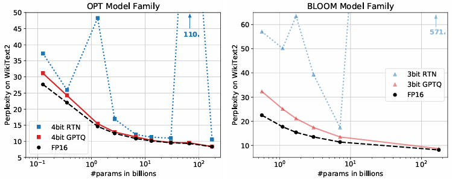
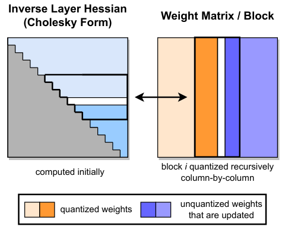

# GPTQ: Accurate Post-Training Quantization for Generative Pre-trained Transformers

## 📌 Metadata
---
분류
- Quantization
- LLM Compression
- Post-Training Quantization (PTQ)

---
url:
- [paper](https://arxiv.org/abs/2210.17323) (ICLR 2023)
- [github](https://github.com/IST-DASLab/gptq)

---
- **Authors**: Elias Frantar, Saleh Ashkboos, Torsten Hoefler, Dan Alistarh
- **Venue**: ICLR 2023

---

## 📑 Table of Contents
- [Abstract](#abstract)
- [1. Introduction](#1-introduction)
- [2. Related Work](#2-related-work)
- [3. Background](#3-background)
- [4. The GPTQ algorithm](#4-the-gptq-algorithm)
  - [Step 1. Arbitrary Order Insight](#step-1-arbitrary-order-insight)
  - [Step 2. Lazy Batch-Updates](#step-2-lazy-batch-updates)
- [5. Experiments](#5-experiments)
- [6. Conclusion](#6-conclusion)

---

## Abstract

Generative Pre-trained Transformer(GPT 또는 OPT)
- 복잡한 언어 모델링 작업 전반에 걸쳐 획기적인 성능을 제공
- 높은 컴퓨팅 및 스토리지 비용
- 크기가 크기 때문에 높은 정확도의 GPT 모델은 추론에도 여러 성능의 GPU를 필요로 할 수 있다.

GPT 모델의 규모와 복잡성으로 인해 기존 압축 기술의 적용 가능성과 성능이 제한됨

GPTQ
- 위의 문제를 해결
- 대략적인 second-order 정보를 기반으로 하는 새로운 one-shot weight 양자화 방법
- 4 GPU 시간 내에 175B개의 매개변수가 있는 GPT 모델을 양자화 할 수 있다.
- bitwidth를 가중치 당 3 또는 4 비트로 줄일 수 있다.
- 압축되지 않은 basline에 비해 정확도 저하를 무시할 수 있을 정도
- 이전 one-shot 가중치 양자화 방법에 비해 정확도를 유지하며 압축 이득을 두 배 이상 높임
-> 생성적 추론을 위해 단일 GPU에서 175B 매개변수 모델을 처음으로 실행할 수 있게 됨
- 가중치가 2-bit 또는 삼진(-1, 0, 1) 양자화 체제에서 여전히 합리적인 정확도를 제공할 수 있다.
- FP16에 비해 high-end GPUs(NVIDIA A100)를 사용할 때 약 3.25배, cost-effective ones(NVIDIA A6000)를 사용할 때 약 4.5배의 end-to-end 추론 속도 향상을 보임

## 1. Introduction

GPT 또는 OPT로 알려진 Transformer 기반 Pre-trained generative models는 획기적인 성능을 보임
하지만 높은 컴퓨팅 및 스토리지 비용을 요구
(GPT3 175B와 같은 모델은 훈련에 10~100 GPU year이 필요)

GPT3-175B를 FP16으로 양자화해도 326GB 메모리를 차지
-> 최고급 단일 GPU의 메모리 용량을 초과. multi-GPU와 같은 비용이 많이 드는 환경에서 추론을 수행해야 함

**GPT와 같은 모델 압축**
- low-bitwidth 양자화 또는 model pruning은 일반적으로 모델 재학습을 요구
-> GPT와 같은 모델은 재학습 비용이 매우 비싸다.
- 훈련 후 방법: 재훈련 없이 모델을 한 번에 압축
-> 복잡하고 수십억 개의 매개변수로 확장하기 어렵다.
- round-to-nearest quantization는 GPT-175B 규모에 적용된 적이 있다.
    - 낮은 압축 대상(예: 8-bit 가중치)에 대해 잘 작동
    - 더 높은 압축률에서 정확도를 유지하지 못함
- 더 높은 압축률에 대해 one-shot post-training 후 양자화가 일반적으로 실현 가능한지 여부는 알지 못한다.

> **Figure 1. OPT 모델을 4-bit로, BLOOM 모델을 3-bit 정밀도로 양자화. GPTQ를 FP16 baseline 및 RTN(Round-To-Nearest)과 비교**

**논문의 기여**

**GPTQ**
- 훈련 후 양자화 방법
- 효율적이고 정밀하다.
    - 수천억 개의 매개변수가 있는 모델을 최대 몇 시간 내에 실행 가능. 이러한 모델을 상당한 정확도 손실 없이 매개변수 당 3-bit 또는 4-bit로 압축할 수 있을 만큼 정밀함
    - OPT-175B와 BLOOM-176B를 약 4 GPU 시간동안 양자화 가능
    (perplexity(언어 모델이 샘플을 얼마나 잘 예측하는지) 지표의 증가를 최소화하면서)
- 구성 요소당 2-bit 또는 삼진 값으로 극단적으로 양자화해도 강력한 결과를 제공
- 비용 효율적인 A6000GPU 두 개 또는 단일 A100 GPUT에서 압축된 OPT-175B 모델을 실행할 수 있다.

기타 사항
- 생성 작업을 위해 압축된 모델을 효율적으로 실행할 수 있는 실행 harness를 개발
- 빠른 메모리 로딩을 위해 압축을 활용할 수 있는 맞춤형 GPU kernel을 구현
    A100을 사용할 때 약 3.25배, A6000을 사용할 때 약 4.5배 속도 향상을 제공

수천억 개의 매개 변수를 가진 매우 정확한 언어 모델이 구성 요소당 3-4비트로 양자화 될 수 있음을 보인 최초의 사례
- 이러한 높은 수준의 압축은 네트워크가 과도하게 매개변수화되어 있기 때문에 자연스러워 보일 수 있다. 
하지만 압축은 언어 모델링의 정확성(perplexity), bit-width, 원본 모델의 크기 간에 사소하지 않은 절충을 유도

## 2. Related Work

양자화의 두 가지 부류
1. Quantization during training
    - 일반적으로 광범위한 retraining 및/또는 fine-tuning 중에 모델을 양자화
    - 반올림 연산에 대한 몇 가지 대략적인 미분 매커니즘을 사용
2. Post-training(one-shot) methods
    - 수천 개의 데이터 샘플과 몇 시간의 계산과 같은 적당한 자원을 사용하여 pre-trained model을 양자화
    - 대규모 모델에 특히 유용하다.

**PTQ(Post-training Quantization)**

대부분의 post-training 방법은 vision model에 초점을 맞춤
- AdaRound
    - penalty term을 annealing하여 data-dependent rounding을 계산
    - 가중치가 양자화 수준에 해당하는 grid points로 이동하도록 권장
- BitSplit
    - residual error에 대한 squared error objective를 사용하여 bit-by-bit로 양자화된 값을 구성
- AdaQuant
    - straight-through 추정치를 기반으로 직접 최적화 수행
- BRECQ
    - Fisher 정보를 objective에 도입하고, 단일 residual block 내의 layer을 공동으로 최적화
- OBQ(Optimal Brain Surgeon)
    - second-order weight pruning framework를 일반화해서 양자화에 적용
    - 양자화 error 순서대로 가중치를 하나씩 양자화하고 항상 나무지 가중치를 조정
    - 몇 GPU시간 내에 최대 1억 개의 매개변수를 가진 모델에 대해 좋은 결과를 생성 가능. 하지만 더 큰 네트워크로 확장은 어렵다.

**Large-model Quantization.**
ZeroQuant, LLM.int8(), nuQmm 등 기존의 작업들
- 양자화 세분성(granularity. 예: vector-wise, layer-wise 등)을 신중하게 선택
- 매우 큰 모델에 대해 허용 가능한 runtime을 유지하기 위해 가중치를 가장 가까운 (RTN) 양자화 수준으로 반올림

- ZeroQuant
    - AdaQuant와 유사한 layer-wise knowledge distillation을 제안
    - 이 방법을 적용할 수 있는 가장 큰 모델은 1.3B 매개변수 모델
    (3 컴퓨팅 시간 소요. GPTQ는 4시간 만에 100배 큰 모델을 양자화)
- LLM.int8()
    - 몇몇 feature demension의 activation outlier가 양자화를 깨뜨린다는 것을 관찰
    -> 이러한 차원을 더 높은 정밀도로 유지하여 문제 해결을 제안
- nuQmm
    - 특정 binary-coding 기반 양자화 체계를 위한 효율적인 GPU kernel을 개발
    

## 3. Background

**Layer-Wise Quantization**

논문의 방법은 SOTA PTQ 방법의 구조를 따른다.

layer-by-layer로 양자화를 수행해서 각 계층에 해당하는 재구성 문제를 해결

$W_\ell$: 선형 계층 $\ell$에 해당하는 가중치
$X_\ell$: 네트워크를 통과하는 m개의 작은 data point 집합에 해당하는 layer 입력

위와 같을 때,
**objective:** full-precision layer output에 상대적인 제곱 오차를 최소화하는 양자화된 가중치 $\hat{W}$를 찾는 것

$$\displaystyle \begin{aligned}
&\argmin_{\hat{W}}{||WX - \hat{W}X||}_{2}^{2}
&(1)
\end{aligned}$$

또한, $\hat{W}$에 대한 양자화 grid가 process 전에 고정되어 있고, 개별 가중치가 자유롭게 이동 할 수 있다고 가정

**Optimal Brain Quantization**

식 (1)이 W의 각 행에 대한 제곱 오차의 합으로 쓰여질 수 있다.
단일 가중치를 양자화할 때 발생하는 오류를 보상하기 위해 아직 양자화되지 않은 모든 가중치를 항상 업데이트하면서 각 행 $w$를 독립적으로 처리

목적함수가 2차이므로, Hessian은 $H_F = 2X_FX_F^T$이다.

Hessian 행렬: 목적함수를 2차 미분한 행렬. 목적함수의 기울기가 어떻게 변하는가를 나타냄

$F$: 남은 full-precision 가중치의 집합
$w_q$: 다음에 양자화 할 greedy-optimal 가중치
$\delta_F$: F의 모든 가중치에 해당하는 최적 업데이트
quant($w$): w를 양자화 grid에서 가장 가까운 값으로 반올림

$$\displaystyle \begin{aligned}
&w_q = \argmin_{w_q}{\frac{(\rm quant \it (w_q) - w_q)^2}{[H_F^{-1}]_{qq}}},
&\delta_F = -\frac{w_q - \rm quant \it (w_q)}{[H_F^{-1}]_{qq}} \cdot (H_F^{-1})_{:,q}
&\quad(2)
\end{aligned}$$

$w$의 모든 가중치가 양자화될 때까지 식 (2)의 두 방정식을 사용해 반복적으로 양자화
이는 $H^{-1}$의 값비싼 재계산을 피하고 효율적으로 수행된다.
- $H$의 q번째 행과 열을 제거
- Gaussian elimination의 한 단계를 통해 역으로 직접 $w_q$를 양자화 한 후 필요한 H

업데이트된 역은 다음 공식에 의해 계산된다.

$$\displaystyle \begin{aligned}
&H_{-q}^{-1} = (H^{-1} - \frac{1}{[H^{-1}]_{qq}} H_{:,q}^{-1} H_{q,:}^{-1})_{-p}
&\quad(3)
\end{aligned}$$

이 방법은 $W$의 여러 행을 병렬로 처리하는 vectorized 구현과 함께 사용한다.
=> medium-sized models에 대해 납득할 만한 runtime을 달성할 수 있다.
**예:** 단일 GPU에서 1시간 만에 ResNet-50(25M parameters)를 완전히 양자화 할 수 있다.

단점:
$d_{row} \times d_{col}$ 행렬 $W$에 대한 OBQ의 runtime이 3차 입력 종속성 $O(d_{row} \cdot d_{col}^3)$이 있다.
=> 수십억 개의 매개 변수가 있는 모델에 적용하는 비용이 매우 비싸다.

논문의 방법은 최근에 제한된 OBQ(Optimal Brain Quantization)을 기반으로 한다.

## 4. The GPTQ algorithm

### Step 1. Arbitrary Order Insight

OBQ는 greedy 순서로 가중치를 양자화
(현재 추가 양자화 오류가 가장 적은 가중치를 항상 선택)

하지만 임의의 순서로 가중치를 양자화하는 것에 비해 개선되는 정도는 작음
- 개별 오차가 큰 양자화된 가중치들 중 일부가 프로세스가 끝날 무렵 양자화되는 가중치에 의해 균형을 이루기 때문

**어떤 순서라도 대형 모델에서 특히 잘 수행될 수 있다.**

> **Figure 2. GPTQ 양자화 프로시저**
연속된 열의 블록(굵은 선)은 Cholesky decomposition에 저장된 inverse Hessian information을 사용하여 지정된 단계에서 양자화된다. 나머지 가중치(오른쪽 그림 파란색)은 단계가 끝날 때 업데이트된다.
양자화 프로시저는 각 블록 내에서 재귀적으로 적용되며, 흰색 중간열은 현재 양자화되고 있다.

OBQ 방법은 추가 양자화 오류가 가장 적은 순서로 W의 행을 독립적으로 양자화

이 논문에서는 모든 행의 가중치를 동일한 순서로 양자화하는 것을 목표로 함
- 일반적으로, 원래 솔루션과 유사한 최종 제곱 오차를 갖는 결과를 산출한다.
- 양자화되지 않은 가중치 $F$ 와 유사하게 $H_F^{-1}$의 집합은 항상 모든 행에 대해서 동일하다.
($H_F$가 가중치가 아닌 모든 행에 대해 동일한 layer inputs $X_F$에만 의존하기 때문.)

**식 (3)에 의해 주어진 $H_F^{-1}$의 업데이트를 가중치 당 $d_{row} \cdot d_{col}$ 번 하는 것이 아니라 열 당 $d_{col}$ 번 수행해야 한다.**
-> 전체 런타임이 $O(d_{row} \cdot d_{col}^3)$에서 $O(max{d_{row} \cdot d_{col}^2, d_{col}^3})$으로, 즉 $min{d_{row}, d_{col}}$의 비율로 줄어든다.

이 알고리즘을 실제로 매우 큰 모델에 적용하기 전에 두 가지 중요한 문제를 해결해야 한다.

### Step 2. Lazy Batch-Updates
1. 앞에서 설명한 scheme의 알고리즘이 상대적으로 컴퓨팅 대 메모리 접근(compute-to-memory-access) 비율이 낮기 때문에 실제로 빠르지 않다.
예: 식 (3)은 각 항목에 대해 몇 개의 FLOPs만 사용하여 잠재적으로 거대한 행렬의 모든 요소를 업데이트해야 한다.
-> 최신 GPU의 컴퓨팅 기능을 제대로 활용할 수 없다.
-> 메모리 대역폭이 크게 낮아지면 병목 현상이 발생한다.

다음을 통해 해결 가능
- i열에 대한 최종 반올림 결정은 해당 열에서 수행된 업데이트의 영향만 받는다.
(이후 열에 대한 업데이트는 관련이 없다)
-> "lazily batch" 업데이트를 함께 수행하는 것이 가능하다.
-> 더 나은 GPU 사용률을 얻을 수 있다.

알고리즘을 한 번에 $B = 128$개의 열에 적용하여 해당 열과 $H^{-1}$의 해당 $B \times B$ 블록에 포함된 업데이트를 유지한다.
