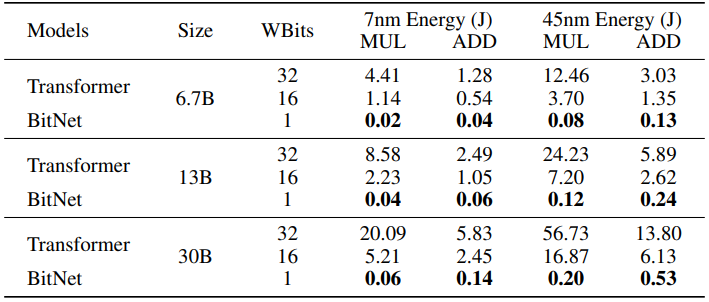

# BitNet: Scaling 1-bit Transformers for Large Language Models

---

- Quantization

---

Hongyu Wang et al.  
arxiv. 2023.  
url: https://arxiv.org/abs/2310.11453

---

목차

0. [Abstract](#abstract)
1. [Introduction](#1-introduction)
2. [BitNet](#2-bitnet)
3. [FP16 Transformer와 비교](#3-fp16-transformer와-비교)
4. [Post-training quantization과 비교](#4-post-training-quantization과-비교)
5. [절제 연구](#5-절제-연구)
6. [결론 및 향후 연구](#6-결론-및-향후-연구)

---

## Abstract

대규모 언어 모델의 크기 증가  
-> 배포 어려움, 높은 에너지 소비

**BitNet**
- 1bit transformer 아키텍쳐
- nn.Linear 레이어의 drop-in 대체품으로 BitLinear을 소개
- 최첨단 8bit 양자화 방법 및 FP16 transformer baseline에 비해 메모리 사용량과 에너지 소비를 크게 줄이면서 경쟁력 있는 성능을 달성
- full-precision transformer과 유사한 확장 법칙을 보임  
-> 효율성과 성능 이점을 유지하면서 더 큰 언어 모델로 효과적으로 확장 가능하다.

## 1. Introduction

> **Fig 1.**  
BitNet은 1-bit transformer을 처음부터 훈련하여 에너지 효율적인 방법으로 경쟁력 있는 결과를 얻는다.
SOTA 양자화 방법을 크게 능가하며, 모델 크기가 확장됨에 따라 FP16으로 훈련된 모델보다 경쟁력 있는 성능을 달성하는 동시에 비용 절감이 더 커진다.

대규모 언어 모델 호스팅은 **높은 추론 비용과 에너지 소비**로 많은 비용이 필요하다
- 모델의 크기가 커질수록 메모리 대역폭이 주요 병목 현상이 되어 전반적인 추론 성능을 제한한다.
- 장치 간 통신 오버헤드는 추론 대기 시간 및 에너지 소비에 상당한 영향을 미칠 수 있다.  
(모델을 분산 시스템 또는 다중 장치 플랫폼에 배포할 때)

**모델 양자화는 성능을 거의 유지하면서 메모리 공간과 계산 비용을 크게 줄일 수 있다.**

LLM에서는 양자화 방식으로 **PTQ(Post-Training Quantization)** 을 주로 사용한다.
- 학습 pipeline을 변경하거나 모델을 다시 학습할 필요가 없다.
- 간단하고 적용하기 쉽다.
- 정밀도가 낮아질 때(양자화 할 때) 정확도가 더 크게 낮아진다.
    - 모델이 훈련 과정에서 양자화된 표현에 최적화되지 않았기 때문

**QAT(Quantization-Aware Training)**
- PTQ와 비교했을 때, 모델이 처음부터 감소된 정밀도를 설명하도록 훈련되기 때문에 정확도가 더 높다.
- 모델이 계속 훈련하거나 미세 조정을 수행할 수 있다.(LLM에 필수적인 요소)
- 정밀도가 낮아질수록 모델이 수렴하기 더 어려워진다.
- QAT가 Neural Language Model의 scaling 법칙을 따르는지 여부가 알려져 있지 않다.

**이진화(1-bit)에 대한 이전 연구**
- CNN을 중심으로 이루어짐
- Transformer에 대해 이뤄진 연구의 경우, 기계 번역 또는 BERT 사전 학습에 중점을 둠
    - 기계 번역은 encoder-decoder 아키텍처를 사용
    - BERT 사전 학습은 양방향 인코더를 사용
    - LLM은 단방향 디코더를 사용
    - LLM은 일반적으로 훨씬 더 큰 모델 크기로 확장되는 반면, 기계 번역 모델과 BERT는 광범위한 확장을 거치지 않음

**BitNet**
- 1-bit Transformer 아키텍처
- QAT 방법 사용
- 저정밀도 binary 가중치와 양자화된 활성화를 사용
- 훈련 중 optimizer 상태 및 gradient에 대해 높은 정밀도를 유지
- LLM을 효율적으로 처리할 수 있는 기능을 통해 확장 가능하고 안정적으로 설계됨
- 구현이 쉽다.
    - linear projection(nn.Linear)만 대체하면 됨
- PagedAttention, FlashAttention 및 추측 디코딩과 같은 LLM에 대한 다른 가속 방법을 보완

다양한 언어 모델링 벤치마크에서 BitNet을 평가
- 복잡성과 downstream 작업 정확성 측면에서 경쟁력 있는 성능을 달성
- baseline에 비해 메모리 공간과 에너지 소비를 크게 줄임
- full-precision transformer와 유사한 scaling 법칙을 따른다.
    -> 더 큰 LLM으로 효과적으로 scailing 될 수 있다.

## 2. BitNet

> **Fig 2.**  
(a) BitLinear의 계산 흐름
(b) BitNet의 아키텍처. attention과 FFN의 stack으로 구성되며, 행렬 곱셈은 BitLinear로 구현됨

- 트렌스포머와 동일한 레이아웃(Fig 2 참고)
- 기존의 행렬 곱셈 대신 BitLinear 사용
- 다른 구성 요소는 고정밀도(8-bit)로 놔둔다
    - residual connection과 layer normalization은 LLM에서 무시할 수 있는 정도의 계산 비용이다.
    - 모델이 커짐에 따라 QKV 변환의 계산 비용이 parametric 투영보다 훨씬 작다.
    - LM이 sampling을 수행하기 위해 고정밀 확률을 사용해야 하기 때문에 입력/출력 임베딩의 정밀도를 유지한다.

### 2.1 BitLinear

signum 함수를 사용하여 가중치를 +1 또는 -1로 이진화.
- 이진화 전에 가중치를 평균이 0이 되도록 중앙 집중화
- scaling factor $\beta$는 이진화 후에 실제 값과 이진화된 가중치 사이의 $L2$ error을 줄이는 데 사용

$W \in R^{n \times m}$는 다음과 같이 이진화

$$
\displaystyle
\begin{aligned}
&\tilde{W} = Sign(W - \alpha)
&(1)
\end{aligned}
$$

$$
\displaystyle
\begin{aligned}
&Sign(W_{ij}) = 
\begin{cases}
+1, &\rm if \it W_{ij} > 0, \\
-1, &\rm if \it W_{ij} \leq 0,
\end{cases}
&(2)
\end{aligned}
$$

$$
\displaystyle
\begin{aligned}
&\alpha = \frac{1}{nm} \sum_{ij} W_{ij}
&(3)
\end{aligned}
$$

activation을 **absmax 양자화**를 사용하여 b-bit 정밀도로 양자화([LLM.int8(), T. Dettmers, 2022.](https://arxiv.org/abs/2208.07339)의 방법을 따름)  
(activation을 양자화: activation 함수를 거친 값을 양자화)
- $Q_b$를 곱하여 activation을 $[-Q_b, Q_b](Q_b = 2^{b-1})$범위로 확장 (INT8이라면, [-127, 127])
- 입력 행렬의 최대값의 절대값으로 나눈다.

$$
\displaystyle
\begin{aligned}
&\tilde{x} = Quant(x) = Clip(x \times \frac{Q_b}{\gamma}, -Q_b + \epsilon, Q_b - \epsilon)
&(4)
\end{aligned}
$$

$$
\displaystyle
\begin{aligned}
&Clip(x, a, b) = max(a, min(b, x)), \gamma=\Vert x{} \Vert_{\infty},
&(5)
\end{aligned}
$$

$\epsilon$: clipping을 수행할 때 오버플로를 방지하기 위한 작은 숫자

ReLU와 같은 activation의 경우 입력(activation을 거치고 난 후 BiTLinear의 입력)의 모든 값이 음수가 안되도록 입력 값의 최소값을 빼서 $[0, Q_b]$ 범위로 조정

$$
\displaystyle
\begin{aligned}
&\tilde{x} = Quant(x) = Clip((x - \eta) \times \frac{Q_b}{\gamma}, \epsilon, Q_b - \epsilon), \eta = \min_{ij} x_{ij}.
&(6)
\end{aligned}
$$

이 논문에서는 activation을 8-bit로 양자화  
양자화는 훈련 중에 tensor당, 추론 중에는 토큰 별로 수행  
(안정성과 효율성을 위해)

**최종 행렬 곱셈:**
$$
\displaystyle
\begin{aligned}
&y=\tilde{W}\tilde{x}
&(7)
\end{aligned}
$$

출력 $y$의 분산:  
($W$와 $x$의 요소는 상호 독립적이고 동일한 분포를 공유하고, $W$와 $x$가 서로 독립이라고 가정 시)

$$
\displaystyle
\begin{aligned}
Var(y)&=nVar(\tilde{w}\tilde{x})
&(8)\\
&=nE[\tilde{w}^2]E[\tilde{x}^2]
&(9)\\
&=n\beta^2E[\tilde{x}^2] \approx E[\tilde{x}^2]
&(10)
\end{aligned}
$$

- full-precision 계산의 경우, 출력 y의 분산은 표준 초기화 방법을 사용하여 1의 scale로 표시된다  
-> 훈련 안정성에 큰 이점이 있다.

양자화 후 분산을 유지하기 위해 activation 양자화 전에 LayerNorm 함수를 도입  
-> 출력 y의 분산은 $var(y) \approx E[LN(\tilde{x}^2)]=1$로 추정된다.

Transformer에서 이는 SubLN과 정확하게 같은 구현을 갖는다.

SubLN과 위의 양자화 방법을 사용하면 다음과 같은 공식화된 BitLinear가 있다.

$$
\displaystyle
\begin{aligned}
&y=\tilde{W}\tilde{x} = \tilde{W} \rm Quant(LN(x)) \it \times \frac{\beta\gamma}{Q_b}
&(11)
\end{aligned}
$$

$$
\displaystyle
\begin{aligned}
&LN(x) = \frac{x - E(x)}{\sqrt{Var(x) + epsilon}}, \beta=\frac{1}{nm} \Vert W \Vert_1
&(12)
\end{aligned}
$$

SubLN 후 activation은 absmax 함수로 양자화  
행렬 곱셈은 1bit 가중치와 양자화 된 activation 사이에서 수행된다.  
출력 activation은 $\{\beta, \gamma\}$로 rescale되어 역양자화된다.

**Group Quantization 및 Normalization을 사용한 모델 병렬 처리**

- **모델 병렬 처리**: 여러 장치에서 행렬 곱셈을 분할
- 기존 모델 병렬 처리의 전제 조건: tensor가 partition 차원을 따라 독립적이어야 함
- $\alpha, \beta, \gamma, \eta$에 해당하는 모든 매개변수는 전체 tensor에서 계산되므로 전제 조건을 위반한다.  
이를 해결하기 위해 각 매개변수에 대해 하나의 all-reduce 연산을 도입할 수 있다.  
-> 각 매개변수에 대한 통신이 적더라도 모델이 심화됨에 따라 동기화량이 증가하여 forward pass 속도가 크게 느려진다.  
-> SubLN에도 동일한 문제가 있다.(partition 차원에서 평균과 분산을 추정해야 함)
- 이를 위해 모델 병렬 처리를 효율적으로 만드는 간단한 접근 방식을 제안  

**Group Quantization**
- 가중치와 activation을 그룹으로 나눈 다음, 각 그룹의 매개변수를 독립적으로 추정  
-> 추가 통신 없이 local에서 매개변수 계산 가능

**가중치 행렬 Group Quantization**

- 가중치 행렬 $W \in R^{n \times m}$의 경우, partition 차원을 따라 $G$ 그룹으로 나눈다.  
(각 그룹의 크기: $\frac{n}{G} \times m$)  
그 다음, 각 그룹에 대한 매개변수를 독립적으로 추정한다.

$$
\displaystyle
\begin{aligned}
&\alpha_g = \frac{G}{nm} \sum_{ij} W_{ij}^{(g)}, \quad \beta_g = \frac{G}{nm} \Vert W^{(g)} \Vert_1,
&(13)
\end{aligned}
$$

$W^{(g)}$: 가중치 행렬의 g번째 그룹

**Activation Group Quantization**

- 입력 행렬 $x \in R^{n \times m}$을 $G$ 그룹으로 나누고 각 그룹에 대한 매개변수를 계산할 수 있다.

$$
\displaystyle
\begin{aligned}
&\gamma_b = \Vert x^{(g)} \Vert_{\infty}, \quad \eta_g = \min_{ij} x_{ij}^{(g)}
&(14)
\end{aligned}
$$

**LN Group Quantization**

- 그룹 정규화 기법을 적용하여 각 그룹의 평균과 분산을 독립적으로 계산할 수 있다.

$$\displaystyle
\begin{aligned}
& \rm LN \it (x^{(g)}) = \frac{x^{(g)} - E(x^{(g)})}{\sqrt{Var(x^{(g)}) + \epsilon}}
&(15)
\end{aligned}
$$

**Group Quantization 및 Normalization을 사용하여 모델 병렬 처리를 효율적으로 구현할 수 있다.**  
-> 추가 통신이 필요하지 않다.  
-> LLM으로 확장할 수 있다.

### 2.2 Model Training

**Straight-through estimator(STE)**

- 1-bit 모델을 훈련하기 위해 STE를 사용하여 역전파 기울기를 근사화  
-> backpropagation 중에 Sign 및 Clip 기능과 같은 미분 불가능한 기능을 우회

**Mixed precision training**

- 가중치와 activation은 낮은 정밀도로 양자화  
- gradient와 optimizer 상태는 훈련 안정성과 정확성을 보장하기 위해 높은 정밀도로 저장
- latent 가중치($\tilde{W}$)는 high-precision 형식으로 유지  
-> 학습 가능한 매개변수가 업데이트를 누적할 수 있도록
- latent 가중치는 forward pass 중에 즉석에서 이진화되며 추론 과정에 사용하지 않는다.

**큰 Learning rate**

- latent 가중치에 대한 작은 업데이트가 종종 1-bit 가중치에 차이를 만들지 않는다.  
-> 편향된 기울기와 업데이트가 발생  
-> 모델이 빨리 수렴해야 하는 경우 학습 시작 부분에서 특히 심각하다.
- learning rate를 높이는 것이 최적화를 가속화하는 가장 간단하고 최상의 방법
- 실험 결과, BitNet은 큰 learning rate의 이점을 얻는 반면  
FP16 Transformer은 이전과 동일한 learning rate로 훈련 시작 시 발산

### 2.3 Computational Efficiency

BitNet의 계산 효율성 추정(산술 연산 에너지, memory footprint에 대해)

> **Table 1. BitNet과 Transformer의 에너지 소비**  
결과는 입력 길이 512와 같다.

> **Table 2. 45nm 및 7nm 공정 노드에서 서로 다른 bit 표현에 대한 ADD 및 MUL 에너지 소비**

**산술 연산 에너지**

- 기본 Transformer에서 차원이 $m \times n$ 및 $n \times p$인 행렬을 곱할 경우, 에너지 소비는 다음과 같다.

$$
\displaystyle
\begin{aligned}
&E_{add} = m \times (n - 1) \times p \times \hat{E}_{add}
&(16)
\end{aligned}
$$

$$
\displaystyle
\begin{aligned}
&E_{mul} = m \times n \times p \times \hat{E}_{mul}
&(17)
\end{aligned}
$$

- BitNet에서 행렬 곱셈의 에너지 소비는 가중치가 1-bit이기 때문에 덧셈 연산에 의해 좌우된다.  
곱셈 연산은 scalar $\beta$ 및 $\frac{\gamma}{Q_t}$를 사용하여 출력을 scailing하는 데만 적용되므로 다음과 같이 계산할 수 있다.

$$
\displaystyle
\begin{aligned}
&E_{mul} = (m \times p + m \times n) \times \hat{E}_{mul}
&(18)
\end{aligned}
$$

- 표 1에서 full-precision(32-32) 및 half-precision(16-16) Transformer과 비교한 W1A8 BitNet의 에너지 소비를 비교  
-> BitNet은 곱셈 연산에 대해 상당한 에너지 절약을 제공

## 3. FP16 Transformer와 비교

### 3.1 Setup

- 125M에서 30B에 이르는 다양한 규모의 BitNet으로 일련의 autoregressive LM을 훈련
- 훈련 데이터: Pile dataset, Common Crawl snapshots, 실제 뉴스, CC-Stories dataset
- Sentencpiece Tokenizer을 사용하여 데이터를 전처리(vocab size: 16K)
- 동일한 설정으로 Transformer baseline을 훈련

### 3.2 Inference-Optimal Scaling Law

Neural Language Model은 vanila Transformer 아키텍처를 통해 예측 가능하게 확장됨이 입증되었다.

loss는 훈련에 사용되는 계산량의 거듭제곱으로 확장된다.  
(여기서 loss는 정확도 loss를 의미)  
-> 계산 예산의 최적 할당을 결정할 수 있다.  
-> 소규모 모델에서 LLM의 성능을 예측할 수 있다.

> **Figure 3. BitNet과 FP16 Transformer의 scaling curve**

Fig 3은 BitNet의 loss scaling이 멱법칙을 따르는 FP16 Transformer과 유사하다는 것을 보인다.  
(멱법칙: 한 수가 다른 수의 거듭제곱으로 표현되는 두 수의 함수적 관계)

축소할 수 없는 loss 항으로 scaling 법칙을 맞춘다.

$$
\displaystyle
\begin{aligned}
&L(N) = aN^b + c
&(19)
\end{aligned}
$$

scaling 법칙이 loss를 정확하게 예측할 수 있는지 평가
- 125M에서 6.7B까지 모델을 선택하고 법칙을 적용해서 13B와 30B의 loss를 예측  
-> scaling 법칙이 BitNet의 loss를 높은 정확도로 예측함

BitNet과 FP16 Transformer의 loss 갭은 모델이 커질수록 작아진다.  
위의 멱법칙은 BitNet의 확장 추세를 측정하지만 loss와 실제 컴퓨팅 간의 관계를 적절하게 모델링하지는 않는다.

FLOP를 계산하여 컴퓨팅을 추정하는 방법은 정수 계산 비용이 대부분인 1-bit 모델에는 사용할 수 없다.

**Inference-Optimal Scaling 법칙**
- 에너지 소비에 대한 loss를 예측
- 이 논문에서는 추론 에너지 비용에 초점을 맞춘다.(훈련 비용은 한 번만 들기 때문)
- Fig 3은 7nm 공정 노드에서 추론 에너지 비용에 대한 scaling 곡선을 보인다.  
-> BitNet이 확장 효율성이 더 높음을 증명  
-> 고정된 계산 예산이 주어지면 BitNet은 더 나은 손실을 달성  
-> 추론 비용은 FP16 모델과 동일한 성능 기준에서 더 적다.  

### 3.3 Downstream Tasks에 대한 결과

> **Figure 4. BitNet과 FP16 Transformer의 추론 비용 대비 성능 비교**  
(a) Zero-shot  
(b) Few-shot

BitNet의 확장 능력을 평가하기 위해 4개의 Downstream 작업에서 0-shot 및 4-shot 결과를 모두 테스트
- Fig 4에서, Downstream 작업 성능은 계산 예산이 증가함에 따라 확장될 수 있다.
- 확장 효율성이 FP16 Transformer baseline보다 훨씬 높다.

### 3.4 안정성 테스트

> **Figure 5.**  
(a) BitNet은 Fp16 Transformer보다 동일한 학습률에서 더 안정적이다.  
(b) 훈련 안정성으로 인해 BitNet은 더 큰 learning rate를 사용할 수 있으며, 이로 인해 더 나은 수렴이 가능하다

다양한 peak learning rate로 일련의 모델을 훈련하여 안정성 테스트 수행
- BitNet은 큰 learning rate로 수렴할 수 있지만 FP16 Transformer은 그렇지 않다.
- 이러한 이점으로, 더 큰 learning rate로 훈련할 수 있다.

## 4. Post-training Quantization과 비교

### 4.1 Setup
- 3.1절과 동일한 설정으로 BitNet을 훈련
- Absmax, SmoothQuant, GPTQ, QulP 등과 비교
    - Absmax, SmoothQuant: 가중치와 activation을 모두 양자화. W8A8, W4A4, W1A8로 실험
    - GPTQ, QulP: 가중치만 양자화. W4A16 및 W2A16으로 실험

### 4.2 Results

> **Figure 6. BitNet과 PTQ baseline을 downstream task에서 비교**  
(a) Zero-shot 결과  
(b) Few-shot 결과

> **Table 3. BitNet과 baseline의 Zero-shot 비교**  
(PTQ: Post-training quantization, WGe: Wino-grande, WG: Winograd, SC: Storycloze, HS: Hellaswag dataset)

표 3에서 BitNet의 zero-shot 성능에 대한 비교 분석을 진행 (모든 모델은 6.7B 크기)

BitNet은 낮은 bit 레벨에서 baseline보다 경쟁력 있는 성능을 달성
- zero-shot 점수는 8-bit 모델과 비슷하지만 추론 비용은 저렴
- 4-bit 모델의 경우, 가중치만 양자화하는 방법은 가중치와 activation을 양자화하는 방법보다 성능이 뛰어남  
(activation을 양자화하기 더 어렵기 때문에)
- BitNet은 4-bit 모델보다 훨씬 더 나은 결과를 달성
- 낮은 bit(2, 1)레벨에서, BitNet은 모든 baseline보다 우수한 점수를 갖는다.  
-> PTQ 방법보다 QAT 방법의 이점을 입증

Fig 6은 모델 크기를 1.3B에서 6.7B로 확장하면서 BitNet과 baseline의 zero-shot 정확도와 few-shot 정확도를 요약
- 다른 모델 크기에서도 이점이 일관됨을 증명

## 5. 절제 연구

> **Table 4. BiTNet의 절제**  
Elastic은 [Liu, Zechun et al. 2022.](https://proceedings.neurips.cc/paper_files/paper/2022/hash/5c1863f711c721648387ac2ef745facb-Abstract-Conference.html)의 양자화 방법  
BMT는 [Zhang, Yichi et al. 2024.](https://proceedings.neurips.cc/paper_files/paper/2023/hash/bd1fc5cbedfe4d90d0ac2d23966fa27e-Abstract-Conference.html)의 아키텍처 - low-bit model의 훈련을 안정화

표 4에서 여러 대안 접근법과 비교한 절제 연구를 제시

**실험 1. activation 양자화 접근 방식에서 제시한 방법의 효과 제거**

- absmax 대신 elastivc function(탄성 함수)를 사용해서 activation 양자화
- elastic function(탄성 함수)
    - 학습 가능한 매개변수
    - scale을 동적으로 조정
- 실험 결과, absmax가 elastic function보다 성능이 우수
    - absmax는 보다 안정적인 훈련을 이끌어냄  
    -> BitNet이 더 큰 learning rate 사용을 가능하게 함

**실험 2. 모델 훈련을 안정화하는 기술 제거**

- SubLN을 Pre-LN 및 BMT 아키텍처와 비교  
(BitNet은 훈련 안정성을 위해 SubLN 사용)
- Pre-LN: GPT와 관련된 기본 아키텍처  
- BMT: 이진화 모델의 안정성을 향상시키는 아키텍처
- 실험 결과, SubLN이 Pre-LN과 BMT를 모두 능가한다.

## 6. 결론 및 향후 연구

BitNet
- LLM을 위한 새로운 1-bit transformer 아키텍처
- 확장 가능하고 안정적으로 설계됨
- BitNet이 복잡성과 downstream 작업 측면에서 경쟁력 있는 성능을 달성
- baseline보다 메모리 공간과 에너지 소비를 크게 줄임
- full-precision transformer와 유사한 scaling 법칙을 따름