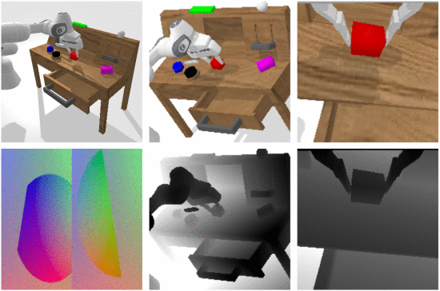

# DreamVLA: A Vision-Language-Action Model Dreamed with Comprehensive World Knowledge

---
Reference

본 문서에 사용된 모든 이미지와 표는 해당 논문에서 발췌하였습니다.

---

## 📌 Metadata
---
분류
- Vision Language Action Model

---
url:
- [paper](https://arxiv.org/abs/2507.04447) (arXiv 2025)
- [project](https://zhangwenyao1.github.io/DreamVLA/)

---
- **Authors**: Wenyao Zhang, Hongsi Liu, Zekun Qi, Yunnan Wang, Xinqiang Yu, Jiazhao Zhang, Runpei Dong, Jiawei He, Fan Lu, He Wang, Zhizheng Zhang, Li Yi, Wenjun Zeng, Xin Jin
- **Venue**: arXiv 2025

---

## 📑 Table of Contents
- [Abstract](#abstract)
- [1. Introduction](#1-introduction)
- [2. Related Works](#2-related-works)
- [3. Method](#3-method)

---

## Abstract

**기존 VLA**
- 정보 중복 및 동적, 공간적, 의미적 정보를 포함한 포괄적이고 중요한 world knowledge가 부족한 어려운 image-based forecasting에 한정됨
- inverse dynamics 모델링을 가능하게 함

**DreamVLA**
- comprehensive world knowledge forecasting을 통합
    - inverse dynamic model을 가능하게 함
    - 조작 작업을 위한 perception-prediction-action loop를 구축
- dynamic-region-guided world knowledge prediction을 도입
    - 공간적 및 의미적 단서와 통합됨
    - action planning을 위한 간결하면서도 포괄적인 표현 제공
    - 사람이 행동하기 전에 먼저 추상적인 multimodal reasoning chain을 형성하는 방식과 일치함
- block-wise structured attention mechanism 도입
    - 훈련 중 동적, 공간적, 의미적 정보 간의 간섭을 완화하기 위함
    - mutual attention을 차단하여 정보 유출을 방지
    - 각 representation을 깨끗하고 disentangle되게 유지
- diffusion-based transformer 사용
    - 미래 행동에 대한 conditional distribution을 모델링하기 위함
    - shared latent features로부터 action representations를 disentangle
- 성능
    - 실제 로봇 작업에서 76.7% 성공률 달성
    - CALVIN ABC-D 벤치마크에서 평균 4.44의 길이 달성

## 1. Introduction

**로봇 학습에서의 VLA**
- 사전학습된 multi-modal LLM(MMLMs)을 활용하여 자연어 지시 + 시각적 관찰을 로봇 행동으로 직접 매핑
- 관찰로부터 행동을 직접 매핑하는 것은 인간이 갖는 폐쇄형 예측 능력이 결여됨
    - 환경에 대한 미래 지식을 이해하고 추론할 때 갖는 능력
- VLA에 future knowledge 예측 통합을 위한 기존 방법
    - copilot 생성 모델로 미래 프레임/keypoint 생성(git copilot이 아니라 부조종사/보조 모델로 해석)
    - goal 이미지에 조건화된 행동 sequence 예측
    - 몇몇 방법은 단일 프레임워크에서 pixel-level 이미지 예측과 행동 예측을 통합
        - 예측 & 계획 시너지를 활용
        - 예측을 LLMs처럼 중간 추론 단계로 간주
    - 한계점
        1. 중복 pixel 정보
            - 예측 이미지화 현재 관찰 사이 상당한 겹침 존재
                - 예측 효율성과 효과가 떨어짐
        2. 공간 정보 부족
            - 환경의 명시적 3D 지식이 결여됨
        3. 고수준 지식 예측 부족
            - 미래 상태에 대한 고수준 이해(예: 의미적 정보)가 결여됨
    - 기존 방법이 world-level future knowledge를 기반으로 보다 포괄적인 prediction-action loop를 위해 미래 상태 예측에 충분하지 않음

**DreamVLA**

- 포괄적인 world knowledge forecasting을 vision-language-action model에 통합
- manipulation 작업을 위한 perception-prediction-action loop를 구축
- 전체 미래 프레임을 직접 생성하는 대신, world embedding 도입
    - 동적 영역, 깊이, 고수준 semantic feature 등 로봇 실행과 관련있는 world knowledge 학습
        - 인간이 세계와 상호작용하는 방식을 반영
        - 관련 변화와 world knowledge를 강조
- 환경의 목표 측면을 상상/예측
    - 간결하고 관련성 높은 중간 표현 제공
        - 모델이 보다 효과적인 행동 계획을 수행할 수 있도록
- 세 가지 주요 특징
    1. Dynamic region-based forecasting
        - 기존의 optical flow 예측 모델을 활용하여 장면 내 동적 영역을 식별
        - 모델이 불필요한 프레임 재구성 대신 작업 수행에 중요한 움직임 영역에 집중 가능
    2. Depth-aware forecasting
        - 프레임별 depth map을 생성하기 위해 depth estimation 기술 사용
    3. High-level foundation features
        - DINOv2와 SAM과 같은 visual foundation model과 aligned semantic feature 통합
    - 이를 통해 모델이 계획하고 실행할 수 있는 보다 포괄적이고 효과적인 경로 제공
- block-wise structured attention mechanism
    - mutual attention을 마스킹하여 정보 누출 방지
    - 각 표현을 깨끗하고 disentangled된 상태로 유지
- world 및 action embedding이 동일한 latent space를 차지하고 유사한 통계를 기록
    - naive MLP head는 modality 별 정보를 분리하거나 cross-modal 상관관계를 활용할 수 없음
- diffusion-based transformer 사용
    - shared latent feature에서 action representation을 분리하여 행동을 추론

**평가**
- CALVIN 벤치마크에서 SOTA 달성(평균 길이 4.44)
- world knowledge의 각 구성 요소가 향상을 제공
    - 동적 영역 예측만으로도 큰 성능 향상 제공
    - depth 및 semantic 신호는 작은 이점 제공
- depth나 semantic 예측을 단독으로 사용하면 성능 향상에 도움이 되지 않음(성능 저하도 가능)

**논문의 기여**
- VLA 모델을 Perception-Prediction-Action model로 재구성
    - 모델이 동적 & 공간적 & 고수준 의미 정보를 압축된 형태로 명시적으로 예측
    - planning을 위한 간결하면서도 포괄적인 look-ahead(선행) 단서를 제공
- block-wise structured-attention 메커니즘 도입
    - diffusion-transformer decoder과 결합하여 cross-type knowledge leakage로 인한 representation noise를 억제
    - 일관된 multi-step action reasoning을 가능하게 함
- CALVIN ABC-D 벤치마크에서 새로운 SOTA 달성
    - 기존 방법보다 3.5% 더 우수한 성과 달성
    - 실제 환경에서 성공률을 76.7%로 향상

## 2. Related Works

## 3. Methodology

### 3.1 Proble Definition and Notation

- future world knowledge를 로봇 제어를 위한 중간 reasoning으로 간주하는 역동역학 문제로 vision-language-action reasoning을 공식화
    - 예측과 실행의 시너지를 최대한 발휘
- 각 시점 $t$에서 로봇이 받는 신호
    - 자연어 명령: $l$
    - raw visual frame: $o_t$
    - 자체 고유 감각 상태: $s_t$
- look-ahead reasoning 도입을 위해 \<dream\> 쿼리라고 불리는 특수 토큰 정의
- 모든 입력을 하나의 sequence로 연결
- world embedding:
    - 통합 모델 $\mathcal{M}$은 이러한 입력을 압축된 잠재 표현으로 매핑
    $$
    \displaystyle
    \rm{w}_{t + n} = \mathcal{M}(l, o_t, s_t | \rm{<dream>})
    \tag{1}
    $$
- world embedding은 motion cues, 공간 detail 정보 및 high-level semantics를 결합한 종합적인 world knowledge를 예측
    - 예측기 $\mathcal{P}$ 세트가 $n$ step 앞을 추론
    $$
    \displaystyle
    \hat{p}_{t + n} = \mathcal{P}(\rm{w}_{t + n}) = [\hat{f}_{t + n}, \hat{d}_{t + n}, \hat{c}_{t + n}]
    \tag{2}
    $$
    > $\hat{f}_{t + n}$: 동적 영역 표시  
    > $\hat{d}_{t + n}$: monocular depth encoding  
    > $\hat{c}_{t + n}$: (선택적) high-level semantic feature(예: DINOv2, SAM)을 저장
- world embedding $\rm{w}_{t + n}$이 주어지면, <action> 쿼리는 관련된 행동 정보를 통합하기 위해 통합 모델 $\mathcal{M}$에 의해 latent action embedding에 할당됨
- denoising-diffusion transformer $D$는 latent feature을 기반으로 $n$-step action을 공식화
$$
\hat{a}_{t: t + n - 1} = \mathcal{D}(\mathcal{M}(l, o_t, s_t, <dream> | <action>)),
\tag{3}
$$

- 학습과 추론 동안 동일한 perception-prediction-action loop가 완성됨

### 3.2 Model Architecture

**DreamVLA 프레임워크**
- Encoder
    - 자연어 $l$, 시각 관측 $o_t$, 고유 감각 상태 $s_t$를 포함한 이질적인 입력을 개별적으로 처리
    - CLIP text embedding
        - language instruction encode
    - Masked Autoencoder
        - visual frame에서 시공간 patch 표현을 얻음
    - 여러 convolutional & fully-connected layers
        - 고유 감각 신호를 encode
    - encoding 후, \<dream\> 및 \<action\>으로 지정된 학습 가능한 쿼리가 multimodal embeddings에 추가됨
        - \<dream\>: 특정 지식 예측에 사용될 수 있는 세 가지 하위 쿼리(동적, 깊이, 의미)를 포함
            - 이후 GPT-2 기반 LLM으로 구조화된 causal&non-causal attention mechanism(Figure 4)를 사용해 modality와 쿼리 간의 통합 및 attend를 수행
            - low-level perceptual signal을 world state에 대한 compact하고 의미적으로 일관된 표현으로 융합
- 경량 출력 헤드
    - 얕은 convolution layer로 구성됨
    - world embedding을 명시적 예측으로 decoding
    - 예상되는 동적 영역, monocular depth, semantic feature을 재구성
- 추론 시 Decoder을 건너뛰어 계산 절약
    - 대신 모델은 pixel 수준 재구성 없이 future dynamics, depth, semantics를 캡슐화하는 world embedding을 출력
        - future-state reasoning의 정확도 향상 유지
        - 낮은 지연 시간 보장
- denoising diffusion transformer 사용
    - latent action embedding을 실행 가능한 robot action sequences로 decoding

### 3.3 Comprehensive World Knowledge Prediction
- 단순히 미래 프레임을 예측하는 것보다 다음에 중요한 것이 무엇일지 예측하는 것이 중요
- DreamVLA는 조작과 가장 관련 있는 미래의 world knowledge를 명시적으로 예측
    1. motion-centric dynamic region
    2. 3D depth 기하학
    3. high-level semantics
    - raw pixel의 압축되고 구조화된 대체물을 제공
    - dynamics planning을 위한 look-ahead context 공급

**Motion-centric dynamic-region reconstruction**
- 동적 영역 예측
    - 각 장면의 어떤 부분이 곧 움직일지 알려줌
    - 모델이 현재 장면, 언어 명령, 예측된 움직임을 실현하는데 필요한 행동 간의 통계적 연관성을 포착할 수 있게 함
    - dense optical flow 또는 전체 future frame을 합성하지 않음(Fig 3 참조)
    - CoTracker[67, 68]을 적용하여 동적 영역 추출
    (로봇의 end-effector나 다른 이동 가능한 객체와 함께 움직이는 픽셀)
        - 이러한 영역만 재구성하도록 함
    - asymmetrical tokenizer로 reconstruction target을 생성하여 성능을 더 향상시킬 수 있음
    - discrete VAE(dVAE) 관점에서 전체 최적화는 log-likelihood $P(x_i | \tilde{x}_i)$의 Evidence Lower Bound(ELBO)를 최대화
    > $x$: 원본 이미지  
    > $\tilde{x}$: 마스킹된 모션 영역  
    > $z$: 재구성 대상
    - 생성 모델링:
    $$
    \displaystyle
    \sum_{(z_i, \tilde{z}_i) \in \mathcal{D}} \log P(x_i | \tilde{x}_i) \geq \sum_{(x_i, \tilde{x}_i) \in \mathcal{D}} \big( \mathbb{E}_{z_i \sim \rm{Q}_\phi(\rm{z}|x_i)} [\log P_{\psi} (x_i | z_i)] - D_{\rm{KL}} [z, P_\theta(\rm{z}|\hat{z}_i)] \big)
    \tag{4}
    $$
    > $P_\psi(x|z)$: 원본 데이터를 복구하기 위한 tokenizer decoder  
    > $z_i = \rm{Q}_\phi(\rm{z}|\tilde{x}_i)$: masked data에서 얻은 masked motion region tokens  
    > $\rm{P}_\theta(z | \hat{z}_i)$: autoencoding 방식으로 masked tokens 재구성
    - $\rm{P}_\theta(z | \hat{z}_i) = 0$
    - dynamic region 예측 loss:
    $$
    \mathcal{L}_{dyn} = \frac{1}{|\mathcal{D}|} \sum_{x_i \in \mathcal{D}} \mathbb{E}_{z \sim Q_\phi(z | x_i)} [-\log \rm{P}_\psi ((x_i)_\mathcal{M} | z)]
    \tag{5}
    $$

**Depth prediction**
- 깊이 영역이 어떻게 변화할지 예측
    - 로봇에게 다음에 어디로 이동해야 할 지 알려줌
    - free space로 유도하고 다가오는 장애물로부터 멀어지게 함
    - Depth 센서를 사용할 수 있는 경우
        - GT map을 사용하여 DreamVLA를 지도 학습
    - Depth 센서가 없는 경우
        - 단일 RGB 스트림으로부터 정렬된 future map $\hat{t + n}$을 회귀하도록 전용 $dpeth query$를 학습
        - objective: scale-normalized mean-squared error
        $$
        \displaystyle
        \mathcal{L}_{\rm{depth}} = \frac{1}{HW} \sum_{i,j} (\hat{d}_{t + n}^{(i,j)} - \alpha d_{t+n}^{i,j})^2
        \tag{6}
        $$
        $$
        \displaystyle
        \alpha = \frac{\hat{d}_{t+n}^{(i,j)} d_{t+n}^{(i,j)}}{\sum_{i, j} d_{t+n}^{(i,j) 2}}
        \tag{7}
        $$
        - $\alpha$: monocular 방식으로 해결할 수 없는 global scale 모호성 제거
        - teacher: 측정상 가능한 깊이 제공
        - scale-normalization: model이 oridinal depth 관계를 유지하도록 장려
        - grasp 합성 및 충돌 확인에 중요한 특성
        - 임의의 global scale shift는 무시

**Contrastive semantic forecasting**
- future semantic 예측
    - 로봇에세 작업에게 중요한 객체 & 영역이 무엇인지 가르침
    - 목표 선택과 그랩 선택을 guide하는 high-level context 제공
    - InfoNCE loss[113, 66]을 사용하여 future DINOv2[69] 및 SAM[70] feature $\hat{c}_{t + n}$ 예측
        - GT feature: positive sample
        - spatially shifted features: negative sample
    - 모델이 그럴듯하지만 잘못된 future 중 올바른 객체 semantic을 선택해야 하는 판별적 예측(discriminative anticipation)을 유도
    $$
    \displaystyle
    \mathcal{L}_{\rm{sem}} = - \log{\frac{\exp (\hat{c}_{t + n}^\top c_{t + n} / \tau)}{\sum_k \exp(\hat{c}_{t + n}^\top c_k / \tau)}}
    \tag{8}
    $$
    > $k$: 공간적 token의 개수  
    > $\tau$: temperature

**Structured attention for cross-type knowledge disentanglement**
- 명확한 cross-type knowledge 경계를 유지하기 위해 \<dream\>을 세 가지 하위 쿼리로 분해
- 하위 쿼리들이 attention을 주고받을 수 있다면
    - high-frequency flow detail이 depth reasoning을 오염시킴
    - semantic cues가 motion features로 스며들어 noisy mixed 표현을 생성할 수 있음
- 서로의 attention masking
    - 각 하위 query는 공유된 visual, language, state token에만 attention 적용
    - 세 query 간의 직접 연결은 비활성화
        - latent feature가 disentangled되고, cross-talk 없이 유지되도록 함
    - \<dream\>, \<action\> 쿼리 또한 causal attention을 적용하여 시간적 인과성 유지
- 이런 조직화된 패턴은 Mixture-of-Experts(MoE) 네트워크에서 사용되는 전문화된 라우팅과 유사함
- cross-modal leakage를 피하여 structured attention은 다음을 제공
    - 행동 예측을 위한 깨끗한 future world knowledge를 제공
    - 강인성 향상
    - 시간적 일관성 유지

### 3.4 Inverse Dynamics via Denoising Diffusion Transformer

- 두 개의 ordered 관찰 $o_t$와 $o_{t + 1}$이 주어졌을 때
    - 고전적인 inverse dynamics는 중간 행동 $\hat{a}_t$를 추론
    - 제안 방법은 현재 관찰 $o_t$와 future latent world embeddings $\rm{w}_{t+n}$을 조건으로 전체 행동 sequence $\hat{a}_{t:t+n-1}$을 예측
    - 예측된 future dynamics, depth, semantics로 이미 풍부해진 latent embedding을 compact한 action embedding으로 집계
        - 전용 action query와 모델의 causal attention을 통해서
    - world와 action embedding이 동일한 latent space를 차지하고 유사한 통계치 공유
        - 단순 MLP head는 modality-specific 정보를 분리하거나 cross-modal correlation을 활용할 수 없음
        - action head로서 denoising diffusion transformer(DiT)를 사용
    - action embedding을 조건으로, DiT는 반복적인 self-attention과 denoising을 활용하여 perceptual forecasts(지각 예측)과 control priors를 융합
    - 또한, Gaussian noise를 $n$-step 궤적 $a_{t:t+n-1}$으로 변환하여 일관되며 다양하고 물리적으로 근거 있는 action sequence를 생성
    - action prediction loss:
    $$
    \mathcal{L}_{\rm{DiT}} = \mathbb{E}_{\tau, \epsilon} ||\epsilon - \epsilon_\theta (\sqrt{\bar{\alpha}_\tau} a_{t:t+n-1} + \sqrt{1-\bar{\alpha}_\tau} \epsilon, \tau, \rm{c}) ||_2^2
    \tag{9}
    $$
    > $\epsilon_\theta$: DiT deoniser  
    > $\epsilon ~ \mathcal{N}(0, I)$  
    - $\bar{\alpha}_T$는 cosing noise schedule을 따름
    - $\rm{c}$는 LLM에서 얻은 latent action embedding
    - Inference
        - 가우시안 샘플 추출
        - 학습된 reverse diffusion을 실행하여 수행됨

## 4. Experiments

### 4.1 Implementation Details

**실험 사양**
- Pytorch로 구현
- NVIDIA 8 A800GPU로 학습
- initial lr: $10^{-3}$
- weight decay 1e-4
- optimizer: AdamW
- scheduler: 5% linear warm-up이 포함된 cosine learning-rate scheduler
- batch size: 64
- 각 modality의 query length: 9
- DiT에서의 diffusion steps: 10
- $\lambda_{\rm{dyn}}=0.1$
- $\lambda_{\rm{depth}}=0.001$
- $\lambda_{\rm{sem}}=0.1$
- $\lambda_{\rm{DiT}}=1$
- 학습 방법
    - 사전학습: CALVIN[117]의 language-free split 데이터와 DROID 데이터셋[82] 사용
    - LIBERO 벤치마크
        - LIBERO-90에서 DreamVLA 사전 학습
        - 각 track에서 fine-tuning
    - 이 모델은 포괄적인 지식 대신 전체 프레임을 예측하여 저장 공간과 계산 요구를 관리 가능한 수준으로 유지
    - 이후 포괄적인 world model 예측 objective를 사용하여 각 데이텃세에서 DreamVLA를 fine-tune
- 모든 모델은 20 epoch동안 학습됨
- 최종 평가를 위해 Success Rate(SR)이 가장 높은 checkpoint 선택

### 4.2 Simulation Benchmark Experiments

**Simulation setup**
- CALVIN[117]과 LIBERO[122] 벤치마크에서 평가
- CALVIN
    
    > **CALVIN 데이터셋**  
    > static & gripper camera의 RGB-D 이미지  
    > proprioceptive 정보  
    > vision-based tactile sensing 데이터로 구성  
    > (출처: https://doi.org/10.1109/LRA.2022.3180108)

    - 장기적, language-conditioned 로봇 조작 policies 학습을 위해 설계된 simulated benchmark
    - 네 가지 독립적인 조작 환경으로 구성됨
    - 각 환경당 정적 및 gripper-mounted RGB-D 카메라, tactile image(촉각 이미지), proprioceptive readings(고유 감각 데이터)
        - static RGB-D 해상도: $200 \times 200$
        - gripper RGB-D 해상도: $84 \times 84$
        - tactile image: $120 \times 160 \times 2$
            - 가상의 촉각 이미지 렌더링
        - proprioceptive state
            - 자기 자신의 관절 상태
            - 다음으로 구성
                - EE position (3)
                - EE orientation (3)
                - Gripper width (1)
                - Joint positions (7)
                - Gripper action (1)
    - 각 track의 성공률과 5개의 작업 평균 길이를 보고
- LIBERO
    - 네 가지 suites(Spatial/Object/Goal/Long)을 포함하는 시뮬레이션 벤치마크
    - 각 suite는 공간 추론, 객체 중심 조작, 목표 완료를 복표로 하는 10개 작업과 50개의 human-teleopreated 시연을 지원

**결과**

- DreamVLA는 ABC-D 과제에서 가장 높은 성능 달성(표 1 참조)
    - Roboflamingo, 3D Diffusor Actor, OpenVLA, RoboDual, UNIVLA, Robovlm, GR1
        - RGB-D 이미지를 직접 action 신호로 투영
    - Susie & CLOVER
        - 하위 목표 이미지를 입력으로 생성하는 copilot 모델을 사용
        - 제안 모델은 더 정확한 제어 달성(Fig 1(b) 참조)
    - UP-VLA, Seer, VPP
        - 전체 sub-goal image를 하나의 VLA로 통합
            - 통합적인 설계와 joint optimization의 이점을 취함(Fig 1(c) 참조)
    - 시뮬레이션 과제에서 더 나은 multi-task learning 및 generalization 능력을 갖춤
    - LIBERO 벤치마크의 경우, future world knowledge prediction을 통해 이전 방법과 같거나 더 나은 능력을 보임(표 2 참조)

### 4.3 Real World Experiments

- gripper grasping real-world 실험
    - Franka Panda 로봇 팔 사용
    - 두 대의 RealSense D415 카메라 사용
        