# FastViT: A Fast Hybrid Vision Transformer using Structural Reparameterization
---

- Hand pose estimation
- Vision Transformer

---

- Pavan Kumar Anasosalu Vasu et al.
- ICCV 2023
- url: https://openaccess.thecvf.com/content/ICCV2023/html/Vasu_FastViT_A_Fast_Hybrid_Vision_Transformer_Using_Structural_Reparameterization_ICCV_2023_paper.html

---

---

## GPT 요약

1. 새로운 하이브리드 Vision Transformer 아키텍처: FastViT
FastViT는 기존 Transformer와 CNN을 결합한 하이브리드 비전 모델로, 최적의 정확도-지연시간(latency-accuracy) 트레이드오프를 제공하는 것이 핵심 목표.
모바일 및 데스크톱 GPU 환경에서 기존 SOTA 모델 대비 최대 4.9배 빠른 속도를 달성함.

2. RepMixer: 새로운 구조적 재파라미터화(Token Mixing) 기법 도입
기존 Transformer 기반 모델은 토큰 혼합(token mixing) 연산에서 skip connection을 사용하지만, 이는 메모리 접근 비용(memory access cost) 증가로 인해 추론 속도 저하를 유발.
RepMixer를 도입하여, skip connection을 제거한 새로운 토큰 믹싱 기법을 제안.
ConvMixer와 유사한 depthwise convolution을 사용하면서, 추론 시에는 단일 depthwise convolution 레이어로 재파라미터화(reparameterization) 가능.

3. 학습 시 과적합 방지 및 성능 향상을 위한 구조적 재파라미터화
학습 중에는 모델 용량을 증가시키기 위해 Train-time Overparameterization 기법을 적용.
하지만 추론 단계에서는 이러한 추가적인 계산을 제거하여 연산 효율성을 극대화.

4. 대형 커널(large kernel) 컨볼루션 적용
초기 네트워크 스테이지에서 Self-Attention을 대체할 수 있도록 대형 커널 컨볼루션(예: 7×7)을 사용.
Self-Attention의 장점(전역 정보 처리)을 유지하면서도 지연시간(latency) 증가 문제를 해결.
FFN(Feed Forward Network)과 Patch Embedding 레이어에도 적용하여 전체적인 수용 영역(receptive field) 증가 및 성능 향상.

5. 다양한 비전 태스크에서 최적의 성능 및 속도 개선
ImageNet-1K 이미지 분류에서 기존 모델 대비 최고의 정확도-지연시간 성능 제공.
객체 탐지(Object Detection) 및 인스턴스 세그멘테이션(Semantic Segmentation): 기존 CMT-S 모델 대비 4.3배 빠른 backbone latency.
3D 손 메쉬 추정(3D Hand Mesh Regression): 최신 SOTA 모델인 MobRecon 대비 2.8배 빠름.

6. 강건성(Robustness) 개선
Out-of-Distribution 데이터 및 다양한 데이터 변형(Corruptions)에 대한 강건성을 분석.
PVT, Swin, ConvNeXt 등의 최신 모델 대비 높은 강건성을 보임.

7. 실험 결과: 기존 모델 대비 성능 비교
기존 모델 대비 최대 4.9배 빠름 (EfficientNet-B5 대비 4.9×, ConvNeXt 대비 1.9× 빠름).
모바일(iPhone 12 Pro) 및 데스크톱 GPU(NVIDIA RTX-2080Ti) 환경에서 최적화된 모델.
같은 속도에서 MobileOne 대비 4.2% 높은 Top-1 정확도.

📌 결론
FastViT는 CNN과 Transformer의 장점을 결합하여, 기존 모델 대비 더 빠르고 정확한 비전 모델을 제안함.
특히 RepMixer와 대형 커널 컨볼루션을 적용하여 지연시간을 최소화하면서도 정확도를 유지하는 것이 핵심 기여.
모바일 및 클라우드 기반 컴퓨터 비전 애플리케이션에 적합한 경량화된 고성능 모델로 평가될 수 있음. 🚀

## Abstract

Transformer과 Convolutional 설계의 융합으로 모델의 정확성과 효율성이 꾸준히 개선되어옴

**FastViT**
- SOTA latency-accuracy trade-off를 준수
- FastViT의 building block인 새로운 token mixing operator RepMixer을 제안
    - structural reparameterization을 사용하여 네트워크에서 skip-connection을 제거하여 메모리 access 비용을 낮춤
- train-time overparametrization 및 large kernel convolutions를 적용
    - 정확도를 높이고 이러한 선택이 latency에 미치는 영향이 최소화됨을 경험적으로 보임
- SOTA hybrid transformer 구조인 CMT 보다 $3.5\times$ 빠름
- EfficientNet보다 $4.9\times$ 빠름
- 모바일 장치에서 ConvNeXt보다 $1.9\times$ 빠름
- 위 모델들과 ImageNet 데이터셋에서 동일한 정확도를 보임
- 이미지 분류, 감지, segmentation, 3D mesh regression과 같은 여러 작업에서 경쟁 아키텍처를 지속적으로 능가
- 모바일 장치와 desktop GPU 모두에서 latency를 크게 개선
- 배포되지 않은 sample 및 corruptions에 대해 경쟁 모델에 비해 매우 견고함

## 1. Introduction

Vision Transformers
- 이미지 분류, 감지 및 segmentation 같은 작업에서 SOTA 달성
- 전통적으로 계산 비용이 많이 들음
- 최근 연구[66, 39, 41, 57, 29]는 vision transformer의 computing 및 메모리 요구사항을 낮추는 방법을 제안
- 최근의 하이브리드 아키텍처는 컨볼루셔널 아키텍처와 트랜스포머의 강점을 결합하여 비전 작업에 경쟁력 있는 아키테처를 구축

비전 및 하이브리드 Transformer 모델[51, 17, 42, 41]은 Metaformer 아키텍처를 따름
- skip connection이 있는 token mixer와 다른 skip connection이 있는 Feed Forward Network(FFN)을 결합
    - 이러한 skip connection은 메모리 접근 비용 증가로 latency에서 상당한 오버헤드를 차지
- 재매개변수화 가능한 token mixer인 RepMixer을 도입
    - 이 latency 오버헤드를 해결하기 위해 구조적 재매개변수화를 사용하여 skip-connections를 제거
    - ConvMixer와 유사한 정보의 spatial mixing을 위해 depthwise convolution을 사용
        - 주요 차이점: 추론 시 모듈을 재매개변수화하여 branch를 제거할 수 있음

대기 시간, FLOPs 및 매개 변수 수를 더 개선하기 위해 조밀한 k $\times$ k convolutions를 factorized버전(pointwise convolution 이후 depthwise convolutions 사용)으로 교체
- 효율성 metric을 개선하기 위해 효율적인 아키텍처[26, 46, 25]에서 사용하는 일반적인 접근방식
    - 이 방식을 그대로 사용하면 성능이 저하(표 1 참조)
- 이러한 layer의 용량을 늘리기 위해 [13, 11, 12, 55, 18]에 소개된 대로 선형 train-time overparameterization을 사용
    - 이러한 추가 branch는 학습 중에만 도입. 추론 시 reparameterized

네트워크에서 large kernel convolution을 사용
- token mixing에 기반한 self-attention가 경쟁력있는 정확도를 달성하는데 매우 효과적
    - 하지만 latency 측면에서는 비효율적

- Feed Forward Network(FFN) 레이어에 large kernel convolution을 통합하고 patch embedding layer을 통합
-> 모델의 전체 대기 시간에 미치는 영향을 최소화하면서 성능 향상

**FastViT**
1. RepMixer block을 사용하여 skip connection을 제거
2. linear train-time connection을 사용하여 정확도를 높임
3. 초기 단계에서 self-attention layer을 대체하기 위해 large convolutional kernel을 사용

- 다른 Hybrid vision transformer 아키텍처에 비해 latency를 크게 개선 및 여러 작업에서 정확도를 유지
- iPhone 12 Pro와 NVIDIA RTX-2080Ti에서 종합적인 분석을 수행

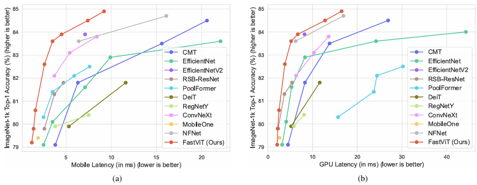

> **Figure 1.**  
> (a): 최근 방법의 정확도 vs 모바일 지연 시간 곡선. iPhone 12 Pro를 사용하여 벤치마킹  
> (b): 최근 방법의 정확도 vs GPU 지연 시간 곡선. 가독성을 위해 Top-1 정확도가 79%보다 높은 모델만 표시  
> 두 컴퓨팅 지표 모두에서 FastViT는 정확도와 지연 시간 간의 절충안이 가장 우수함

iPhone 12 Pro에서 FastViT의 ImageNet Top-1 정확도가 83.9%일 때,
- EfficientNet B5보다 $4.9\times$,
- EfficientNetV2-S보다 $1.6\times$,
- CMT-S보다 $3.5\times$,
- ConvNeXt보다 $1.9\times$ 빠르다.

FastViT의 ImageNet Top-1 정확도가 84.9%일 때,
- 데스크톱 GPU에서 NFNet F1만큼 빠르지만 66.7% 더 작고 FLOPs는 50.1% 더 적다.  
- 모바일 장치에서 42.8%만큼 더 빠르다.

iPhone 12 Pro에서 0.8ms latency일 때
- MobileOne-S0보다 ImageNet에서 4.2% 더 나은 Top-1 정확도를 보인다.

Mask-RCNN 헤드를 사용한 MS COCO 객체 감지 및 instance 분할의 경우
- CMT-S와 유사한 성능을 달성하면서 backbone 지연 시간이 $4.3\times$ 낮다.

iPhone 12 Pro에서 ADE20K 데이터셋으로 semantic segmentation
- PoolFormer-M36[65]보다 성능이 5.2% 증가하고 backbone latency가 $1.5 \times$배 감소

corruption 및 out-of-distribution에 대한 모델의 견고성 연구
- 정확성과 항상 상관관계가 있지는 않음
    - PVT[58]은 ImageNet 데이터셋에서 경쟁력있는 성능을 달성
    - corruption 및 out-of-distribution 샘플에 대한 경고성은 매우 낮음(Mao et al.[38]에서 보고)
- 견고성이 좋은 모델 사용 시 실제 응용 프로그램에서 사용자 환경을 크게 향상시킬 수 있음
- 제안한 모델은 corruption 및 out-of-distribution 샘플에 대해 매우 견고하고 경쟁하는 견고한 모델보다 훨씬 빠름

**논문의 기여**

- FastViT 제안
    - 구조적 reparameterization을 사용하여 메모리 접근 비용을 낮추고 용량을 늘려 SOTA accuracy-latency trade-off 달성
- 두 가지 플랫폼(모바일 장치, 데스크톱 GPU)에서 latency 측면에서 가장 빠름
- 이미지 분류, 객체 감지, semantics segmentation 및 3D 손 mesh regression과 같은 많은 작업으로 일반화됨
- corruption 및 out-of-distribution 샘플에 강건하며 다른 견고한 모델보다 훨씬 빠름

## 2. Related Work

- 최근 transformer 모델들이 컴퓨터 비전 작업에서 큰 성공을 보임
- convolutional layer과 달리, vision transformer의 self-attention layer는 장거리 의존성을 모델링하여 글로벌 context를 제공
- 이러한 global scope는 종종 높은 계산 비용을 요구
- [41, 57, 29, 39]와 같은 작업들은 self-attention layer과 관련된 계산 비용을 완화하는 방법을 다룸
- 본 논문에서는 더 낮은 latency를 위해 self-attention layer에 효율적인 대안을 탐구

**Hybrid Vision Transformers**

- 최근 연구에서는 convolution 설계와 transformer 설계를 결합
    - local 및 global 정보를 효과적으로 캡처
    - 정확성을 유지하면서 효율적인 네트워크를 설계하기 위함
    - 예시:
        - patchify stem을 convolution layer로 대체
        - windowed attention을 통해 암시적으로 hybridize
- 최근 연구는 token(또는 patch) 사이의 정보 교환을 위해 명시적인 hybrid 구조를 구축
- 대부분 hybrid 아키텍처에서 token mixer는 주로 self-attention을 기반으로 함
- MetaFormer은 token mixing을 위한 간단하고 효율적인 pooling을 제안

**Structural Reparameterization**

- 최근 연구[13, 55]는 메모리 접근 비용을 낮추기 위해 skip connection을 reparameterizing
- 제안 모델은 추론 시 reparameterizable한 RepMixer을 제안
- [26, 46, 25, 37, 69]와 같은 작업은 깊이별 또는 그룹화된 convolution을 사용한 후 $1 \times 1$ pointwise convolution을 사용하여 factorized $k \times k$ convolution을 도입
    - 모델의 전반적인 효율성을 개선하는데 매우 효과적
    - 매개 변수 수가 적으면 용량이 감소할 수 있음
- 이러한 모델의 용량을 향상시키기 위해 [55, 11, 12]에서는 linear train-time overparameterization 도입
    - factorized $k \times k$ convolution와 linear train-time overparameterization를 사용  
    -> 이러한 layer의 용량을 늘림
- skip connection 및 linear overparameterization을 제거하기 위한 구조적 reparameterization은 이전의 hybrid transformer 아키텍처에서 시도되지 않음

## 3. Architecture

### 3.1 Overview

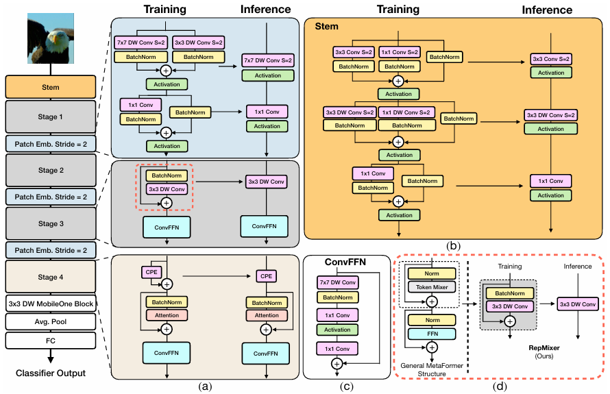

> **Figure 2.**  
> (a) train-time과 inference-time 아키텍처를 분리한 FastViT 아키텍처 개요. Stage 1, 2, 3은 같은 아키텍처를 가지며 Token mixing을 위해 RepMixer을 사용한다. Stage 4에서는 Token mixing을 위해 self attention layer을 사용한다.  
> (b) Convolutional stem 아키텍처  
> (c) Convolutional-FFN 아키텍처
> (d) RepMixer block 개요. 추론 단계에서 skip connection을 재매개변수화 함

FastViT (Fig 2 참조. 모든 변형에 대해서는 표 2 참조)
- 하이브리드 transformer
- 서로 다른 scale에서 작동하는 4개의 개별 stage가 존재
- RepMixer 사용
    - skip connection을 재매개변수화
    - 메모리 접근 비용을 완화하는데 도움이 됨(Fig 2d)
- 효율성과 성능을 개선하기 위해 stem 및 patch embedding layer에서 흔히 볼 수 있는 dense k $\times$ k convolution을 train-time overparameterization을 사용하는 factorized 버전으로 교체(Fig 2a)
- Self-attention token mixer
    - 더 높은 해상도에서 계산적으로 효율적
- 초기 수용장(receptive field)를 개선하기 위한 효율적인 대안으로 큰 kernel convolution 사용

> **Table 1.**  
> PoolFormer-S12부터 시작해서 FastViT-S12를 얻기 위한 아키텍처 선택 사항 분석  
> "LK."는 대형 kernel을 의미

표 1에서 PoolFormer baseline에서 FastViT를 설계할 때 선택한 다양한 아키텍처 선택 사항을 분석

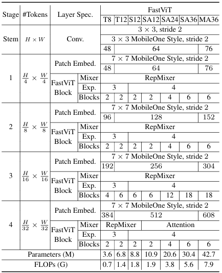

> **Table 2. FastViT 변형의 아키텍처 details**  
> 작은 embedding 차원을 갖는 모델(예: [64, 128, 256, 512])은 "S"를 접두사로 사용  
> Self-Attention layer을 포함하는 경우 "SA"를 접두사로 사용  
> 더 큰 embedding 차원을 갖는 모델(예: [76, 152, 304, 608])은 "M"을 접두사로 사용  
> MLP 확장 비율이 4보다 작은 모델은 "T"를 접두사로 사용  
> 표기법의 숫자는 FastViT blocks의 총 수를 나타냄  
> FLOP count는 $\text{fvcore}$ 라이브러리로 계산됨

### 3.2 FastViT

#### 3.2.1 Reparameterizing Skip Connections

**RepMixer**

convolutional mixing

입력 텐서 $X$의 경우 layer에 있는 mixing block은 다음과 같이 구현

$$
\displaystyle
\begin{aligned}
&Y = \text{BN}(\sigma(\text{DWConv}(X))) + X
&(1)
\end{aligned}
$$

> $\sigma:$ 비션형 활성화 함수  
> $\text{BN}:$ batch normalization layer  
> $\text{DWConv}:$ depthwise convolutional layer

RepMixer에서는 아래와 같이 연산을 재정렬하고 비선형 활성화 함수를 제거하기만 하면 됨

$$
\displaystyle
\begin{aligned}
&Y = \text{DWConv}(\text{BN}(X)) + X
&(2)
\end{aligned}
$$

아래 및 그림 2d와 같이 추론 시간에 단일 depthwise convolutional layer로 재매개변수화 할 수 있음

$$
\displaystyle
\begin{aligned}
&Y = \text{DWConv}(X)
&(3)
\end{aligned}
$$

**Positional Encoding**

입력 토큰의 local 이웃에 따라 동적으로 생성되고 조건화되는 조건부 positional encodings를 사용
- depth-size convolution 연산자의 결과로 생성
- 패치 임베딩에 추가됨
- 비선형이 부족하므로 그림 2a와 같이 재매개변수화된다.

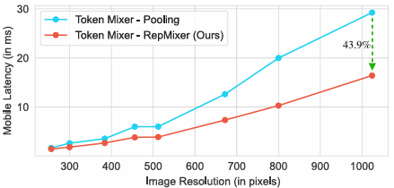

> **Figure 3. MetaFormer(S12) 아키텍처에서 Pooling과 RepMixer을 token mixing으로 사용했을 때 latency 비교**  
> iPhone 12 Pro에서 다양한 이미지 해상도로 측정  
> 두 모델 모두 ~1.8G FLOPs를 가짐  
> RepMixer에서 skip connection의 부재는 전체 메모리 비용을 낮추고 latency를 줄임

**Empirical Analysis**

skip connection을 재매개변수화하는 이점을 확인하기 위해, 가장 효율적인(대기시간 측면에서) token mixer 중 하나인 Pooling과 RepMixer을 MetaFormer S12 아키텍처에서 사용하는 것을 고려. 두 모델 모두 ~1.8G FLOPs를 갖는다.

- iPhone 12 Pro에서 $224 \times 224$부터 $1024 \times 1024$까지 다양한 입력 해상도를 테스트
- 그림 3에서 RepMixer은 특히 더 높은 해상도에서 pooling보다 크게 향상되는 것을 보임
- $384 \times 384$에서 RepMixer을 사용하면 latency가 25.1% 감소,
- $1024 \times 1024$에서 latency가 43.9% 감소

#### 3.2.2 Linear Train-time Overparameterization

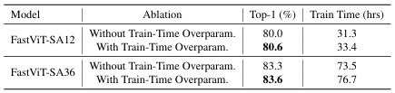

> **Table 3. ImageNet-1k dataset으로 훈련한 linear train-time overparameterization이 있는/없는 FastViT 변형 비교**  
> 훈련 시간은 훈련이 끝날 때 경과된 wall clock time(경과된 실제 시간)

- 효율성(파라미터 수, FLOPs, latency)를 더 향상시키기 위해 모든 dense $k \times k$ convolutions를 인수분해(factorized)된 version으로 대체  
(예: $k \times k$ depthwise를 $1 \times 1$ pointwise convolutions로 변환)

- factorization으로 파라미터 개수가 감소하면 모델의 용량이 감소할 수 있음  
-> factorized layer의 용량을 키우기 위해 linear train-time overparameterization을 수행(MobileOne[55]에 설명됨)

- stem, patch embedding, projection layers의 MobileOne-style overparameterization은 boosting 성능을 높여줌
- 표 3에 train-time overparameterization이 FastViT-SA12 모델의 ImageNet Top-1 정확도를 0.6% 향상시킴을 보임.
- 표 1에서는 더 작은 FastViT-S12에서 Top-1 정확도가 0.9% 향상됨

- train-time overparameterization 결과는 추가된 branches에서 계산 overhead로 인해 training time이 늘어남

- 제안한 아키텍처는 조밀한 $k \times k$ convolution을 인수분해된 형태로 대체하는 layer만 overparameterize 함
    - 이러한 layer은 convolution stem, patch embedding 및 projection layers에 있음
    - 여기서 발생하는 계산 비용은 네트워크의 나머지 부분보다 낮음  
    -> overparameterization해도 학습 시간이 크게 증가하지 않음  
    (FastViT-SA12는 6.7%, FastViT-SA36은 4.4% 더 오래 걸림. 4.1절의 세팅으로 실험)  
    
#### 3.2.3 Large Kernel Convolutions

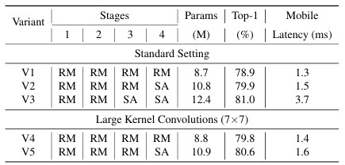

> **Table 4. self-attention layers의 대체물로 large kernel convolutions를 사용하는 것에 대한 제한 연구**  
> "RM": stage에서 [RepMixer-FFN] block 사용  
> "SA": stage에서 [Self Attention-FFN] block 사용  
> Standard setting: patch embedding과 stem layers에서 $3 \times 3$ factorized convolutions 사용, FFN에서 $1 \times 1$ convolution 사용  
> V4, V5: patch embedding과 FFN layers에서 large kernel convolutions ($7 \times 7$) 사용

- RepMixer의 receptive field는 self-attention token mixer에 비해 지역적임
    - self-attention based token mixer은 계산 비용이 높음

- self-attention을 사용하지 않는 초기 단계의 receptive field를 향상시키기 위한 계산 효율적인 접근 방법
    - depthwise large kernel convolutions를 통합

- FFN 안의 depthwise large kernel convolutions와 patch embedding layer을 소개

- depthwise large kernel convolutions를 사용하는 변종은 self-attention layer을 사용하는 변종에 비해 경쟁력이 높을 수 있지만 latency가 약간 증가할 수 있음(표 4 참조)

- V5와 V3을 비교할 때 모델 크기는 11.2% 증가하고 대기 시간은 $2.3 \times$ 배 증가. Top-1 정확도 0.4% 증가
- V2는 V4보다 20% 더 크고 V4보다 7.1% 더 긴 대기시간을 가짐. ImageNet에서 유사한 Top-1 정확도 달성

- 표 1에서는 FFN 및 patch embedding layer에서 큰 kernel convolution을 제거

- 큰 kernel convolution은 FastViT-S12에서 Top-1 정확도를 0.9% 향상

그림 2에서 제안한 FFN과 patch embedding layer의 architecture을 보임
- FFN block은 ConvNeXt[36] block과 유사하고 약간의 key difference만 존재. (그림 2c 참조)
    - Layer Normalization 대신 Batch Normalization 사용
        - 추론 시 이전 layer과 융합될 수 있기 때문
    - ConvNeXt 블록의 원래 구현처럼 layer 정규화에 대한 적절한 tensor layout을 얻기 위해 추가 reshape 작업이 필요하지 않음

증가된 receptive field와 함께, large kernel convolutions는 model 견고성을 개선하는 데 도움이 됨([59]에서 관찰)  
convolutional-FFN blocks는 일반적으로 vanilla-FFN blocks보다 더 견고함([38]에서 관찰)  
-> large kernel convolution을 통합하면 모델 성능과 견고성 향상에 도움이 됨

## 4. Experiments

### 4.1 Image Classification

ImageNet-1K 데이터셋에 대한 결과
- ~1.3M training 이미지, 50K validation 이미지
- [51, 65]의 training recipe를 따름
    - 300 epochs
    - AdamW optimizer
        - weight decay: 0.05
        - peak learning rate: $10^{-3}$
    - batch size: 1024
    - warmup epochs: 5
    - cosine schedule 사용
- Timm 라이브러리 사용
- 8개의 NVIDIA A100 GPUs로 훈련
- input size가 $384 \times 384$인 경우 fine-tuning 방법
    - 30 epoch
    - weight decay: $10^{-8}$
    - learning rate: $5 \times 10^{-5}$
    - batch size: 512

latency를 측정하기 위해 각 방법에 해당하는 input sizes를 사용

iPhonw latency 측정방법([55]의 프로토콜을 그대로 사용)
- Core ML Tools (v6.0)
- iPhone12 Pro Max(iOS 16)
- batch size: 1

GPU latency 측정방법
- TensorRT(v8.0.1.6)
- NVIDIA RTX-2080Ti
- batch size: 8

100번 실행에서 중앙값 latency를 보고

**Comparison with SOTA Models**

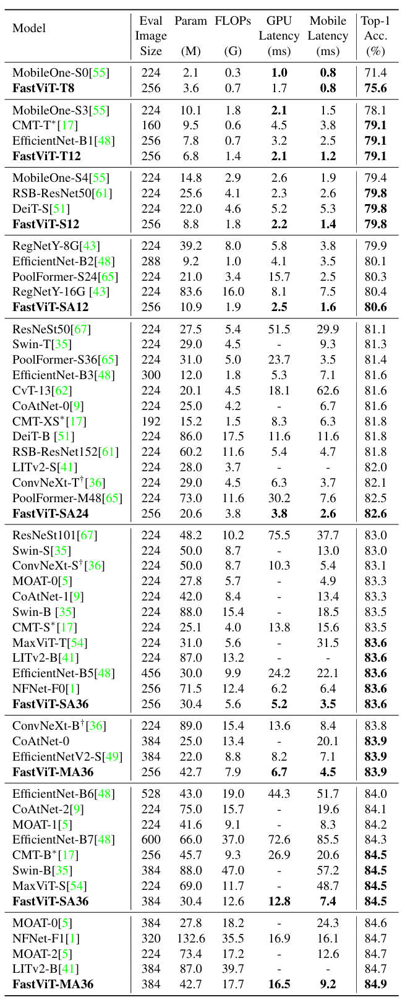

> **Table 5. ImageNet-1k classification에 대한 다양한 SOTA 방법 비교**  
> HardSwish는 Core ML에서 잘 지원되지 않음  
> *: 공정한 비교를 위해 HardSwish를 GELU로 변환  
> $\dagger:$ 효율적인 배포를 위해 원본 구현에서 수정된 모델  
> "-": TensorRT나 Core ML Tools로 export할 수 없는 모델

ImageNet-1k dataset의 최신 SOTA 모델과 제안 모델 비교
- 공정한 비교를 위해 ConvNeXt[36]의 공식 구현에서 수정
    - 비용이 많이 드는 reshape operations는 피함
- LITv2[41]을 안정적으로 export 하지 못함
    - 두 라이브러리 중 하나에서 deformable convolution에 대한 지원이 부족
- 제안 모델은 두 개의 서로 다른 computing fabrics(desktop-grade GPU, 모바일 장치)에서 SOTA 모델과 비교할 때 최고의 정확도-latency 절충안을 얻음
- 매개변수 수와 FLOPs 모두에서 LITv2보다 향상됨
    - 84.9% Top-1 정확도에서 FastViT-MA36은 LITv2-B보다 49.3% 더 작고 55.4% 더 적은 FLOPs를 보임
    - FastViT-S12는 iPhone 12 Pro에서 MobileOne-S4[55]보다 26.3% 빠르고 GPU에서 26.9% 더 빠름
    - 83.9% Top-1 정확도에서 FastViT-MA36은 iPhone12 Pro에서 최적화된 ConvNeXt-B 모델보다 $1.9 \times$ 빠르고 GPU에서는 $2.0 \times$ 더 빠름
    - 84.9% Top-1 정확도에서 FastViT-MA36은 GPU에서 NFNet-F1[1]만큼 빠르지만 66.7% 더 작고 50.1% 더 적은 FLOPs를 가짐. 모바일 장치에서는 42.8% 더 빠름

**Knowledge distillation**

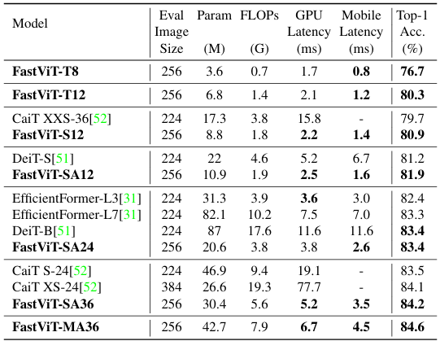

> **Table 6.**  
> ImageNet-1k classification에 대한 [51]에 명시된 distillation objective로 훈련했을 때 다양한 SOTA 방법 비교  
> "-": TensorRT나 Core ML Tools로 export할 수 없는 모델

distillation objective로 학습된 모델의 성능(표 6)
- DeiT[51]의 설정을 따름
- RegNet 16GF[43]을 teacher model로 사용
- DeiT[51]에 따라 teacher의 hard decision을 true label로 설정하는 hard distillation을 사용
- 300 epoch동안 훈련
- [51, 52, 31]과 달리 distillation을 위한 추가 classification head를 도입하지 않음
- FastViT는 최신 SOTA인 EfficientFormer[31]을 능가
    - FastViT-SA24는 EfficientFormer-L7과 유사한 성능을 달성하면서 매개변수는 $3.8 \times$, FLOPs는 $2.7 \times$, latency는 $2.7 \times$ 낮다.

### 4.2 Robustness Evaluation

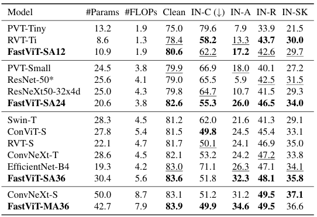

> **Table 7. 강인함 benchmark 데이터셋 결과**  
> FLOPs 기준으로 모델들을 그룹화  
> 경쟁 모델의 성능은 [38]과 [36]에서 보고됨  
> *ResNet-50 모델은 강인함을 향상시키기 위해 AugMix로 훈련됨([38] 참조)  
> ImageNet-C는 평균 corruption error 보고  
> 다른 데이터셋의 Top-1 accuracy 보고  
> 가장 좋은 결과는 굵은 글씨, 두 번째로 좋은 결과는 밑줄 처리

### 4.3 3D Hand mesh estimation

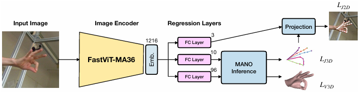

> **Figure 2(supplementary). 3D hand mesh estimation framework 개요**

- real-time 3D hand mesh estimation은 CNN 기반 backbone에 복잡한 mesh regression layer을 도입
- backbone으로는 보통 ResNet이나 MobileNet 아키텍처 제품군 사용
- 이와 달리 METRO와 MeshGraphormer은 HRNets를 feature extraction에 사용
- 대부분의 하드웨어 장치는 2D CNNs로 feature extraction하는 데 최적화되어 있음
- 이러한 방법에서 사용되는 복잡한 mesh regression head에 대해서는 최적화되어 있지 않음
- 복잡한 mesh regression head를 간단한 regression module로 변환(다음을 회귀하는)
    - weak perspective camera
    - MANO model의 pose & shape parameters
    
- 기본 이미지들에 대해 좋은 표현을 학습하는 feature extraction backbone을 사용하면 mesh 회귀 학습 문제를 완화할 수 있음
- 다른 실시간 방법은 복잡한 mesh regression layer가 있는 weak feature extraction backbone을 사용
- 본 논문에서는 간단한 mesh regression layer가 있는 더 나은 feature extraction backbone을 사용
- FreiHand 데이터셋으로 다른 방법과 비교
    - FreiHand 데이터셋만 사용한 결과를 인용
    - 사전 훈련에만 ImageNet-1k 데이터셋을 사용
    - [32]에 설명된 실험 설정을 사용하여 FreiHand 데이터셋에서만 훈련
    - 실시간 방법 중 제안 방법은 모든 joint 및 vertex error 관련 지표에서 다른 방법보다 우수함
        - MobileHand[16]보다 $1.9 \times$ 빠름
        - 최신 MobRecon보다 $2.8 \times$ 빠름

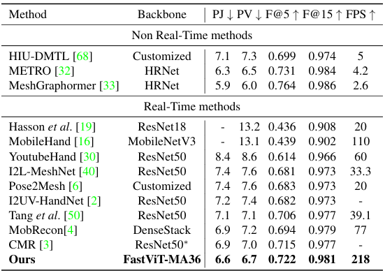

> **Table 8. FreiHAND test dataset 결과**  
> MobRecon과 유사한 설정에서 NVIDIA RTX-2080Ti으로 FPS 측정  
> 경쟁 방법의 성능은 FreiHand 데이터셋으로만 훈련한 성능

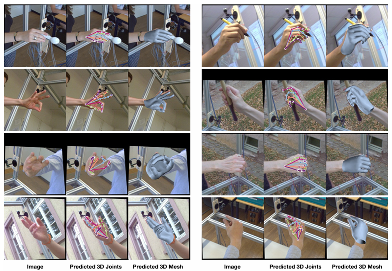

> **Figure 3(supplementary). 제안 프레임워크의 FreiHand test set 정성적 결과**  
> 3D 예측은 weak perspective camera model을 사용하여 이미지로 투영됨  
> camera model의 매개변수 또한 모델에 의해 예측됨

### 4.4 Semantic Segmentation and Object Detection

- ADE20k 데이터셋으로 성능 평가
    - 20K training images & 2K validation images
    - 150 semantic categories

- Semantic FPN[28] decoder로 훈련
    - Semantic FPN head는 [65]의 설정을 따름

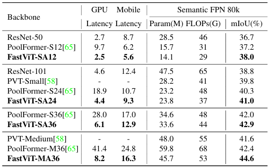

> **Table 9. ADE20K semantic segmentation 작업에서 서로 다른 backbone의 성능**  
> FLOPs와 backbone latency는 $512 \times 512$로 잘린 이미지로 측정

- 모든 모델은 각각에 해당하는 image classification model로 사전훈련된 가중치 사용
- FLOPs 및 backbone latency는 $512 \times 512$로 crop된 이미지로 측정
- GPU latency는 표 9와 표 10에서 batch size=2로 추정(입력 이미지 해상도가 높기 때문)
- 표 9에서 최신 모델과 비교
    - FastViT-MA36은 PoolFormer-M36보다 5.2% 높은 mIoU를 보임
        - PoolFormer-M36이 desktop GPU와 모바일 장치 모두에서 FLOPs, 파라미터 수, latency가 더 높음

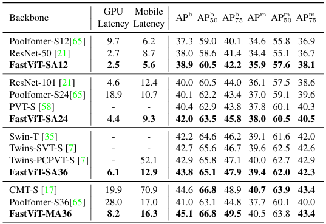

> **Table 10. MS-COCO val2017의 object detection 및 instance segmentation에 대한 결과**
> $1 \times$ training schedule(즉, 모델 훈련에 사용되는 12 epochs 동안)을 사용한 Mask-RCNN[20] 프레임워크를 사용
> Backbone latency는 $512 \times 512$로 잘린 이미지로 측정

- MS-COCO 데이터셋으로 object detection 훈련
    - 80개 클래스
    - 118K training images & 5K validation images
- 표 10에서 최신 모델과 비교
- 모든 모델은 Mask-RCNN head를 사용하여 $1 \times$ schedule로 훈련됨
- 모든 모델은 각각에 해당하는 image classification model로 사전훈련된 가중치 사용
- 제안 모델은 multiple latency 체제에서 SOTA를 달성
    - FastViT-MA36 모델은 CMT-S와 비슷한 성능을 보임
        - Desktop GPU에서 $2.4 \times$ 더 빠름
        - 모바일 장치에서 $4.3 \times$ 더 빠름

## 5. 결론

- 여러 컴퓨팅 장치에서 효율적인 범용 hybrid vision transformer 제안
- 구조적 재매개변수화를 통해 메모리 접근 비용을 줄임
    - 더 높은 해상도에서 실행 시간을 크게 향상시킴
- downstream 작업의 성능을 향상시키는 추가 아키텍처 변경을 제안
    - ImageNet 분류, 객체 감지, semantic segmentation, 3D 손 mesh 추정과 같은 작업들
- 제안한 backbone은 분포를 벗어난 샘플에 대해 매우 견고하며 경쟁하는 견고한 모델보다 훨씬 빠름
