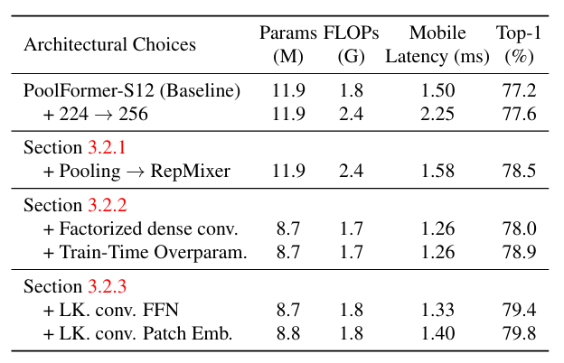

# FastViT: A Fast Hybrid Vision Transformer using Structural Reparameterization
---

- Hand pose estimation
- Vision Transformer

---

- Pavan Kumar Anasosalu Vasu et al.
- ICCV 2023
- url: https://openaccess.thecvf.com/content/ICCV2023/html/Vasu_FastViT_A_Fast_Hybrid_Vision_Transformer_Using_Structural_Reparameterization_ICCV_2023_paper.html

---

## GPT 요약

1. 새로운 하이브리드 Vision Transformer 아키텍처: FastViT
FastViT는 기존 Transformer와 CNN을 결합한 하이브리드 비전 모델로, 최적의 정확도-지연시간(latency-accuracy) 트레이드오프를 제공하는 것이 핵심 목표.
모바일 및 데스크톱 GPU 환경에서 기존 SOTA 모델 대비 최대 4.9배 빠른 속도를 달성함.

2. RepMixer: 새로운 구조적 재파라미터화(Token Mixing) 기법 도입
기존 Transformer 기반 모델은 토큰 혼합(token mixing) 연산에서 skip connection을 사용하지만, 이는 메모리 접근 비용(memory access cost) 증가로 인해 추론 속도 저하를 유발.
RepMixer를 도입하여, skip connection을 제거한 새로운 토큰 믹싱 기법을 제안.
ConvMixer와 유사한 depthwise convolution을 사용하면서, 추론 시에는 단일 depthwise convolution 레이어로 재파라미터화(reparameterization) 가능.

3. 학습 시 과적합 방지 및 성능 향상을 위한 구조적 재파라미터화
학습 중에는 모델 용량을 증가시키기 위해 Train-time Overparameterization 기법을 적용.
하지만 추론 단계에서는 이러한 추가적인 계산을 제거하여 연산 효율성을 극대화.

4. 대형 커널(large kernel) 컨볼루션 적용
초기 네트워크 스테이지에서 Self-Attention을 대체할 수 있도록 대형 커널 컨볼루션(예: 7×7)을 사용.
Self-Attention의 장점(전역 정보 처리)을 유지하면서도 지연시간(latency) 증가 문제를 해결.
FFN(Feed Forward Network)과 Patch Embedding 레이어에도 적용하여 전체적인 수용 영역(receptive field) 증가 및 성능 향상.

5. 다양한 비전 태스크에서 최적의 성능 및 속도 개선
ImageNet-1K 이미지 분류에서 기존 모델 대비 최고의 정확도-지연시간 성능 제공.
객체 탐지(Object Detection) 및 인스턴스 세그멘테이션(Semantic Segmentation): 기존 CMT-S 모델 대비 4.3배 빠른 backbone latency.
3D 손 메쉬 추정(3D Hand Mesh Regression): 최신 SOTA 모델인 MobRecon 대비 2.8배 빠름.

6. 강건성(Robustness) 개선
Out-of-Distribution 데이터 및 다양한 데이터 변형(Corruptions)에 대한 강건성을 분석.
PVT, Swin, ConvNeXt 등의 최신 모델 대비 높은 강건성을 보임.

7. 실험 결과: 기존 모델 대비 성능 비교
기존 모델 대비 최대 4.9배 빠름 (EfficientNet-B5 대비 4.9×, ConvNeXt 대비 1.9× 빠름).
모바일(iPhone 12 Pro) 및 데스크톱 GPU(NVIDIA RTX-2080Ti) 환경에서 최적화된 모델.
같은 속도에서 MobileOne 대비 4.2% 높은 Top-1 정확도.

📌 결론
FastViT는 CNN과 Transformer의 장점을 결합하여, 기존 모델 대비 더 빠르고 정확한 비전 모델을 제안함.
특히 RepMixer와 대형 커널 컨볼루션을 적용하여 지연시간을 최소화하면서도 정확도를 유지하는 것이 핵심 기여.
모바일 및 클라우드 기반 컴퓨터 비전 애플리케이션에 적합한 경량화된 고성능 모델로 평가될 수 있음. 🚀

## Abstract

Transformer과 Convolutional 설계의 융합으로 모델의 정확성과 효율성이 꾸준히 개선되어옴

**FastViT**
- SOTA latency-accuracy trade-off를 준수
- FastViT의 building block인 새로운 token mixing operator인 RepMixer을 도입
    - structural reparameterization을 사용하여 네트워크에서 skip-connection을 제거하여 메모리 access 비용을 낮춤
- train-time overparametrization 및 large kernel convolutions를 적용
    - 정확도를 높이고 이러한 선택이 latency에 미치는 영향이 최소화됨을 경험적으로 보임
- SOTA hybrid transformer 구조인 CMT 보다 $3.5\times$ 빠름
- EfficientNet보다 $4.9\times$ 빠름
- 모바일 장치에서 ConvNeXt보다 $1.9\times$ 빠름
- 위 모델들과 ImageNet 데이터셋에서 동일한 정확도를 보임
- 이미지 분류, 감지, segmentation, 3D mesh regression과 같은 여러 작업에서 경쟁 아키텍처를 지속적으로 능가
- 모바일 장치와 desktop GPU 모두에서 latency를 크게 개선
- 배포되지 않은 sample 및 corruptions에 대해 경쟁 모델에 비해 매우 견고함

## 1. Introduction

Vision Transformers
- 이미지 분류, 감지 및 세분화 같은 작업에서 SOTA 달성
- 전통적으로 계산 비용이 많이 들음
- 최근 연구[66, 39, 41, 57, 29]는 vision transformer의 computing 및 메뢰 요구사항을 낮추는 방법을 제안
- 최근의 하이브리드 아키텍처는 컨볼루셔널 아키텍처와 트랜스포머의 강점을 결합하여 비전 작업에 경쟁력 있는 아키테처를 구축

비전 및 하이브리드 Transformer 모델[51, 17, 42, 41]은 Metaformer 아키텍처를 따름
- skip connection이 있는 token mixer와 다른 skip connection이 있는 Feed Forward Network(FFN)을 결합
    - 이러한 skip connection은 메모리 엑세스 비용 증가로 latency에서 상당한 오버헤드를 차지
- 재매개변수화 가능한 token mixer인 RepMixer을 도입
    - 이 latency 오버헤드를 해결하기 위해 구조적 재매개변수화를 사용하여 skip-connections를 제거
    - ConvMixer와 유사한 정보의 spatial mixing을 위해 depthwise convolution을 사용
    - 주요 차이점은 모듈을 추론 시 다시 매개변수화하여 분기를 제거할 수 있음

대기 시간, FLOPs 및 매개 변수 수를 더 개선하기 위해 조밀한 k $\times$ k convolutions를 factorized버전(depthwise followed by pointwise convolutions)으로 교체
- 효율성 metric을 개선하기 위해 효율적인 아키텍처[26, 46, 25]에서 사용하는 일반적인 접근방식
    - 이 방식을 그대로 사용하면 성능이 저하(표 1 참조)
- 이러한 계층의 용량을 늘리기 위해 [13, 11, 12, 55, 18]에 소개된 대로 선형 train-time overparameterization을 사용
- 이러한 추가 분기는 학습 중에만 도입. 추론 시 reparameterized

네트워크 작업에서 큰 커널 convolution을 사용
- ken mixing에 기반한 self-attention가 경쟁력있는 정확도를 달성하는데 매우 효과적
    - 하지만 latency 측면에서는 비효율적

- Feed Forward Network(FFN) 레이어에 큰 kernel convolution을 통합하고 patch embedding layer을 통합
-> 모델의 전체 대기 시간에 미치는 영향을 최소화하면서 성능 향상

**FastViT**
1. RepMixer block을 사용하여 skip connection을 제거
2. linear train-time connection을 사용하여 정확도를 높임
3. 초기 단계에서 self-attention layer을 대체하기 위해 대형 convolutional kernel을 사용

- 다른 Hybrid vision transformer 아키텍처에 비해 latency를 크게 개선 및 여러 작업에서 정확도를 유지
- iPhone 12 Pro와 NVIDIA RTX-2080Ti에서 종합적인 분석을 수행

iPhone 12 Pro에서 FastViT의 ImageNet Top-1 정확도가 83.9%일 때,
- EfficientNet B5보다 $4.9\times$,
- EfficientNetV2-S보다 $1.6\times$,
- CMT-S보다 $3.5\times$,
- ConvNeXt보다 $1.9\times$ 빠르다.

FastViT의 ImageNet Top-1 정확도가 84.9%일 때,
- 데스크톱 GPU에서 NFNet F1만큼 빠르지만 66.7% 더 작고 FLOPs는 50.1% 더 적다.  
- 모바일 장치에서 42.8%만큼 더 빠르다.

iPhone 12 Pro에서 0.8ms latency일 때
- MobileOne-S0보다 ImageNet에서 4.2% 더 나은 Top-1 정확도를 보인다.

Mask-RCNN 헤드를 사용한 MS COCO 객체 감지 및 instance 분할의 경우
- CMT-S와 유사한 성능을 달성하면서 backbone 지연 시간이 $4.3\times$ 낮다.

~~

## 2. Related Work

## 3. Architecture

### 3.1 Overview

FastViT (Fig 2 참조)
- 하이브리드 transformer
- 서로 다른 scale에서 작동하는 4개의 개별 stage가 존재
- RepMixer 사용
    - skip connection을 재매개변수화
    - 메모리 엑세스 비용을 완화하는데 도움이 됨(Fig 2d)
- 효율성과 성능을 개선하기 위해 stem 및 patch embedding layer에서 흔히 볼 수 있는 dense k $\times$ k convolution을 train-time overparameterization을 사용하는 factorized 버전으로 교체(Fig 2a)
- Self-attention token mixer
    - 더 높은 해상도에서 계산적으로 효율적
- 초기 수용장(receptive field)를 개선하기 위한 효율적인 대안으로 큰 kernel convolution 사용

> **Table 1**  
> PoolFormer-S12부터 시작해서 FastViT-S12를 얻기 위한 아키텍처 선택 사항 분석  
> "LK."는 대형 kernel을 의미

표 1에서 PoolFormer baseline에서 FastViT를 설계할 때 선택한 다양한 아키텍처 선택 사항을 분석

### 3.2 FastViT

#### 3.2.1 Reparameterizing Skip Connections

**RepMixer**

convolutional mixing

입력 텐서 $X$의 경우 layer에 있는 mixing block은 다음과 같이 구현

$$
\displaystyle
\begin{aligned}
&Y = \text{BN}(\sigma(\text{DWConv}(X))) + X
&(1)
\end{aligned}
$$

