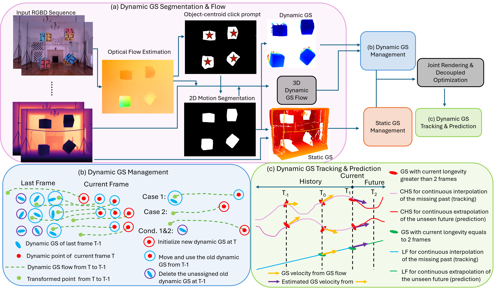

# DynaGSLAM: Real-Time Gaussian-Splatting SLAM for Online Rendering, Tracking, Motion Predictions of Moving Objects in Dynamic Scenes

---
Reference

본 문서에 사용된 모든 이미지와 표는 해당 논문에서 발췌하였습니다.

---

---

- SLAM
- Dynamic SLAM
- 3D Gaussian Splatting

---

url:
- [paper](https://openaccess.thecvf.com/content/WACV2026/html/Li_DynaGSLAM_Real-Time_Gaussian-Splatting_SLAM_for_Online_Rendering_Tracking_Motion_Predictions_WACV_2026_paper.html) (WACV 2026)
- [project](https://blarklee.github.io/dynagslam/)

---
요약

- localization
    - DynoSAM[32]에 의존
    - point cloud 표현 기반
    - 동적 장면에서 SOTA 그래프기반 시각적 위치 추정 방법
- mapping
    - DynoSAM으로 추정한 카메라 궤적 $T_\tau$를 이용
    - RTGSLAM[36]에서 ORB-SLAM2[33]을 사용하는 것과 유사함
- DynaGS Flow
    - t에서 optical flow를 사용하여 시간 t - 1의 기존 GS를 연결하고 propagate
    - 2D optical flow를 3D(Fig. 3(a))로 lift
        - dynamic GS flow라 칭함

- 동적 영역과 정적 영역을 분리
    - 정적 GS
        - GS-SLAM의 전략을 따름
        - 새로운 영역이 보이면 새로운 GS를 추가하고 최적화
        - 변하지 않은 오래된 GS를 유지
        - 일정 프레임 이상 GS가 보이지 않으면 제거
    - 동적 GS
        - 현재 pointcloud $\mathcal{P}_t(red)$를 GS flow $\text{F}_{t-1 \leftarrow t}^\text{Dyna}$ (green)을 사용해서 이전 timestep $t-1$(blue)로 변환
        - 현재 pointcloud를 마지막 optical flow 관측 $\text{F}_{t-1 \leftarrow t}$로 변환시키는 게 extrapolation을 위해 cubic hermite spline을 사용하는 것보다 나음.
            - cubic Hermite spline은 시간 $t-1$의 정보만 갖고 있기 때문
        - 시간 $t - 1$의 GS를 필터링하여 시간 $t$의 불필요한 GS의 불필요한 forward-propagation를 피할 수 있음

---

## Abstract

SLAM
- 고품질과 빠른 매핑이 중요함
- 3DGS SLAM은 pointcloud-SLAM과 비교했을 때 고품질 텍스쳐로 보이지 않는 뷰를 합성함

GS-SLAM
- GS-SLAM은 bundle adjustment의 정적인 가정을 위반하는 이동 객체가 장면을 점유하면 실패함
- 움직이는 GS의 업데이트 실패는 정적인 GS에 영향을 미침.  
-> 전체 맵을 오염시킴
- 이동 객체 고려 연구
    - GS 렌더링에서 움직이는 영역을 감지하고 제거함(anti dynamic GS-SLAM). 정적 배경만 GS-SLAM의 혜택을 받음

> **Figure 1. **

## 1. Introduction

> **Figure 2. 긴 프레임에 걸친 정적 GS-SLAM의 실패**  
> "Abs. Error": GT RGB와 렌더링된 RGB의 절대 오차  
> 일반적인 정적 GS-SLAM 작업들은 동적 객체를 고려하지 않기에 렌더링 품질이 긴 프레임동안 악화됨. 또한 정적 영역도 실패한 동적 GS에 의해 오염됨.  
> DynaGSLAM은 동적 영역과 정적 영역 모두를 장시간 프레임에도 높은 품질로 지속적으로 렌더링

3DGS SOTA 방법은 정적인 장면에서만 고려됨
- Fig 2의 정적인 영역도 동적 영역으로 잘못 취급되어 결과가 나빠질 수 있음

동적 객체를 감지하고 제거하는 방법
- localization에는 도움이 됨
- 동적 객체를 제거하면 GS 맵에서 정적인 배경만 렌더링 가능

동적 객체를 GS로 표현하기 위한 SOTA 방법
- GS에 직접 시간 차원을 추가하는 방법 등
- GS를 오프라인 방식으로 영상 시퀀스 당 몇시간씩 학습하므로 온라인 SLAM에 적합하지 않음

본 논문의 기여
- DynaGSLAM
    - moving object의 모션 예측을 지원하는 첫 번째 real-time Gaussian-Splatting based SLAM
- novel dynamic GS management 알고리즘 제안
    - adding, deleting, tracking, updating, predicting dynamic GS

## 2. Related Works

**Dynamic SLAM**
- 일반적인 접근법: 동적 영역을 탐지하고 제거
    - [5, 40]: 모션 감지를 위해 RANSAC이나 point correlations를 사용
    - [3, 54]: 움직이는 객체를 의미론적으로 분할하도록 학습
    - 카메라 위치 추정 품질을 향상시키지만 객체의 움직임 정보를 잃게 됨
    - anti dynamic SLAM으로 칭함
- 일부 동적 SLAM은 동적 객체를 통합하고 추적
    - 객체가 강체임을 가정
    - 각 객체에  tracklet을 할당
    - DynaSLAM2[4]:
        - centroids의 움직임을 추정하여 rigid 객체 추적. 
        - 카메라 위치 추정 향상
    - DynoSAM[32]:
        - 정확도를 위해 world-centric factor-graph 최적화 제안
        - 객체 움직임 추정이 시간 소모가 큼
    - 고전적인 point cloud 매핑 기반이므로, GS-SLAM으로 직접 확장하는 것이 어려움(sh, shape 등 더 복잡한 속성을 보유함)

**GS-based SLAM**

## 3. Problem Formulation

> **Figure 3. DynaGSLAM Mapping 개요**  
> DynaGS는 RGBD 시퀀스를 입력으로 받음  
> (a) 3D에서 정적 GS로부터 dynamic GS를 segment. 프레임들 사이의 dynamic GS 3D motion flow를 추정.  
> (b) Dynamic GS는 GS flow를 통ㅌ해 static GS와 별도로 관리됨. 하지만 공동 최적화를 위해 결합됨. Case 1&2: dynamic GS 추가 규칙. Cond 1&2는 dynamic GS 제거 조건  
> (c) 현재 및 과거 프레임의 최적화된 dynamic GS는 과거에서 미래로의 연속적인 interpolate/extrapolate dynamic GS를 위해 사용됨.  
> "CHS"는 "cubic Hermite spline"을 의미  
> "LF"는 "linear function"을 의미

dynamic GS SLAM 문제
- 입력: unknown 카메라 포즈 $T_t \in SE(3)$으로부터 입력받은 RGB-d 입력 시퀀스
$C_t \in \mathbb{R}^{W \times H \times 3}$, 
$D_t \in \mathbb{R}^{W \times H}$

- 목적
    - unknown 카메라 포즈 $T_t$를 복구
    - 동적 객체를 모델링한 time-varying scene 표현 $\mathcal{G}_t$ 찾아내기

- 각 시간 $t$에서 카메라 궤적 $\{T_\tau\}$ ($\tau \in [0,t]$)와 time-varying scene 표현 $\{\mathcal{G}_\tau\}$를 찾게 됨
$$
\displaystyle
\begin{aligned}
\min_{\mathcal{G}_\tau, T_\tau} \sum_{\tau=0}^t \ell_c (\hat{C}(\mathcal{G}_\tau, T_\tau), C_\tau) + \ell_d(\hat{D}(\mathcal{G}_\tau, T_\tau), D_\tau)
\tag{1}
\end{aligned}
$$

> $\ell_c, \ell_d$: color & depth 이미지 loss

- 매 timestep마다 새로운 GS를 생성하는 것 뿐 아니라, 시간 범위에 걸쳐 변하는 GS $\mathcal{G}_t$를 추적하는데 중점을 둠  
-> 정적 GS에서처럼 새로운 viewpoint에서뿐만 아니라 연속적인 새로운 시간에서도 photorealistic한 이미지 합성을 가능하게 함

- 논문에서 표기는 규칙적이고 단위 시간의 경우를 반영. 하지만 저자는 불규칙한 시간 간격으로 도착하는 데이터를 바탕으로 연속적인 시간에 걸친 움직임을 예측하고 추적하는 것을 목표로 함

- 온라인 실시간 성능 보장을 위해 localization과 mapping을 별도로 처리
    - localization
        - DynoSAM[32]에 의존
        - point cloud 표현 기반
        - 동적 장면에서 SOTA 그래프기반 시각적 위치 추정 방법
    - mapping
        - DynoSAM으로 추정한 카메라 궤적 $T_\tau$를 이용
        - RTGSLAM[36]에서 ORB-SLAM2[33]을 사용하는 것과 유사함

## 4. Dynamic GS Architecture

시간에 따라 움직이는 동적 평균을 갖는 새로운 종류의 GS를 도입
- 동적 GS를 Gaussian blobs의 집합으로 정의
$\mathcal{G}_t = \{(\text{m}_t^i(\tau),\Sigma_t^i, \alpha_t^i, \text{sh}_t^i)\}$

> $\text{m}_t^i(\tau)$: time-varying 평균. unobserved time \tau에서 novel view 합성을 가능하게 함. cubic Hermite splie으로 모델링됨:
$$
\displaystyle
\begin{aligned}
\text{m}_t^i(\tau) = (2\tau'^3 - 3\tau'^2 + 1)\text{m}_{t-}^i + (\tau'^3 - 2\tau'^2 + \tau')\text{v}_{t-}^i + (-2\tau'^3 + 3\tau'^2)\text{m}_{t+}^i + (\tau'^3 - \tau'^2)v_{t+}^i
\tag{2}
\end{aligned}
$$

> $\tau' = \tau - t - 1, \text{m}_{t-, t+}^i, \text{v}_{t-,t+}^i$: 보간 파라미터. iterative 최적화 없이 분석적으로 업데이트 될 수 있음

- extrapolation은 $\tau > t$를 query하여 달성할 수 있음

RGB 이미지는 원본 3DGS와 유사하게 렌더링됨

정확한 depth 이미지 $\hat{D}_t$를 렌더링하기 위해 2DGS[11]의 아이디어를 적용
- 더 높은 효율성과 더 나은 표면 표현을 위해 3D 가우시안의 가장 짧은 주축을 버림
- depth에 surface rendering 기법을 적용[11]
    - alpha blending보다 빠름
    - 투명도가 임계값 $\lambda_\alpha$를 넘는 가장 가까운 GS의 depth $d(g_t^i)$를 취함
    $$
    \displaystyle
    \begin{aligned}
    \hat{D} = \min_{g_t^i \in \mathcal{G}^t} d(g_t^i), \text{s.t.} f(g_t^i) \prod_{j=i}^{i-1}(1 - f(g_t^j)) > \lambda_\alpha.
    \tag{4}
    \end{aligned}
    $$

## 5. Online Training of Dynamic GS

전통적인 정적 GS를 훈련
- RGB & depth 이미지를 렌더링
- 렌더링 결과와 관측 결과 사이의 loss 최소화
- 이는 객체의 움직임 때문에 동적 GS의 real-time training에는 불충분함

현재 관찰과 일치하도록 GS를 명시적으로 수정하여 객체의 움직임을 정확하게 설명하는 향상된 학습 방법을 소개

**전제 조건**

1) 2D optical flow 계산
2) 동작 분할
3) localization

을 위한 적절한 하위 모듈이 있다고 가정

1) 2D optical flow
    - real-time optical flow(RAFT) 채택
2) 동작 분할(motion segmentation)
    - RAFT optical flow 이미지에서 계산된 coarse motion blobs를 real-time online SAM2와 결합
3) localization
    - DynoSAM[32] 채택
    - 추정된 카메라 자세를 수정 없이 사용

### 5.1. Dynamic GS Flow

현재 프레임 $t$에서 optical flow를 사용하여 시간 $t - 1$의 기존 GS를 연결하고 propagate
- 2D optical flow를 3D(Fig. 3(a))로 lift
    - dynamic GS flow라 칭함
- 현재 프레임에서 마지막 프레임$t \rightarrow t - 1$의 3D에서 dynamic GS flow를 얻기 위해
    - static optical flow를 2D motion mask $M_t$로 마스킹
    - moving optical flow $\text{f}_{t - 1 \leftarrow t}(u, v)$를 depth $D_t$를 사용하여 3D dynamic GS flow $\text{F}_{t - 1 \leftarrow t}^{\text{Dyna}}$로 project
    - ego motion에 대해 보상(카메라 변화량을 고려)
    $$
    \displaystyle
    \begin{aligned}
    \text{F}_{t-1 \leftarrow t}^\text{Dyna} = M_t \cdot (D_t K^{-1} \text{f}_{t-1 \leftarrow t}) - (T_{t-1 \leftarrow t} \text{P}_t - \text{P}_t)
    \tag{5}
    \end{aligned}
    $$
    > $K$: intrinsic
    > $P$: 카메라 포즈
    > $T_{t-1 \leftarrow t}$: ego motion transformation

### 5.2. Dynamic GS Management

- GS-SLAM에서 적절한 수의 GS를 유지하는 것이 중요
- 새로운 GS 추가:
    - 최신 정보 캡쳐 가능
    - 메모리 사용량이 높아질 수 있음(참고: Table 2의 SplaTAM[17] 결과)
- 오래된 GS 제거도 메모리 사용량 제한을 위해 필수적임
    - 이후 outlier 도입 방지에 필요

동적 GS의 추가 및 제거를 위한 관리 전략
- 동적 및 정적 GS를 분리해서 저장
- 서로 다른 추가/제거 전략 사용
- 렌더링은 공동으로 진행
- 정적 GS
    - GS-SLAM의 전략을 따름
    - 새로운 영역이 보이면 새로운 GS를 추가하고 최적화
    - 변하지 않은 오래된 GS를 유지
    - 일정 프레임 이상 GS가 보이지 않으면 제거
- 동적 GS
    - Fig 3(b) 참고
    - $\mathcal{G}_{t-1} = \{g_{t-1}^i\}$: $t-1$일 때의 GS
    - $\mathcal{P}_t = \{p_t^i\}$: 현재 motion-segmented RGBD pointcloud
    - 현재 pointcloud $\mathcal{P}_t(red)$를 GS flow $\text{F}_{t-1 \leftarrow t}^\text{Dyna}$ (green)을 사용해서 이전 timestep $t-1$(blue)로 변환
    - 현재 pointcloud를 마지막 optical flow 관측 $\text{F}_{t-1 \leftarrow t}$로 변환시키는 게 extrapolation을 위해 cubic hermite spline을 사용하는 것보다 나음.
        - cubic Hermite spline은 시간 $t-1$의 정보만 갖고 있기 때문
    - 시간 $t - 1$의 GS를 필터링하여 시간 $t$의 불필요한 GS의 불필요한 forward-propagation를 피할 수 있음

transformed pointcloud $\text{F}_{t-1 \leftarrow t}^\text{Dyna}$ (green)에서, 존재하는 dynamic GS(blue)의 nearest neighbor을 검색하고 nearest neighbor 거리 $d_\text{min}(p_t^i)$를 비교.

평균 nearest neighbor distance $\bar{d}$는 다음과 같이 계산됨:
$$
$$

nearest neighbor 거리가 $\bar{d}$의 특정 비율 임계값 $\lambda_d$을 초과하는지 검사하여 두 가지 경우로 처리

**Case 1(이전에 관측된 point)**:
- $d_\text{min}(p_t^i)\leq \lambda_d \bar{d}$
- 가장 가까운 과거의 GS(파랑)은 transformed point(green)와의 거리 임계값 안에 있음
- 이 경우, 과거의 GS(파랑)을 재사용
    - 평균을 현재 matched point(red)로 교체
    - 현재 RGBD를 사용해서 최적화
- 이 명시적인 수정은 성능 향상의 핵심임
    - 과거의 GS를 한 step에 맞는 위치로 이동시킴
    - 일반적인 기울기 업데이트는 미미하고 부족한 변위만 제공

**Case 2(새로운 point)**
- $d_\text{min}(p_t^i) > \lambda_d\bar{d}$
- transformed point(green) 근처에 과거의 GS(blue)가 없음
- point $p_t^i$에서 새로운 GS(red)를 초기화
- 이는 현재 프레임 이전에는 일부 물체가 보이지 않기 때문에 전체 scene을 완전히 커버할 수 있게 함

**Cond 1(관찰 가능성)**
- $\exists p_t^i \in \mathcal{P}_t, ||\text{F}_{t - 1 \leftarrow t}^\text{Dyna} p_t^i - g_j || \leq \lambda_d \bar{d}$
- 현재 관측된 points(green)의 거리 임계값 안에 있는 GS(blue)만 유지
- 오래되고 관측되지 않은 GS가 교체되거나 제거되지 않으면 후에 outlier noise가 될 수 있음

**Cond 2(지속성)**
- 지속성 임계값을 둬서 이보다 긴 기간동안 존재하는 GS를 제거

거리 임계값 비율 $\lambda_d$는 동적 GS 관리에 중요한 역할을 함

Point trackers는 같은 목적을 하는 듯 보이지만 그렇지 않음
- 또한 온라인 SLAM에서는 너무 느림
- 본 논문에서는 현재 pointcloud에서 과거 GS로의 대응점을 찾는 대 비해, point tracker은 과거 point의 위치를 현재 프레임에서 예측함.
    - 본 논문이 제안한 관리 logic이 필요함

### 5.3. 렌더링 및 최적화

동적&정적 GS를 공동으로 렌더링
- 폐색, 조명 일관성, 공간적 일관성을 더 잘 핸들링하기 때문
- SOTA GS-SLAM[17, 31, 36, 48, 51]을 따름
    - 과거 뷰의 작은 time window 내에서 렌더링 결과와 입력 RGBD 사이의 감독
    - 최적화는 decoupled됨
        - 동적&정적 GS간에 서로 다른 learning rate & 지속성 window 사용
        - 정적 GS 속성은 프레임에 걸쳐 더 안정적임
        - 디커플링은 정적 구조 최적화에 방해되지 않도록 보장
        - 디커플링이 없으면
            - 동적 객체로 인한 움직임 불일치로 인해 고스팅 효과, 블렌딩 또는 정적 영역의 잘못된 업데이트를 유발

**Opimization-free update of motion spline**
- 현재 프레임과 관련하여 동적 GS를 연관시키고 훈련한 후, cubic hermite spline은 최적화 없이 분석적으로 업데이트될 수 있음
- $\text{m}_{t-, t+}^i, \text{v}_{t-, t+}^i$는 마지막(t-) 및 현재(t+) 프레임의 GS g_t^i 의 중심의 3D 위치와 속도에 해당
- $\text{m}_{t-, t+}^i는 마지막 및 현재 프레임의 최적화된 GS 중심을 사용해서 설정
- 마지막 프레임의 속도 항 $\text{v}_{t-}^i$는 GS flow(5)의 negative로 설정. $\text{v}_{t-}^i=-\text{F}_{(t-1) \leftarrow t}^{Dyna}$
- 현재 프레임의 속도 항$text{v}_{t+}^i$는 $\text{v}_{(t-1)+}^i 와 $\text{v}_{t-}^i$ 사이의 보간을 통한 일정가속도 가정을 사용해서 추정하는 것이 불가능함. (예: GS $g_t^i$가 방금 초기화된 경우). 따라서 일정 속도 가정을 사용

## 6. Experiments

> **Figure 4. Bonn 데이터셋에서의 정성적 결과**  
> 첫번째 줄: RGB 렌더링  
> 두번째 줄: GT와 렌더링 결과 차이  
> DynaGSLAM은 모든 baseline 정적 GS-SLAM보다 매핑 품질이 높음

**Baselines**
- RTGSLAM[36]
- SplatTAM[17]
- GSSLAM[31]
- GSLAM[51]
- "anti" 동적 GS-SLAM 방식들
    - 동적 물체를 제거
    - 코드를 실행 불가하여 재구성하지 못함. 보고된 결과 비교

**Datasets**
- OMD[14]
- TUM[42]
- BONN[34]

**실험 설정:**
- TUM, OMD 데이터셋
    - DepthAnythingV2[49]를 사용하여 부드러운 깊이를 얻고 원래 깊이 맵으로 실제 scale을 복구
- BONN 데이터셋
    - raw depth sensor 측정을 사용

- 2D motion mask 내의 동적 개체에 대해서만 PSNR로 평가
- 카메라 위치 파악의 ATE(Absolute Trajectory Error)을 평가

**Dynamic Mapping Results**

**정량적 비교(Tables 1 & 2)**

> **Table 1. Comparison on Bonn Dataset**  
> 제안 방법은 다른 baseline을 모두 능가  
> '*': reproduction 없이 [46]에서 보고된 성능 리스트  
> [46]에 대해 DynaPSNR 측정 불가

> **Table 2. Comparison on TUM Dataset**  
> 제안 방법은 모든 지표에서 다른 방법보다 우수함

- DynaGSLAM은 모든 dnyamic sequence에서 다른 SOTA GS-SLAM보다 우수한 성능 달성
- DynaPSNR 지표에서 향상은 제안한 동적 GS management 알고리즘의 효과를 입증

**정성적 비교(Figures 1 & 4)**
- 렌더링 품질이 다른 방법보다 뛰어나며, 동적 객체 주변에서 차이가 두드러짐
- 소수의 GS만 사용하여 효율성을 높였기 때문에 일부 floater 아티팩트 발생
- SplaTAM[17]은 500프레임 이후 메모리 부족(OOM) 발생  
-> 동적 GS의 이상치(outlier)을 삭제하지 못해 메모리 해제 실패

**Dynamic Motion Tracking & Prediction**

평가 방법(Figure 5)
- Tracking
    - 시작 프레임 $t_0$과 종료 프레임 $t_5$만 주어졌을 때, 중간 시점 $t_3$을 보간하여 렌더링
- Prediction
    - 동일한 입력으로 미래 시점 $t_10$을 외삽(extrapolation)하여 렌더링
- 5프레임마다 단 하나의 프레임만 제공하기 때문에 시간적으로 희소한 데이터에서 unseen 프레임($t_3, t_10$)을 재구성해야 하기에 매우 어려운 작업

비교 기준
- 기존 방법들은 GS에서 동적 객체 모션을 모델링하지 않음
- RTGSLAM[36]을 baseline으로 사용. $t_5$ 시점에 동적 객체가 없다고 가정하고 목표 시점 viewpoint에서 렌더링

결과
- DynaGSLAM은 이동하는 객체(박스, 사람)을 정확히 예측
- 예측 결과가 모션 마스크(투명 흰색)과 잘 겹침
-> 동적 모션 추정 및 렌더링 정확도 입증