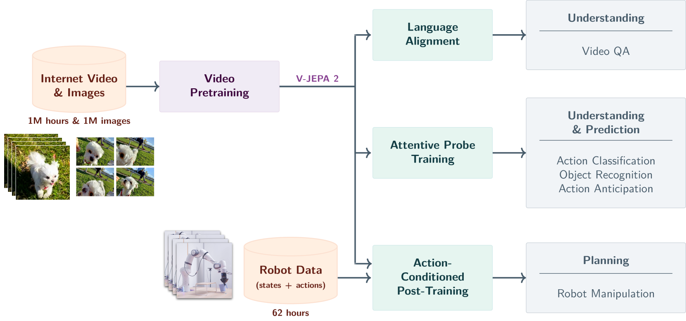

# V-JEPA 2: Self-Supervised Video Models Enable Understanding, Prediction and Planning

---
Reference

본 문서에 사용된 모든 이미지와 표는 해당 논문에서 발췌하였습니다.

---

## 📌 Metadata
---
분류
- World Model
- Self-Supervised Learning
- Robotics

---
url:
- [paper](https://arxiv.org/abs/2506.09985) (arXiv 2025)
- [project](https://github.com/facebookresearch/vjepa2)
- [blog](https://ai.meta.com/blog/v-jepa-2-world-model-benchmarks/)
---
- **Authors**: Mido Assran, Adrien Bardes, David Fan, et al.
- **Venue**: arXiv 2025 (June 2025)

---

## 📑 Table of Contents
- [Abstract](#abstract)
- [1. Introduction](#1-introduction)
- [2. Related Works](#2-related-works)
- [3. Method](#3-method)

---

## ⚡ 요약 (Summary)
- **Problem**: 기존의 생성형 비디오 모델들은 픽셀 수준의 예측에 치중하여 불필요한 세부 사항 처리에 많은 자원을 소모하며, 추상적인 물리적 세계관(World Model)을 형성하여 로봇 계획에 활용하기에는 한계가 있음.
- **Idea**: 비디오의 시각적 특징을 직접 생성하는 대신 잠재 공간(Latent Space)에서 물리적 역학을 예측하는 JEPA(Joint Embedding Predictive Architecture)를 채택하고, 이를 대규모 비디오 및 소량의 로봇 데이터로 사전 학습함.
- **Result**: 복잡한 물체 조작 작업에서 SOTA 성능을 달성했을 뿐만 아니라, 특정 작업에 대한 추가 훈련 없이도 실제 로봇(Franka arms)에서 제로샷(Zero-shot) 작업 계획 및 수행이 가능함을 입증함.

---

## 📖 Paper Review

## Abstract

- internet-scale 비디오 데이터와 약간의 interaction data(로봇 trajectories)를 결합해서 self-supervised 접근 방법을 탐구
- 물리적 세계에서 이해하고, 예측하며, 계획할 수 있는 모델을 개발하는 방법 제시

**V-JEPA 2**
- action-free joint embedding-predictive architecture
- 100만 시간이 넘는 인터넷 비디오로 구성된 데이터셋 사용
- motion 이해에 강력한 성능 달성
    - Something-Something v2에서 77.3% top-1 정확도
- 인간 행동 예측에서 SOTA 성능을 보임
    - Epic-Kitchens-100에서 recall-at-5 39.7%
- V-JEPA 2를 LLM과 정렬한 후, 8B 크기에서 다중 비디오 question-answering 작업에서 SOTA를 보임
    - PerceptionTest에서 84.0%, TempCompass에서 76.9%
- V-JEPA 2-AC라는 잠재 행동-조건 world model을 post-training하여 self-supervised learning을 로봇 planning 작업에 적용할 수 있는 방법을 보임
    - Droid 데이터셋의 62시간 미만의 unlabeled 로봇 비디오 사용
- 두 개의 서로 다른 실험실에서 Franka arms에 V-JEPA 2-AC zero-shot을 배포하고 이미지 목표를 이용한 planning을 통해 물체를 잡고 놓는 작업을 가능하게 함
    - 로봇으로부터 어떤 데이터도 수집하지 않고 특정 작업에 대한 훈련이나 보상 없이 달성
- 웹 규모 데이터와 소량의 로봇 상호작용 데이터를 이용한 self-supervised learning이 물리적 세계에서 계획할 수 있는 world model을 가져올 수 있음을 보임

## 1. Introduction

> **Figure 1. V-JEPA 2 개요**

## 2. Related Works

## 3. Method